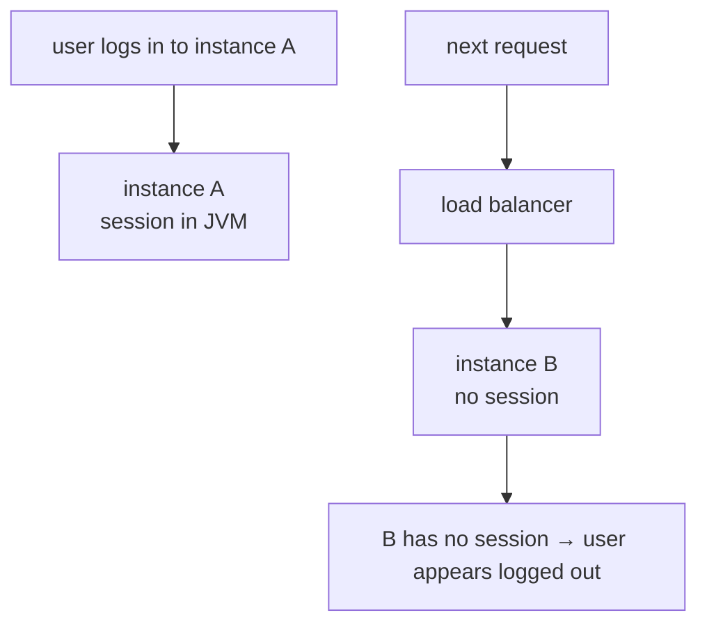
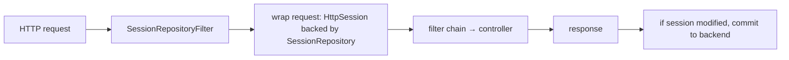
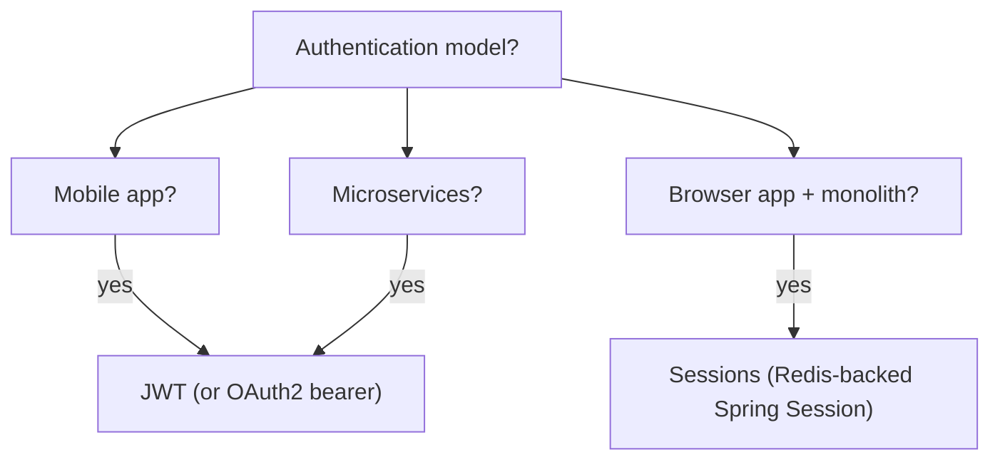

# Spring Session

The traditional Java web model — `HttpSession` — stores per-user state on the server in JVM memory. That works for a single instance; it falls apart the moment you scale: two instances behind a load balancer, an LB that doesn't pin clients to instances, and suddenly a user's session is on instance A but their next request lands on instance B that has never seen them. Three responses: **sticky sessions** at the LB (couples session lifetime to instance lifetime; lose all sessions when an instance restarts), **session replication** across the cluster (broadcasts every session change; doesn't scale past 4-5 instances), and **externalized sessions** — store session state in a shared backend (Redis / JDBC / Mongo / Hazelcast) that all instances can read. **Spring Session** is the framework that transparently substitutes the Servlet `HttpSession` with one of those backends — your `request.getSession()` code keeps working unchanged, but the bytes live in Redis.

A senior engineer needs to understand the *trade-off space* — sticky vs replicated vs externalized vs JWT-only — because the choice ripples into UX (logout on instance restart? login bounces between regions?), operations (what happens when Redis is down?), and security (session-fixation defenses; cookie attributes). This topic teaches Spring Session as the externalization tool and frames the JWT-vs-session decision that drives most of 2026's authentication architectures.

The depth-bar this topic clears: at the **language layer**, `@EnableRedisHttpSession` / `@EnableJdbcHttpSession`, `SessionRepository`, `Session` interface, the cookie / header session-strategy options, principal-based session lookup. At the **memory layer**, what gets serialized — Spring Session stores attributes as Java serialization or JSON; Redis hash of `(sessionId → attributes)`; per session ~1–10 KB depending on attributes; per backend operation ~1–3 ms. At the **architecture layer** — the heart — **the `SessionRepositoryFilter`** that intercepts every request, swaps the Servlet `HttpSession` for a `SessionRepository`-backed wrapper, and writes back at the end of the request; **the JWT-vs-session decision matrix**; concurrent-session control; cross-domain cookie strategy; the **operational risks** of a shared session store.

> [!NOTE]
> Prerequisites: [Spring MVC (T10)](./T10-spring-mvc-rest-controllers.md), [Spring Security (T14)](./T14-spring-security-authentication-and-authorization.md). Servlet API basics (`HttpSession`).

## The Problem — Sessions Across Multiple Instances



Three classical answers:

1. **Sticky sessions** (LB pins the user to instance A by cookie or source IP). Works until A restarts; then every user pinned to A is logged out. Also breaks rolling deploys.
2. **Session replication** (Tomcat's `<Cluster>` mode, JGroups). Each session change is broadcast. Scales poorly (N² gossip traffic); hard to operate; flaky.
3. **Externalized sessions** (the right answer). One shared backend; any instance can serve any request.

Spring Session implements option 3 with a clean abstraction.

## Setup — Redis-Backed Sessions

```xml
<dependency>
    <groupId>org.springframework.boot</groupId>
    <artifactId>spring-boot-starter-data-redis</artifactId>
</dependency>
<dependency>
    <groupId>org.springframework.session</groupId>
    <artifactId>spring-session-data-redis</artifactId>
</dependency>
```

```yaml
spring:
  data:
    redis:
      host: redis
      port: 6379
  session:
    store-type: redis
    timeout: 30m
    redis:
      flush-mode: on_save
      namespace: spring:session
```

Boot auto-configures `@EnableRedisHttpSession`; the `SessionRepositoryFilter` is registered at the highest precedence in the servlet filter chain.

That's it. Every `request.getSession()` now reads/writes Redis instead of the JVM:

```java
@RestController
public class CartController {

    @GetMapping("/cart")
    public Cart get(HttpSession session) {
        Cart cart = (Cart) session.getAttribute("cart");
        return cart != null ? cart : new Cart();
    }

    @PostMapping("/cart/items")
    public void addItem(@RequestBody CartItem item, HttpSession session) {
        Cart cart = Optional.ofNullable((Cart) session.getAttribute("cart"))
            .orElseGet(Cart::new);
        cart.add(item);
        session.setAttribute("cart", cart);
    }
}
```

No code change vs the in-memory session model. The bytes live in Redis.

## The Filter — What Happens Per Request

`SessionRepositoryFilter` is a servlet filter (registered with highest precedence) that wraps every request:



When the controller calls `request.getSession()`, the wrapper:

1. Reads the session-id cookie (or header — configurable).
2. Calls `SessionRepository.findById(id)` to load the session.
3. Returns the session as a wrapper around `org.springframework.session.Session`.
4. Mutations to attributes are tracked in the wrapper.
5. At response time, the wrapper calls `SessionRepository.save(session)` if dirty.

The cost: ~1-3 ms per request that touches the session (one Redis GET + one SET). For requests that don't touch the session (`/health`, `/metrics`), the filter is essentially free.

## `SessionRepository` Backends

| Backend | Pros | Cons |
|---------|------|------|
| **Redis** (`spring-session-data-redis`) | fast (sub-ms), TTL native, pub/sub for expiration events | extra infrastructure |
| **JDBC** (`spring-session-jdbc`) | reuses existing DB | slower; DB load |
| **MongoDB** (`spring-session-data-mongodb`) | already deploying Mongo | Mongo expiration TTL semantics |
| **Hazelcast** (`spring-session-hazelcast`) | embedded; no extra infra | clustering complexity |
| **In-memory** (`MapSessionRepository`) | for tests only | not distributed |

Redis is the dominant choice for sessions — sub-ms latency, native TTL handling, well-understood operationally.

## Cookie Strategy

The session id needs to travel between client and server. Two strategies:

### `CookieHttpSessionIdResolver` (default)

```java
@Bean
public CookieSerializer cookieSerializer() {
    DefaultCookieSerializer s = new DefaultCookieSerializer();
    s.setCookieName("SESSION");
    s.setSameSite("Lax");                  // CSRF defense
    s.setUseSecureCookie(true);            // HTTPS only
    s.setUseHttpOnlyCookie(true);          // no JS access
    s.setDomainName(".example.com");       // cross-subdomain
    s.setCookiePath("/");
    return s;
}
```

Attributes to know:

- **`HttpOnly`** — JS can't read the cookie. Defeats XSS-based session theft.
- **`Secure`** — sent only over HTTPS. Always set in production.
- **`SameSite`** — `Strict` (only same-origin), `Lax` (allow top-level navigations), `None` (cross-site, requires `Secure`). `Lax` is the safe modern default.

### `HeaderHttpSessionIdResolver` (mobile / API)

For native apps that prefer header-based session ids:

```java
@Bean
public HttpSessionIdResolver httpSessionIdResolver() {
    return HeaderHttpSessionIdResolver.xAuthToken();
}
```

The client sends `X-Auth-Token: <session id>` instead of a cookie. Useful for mobile clients that don't have a native cookie store.

## Concurrent Session Control

Limit concurrent sessions per user:

```java
@Bean
public SpringSessionBackedSessionRegistry<? extends Session> sessionRegistry(
        FindByIndexNameSessionRepository<? extends Session> repo) {
    return new SpringSessionBackedSessionRegistry<>(repo);
}

// in SecurityFilterChain
.sessionManagement(s -> s
    .maximumSessions(1)
    .maxSessionsPreventsLogin(false)   // new login kicks old; alternative: prevent new login
    .sessionRegistry(sessionRegistry))
```

The registry uses `FindByIndexNameSessionRepository.PRINCIPAL_NAME_INDEX_NAME` to find existing sessions per user.

## Session Events

```java
@Component
public class SessionListener {

    @EventListener
    public void onCreate(SessionCreatedEvent e) {
        log.info("session created: {}", e.getSessionId());
    }

    @EventListener
    public void onDestroy(SessionDestroyedEvent e) {
        log.info("session destroyed: {}", e.getSessionId());
        userPresence.markOffline(e.getSessionId());
    }

    @EventListener
    public void onExpire(SessionExpiredEvent e) {
        log.info("session expired: {}", e.getSessionId());
    }
}
```

Redis-backed Spring Session uses keyspace notifications (`__keyevent@*__:expired`) to publish expiration events; you enable with `notify-keyspace-events Ex` in Redis config.

## JWT vs Session — The Architectural Choice

In 2026 every backend team chooses between session cookies and stateless JWT bearer tokens. The matrix:

| Aspect | Session Cookie | JWT |
|--------|----------------|-----|
| State location | server backend (Redis) | inside the token |
| Server lookup per request | yes (1 backend GET) | no |
| Logout / revoke | trivial (delete session) | hard (need allow/denylist) |
| Storage in browser | HttpOnly cookie | localStorage / cookie / memory |
| XSS exposure | none (HttpOnly) | high (if localStorage) |
| CSRF protection | required | not needed for header-based |
| Cross-domain | tricky (cookie sharing) | easy (header) |
| Token rotation / expiry | server-controlled | client-managed |
| Mobile / SPA friendliness | cookie isn't ideal | excellent |
| Microservices propagation | session id → lookup per service | self-contained |

A pragmatic 2026 decision tree:

- **Server-rendered web app, monolith, browser-only**: sessions (Redis-backed). Simpler ops, native CSRF defense, instant revocation.
- **SPA with single backend**: sessions (HttpOnly cookie) or JWT — both work; sessions are slightly safer (HttpOnly defeats XSS).
- **Mobile native + REST API**: JWT or opaque tokens. Sessions don't fit mobile cookie semantics.
- **Microservices / multiple backends**: JWT. Each service validates the token; no central session store needed.
- **High-stakes (banking, payments)**: sessions for the user-facing UI (instant revoke); JWT short-lived for inter-service.



## Operational Considerations

### Session Store Down

What happens if Redis is unreachable mid-request?

- `findById` throws → user can't load existing session → effectively logged out.
- `save` throws → mutations lost.

Boot's `RedisOperationsSessionRepository` raises an exception; the request fails. Defensive: catch `SessionRepositoryException` in a filter and degrade to "anonymous" mode (depends on app behavior). Almost always you accept the downtime: sessions imply Redis is core infrastructure with HA.

### Session Hijacking

A stolen session cookie = total account compromise. Defenses:

- `HttpOnly` — JS can't read.
- `Secure` — HTTPS only.
- `SameSite=Lax` or `Strict` — limits cross-site CSRF.
- Session fixation rotation on login (Spring Security: enabled by default).
- Short session timeouts (e.g., 30 min idle).
- Bind session to IP or user agent (with caution — mobile clients change networks).
- Audit unusual session access (multiple geos quickly).

### Session Replication Lag

In active-active multi-region setups, Redis writes from region A might not be immediately visible in region B. Mitigations:

- Pin user to a region (sticky-region routing).
- Use Redis cluster with global replication (Redis Enterprise / AWS ElastiCache global datastore).
- Accept eventual consistency (slow ride for the user — they might see a stale cart).

## Worked Example — Shopping Cart

```java
@RestController
@RequestMapping("/api/cart")
public class CartController {

    @GetMapping
    public Cart get(HttpSession session) {
        return getCart(session);
    }

    @PostMapping("/items")
    public Cart addItem(@RequestBody @Valid CartItem item, HttpSession session) {
        Cart cart = getCart(session);
        cart.add(item);
        session.setAttribute("cart", cart);
        return cart;
    }

    @DeleteMapping
    public void clear(HttpSession session) {
        session.removeAttribute("cart");
    }

    private Cart getCart(HttpSession session) {
        Cart cart = (Cart) session.getAttribute("cart");
        if (cart == null) {
            cart = new Cart();
            session.setAttribute("cart", cart);
        }
        return cart;
    }
}
```

With `spring.session.store-type=redis`, this code is *automatically* distributed-session-friendly. Two instances behind an LB, both backed by the same Redis — every request finds the cart. Restart instance A; user's next request goes to B; cart is still there.

## Common Pitfalls

> [!WARNING]
> **Storing non-serializable objects in the session.** Redis serializes via Java serialization (default) or Jackson JSON. Custom classes need `Serializable` (Java) or default constructors + getters (JSON). Otherwise: NullPointer on next access or session save failure.

> [!WARNING]
> **Storing huge objects in the session.** A 1 MB cart × 100k users = 100 GB Redis. Spring Session has no built-in size cap. Store ids; fetch details fresh.

> [!WARNING]
> **`SameSite=None` without `Secure`.** Modern browsers reject the cookie outright. If you need cross-site cookies, must be HTTPS + Secure + SameSite=None.

> [!WARNING]
> **Forgetting Redis pub/sub for expiration events.** `notify-keyspace-events Ex` must be configured in Redis for `SessionDestroyedEvent`s to fire on expiry.

> [!WARNING]
> **Mixing Spring Session with `@EnableWebMvc`'s default session strategy.** Override conflicts; weird behaviors. The filter is registered automatically; let it.

> [!WARNING]
> **JDBC session backend without an index on `(session_id)`.** `findById` is a full-table scan. Boot's schema includes the index; don't accidentally drop it.

> [!WARNING]
> **Using sessions for inter-service authentication.** Sessions are user-frontend. Inter-service should use JWT / OAuth2 client credentials.

> [!WARNING]
> **Treating Redis as an availability afterthought.** Sessions in Redis = Redis is your auth store. Make Redis HA before adopting.

## Practice

1. Build a Boot app with `spring-session-data-redis`. Verify with `redis-cli MONITOR` that sessions land in Redis on login.
2. Run two instances of the app behind a local NGINX (round-robin). Log in via instance A; verify the next request to B is still authenticated.
3. Add `concurrent session control` (max 1 per user). Open two browsers; log in to both; verify the second login invalidates the first.
4. Configure cookie attributes correctly: `HttpOnly`, `Secure`, `SameSite=Lax`. Check in dev tools.
5. Switch from cookie to header session strategy. Connect with a CLI client passing `X-Auth-Token`.
6. Subscribe to `SessionDestroyedEvent`. Manually invalidate a session via `findByPrincipalName`; verify the event fires.
7. Compare session + Redis vs JWT for the same UX. Measure per-request overhead. Decide which suits your app.

## Recap

You should now be able to:

- Choose between sticky sessions, session replication, externalized sessions, and stateless JWT based on scale, ops complexity, and use case.
- Configure Spring Session with Redis (preferred), JDBC, Mongo, or Hazelcast backends.
- Explain how `SessionRepositoryFilter` substitutes the Servlet `HttpSession` transparently — your `request.getSession()` code is unchanged.
- Configure cookie attributes (`HttpOnly`, `Secure`, `SameSite`, `Domain`) and choose cookie vs header session-id resolvers.
- Implement concurrent-session control with `SpringSessionBackedSessionRegistry`.
- Subscribe to session events (created / destroyed / expired) and enable Redis keyspace notifications.
- Articulate the JWT-vs-session matrix: sessions for browser-monolith with instant revoke; JWT for mobile / microservices / cross-domain.
- Plan for operational reality: Redis HA for sessions, session-store outage degradation, hijack defenses, store size limits.
- Avoid the common pitfalls: non-serializable session objects, huge sessions, SameSite=None without Secure, missing keyspace notifications, JDBC without indexes.

## Next

Continue to [Spring Testing](./T24-spring-testing.md) for the deep treatment of `@SpringBootTest`, test slices (`@WebMvcTest`, `@DataJpaTest`, `@JsonTest`), MockMvc / WebTestClient, Testcontainers integration, and the unit-vs-integration-vs-system test pyramid for Spring applications.
