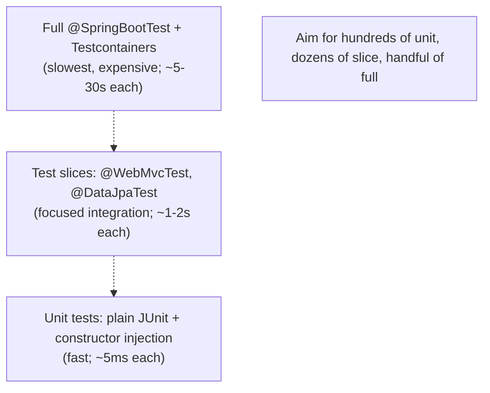

# Spring Testing

A Spring application's correctness depends on (1) the business logic in its classes, (2) the wiring among them through the container, (3) the framework integrations (MVC routing, JPA persistence context, security filter chain), and (4) end-to-end behavior against real downstream systems. **Each** layer needs a different test strategy, with very different startup costs and feedback loops. A pure unit test on `OrderService` constructed via `new` runs in ~5 ms; a full `@SpringBootTest` boots the entire context and takes 2–5 seconds. Running 500 of the latter in CI is a 30-minute affair; mixing in unit tests where they suffice keeps the pyramid right-side up.

Spring's testing support is the catalog of tools that let you write *exactly the test you need*: `@SpringBootTest` for full integration, **test slices** (`@WebMvcTest`, `@DataJpaTest`, `@JsonTest`, `@RestClientTest`, `@WebFluxTest`, `@JdbcTest`, `@DataMongoTest`) that boot only the relevant beans, `MockMvc` / `WebTestClient` for controller testing without a real HTTP server, `@MockitoBean` / `@MockitoSpyBean` for swapping beans in the context, `@DataJpaTest` with `@Sql` scripts for repository tests against an embedded database, and **Testcontainers** integration for full integration tests against real Postgres / Redis / Kafka in Docker containers. The mature testing setup combines all of them — fast unit tests for logic, slice tests for layer integration, a small number of full Boot tests for happy-path system behavior, and Testcontainers for storage / messaging integration.

The depth-bar this topic clears: at the **language layer**, the test annotation catalog, `MockMvc` / `WebTestClient` usage, `@MockitoBean` mocking, `@Sql` scripts, Testcontainers integration. At the **memory layer**, what each test type loads — `@SpringBootTest` boots ~280 beans (the full Boot context), `@WebMvcTest` ~60, `@DataJpaTest` ~70, `@JsonTest` ~10 — and the **context-caching** mechanism that lets repeated tests share a context (the single most important Spring-test performance feature). At the **architecture layer** — the heart — the **test pyramid** as it applies to Spring: keep the base broad (cheap unit tests on POJOs), the middle thinner (slice tests on layers), and the top narrow (full integration tests against Testcontainers), and the **context-cache trade-offs** that determine whether a 500-test suite runs in 30 s or 30 min.

> [!NOTE]
> Prerequisites: JUnit 5 fundamentals. Spring MVC (T10), Spring Data (T13), Spring Boot Actuator (T09). Docker for Testcontainers.

## The Test Pyramid for Spring



Conservative ratios for a healthy project:

- 80% unit tests — pure POJO logic with mocks.
- 15% slice tests — confirm Spring wiring per layer.
- 5% full integration — happy-path end-to-end.

Inverting this (everything `@SpringBootTest`) produces a CI suite that takes 30+ minutes and gives up fast feedback.

## `@SpringBootTest` — The Full Boot

```java
@SpringBootTest
class OrderServiceIntegrationTest {

    @Autowired UserService userService;
    @Autowired OrderService orderService;
    @Autowired OrderRepository repo;

    @Test void place_creates_order() {
        User u = userService.create("alice", "alice@example.com");
        Order o = orderService.place(new PlaceOrderRequest(u.id(), ...));
        assertThat(repo.findById(o.id())).isPresent();
    }
}
```

`@SpringBootTest` boots the *full* `ApplicationContext`. By default it does *not* start a web server; add `webEnvironment` to enable one:

| `webEnvironment` | Behavior |
|------------------|----------|
| `MOCK` (default) | full context, no web server, `MockMvc` available |
| `RANDOM_PORT` | full context, embedded server on random port (good for `TestRestTemplate` / `WebTestClient`) |
| `DEFINED_PORT` | use `server.port` |
| `NONE` | no web infrastructure |

```java
@SpringBootTest(webEnvironment = RANDOM_PORT)
class HttpIntegrationTest {

    @Autowired TestRestTemplate http;

    @Test void hello_returns_ok() {
        ResponseEntity<String> resp = http.getForEntity("/hello", String.class);
        assertThat(resp.getStatusCode()).isEqualTo(HttpStatus.OK);
    }
}
```

## Context Caching

The single most important Spring-test performance feature. The test framework caches the `ApplicationContext` per **configuration signature** — same `@SpringBootTest` config + same active profiles + same property overrides = reuse the same context across tests. **One context boot for 500 tests** is the goal.

The cache key includes:

- Configuration classes
- Active profiles
- Property sources (`@TestPropertySource`, `@DynamicPropertySource`)
- Bean overrides (`@MockitoBean`)
- Custom context customizers

Anything that differs invalidates the cache → new boot.

**The performance-killer pattern**: every test class has slightly different `@MockitoBean` / `@TestPropertySource` → every test class boots its own context → 500 tests × 2 s boot = 1000 s CI overhead.

The fix: cluster tests with shared config; minimize per-class customization; if N tests need a Mongo running, share the test class.

`@DirtiesContext` *forces* cache invalidation after the test. Use sparingly — every use slows the next test by one full boot.

## Test Slices

Slices are restricted Boot contexts — only the beans relevant to one layer get loaded. ~5× faster than `@SpringBootTest`.

### `@WebMvcTest`

```java
@WebMvcTest(UserController.class)
class UserControllerTest {

    @Autowired MockMvc mvc;
    @MockitoBean UserService userService;

    @Test void get_returns_user() throws Exception {
        when(userService.load(42L)).thenReturn(new User(42L, "alice"));

        mvc.perform(get("/api/users/42"))
            .andExpect(status().isOk())
            .andExpect(jsonPath("$.id").value(42))
            .andExpect(jsonPath("$.name").value("alice"));
    }
}
```

Loads only MVC infrastructure (`DispatcherServlet`, Jackson, `@ControllerAdvice` advisors, validators) + `UserController`. **Does not** load `UserService` or `UserRepository` — you `@MockitoBean` them.

Slice annotations include `@WebMvcTest`, `@WebFluxTest`, `@DataJpaTest`, `@JsonTest`, `@RestClientTest`, `@DataMongoTest`, `@DataRedisTest`, `@JdbcTest`, `@DataR2dbcTest`, `@DataLdapTest`, `@DataNeo4jTest`, `@DataCassandraTest`, `@DataCouchbaseTest`.

### `@DataJpaTest`

```java
@DataJpaTest
class UserRepositoryTest {

    @Autowired TestEntityManager em;
    @Autowired UserRepository repo;

    @Test void finds_by_email() {
        em.persistAndFlush(new User("alice", "alice@example.com"));

        Optional<User> u = repo.findByEmail("alice@example.com");

        assertThat(u).isPresent();
        assertThat(u.get().getName()).isEqualTo("alice");
    }
}
```

Configures JPA, EntityManager, an in-memory H2 database, and your `@Entity` + repository classes. Tests run in a transaction that **rolls back at the end** (so tests don't pollute each other).

Default uses an embedded database (H2). Override with `@AutoConfigureTestDatabase(replace = NONE)` plus `@Sql` scripts for real-DB compatibility tests (better: use Testcontainers).

### `@JsonTest`

```java
@JsonTest
class UserResponseJsonTest {

    @Autowired JacksonTester<UserResponse> json;

    @Test void serializes() throws Exception {
        UserResponse u = new UserResponse(42L, "alice");

        assertThat(json.write(u)).extractingJsonPathStringValue("$.name").isEqualTo("alice");
        assertThat(json.write(u)).extractingJsonPathNumberValue("$.id").isEqualTo(42);
    }

    @Test void deserializes() throws Exception {
        UserResponse u = json.parseObject("{\"id\":42,\"name\":\"alice\"}");

        assertThat(u.id()).isEqualTo(42L);
        assertThat(u.name()).isEqualTo("alice");
    }
}
```

Just Jackson + auto-configured `ObjectMapper`. Fast and focused.

### `@RestClientTest`

```java
@RestClientTest(InventoryClient.class)
class InventoryClientTest {

    @Autowired InventoryClient client;
    @Autowired MockRestServiceServer server;

    @Test void getItem_returns_item() {
        server.expect(requestTo("/items/SKU-1"))
              .andRespond(withSuccess("{\"sku\":\"SKU-1\",\"qty\":42}", APPLICATION_JSON));

        Item item = client.getItem("SKU-1");

        assertThat(item.qty()).isEqualTo(42);
    }
}
```

Wires the HTTP client + a mock-server stub. The mock server records expectations and serves canned responses — no real network call.

## `MockMvc` — Controller Testing Without HTTP

```java
@WebMvcTest(OrderController.class)
class OrderControllerTest {

    @Autowired MockMvc mvc;
    @Autowired ObjectMapper json;
    @MockitoBean OrderService service;

    @Test void place_returns_201() throws Exception {
        when(service.place(any())).thenReturn(new Order(1L, "alice", 100));

        mvc.perform(post("/api/orders")
                .contentType(APPLICATION_JSON)
                .content(json.writeValueAsString(new PlaceOrderRequest("alice", 100))))
            .andExpect(status().isCreated())
            .andExpect(header().string("Location", "/api/orders/1"))
            .andExpect(jsonPath("$.id").value(1));
    }
}
```

`MockMvc` invokes the `DispatcherServlet` with a *mock* `HttpServletRequest`. No socket; no real HTTP; full MVC stack runs. ~10 ms per test.

For WebFlux: `WebTestClient` is the equivalent (works for both WebFlux *and* `@SpringBootTest(webEnvironment = RANDOM_PORT)` via real HTTP):

```java
@WebFluxTest(OrderController.class)
class OrderControllerWebFluxTest {

    @Autowired WebTestClient client;
    @MockitoBean OrderService service;

    @Test void place_returns_201() {
        when(service.place(any())).thenReturn(Mono.just(new Order(1L, "alice", 100)));

        client.post().uri("/api/orders")
            .contentType(APPLICATION_JSON)
            .bodyValue(new PlaceOrderRequest("alice", 100))
            .exchange()
            .expectStatus().isCreated()
            .expectBody().jsonPath("$.id").isEqualTo(1);
    }
}
```

## `@MockitoBean` — Replacing Beans in the Context

`@MockitoBean` (Spring Boot 3.4+; replaces `@MockBean` which is deprecated):

```java
@SpringBootTest
class OrderServiceTest {

    @MockitoBean PaymentGateway gateway;   // replaces the real bean in the context
    @Autowired OrderService service;

    @Test void place_charges_gateway() {
        when(gateway.charge(any())).thenReturn(new ChargeResult("OK"));

        service.place(new PlaceOrderRequest(...));

        verify(gateway).charge(any());
    }
}
```

The mock replaces the real bean even for *other beans that depend on it*. `OrderService` injected from the container now holds the mock.

**Caveat**: `@MockitoBean` invalidates the context cache (different beans = different context). Multiple test classes with the same `@MockitoBean` signature share a cache; differing signatures fragment it.

## Test Databases

The default for `@DataJpaTest` is H2 in-memory. Useful for fast tests but H2 ≠ Postgres in subtle ways (data types, constraints, functions). Two strategies:

### Approach 1: H2 With Compatibility Mode

```yaml
spring:
  datasource:
    url: jdbc:h2:mem:testdb;MODE=PostgreSQL
```

Cheap; works for ~90% of code. Subtle differences remain.

### Approach 2: Testcontainers (Production Parity)

```java
@SpringBootTest
@Testcontainers
class OrderServiceIntegrationTest {

    @Container
    static PostgreSQLContainer<?> postgres = new PostgreSQLContainer<>("postgres:16-alpine");

    @DynamicPropertySource
    static void register(DynamicPropertyRegistry r) {
        r.add("spring.datasource.url", postgres::getJdbcUrl);
        r.add("spring.datasource.username", postgres::getUsername);
        r.add("spring.datasource.password", postgres::getPassword);
    }

    @Autowired OrderService service;

    @Test void place_persists() {
        Order o = service.place(new PlaceOrderRequest(...));
        // ...
    }
}
```

Boots a real Postgres container per test class. Cost: ~2–5 s container startup. Use `@Container` (per class) or `@Container static` (shared across `@Testcontainers` tests via reuse-mode).

For shared containers across many test classes, use the **container-per-suite** pattern with a custom `ContextCustomizer` or a Spring TestExecutionListener.

Testcontainers covers Postgres, MySQL, MongoDB, Redis, Kafka, RabbitMQ, Elasticsearch, Cassandra, Neo4j, generic Docker images. **The right answer for any test that needs a real backing service.**

## `@Sql` for Test Data

```java
@DataJpaTest
@Sql({"/test-data/users.sql", "/test-data/orders.sql"})
class UserRepositoryTest {

    @Test void finds_active() {
        List<User> active = repo.findByActiveTrue();
        assertThat(active).hasSize(3);
    }
}
```

Scripts run before each test method. `@Sql(executionPhase = AFTER_TEST_METHOD)` runs after for cleanup. Useful for repository tests when you want known fixtures.

## Transactional Tests — Rollback Semantics

`@DataJpaTest` and `@SpringBootTest` both default to **transactional** test methods that **roll back** at the end. Tests don't pollute each other; no cleanup code needed.

Disable with `@Transactional(propagation = NEVER)` or `@Rollback(false)`. Useful when the code under test commits explicitly and you need to inspect the post-commit state (rare).

For tests that span multiple DB transactions (testing optimistic locking, isolation), use `TestTransaction.flagForRollback()` / `TestTransaction.start()` / `TestTransaction.end()` for explicit control.

## Property Overrides

Three idioms, in order of preference:

```java
// 1. inline properties (fast, per-class)
@SpringBootTest(properties = "feature.x=true")
class XEnabledTest { ... }

// 2. profile-based
@SpringBootTest
@ActiveProfiles("integration")
class IntegrationTest { ... }   // loads application-integration.yml

// 3. dynamic (Testcontainers)
@DynamicPropertySource
static void register(DynamicPropertyRegistry r) {
    r.add("spring.datasource.url", postgres::getJdbcUrl);
}
```

Each modifies the context-cache key; use the minimum needed.

## Security in Tests

Spring Security adds friction — every request must authenticate. Use `@WithMockUser` or `SecurityMockMvcRequestPostProcessors`:

```java
@WebMvcTest
@AutoConfigureMockMvc
class SecuredEndpointTest {

    @Autowired MockMvc mvc;

    @Test
    @WithMockUser(roles = "ADMIN")
    void admin_can_delete() throws Exception {
        mvc.perform(delete("/api/users/42"))
            .andExpect(status().isNoContent());
    }

    @Test
    @WithMockUser(roles = "USER")
    void user_cannot_delete() throws Exception {
        mvc.perform(delete("/api/users/42"))
            .andExpect(status().isForbidden());
    }
}
```

For JWT/OAuth2: `mvc.perform(get("/api/me").with(jwt().jwt(j -> j.subject("user1"))))`.

## When To Use Each Test Type

| Goal | Test type |
|------|-----------|
| Verify a method's logic on a pure POJO | plain JUnit + mocks |
| Verify a controller's request/response mapping | `@WebMvcTest` + `MockMvc` |
| Verify a repository's query | `@DataJpaTest` + Testcontainers |
| Verify Jackson serialization | `@JsonTest` |
| Verify an HTTP outbound client | `@RestClientTest` |
| End-to-end happy path | `@SpringBootTest(RANDOM_PORT)` + `TestRestTemplate` + Testcontainers |
| Performance / load | external tools (Gatling, JMeter, k6) |

## Common Pitfalls

> [!WARNING]
> **`@SpringBootTest` for everything.** Slow; brittle; wrong layer. Use slices and unit tests where possible.

> [!WARNING]
> **Different `@MockitoBean` per test class fragmenting the context cache.** Each variation boots a fresh context. Co-locate tests with shared config.

> [!WARNING]
> **`@DirtiesContext` everywhere "just in case."** Every use kills the cache. Use only when tests genuinely mutate the context.

> [!WARNING]
> **Testing against H2 when production is Postgres.** Subtle differences (date formats, sequences, JSON functions) hide bugs. Use Testcontainers for storage-aware tests.

> [!WARNING]
> **Forgetting `@AutoConfigureMockMvc` outside slice tests.** `@SpringBootTest(MOCK)` requires it to auto-configure `MockMvc`.

> [!WARNING]
> **Long sleeps in async tests.** `Thread.sleep(2000)` makes tests flaky. Use `Awaitility.await().atMost(5, SECONDS).until(...)`.

> [!WARNING]
> **Mocking the database via `@MockitoBean UserRepository`.** Tests pass; the actual SQL is wrong. Use `@DataJpaTest` with Testcontainers for repository validation.

> [!WARNING]
> **`@Sql` scripts that load 100 K rows.** Per-test setup time becomes the bottleneck. Use minimal fixtures; share a pre-populated database via Testcontainers reuse.

## Practice

1. Write a unit test for a service using constructor injection + Mockito mocks. Measure time; should be ~5 ms.
2. Convert it to `@SpringBootTest`; measure time; observe the 100× slowdown.
3. Write a `@WebMvcTest` for a controller with `@MockitoBean` for its service dependency. Use `MockMvc` with JSON path matchers.
4. Write a `@DataJpaTest` for a repository. Use `TestEntityManager` to set up fixtures.
5. Add Testcontainers Postgres. Use `@DynamicPropertySource`. Run the repository test against real Postgres.
6. Write a `@RestClientTest` for an outbound client. Use `MockRestServiceServer` to stub responses.
7. Add `@WithMockUser` to a `@WebMvcTest` for a secured controller. Verify role-based access.
8. Measure CI suite total time. Identify the slowest tests; convert to lighter slice or unit tests where possible.

## Recap

You should now be able to:

- Pick the right test type per layer: unit (POJOs), slice (per-layer Boot), full Boot (system), Testcontainers (storage / messaging).
- Use `@SpringBootTest` with `webEnvironment` correctly; reach for `MockMvc` / `WebTestClient` / `TestRestTemplate` per need.
- Use slice annotations (`@WebMvcTest`, `@DataJpaTest`, `@JsonTest`, `@RestClientTest`, `@WebFluxTest`, `@JdbcTest`, `@DataMongoTest`) and explain which beans each loads.
- Replace beans in the context with `@MockitoBean` / `@MockitoSpyBean`; understand the context-cache impact.
- Drive transactional rollback semantics in tests; use `@Sql` for fixtures.
- Integrate Testcontainers via `@Container` + `@DynamicPropertySource` for production-parity storage / messaging tests.
- Test secured endpoints with `@WithMockUser` and JWT-aware request post-processors.
- Manage the context cache: minimize per-class variation; co-locate tests; avoid `@DirtiesContext`.
- Avoid the common pitfalls: `@SpringBootTest` overuse, H2-when-production-is-Postgres, mocking the repository instead of testing it, long sleeps in async tests.

## Next

Continue to [Spring Native / GraalVM](./T25-spring-native-graalvm.md) — the final C01 topic — covering Spring 6's AOT processing, GraalVM native image compilation, reflection / proxy hints, and the "20× faster cold start, 5× smaller RSS" promise (with caveats).
