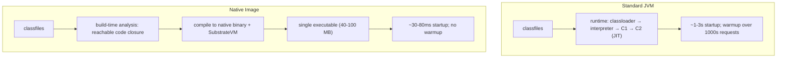
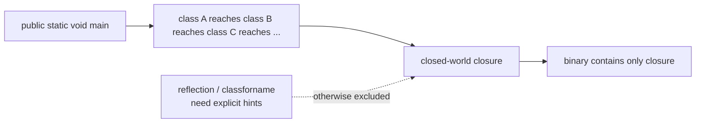
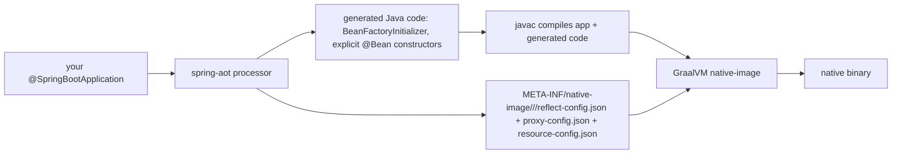

# Spring Native / GraalVM

A standard Spring Boot service takes **1–3 seconds to start cold**, loads a **150–250 MB RSS** at idle, and runs **slower for the first few thousand requests** (JIT warmup) before reaching peak throughput. For long-running services (the typical case), these numbers are fine — startup amortizes over hours of runtime; warmup happens once. For **short-lived environments** — AWS Lambda, Kubernetes-on-spot-instances with frequent restarts, scale-to-zero, function-as-a-service — they are *fatal*: a 2-second cold start on a 100 ms request is a 20× tax; a 200 MB pod is 4× a Node.js equivalent.

**GraalVM Native Image** is the alternative execution model: take the Spring Boot app, the JDK, every dependency; analyze the whole closure ahead of time; compile to a **single native binary** that the OS executes directly. No JVM. No JIT. No classloading at runtime. Result: **~30–50 ms startup**, **~40–80 MB RSS**, predictable single-threaded performance from request one. The trade: **build time** (Native Image takes 1–10 minutes vs javac's seconds), **peak throughput** (often 10–20% lower than the JIT-optimized JVM), and **reflective / dynamic features** require explicit configuration (the AOT compiler needs to know what classes you'll reflect on; runtime "load this class by name" requires hints). Spring 6 / Boot 3's **`spring-aot`** module bridges Spring's reflection-heavy machinery to the closed-world assumption — generating the reflection hints, proxy hints, and explicit `BeanDefinition`s at build time so the native image works.

A senior engineer in 2026 needs to know when native image is the right answer (and when it is not), how to enable it for a Spring Boot app, and how to debug the inevitable "works on JVM, fails on native" issues — almost always missing reflection / proxy / resource hints.

The depth-bar this topic clears: at the **language layer**, GraalVM Native Image's closed-world assumption, build-time vs runtime initialization, the four kinds of hints (reflection, proxy, resource, serialization), Spring 6's `RuntimeHintsRegistrar` SPI, the `spring-aot-maven-plugin` / `gradle-plugin` build pipeline. At the **memory layer**, the **JVM vs Native runtime** comparison — JVM is a HotSpot interpreter + JIT compiler running on classfiles; Native Image is a pre-compiled binary including a minimal runtime (the **SubstrateVM**) of ~30 MB for GC + threading + JNI + I/O; the **per-request profile** difference (no JIT warmup; predictable latency); the **build profile** (analysis takes 1–10 minutes producing a 30–100 MB binary). At the **architecture layer** — the heart — **when to choose native**, the **AOT processing pipeline** (resolve all `@Conditional`, generate `BeanFactoryInitializer` Java code, emit reflection metadata), **profile-guided optimization** (PGO) for closing the throughput gap, and the **operational reality** — debugging a native image is harder than a JVM, but the cold-start payoff for serverless / scale-to-zero often dominates.

> [!NOTE]
> Prerequisites: Spring Boot auto-configuration (T07), Spring AOP / proxies (T05), the IoC container (T01). General JVM understanding (L3/C02).

## JVM vs Native — The Comparison

| Property | Standard JVM (HotSpot) | GraalVM Native Image |
|----------|------------------------|----------------------|
| Compilation | classfiles → JIT to native at runtime | classfiles → native binary at build time |
| Startup | 1–3 s for Spring Boot | 30–80 ms |
| RSS (idle) | 150–250 MB | 40–80 MB |
| Build time | seconds (javac) | 1–10 minutes |
| Peak throughput | high (after JIT warmup) | 10-20% lower (no JIT, less aggressive optimization) |
| Warmup curve | first 1000s of requests slow | predictable from request 1 |
| Reflection | unrestricted | requires explicit hints |
| Dynamic classloading | works | mostly disallowed |
| Debugging | mature (debugger, profiler) | native-debug-symbols + LLDB; less mature |
| Patching | swap classes / agents | rebuild binary |



## The Closed-World Assumption

Native Image's defining property: **every class that will be in the running program must be known at build time.** The compiler walks the call graph from `main` outward; only reachable code is included. Code that *might* be reached via reflection or dynamic loading is invisible to the analyzer unless you *tell* it.



For a "pure" Java program with no reflection, this is fine. **Spring is anything but pure** — it reflects on every bean, uses CGLIB for proxies, builds configuration classes at runtime, scans classpath for components. Without help, a Spring app in Native Image would have nothing reachable.

## Spring 6 AOT — Bridging the Gap

Spring 6 / Boot 3 ship the **`spring-aot`** module that runs at build time (before `native-image`) and:

1. **Boots the Spring context to "almost ready"** — resolves every `@Conditional`, processes every `@Configuration`, finds every component, processes every `@Autowired`.
2. **Emits Java source files** that construct each bean explicitly — no reflection, no `@Conditional` evaluation at runtime, just `new MyBean(other, deps)` calls.
3. **Emits hint metadata** for every reflective access Spring still needs at runtime (`@Component` class metadata, JPA entities, `@Configuration` classes for property binding, etc.).



The result: a native binary where Spring's startup is dominated by your beans' constructors, not by reflection / scan / condition evaluation. **Startup drops from ~1500 ms (JVM) → ~50 ms (native).**

### Build Setup

```xml
<plugin>
    <groupId>org.springframework.boot</groupId>
    <artifactId>spring-boot-maven-plugin</artifactId>
</plugin>
<!-- separate profile/activation for native build -->
```

```bash
# Generate AOT sources and run on JVM (faster iteration)
./mvnw spring-boot:run -Pnative

# Build native image (slow)
./mvnw -Pnative native:compile

# Result: target/myapp (a self-contained binary)
./target/myapp
```

Gradle equivalent uses `org.graalvm.buildtools.native` plugin + `aotProcessor` task.

The build needs **GraalVM JDK** installed (not OpenJDK). Use SDKMAN: `sdk install java 21.0.2-graal`.

## Reflection / Proxy / Resource Hints

Spring AOT generates most hints automatically. For *your own* code that reflects, serializes JSON, or loads resources dynamically, you provide hints via `@RegisterReflectionForBinding` or a `RuntimeHintsRegistrar`:

```java
@Configuration
@RegisterReflectionForBinding({CreateUserRequest.class, UpdateUserRequest.class})
public class NativeHintsConfig {
    // Jackson will serialize these via reflection;
    // the hint tells native-image to keep their constructors and fields reachable.
}
```

For more elaborate hints:

```java
public class MyHintsRegistrar implements RuntimeHintsRegistrar {

    @Override
    public void registerHints(RuntimeHints hints, ClassLoader cl) {
        // reflection
        hints.reflection().registerType(MyClass.class,
            MemberCategory.INVOKE_DECLARED_CONSTRUCTORS,
            MemberCategory.INVOKE_PUBLIC_METHODS,
            MemberCategory.DECLARED_FIELDS);

        // proxy
        hints.proxies().registerJdkProxy(MyInterface.class);

        // resources
        hints.resources().registerResource(new ClassPathResource("templates/email.ftl"));
        hints.resources().registerPattern("static/.*");

        // serialization
        hints.serialization().registerType(MyData.class);
    }
}

@Configuration
@ImportRuntimeHints(MyHintsRegistrar.class)
public class NativeConfig { }
```

The four hint categories:

| Hint type | What it preserves |
|-----------|-------------------|
| `reflection` | Fields, methods, constructors accessible via `java.lang.reflect` |
| `proxies` | JDK dynamic proxy interfaces (CGLIB is handled separately by Spring AOT) |
| `resources` | Files inside the binary (`classpath:templates/...`) |
| `serialization` | Classes Java-serialized via `ObjectOutputStream` |
| `jni` | Native libraries called via JNI |

## The GraalVM Tracing Agent — Automatic Hint Discovery

For libraries you don't control that reflect, the **tracing agent** records reflection access during a JVM run and writes hint config:

```bash
java -agentlib:native-image-agent=config-output-dir=src/main/resources/META-INF/native-image \
     -jar app.jar
```

Run the app under realistic load (covering every code path). The agent generates `reflect-config.json`, `proxy-config.json`, `resource-config.json`, `serialization-config.json`. Commit them.

Caveats:

- Only records what *actually executed*. Code paths not exercised won't be in the config → runtime failures in native.
- Generated configs can be huge; review before committing.

## Build-Time vs Runtime Initialization

GraalVM defaults to **runtime initialization** — static initializers run when the binary starts. Spring's `spring-aot` opts many classes to **build-time initialization** — static state is computed once during build and baked into the binary.

Pros: faster startup (no per-request `static {...}` work).
Cons: build-time state might not match runtime (e.g., a static `Map<String, ?>` populated at build time has the build machine's environment baked in).

Spring AOT picks safe candidates; you can override:

```java
@Configuration
public class TimeConfig {

    @Bean
    public Clock clock() {
        return Clock.systemUTC();   // safe: works at any init time
    }
}

// In a RuntimeHintsRegistrar
hints.reflection().registerType(MyEnum.class, MemberCategory.PUBLIC_FIELDS);
```

If a class's static initializer reads system properties / env vars that differ between build and run, force runtime init via `--initialize-at-run-time=com.example.MyClass` in the native-image arguments.

## Profile-Guided Optimization (PGO)

GraalVM 22+ supports PGO: profile a *real* JVM run, feed the profile back into the native build, the compiler optimizes hot paths more aggressively. Closes most of the throughput gap:

```bash
# Step 1: build instrumented binary
./mvnw -Pnative native:compile -Dnative.image.args=--pgo-instrument

# Step 2: run under realistic load
./target/myapp.instrumented
# (issue load) ...

# Step 3: rebuild with the collected profile
./mvnw -Pnative native:compile -Dnative.image.args=--pgo=default.iprof
```

With PGO the native binary often *matches* JVM peak throughput. Without PGO it's typically 10–20% lower.

## When To Use Native

Strong fits:

- **AWS Lambda** — cold starts dominate; 30 ms native vs 2 s JVM is the difference between viable and not.
- **Kubernetes scale-to-zero** (Knative, KEDA) — each scale-up is a cold start; native wins.
- **CLI tools** — distribute one binary; no JRE dependency.
- **Memory-tight environments** — 40 MB RSS fits more containers per node.
- **High-density multi-tenant** — many small services on small VMs.

Weak fits:

- **Long-running services** — startup is once; warmup happens once; both amortize. JVM peak throughput wins.
- **Heavily-reflective frameworks not yet AOT-ready** — Hibernate, some Spring Cloud components have rough native support.
- **Dynamic codegen at runtime** — JDK Proxy, code-generating libraries (Lombok runtime extensions, ByteBuddy). Native disallows runtime codegen.
- **JVM-only tools** — Java agents (newrelic agent, datadog APM agent) don't work in native.
- **Debug-heavy operations** — heap dumps, JFR, attach-API are limited in native.

The decision: **measure your actual cold-start cost and your actual peak-throughput need.** Native is not a free win.

## Performance Profile

Indicative numbers for a Spring Boot REST service:

| Metric | JVM | Native | Native + PGO |
|--------|----:|-------:|------------:|
| Cold start (ms) | 1500 | 50 | 50 |
| RSS at idle (MB) | 220 | 65 | 65 |
| Peak throughput (req/s) | 32 000 | 26 000 | 30 500 |
| p99 first 1000 requests (ms) | 280 (warmup) | 12 | 11 |
| p99 after 10000 requests (ms) | 8 | 12 | 10 |
| Build time | 12 s | 4 min | 6 min |
| Binary size | (jar 65 MB) | 75 MB | 75 MB |

The trade-off is clear: **native wins on cold-start and steady-low-latency from request 1**; **JVM wins on peak throughput after warmup**.

## Common Pitfalls

> [!WARNING]
> **"Works on JVM, fails on native" with `ClassNotFoundException` / `MissingResourceException` / `Proxy throws NPE`.** Almost always a missing hint. Re-run the tracing agent or add the hint manually.

> [!WARNING]
> **Build-time static state baked from build env.** A static `Map.of("env", System.getenv("ENV"))` records the build machine's env. Force runtime init.

> [!WARNING]
> **Native image build crashing on `OutOfMemory`.** Native-image needs ~4-8 GB build heap. Set `-J-Xmx4g` in plugin args.

> [!WARNING]
> **Forgetting GraalVM JDK and using OpenJDK.** Native-image plugin will fail or fall back to a polyglot mode. Use `sdk install java 21-graal`.

> [!WARNING]
> **Trying to use Java agents.** Native binaries are pre-compiled; agent attach doesn't work. Use the agent at build time only.

> [!WARNING]
> **Hibernate / JPA without explicit entity hints.** Hibernate reflects heavily; missing entity hints break at runtime. Use `@RegisterReflectionForBinding(MyEntity.class)` for every entity.

> [!WARNING]
> **Heavy use of `Class.forName(dynamicName)`.** Native cannot pre-compute. Replace with a finite Map<String, Class<?>> lookup or refactor.

> [!WARNING]
> **CGLIB-heavy patterns without AOT awareness.** Spring AOT generates explicit proxies; third-party libs may not. Check library "native support" status.

> [!WARNING]
> **Treating native as a "free perf win."** Build complexity, build time, debugging difficulty, and lower peak throughput are real. Justify with concrete cold-start / RSS requirements.

## Practice

1. Build a minimal Spring Boot REST service. Time JVM cold start (`time java -jar app.jar`). Measure RSS in idle state.
2. Add the native plugin. Build a native binary: `./mvnw -Pnative native:compile`. Time the build.
3. Time the native binary cold start. Compare RSS at idle.
4. Use `wrk` or `hey` to load-test both. Compare peak throughput.
5. Use the tracing agent on a JVM run that exercises every endpoint. Save the configs. Rebuild.
6. Build with PGO: instrument, run load, rebuild. Measure throughput. Compare.
7. Add a Hibernate `@Entity`. Build native; observe the runtime reflection failure. Add `@RegisterReflectionForBinding`. Rebuild.
8. Deploy the native binary to AWS Lambda (via custom runtime). Compare cold start to the JVM equivalent.

## Recap

You should now be able to:

- Explain the GraalVM Native Image model (closed-world, build-time compilation) vs the JVM (HotSpot interpreter + JIT, classloading, reflection).
- Quantify the trade-offs: ~30× faster cold start, ~3× smaller RSS, 10-20% lower peak throughput, much longer build.
- Configure a Spring Boot project for native: GraalVM JDK, `spring-boot-maven-plugin`, the `native` profile.
- Use `@RegisterReflectionForBinding`, `RuntimeHintsRegistrar`, `@ImportRuntimeHints` for application code hints.
- Use the GraalVM tracing agent on a JVM run to auto-generate hints for libraries.
- Manage build-time vs runtime initialization for static state correctness.
- Apply PGO to close the throughput gap on hot paths.
- Choose native for: serverless cold start, scale-to-zero, CLI tools, memory-tight deployments. Stick with JVM for: long-running services, agent-dependent ops, dynamic-codegen-heavy code.
- Diagnose "works on JVM, fails on native" by checking missing hints, build-time state, or unsupported features.

## Next

C01 is complete. Continue to [Persistence — JPA / Hibernate / ORM](../C02-persistence-jpa-hibernate/) — the deep treatment of ORM concepts, the impedance mismatch, Hibernate's architecture, the persistence context, the N+1 problem, locking, and Spring Data JPA repositories at the persistence layer level.
