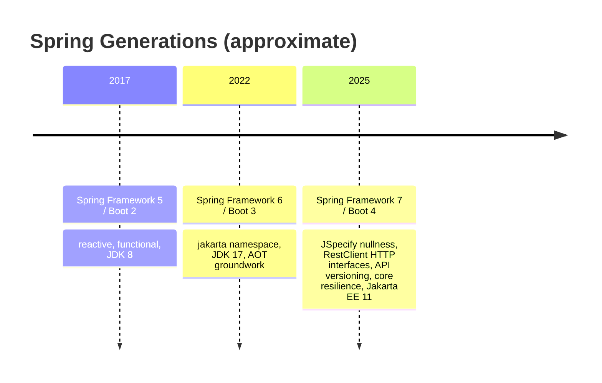
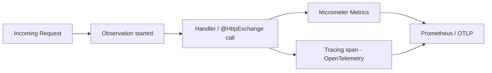
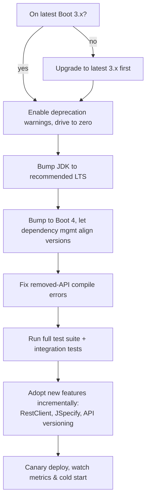

# Spring Boot 4 & Spring Framework 7

Every few years the Spring team ships a **major generation** — Spring Framework 5 (2017, reactive + functional), Spring Framework 6 / Boot 3 (2022, the `javax`→`jakarta` migration + JDK 17 baseline), and now **Spring Framework 7 / Spring Boot 4** (GA around **late 2025**). A major generation is not "more features." It is a **baseline reset** plus a **set of API shifts the team has been holding back for a non-breaking window**: a new minimum JDK, a new Jakarta EE level, removals of long-deprecated APIs, and headline capabilities that needed a major boundary to land. For a team, a major upgrade is the moment you pay down the deprecations you ignored for three years — and the moment you get features that quietly change how you write everyday code.

The analogy: minor releases (6.1, 6.2) are like **OS point updates** — security patches, small features, fully backward-compatible. A major release (6 → 7) is like **moving to a new OS version** — mostly familiar, but some drivers stop working, the minimum hardware bumps, and a few system APIs you depended on are gone. You schedule it, you test it, you do it on purpose.

This topic covers what the Spring 7 / Boot 4 generation actually changes, the **headline features** a senior engineer is expected to reach for in 2026 (**JSpecify null-safety**, **HTTP interface clients / `RestClient`**, **API versioning**, **core resilience annotations**), the baseline bumps (**Jakarta EE 11**, JDK, first-class **AOT/native** and **virtual threads**), and a **concrete Boot 3 → Boot 4 migration story** with before/after code.

> [!NOTE]
> Prerequisites: the Spring IoC container (T01), Boot auto-configuration & starters (T07), and Spring Native / GraalVM (T25) — Boot 4 makes the AOT/native story from T25 first-class. General JVM/virtual-threads understanding (L3) helps.

> [!WARNING]
> Spring Framework 7 / Boot 4 reached GA around **late 2025**. The *direction* of everything below is well-established from the team's public roadmap and milestones, but **exact minor-version numbers, the precise JDK baseline, and which APIs were removed in which milestone are easy to get wrong**. Where a specific number matters, this topic hedges it explicitly — verify against the official release notes before quoting a version in production planning.

## The Cadence — What a Major Generation Means

Spring's modern release rhythm is predictable:

- **Minor releases** (e.g. 6.1, 6.2) roughly **every 6 months**, backward-compatible, with new features behind non-breaking APIs.
- **Major releases** (5 → 6 → 7) every **~3 years**, aligned to a JDK/Jakarta baseline bump, where the team is *allowed* to break things.
- Each Spring Framework major maps to a **Spring Boot major**: Framework 6 ↔ Boot 3, **Framework 7 ↔ Boot 4**.



> [!IMPORTANT]
> The single most useful framing: **the painful part of the last major (6/3) was already done.** The `javax.*` → `jakarta.*` package migration happened in Boot 3. If you are already on Boot 3, the Boot 4 jump is **dramatically smaller** than the Boot 2 → 3 jump was. Most of the work is dependency bumps and clearing deprecations, not a sweeping namespace rewrite.

## The Baseline: JDK, Jakarta EE 11, Virtual Threads, AOT

A major generation resets the floor. For Spring 7 / Boot 4 (hedge the exact numbers):

- **JDK baseline: Java 17+** is the established floor; the generation is built and tested against newer LTS releases (Java 21 / 25) and treats their features — **virtual threads**, pattern matching, sequenced collections — as first-class. *Do not quote a hard "Java 21 required" without checking the release notes* — the team historically keeps the compile baseline conservative while strongly recommending the latest LTS at runtime.
- **Jakarta EE 11** baseline. Boot 3 moved you to the `jakarta.*` namespace at the EE 9/10 level; Boot 4 moves the **specification level** up to EE 11 (newer Servlet, Bean Validation, Persistence/JPA, etc.). Package names do **not** change again — they are still `jakarta.*` — but the underlying spec versions and some default behaviors do.
- **Virtual threads as a normal option.** Boot's `spring.threads.virtual.enabled=true` (introduced in the Boot 3.2 era) is mainstream; on a modern JDK the per-request execution model can switch to one virtual thread per request without a thread pool. This is a config flag, not a rewrite — but it has real consequences (covered below).
- **AOT & GraalVM native as first-class citizens.** The `spring-aot` machinery and native-image build support (T25) are no longer "the new thing on the side" — they are a fully supported, documented build target with the tooling matured.

> [!TIP]
> Treat "what JDK does Boot 4 *require*" and "what JDK should I *run*" as two questions. The required floor is conservative (compatibility); the recommended runtime is the latest LTS (virtual threads, GC, JIT improvements). In practice, target the latest LTS your platform supports.

## Headline Change: JSpecify Null-Safety

For years Spring shipped its **own** nullness annotations (`org.springframework.lang.@Nullable` / `@NonNull`) to document which parameters and return values could be `null`. The Spring 7 generation **adopts [JSpecify](https://jspecify.dev)** — an industry-standard, vendor-neutral set of nullness annotations (`org.jspecify.annotations.@Nullable`, `@NonNull`, `@NullMarked`, `@NullUnmarked`) — across the entire framework codebase.

Why this matters:

- **One standard, many tools.** JSpecify is backed by Google, JetBrains, Microsoft, Oracle, and others. Annotating with JSpecify means **IntelliJ, the Kotlin compiler, NullAway, Checker Framework, and Error Prone** all understand your intent — you get **compile-time / build-time null checking** instead of runtime NPEs.
- **`@NullMarked` packages.** A package (or module) marked `@NullMarked` flips the default: every type is **non-null unless explicitly `@Nullable`**. This is the same mental model Kotlin uses — `String` means "never null," `@Nullable String` means "might be null."
- **Better Kotlin interop.** Because Kotlin reads JSpecify annotations, Spring APIs surface as proper nullable/non-null Kotlin types, eliminating a whole class of platform-type surprises.

Before (Boot 3, Spring's own annotation, runtime-only intent):

```java
import org.springframework.lang.Nullable;

public class UserService {

    @Nullable
    public User findByEmail(String email) {       // is `email` allowed to be null? unclear
        return repository.findByEmail(email);       // may return null
    }
}
```

After (Boot 4, JSpecify, build-time checkable):

```java
import org.jspecify.annotations.NullMarked;
import org.jspecify.annotations.Nullable;

@NullMarked                                  // everything below is non-null by default
package com.example.users;                   // (placed in package-info.java)
```

```java
package com.example.users;

import org.jspecify.annotations.Nullable;

public class UserService {

    // email is non-null (inherited from @NullMarked); return may be null
    public @Nullable User findByEmail(String email) {
        return repository.findByEmail(email);
    }
}
```

Now a static analyzer (NullAway / IntelliJ) will **flag at build time** any caller that passes a possibly-null `email`, and any code that dereferences the return value of `findByEmail` without a null check.

> [!INTERVIEW]
> **Q: "Spring 7 adopted JSpecify. What does that buy you over Spring's old `@Nullable`, and is it a runtime check?"**
>
> Strong answer: JSpecify is a **vendor-neutral standard** understood by many tools, so adopting it means IDEs, the Kotlin compiler, and static analyzers (NullAway, Checker Framework) can enforce nullness **at compile/build time** — it is *not* a runtime check and adds *no runtime overhead*. The big lever is **`@NullMarked`**: applied to a package, it flips the default to non-null, so you only annotate the exceptions (`@Nullable`), exactly like Kotlin. The practical payoff is catching NPEs in CI instead of production, and cleaner Kotlin interop because Kotlin reads the annotations. Note it's *opt-in for enforcement* — Spring annotating its APIs doesn't break your build; you turn on a checker to benefit.

## Headline Change: HTTP Interface Clients & `RestClient`

The history of "call another HTTP service from Spring" is a graveyard of options: `RestTemplate` (blocking, now feature-frozen but **not removed**), `WebClient` (reactive, fluent, requires WebFlux on the classpath even for simple blocking calls), and various third-party clients. The Spring 6.1 / Boot 3.2 era introduced **`RestClient`** — a modern, fluent, **synchronous** HTTP client with `WebClient`-style ergonomics but no reactive dependency. Spring 7 / Boot 4 makes this the **default recommendation**, and pairs it with **declarative HTTP interface clients**.

Two layers to know:

1. **`RestClient`** — imperative, fluent, the spiritual successor to `RestTemplate` for blocking code.
2. **HTTP Interface clients** (`@HttpExchange`) — define a Java **interface**, annotate methods, and Spring generates the implementation. This is the **Feign-style / Retrofit-style** declarative client, but built into Spring itself (no Spring Cloud OpenFeign needed for the common case — contrast with T18).

Before (Boot 3, `RestTemplate` — verbose, easy to misuse):

```java
@Service
public class CatalogClient {

    private final RestTemplate restTemplate;

    public CatalogClient(RestTemplateBuilder builder) {
        this.restTemplate = builder.rootUri("https://catalog.internal").build();
    }

    public Product getProduct(String id) {
        return restTemplate.getForObject("/products/{id}", Product.class, id);
    }
}
```

After (Boot 4, fluent `RestClient`):

```java
@Service
public class CatalogClient {

    private final RestClient restClient;

    public CatalogClient(RestClient.Builder builder) {
        this.restClient = builder.baseUrl("https://catalog.internal").build();
    }

    public Product getProduct(String id) {
        return restClient.get()
                .uri("/products/{id}", id)
                .retrieve()
                .body(Product.class);
    }
}
```

Even cleaner — a **declarative HTTP interface** (no implementation class at all):

```java
import org.springframework.web.service.annotation.GetExchange;
import org.springframework.web.service.annotation.HttpExchange;

@HttpExchange(url = "/products")
public interface CatalogApi {

    @GetExchange("/{id}")
    Product getProduct(@PathVariable String id);
}
```

```java
@Configuration
class CatalogClientConfig {

    @Bean
    CatalogApi catalogApi(RestClient.Builder builder) {
        RestClient client = builder.baseUrl("https://catalog.internal").build();
        var factory = HttpServiceProxyFactory
                .builderFor(RestClientAdapter.create(client))
                .build();
        return factory.createClient(CatalogApi.class);
    }
}
```

> [!NOTE]
> A direction the Spring 7 generation pushes: **auto-registration of `@HttpExchange` interfaces** so you can annotate the interface and have Boot wire the proxy for you (similar to how `@FeignClient` works), reducing the manual `HttpServiceProxyFactory` boilerplate above. *Hedge:* the exact annotation/property name and how much is auto-configured by default is the kind of detail that shifted across milestones — check the Boot 4 reference for the current auto-config switch before relying on it.

**Decision guidance:**

| Need | Use |
|------|-----|
| Simple blocking HTTP call | `RestClient` |
| Declarative typed client, blocking | `@HttpExchange` interface backed by `RestClient` |
| Reactive / streaming / backpressure | `WebClient` (still the answer; T17) |
| Existing code on `RestTemplate` | Leave it — frozen, not removed — migrate opportunistically |
| Microservice with discovery/load-balancing | `@HttpExchange` (+ Spring Cloud LoadBalancer) or OpenFeign (T18) |

## Headline Change: Built-In API Versioning

Versioning a public API used to be do-it-yourself: parse a header, branch on a path segment, or maintain parallel controllers. Spring 7 brings **first-class API versioning** into Spring MVC and WebFlux. You declare a version on the mapping, configure *how* the version is carried (path segment, request header, query parameter, or media-type parameter), and Spring routes to the right handler.

```java
@RestController
@RequestMapping("/api/orders")
class OrderController {

    // served when the request resolves to version 1
    @GetMapping(version = "1")
    OrderV1 getV1(@PathVariable String id) { ... }

    // served for version 2 — different response shape
    @GetMapping(version = "2")
    OrderV2 getV2(@PathVariable String id) { ... }
}
```

```yaml
# how the version is read off the request (illustrative — confirm exact keys in the Boot 4 reference)
spring:
  mvc:
    apiversion:
      use:
        header: "X-API-Version"     # or a path segment, query param, or media-type param
      default: "1"                  # fallback when the client sends none
```

> [!WARNING]
> The `version = "..."` attribute on `@GetMapping`/`@RequestMapping` and the versioning **resolver** concept are real and established. The **exact property keys** for configuring the version source (`spring.mvc.apiversion.*` shown above) are illustrative — this is precisely the kind of minor-version detail to confirm in the official docs rather than memorize.

In Practice: API versioning shines when you must **evolve a contract without breaking existing clients** — mobile apps you don't control, partner integrations, long-lived public APIs. The framework support means you stop hand-rolling header parsing and get consistent behavior (and OpenAPI/observability integration) across endpoints.

## Headline Change: Resilience Moves Into Core

Patterns that previously required **Spring Cloud Circuit Breaker** / **Resilience4j** (T19) or **Spring Retry** as separate dependencies are moving into **Spring Framework core** as annotations. The generation surfaces declarative **`@Retryable`** and **concurrency limiting** as built-in capabilities.

```java
import org.springframework.resilience.annotation.Retryable;          // core package (direction)
import org.springframework.resilience.annotation.ConcurrencyLimit;

@Service
class PaymentGateway {

    @Retryable(maxAttempts = 3, delay = 200, multiplier = 2.0)        // exponential backoff
    PaymentResult charge(ChargeRequest request) {
        return callExternalPsp(request);   // retried on failure per the policy
    }

    @ConcurrencyLimit(10)                                            // cap concurrent in-flight calls
    InventoryStatus checkStock(String sku) {
        return callInventoryService(sku);
    }
}
```

These are AOP-based (like `@Transactional`), so the usual proxy caveats apply: **self-invocation bypasses the proxy**, and the annotated bean must be a Spring-managed bean.

> [!IMPORTANT]
> Built-in core resilience covers **retry and basic concurrency limiting** — the everyday cases. It does **not** replace **Resilience4j** for rich **circuit breakers, bulkheads, rate limiters, and time limiters** with detailed metrics and state machines (T19). Decision rule: simple retry/backoff and concurrency caps → core annotations; full circuit-breaking with half-open states and dashboards → Resilience4j. *Hedge:* the exact package (`org.springframework.resilience.*`) and attribute names may differ slightly from what's shown — verify against the reference.

## Observability & The Modular Direction

- **Micrometer / Observability.** Boot 3 standardized on the **Micrometer Observation API** (one `Observation` produces both metrics *and* traces). Boot 4 continues to **deepen** this — better defaults, more instrumented components, tighter OpenTelemetry alignment. The mental model is unchanged from T18's tracing discussion; the surface area of what's auto-instrumented grows.
- **Modularity / Spring Modulith direction.** Spring continues pushing **modular monolith** support (the Spring Modulith project) — enforcing module boundaries inside a single deployable, verifying you don't accidentally couple modules, and documenting them. This is adjacent to, not part of, the core framework, but it's the architectural direction the ecosystem is steering toward as a pragmatic alternative to premature microservices.



## Notable Removals & Deprecations

Major releases are where long-deprecated APIs finally disappear. Expect (verify specifics):

- APIs deprecated throughout the 6.x line are **removed** in 7.0 — the framework's standing advice is *"build against the latest 6.x with deprecation warnings on, fix them all, then jump to 7.0."*
- `RestTemplate` and `WebClient` are **not removed** — `RestTemplate` is frozen (no new features), `WebClient` remains the reactive client.
- Older config and integration shims accumulated over 6.x are pruned.
- Third-party baseline bumps (e.g. newer Jackson, newer Hibernate aligned to Jakarta Persistence in EE 11) can surface **transitive** breaking changes that aren't Spring's own code — often the *actual* source of upgrade pain.

> [!TIP]
> The cheapest migration insurance you can buy: **before** the major jump, upgrade to the **latest minor of your current major** (the newest Boot 3.x), turn on deprecation warnings, and drive them to zero. The deprecations you clear on 3.x are exactly the things removed in 4.0.

## The Migration Story: Boot 3 → Boot 4

A realistic, de-risked sequence for upgrading a production Boot 3 service:



1. **Get current first.** Move to the **newest Boot 3.x** and the newest JDK LTS you support. Resolve every deprecation warning. This is 80% of the work and it's done on a *stable* line.
2. **`javax` → `jakarta` is already done.** If you're on Boot 3, your imports are already `jakarta.*`. Boot 4 only bumps the **Jakarta EE spec level to 11** — no namespace rewrite. (If you somehow skipped Boot 3, *that* migration must happen first and is the larger effort.)
3. **Bump the version.** Change the Boot parent/BOM to 4.x and let Boot's dependency management align transitive versions. Expect compile failures from **removed APIs** — fix them mechanically.
4. **Watch the transitive bumps.** Newer Jackson, Hibernate, Tomcat/Jetty, etc. ride along. Read *their* release notes; a surprising amount of "Boot 4 broke my app" is actually a transitive library's behavior change.
5. **Test, then adopt.** Get the suite green on Boot 4 *as-is* before refactoring. Then adopt new features incrementally — swap `RestTemplate` for `RestClient`, annotate packages `@NullMarked`, introduce API versioning where contracts need it.

Concrete before/after of the two changes you'll make most:

```java
// BEFORE (Boot 3): RestTemplate + Spring's own @Nullable
import org.springframework.lang.Nullable;

@Nullable
public Product fetch(String id) {
    return restTemplate.getForObject("/products/{id}", Product.class, id);
}
```

```java
// AFTER (Boot 4): RestClient + JSpecify nullness
import org.jspecify.annotations.Nullable;

public @Nullable Product fetch(String id) {
    return restClient.get()
            .uri("/products/{id}", id)
            .retrieve()
            .body(Product.class);
}
```

### Virtual Threads On By Default — Consider Carefully

Boot makes per-request **virtual threads** trivial (`spring.threads.virtual.enabled=true`). The generation leans into it, but flipping it on is a **decision, not a default you ignore**:

- **Great for** I/O-bound request handling (DB calls, downstream HTTP) — you drop the thread-pool ceiling and scale concurrency cheaply.
- **Watch for pinning.** Code holding a `synchronized` lock across a blocking call **pins** the carrier thread, defeating the benefit. Modern JDKs have reduced pinning, but legacy libraries with `synchronized` I/O paths can still hurt.
- **Pooled resources still cap you.** Your **DB connection pool** (HikariCP) is still finite — unbounded virtual threads can pile up *waiting* for a connection. Virtual threads remove the *thread* bottleneck, not the *downstream* bottleneck.
- **Observability/thread-locals.** Verify your tracing/MDC propagation works under virtual threads (Micrometer context propagation handles this, but check your custom thread-locals).

In Practice: enable virtual threads on a **canary**, load-test against realistic downstream latency, and watch connection-pool saturation and tail latency before rolling out fleet-wide.

## Use-Cases & Decision Guidance

- **When to upgrade now:** you're on Boot 3, you want JSpecify-enforced null-safety in CI, you're building new HTTP clients (reach for `RestClient`/`@HttpExchange`), or you need clean API versioning. The jump is small *if you're current on 3.x*.
- **When to wait:** you're mid-feature-crunch, you depend on a library without a Boot 4-compatible release yet, or you're still on Boot 2 (do **2→3** first — that's the big one).
- **De-risking levers:** drive deprecations to zero on 3.x first; pin and read transitive release notes; keep the test suite green *before* adopting new features; canary deploy and watch cold-start + tail latency + pool saturation.

## Practice

1. **Nullness in CI.** Take a Boot 3 service, add `package-info.java` with `@NullMarked` to one package, add JSpecify and a checker (NullAway via Error Prone, or rely on IntelliJ inspections), and fix every nullness warning it surfaces. Note how many were latent NPE risks.
2. **RestTemplate → RestClient.** Find a `RestTemplate` call in an existing service and rewrite it three ways: `RestClient`, a declarative `@HttpExchange` interface, and (for contrast) `WebClient`. Compare readability and the dependencies each pulls in.
3. **API versioning.** Add a `version = "2"` mapping alongside an existing endpoint that returns a changed DTO shape. Drive it with a header-based resolver and verify old clients (no version header) still hit v1 via the default.
4. **Core resilience.** Add `@Retryable` with exponential backoff to a flaky downstream call. Then prove the self-invocation gotcha: call the annotated method from another method in the *same* bean and observe the retry doesn't apply.
5. **Virtual-thread load test.** Enable `spring.threads.virtual.enabled=true` on a service with a DB call, then load-test with a small Hikari pool. Observe where the bottleneck moves (from threads to connections).

## Recap

- **Spring Framework 7 / Boot 4** (GA ~late 2025) is a **major generation**: a baseline reset (JDK floor + **Jakarta EE 11**, first-class **AOT/native** and **virtual threads**) plus headline API shifts. Crucially, the painful `javax`→`jakarta` migration was **already done in Boot 3**, so the 3→4 jump is far smaller than 2→3 was.
- **JSpecify null-safety** replaces Spring's own annotations — vendor-neutral, **build-time** (not runtime) checking, with `@NullMarked` flipping the default to non-null like Kotlin.
- **`RestClient` + `@HttpExchange`** are the modern HTTP client story: fluent blocking client and declarative typed interfaces; `RestTemplate` is frozen-not-removed; `WebClient` stays for reactive.
- **API versioning** and **core resilience** (`@Retryable`, concurrency limits) move into the framework — but Resilience4j still owns rich circuit breaking.
- **Migration:** get current on 3.x, clear deprecations, bump JDK, then bump Boot, fix removed APIs, watch transitive library bumps, test green, *then* adopt new features. **Hedge the exact version/property/JEP specifics** against the official release notes.

## Next

- **T25 — Spring Native / GraalVM**: the AOT/native execution model that Boot 4 makes first-class.
- **T17 — Spring WebFlux (Reactive)**: where `WebClient` (not `RestClient`) remains the right tool.
- **T18 — Spring Cloud (Config, Gateway, Eureka, OpenFeign)**: how declarative clients and resilience play at the distributed-systems scale.
- **T19 — Spring Cloud Resilience (Resilience4j)**: the full circuit-breaker/bulkhead toolkit beyond core `@Retryable`.
