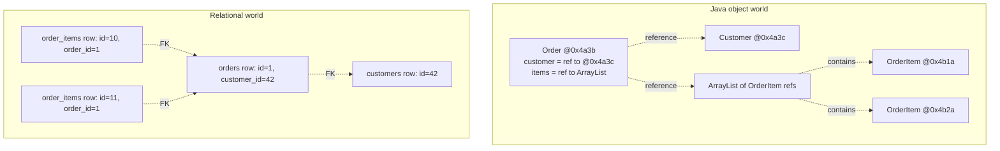
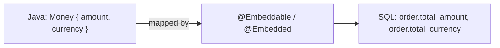
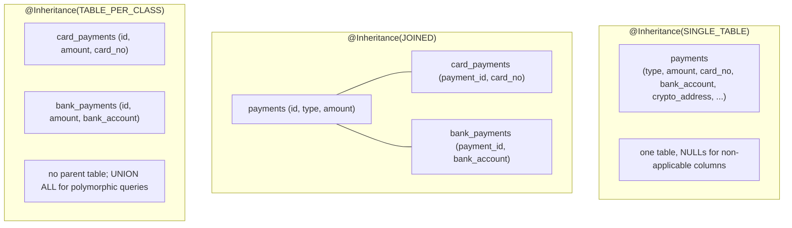
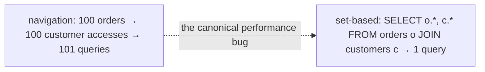
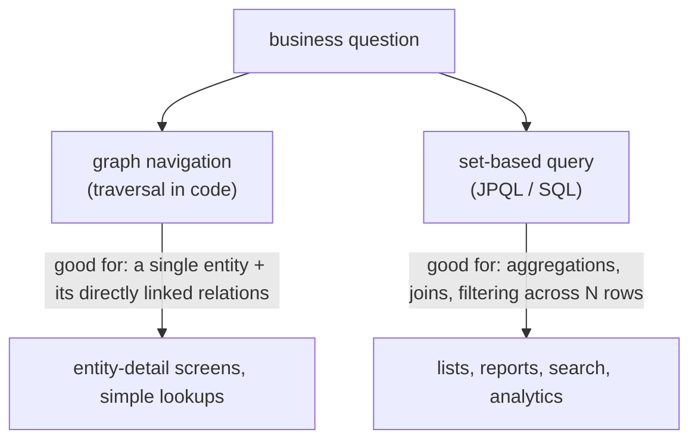
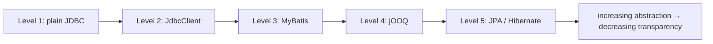

# ORM concepts & the impedance mismatch

A Java program thinks in **objects** — heap-allocated graphs of mutable state, linked by references, polymorphic through inheritance, with identity defined by memory address. A relational database thinks in **tuples** — flat rows in declarative tables, joined via foreign keys, identified by primary keys, set-oriented rather than navigational. The two models are powerful in their own domains but fundamentally **mismatched**: every concept on one side (identity, association, inheritance, encapsulation, collections, types) bends or breaks when forced onto the other. **Object-relational mapping (ORM)** is the disciplined practice of bridging the two — and **the impedance mismatch** is the set of problems any ORM must solve, with the trade-offs that determine whether you reach for a full ORM (JPA / Hibernate), a thin SQL-mapper (MyBatis), a typed query builder (jOOQ), or just plain JDBC.

This topic is the **conceptual foundation** for everything in C02. Before diving into JPA's `@Entity` syntax, the persistence context, lazy loading, N+1, locking, and Spring Data repositories, a senior engineer needs the *vocabulary and mental model* of why ORM exists, what specifically is being mapped, and which problems are inherent to *any* mapping versus specific to Hibernate's choices. This shapes every decision later: when to use an ORM versus drop to SQL, how to model identity, how to choose inheritance strategies, how to decide between eager and lazy fetching, and when to accept that some queries are best written in SQL even in an ORM-heavy codebase.

The depth-bar this topic clears: at the **language layer**, the precise meaning of "ORM", "entity", "value type", "association", "identity", and the JPA spec's positioning; the catalog of Java persistence options (plain JDBC, MyBatis, jOOQ, JPA / Hibernate, Spring Data JDBC). At the **memory layer**, the difference between an in-heap object graph (linked by references, evicted by GC) and a relational result set (rows in memory, eagerly materialized, no implicit graph), and the costs of each mapping decision (a single eager-fetched `@OneToMany` collection in a 1000-row query → 1000 entity allocations + their child collections; lazy fetching defers it but introduces the N+1 trap). At the **architecture layer** — the heart — **the seven dimensions of the impedance mismatch** (identity, granularity, inheritance, association direction, data navigation, types, set vs graph), what *each* costs, and what *each* ORM tradition has chosen. The seven dimensions are the spine of the next 15 topics; understanding them here makes every later topic land cleanly.

> [!NOTE]
> Prerequisites: SQL basics (CREATE TABLE, INSERT, SELECT, JOIN — covered in L2/C05). JDBC fundamentals (`Connection`, `Statement`, `ResultSet` — L2/C05). Java OOP (T01-T19 of L1/C01). No JPA knowledge required — this topic teaches the *concepts*; the next topics teach the spec.

## Two Worlds, Two Models

A Java order management system has classes like:

```java
public class Order {
    private Long id;
    private Customer customer;          // reference to another object
    private List<OrderItem> items;       // collection of objects
    private OrderStatus status;          // enum
    private Money total;                 // value object
    private Instant createdAt;
}

public class OrderItem {
    private Long id;
    private Order order;                 // back-reference (bidirectional)
    private Product product;
    private int quantity;
    private Money unitPrice;
}

public class Customer { Long id; String name; List<Address> addresses; ... }
```

The same domain in a relational database:

```sql
CREATE TABLE customers (
    id BIGINT PRIMARY KEY,
    name VARCHAR(80) NOT NULL
);
CREATE TABLE orders (
    id BIGINT PRIMARY KEY,
    customer_id BIGINT REFERENCES customers(id),
    status VARCHAR(20),
    total_cents BIGINT,
    total_currency VARCHAR(3),
    created_at TIMESTAMP
);
CREATE TABLE order_items (
    id BIGINT PRIMARY KEY,
    order_id BIGINT REFERENCES orders(id),
    product_id BIGINT REFERENCES products(id),
    quantity INT,
    unit_price_cents BIGINT,
    unit_price_currency VARCHAR(3)
);
CREATE TABLE customer_addresses (
    customer_id BIGINT REFERENCES customers(id),
    address_line1 VARCHAR(200),
    ...
    PRIMARY KEY (customer_id, address_line1)
);
```

Both describe the same business reality. They look surprisingly similar — column-per-field, table-per-class, foreign-key-per-reference. But every "almost the same" hides a precise mismatch.



The bridge between the two is **mapping**. ORM is the practice of declaring "this Java class corresponds to that table, this field to that column, this association to that foreign key" and having the framework execute the right SQL when you operate on objects.

## The Seven Dimensions of Impedance Mismatch

Christian Bauer and Gavin King (Hibernate's authors) identified seven mismatches in *Java Persistence with Hibernate*. They are the **spine** of every ORM decision; every later topic in C02 traces back to one or more of them.

### 1. Granularity Mismatch

Java has fine-grained types: a class can have nested classes, value objects, embedded types. SQL flattens. A `Money` Java class with `amount` and `currency` typically maps to *two columns*; an embedded `Address` becomes three or four columns.

```java
public class Money {
    BigDecimal amount;
    Currency currency;
}
public class Order {
    Money total;   // one field; two DB columns
}
```

In the database:
```sql
total_amount DECIMAL(19,2),
total_currency VARCHAR(3)
```

JPA solves this with `@Embeddable` / `@Embedded`. The `Money` becomes a **value type** — it has no identity, lives inside the owning entity's row, has the lifetime of the entity.



This dimension matters for **modeling**: every entity has a handful of value types living inside it. A bad mapping promotes value types to entities (extra table, extra join, extra primary key), bloating the schema. A good mapping keeps value types embedded — flat in the row, no separate identity.

### 2. Identity Mismatch

Java objects have **two** notions of identity: **object identity** (`==` — same memory address) and **equality** (`.equals()` — domain-meaningful). SQL has *one*: **primary key**.

For a brand-new `Order` not yet saved, what is its identity?

- Object identity: unique (it's a fresh allocation).
- Equality: depends on what you've overridden in `equals/hashCode` — typically based on fields like `(customer, createdAt)`.
- Primary key: `null` — not yet assigned.

After saving, the database assigns `id = 42`. Now three identities exist and they all coexist:

```java
Order a = orderService.find(42);
Order b = orderService.find(42);
a == b ?           // ??? depends on whether the ORM caches by id
a.equals(b) ?      // depends on your equals() implementation
a.id() == b.id()?  // true (same DB id)
```

JPA fixes this within a single **persistence context** (T05) by guaranteeing **identity scope**: two `find(42)` calls within the same context return the *same* Java reference. Outside that scope, object identity becomes incidental.

This dimension matters for **`equals`/`hashCode` design**, **collection membership** (a `Set<Order>` needs `hashCode` to be stable across saves), and the **detached entity** problem (an object loaded in one context and reattached to another) — covered in T05.

### 3. Inheritance Mismatch

Java has inheritance, polymorphism, abstract classes, interfaces. Relational databases have no inheritance in any form. Mapping an inheritance hierarchy requires choosing one of four strategies, each with substantial trade-offs:

| Strategy | Tables | Pro | Con |
|----------|--------|-----|-----|
| **Single-table** | one big table with discriminator column | one query, no joins, fast | NULLs for unused fields; wide rows; no NOT NULL on subtype-specific columns |
| **Joined-table** | one table per class, joined by id | normalized, NOT NULL enforced | every polymorphic query joins N tables |
| **Table-per-class** | one table per concrete class, no parent table | simple per-class queries | UNION ALL across types is expensive; no shared id space |
| **Mapped superclass** | parent is a Java mixin, not a table | clean Java; flexibility | no polymorphic queries; tables independent |



JPA expresses this with `@Inheritance(strategy = ...)`. The choice is permanent and architectural — covered in T03.

### 4. Association Mismatch

Java associations are **directional references**: `Order` has `Customer customer`; the back-reference is optional.

SQL **foreign keys are always directional** (the FK is on one side; the other side has *no* representation; to find an order's items you query `SELECT * FROM order_items WHERE order_id = ?`).

```mermaid
flowchart LR
  subgraph Java
    O["Order"]
    C["Customer"]
    I["OrderItem"]
    O -->|"order.customer"| C
    O -->|"order.items"| I
  end
  subgraph SQL
    OR["orders"]
    IR["order_items.order_id"]
    OR <-- IR
    Note["the FK is on the many-side;<br/>the one-side has no column"]
  end
```

JPA models four association cardinalities — `@OneToOne`, `@OneToMany`, `@ManyToOne`, `@ManyToMany` — each with **owning side** and **inverse side** semantics. The owning side defines the FK; the inverse side `mappedBy` references it. Wrong-side updates silently no-op — a major source of beginner bugs.

This dimension matters for **bidirectional associations** (you must keep both sides in sync in Java code; JPA doesn't auto-sync), **cascade and orphan-removal semantics**, and **lazy loading** (which side proxies which).

### 5. Data Navigation Mismatch

Java code walks the object graph: `order.getCustomer().getAddresses().get(0).getStreet()` — four field accesses. SQL doesn't navigate; it issues **set-based queries** that join and filter.

Translating navigation literally produces **the N+1 problem**: loading 100 orders, then accessing `order.customer` for each, issues 1 (for the orders) + 100 (one per customer) SELECTs. The same data in one SQL query is one JOIN.



ORMs offer multiple tools (eager fetching, JOIN FETCH, `@EntityGraph`, batch fetching) for this. Getting it right is one of the most common reasons services need rearchitecting. T06 (lazy vs eager) and T07 (N+1) are dedicated topics.

### 6. Type Mismatch

Java has `int`, `Integer`, `long`, `Long`, `String`, `LocalDate`, `Instant`, `UUID`, `Money`, `Email`, custom value objects, enums.

SQL has `INTEGER`, `BIGINT`, `VARCHAR`, `DATE`, `TIMESTAMP`, `UUID` (some dialects), `JSON` (some dialects). The standard JDBC types are limited.

Three mapping categories:

- **Direct**: `int ↔ INTEGER`, `String ↔ VARCHAR`. The driver handles it.
- **Standard JPA**: `LocalDate ↔ DATE`, `Instant ↔ TIMESTAMP WITH TIME ZONE`, `UUID ↔ UUID`. JPA defines these.
- **Custom**: `Email ↔ VARCHAR` with validation. Use `@AttributeConverter`.

```java
@Converter(autoApply = true)
public class EmailConverter implements AttributeConverter<Email, String> {
    @Override public String convertToDatabaseColumn(Email e) { return e == null ? null : e.value(); }
    @Override public Email convertToEntityAttribute(String s) { return s == null ? null : new Email(s); }
}
```

For JSON columns (Postgres `jsonb`, MySQL `JSON`) — `@Convert` to a JSON converter and store the serialized form, or use Hibernate's `@JdbcTypeCode(SqlTypes.JSON)` (Hibernate 6+).

### 7. Set vs Graph Mismatch

The biggest one. Java thinks in **graphs** — directed, possibly cyclic, navigated lazily, allocated per-object. SQL thinks in **sets** — homogeneous tuple collections, processed declaratively, returned as flat result sets.

A query like "find all customers with at least one premium order placed last month, ordered by total spend" is a single SQL query — a few joins, an aggregation, ORDER BY:

```sql
SELECT c.id, c.name, SUM(o.total_cents)
FROM customers c
JOIN orders o ON o.customer_id = c.id
WHERE o.status = 'PREMIUM' AND o.created_at >= ?
GROUP BY c.id, c.name
ORDER BY SUM(o.total_cents) DESC;
```

The same in pure Java navigation:

```java
return customerRepo.findAll().stream()
    .filter(c -> c.getOrders().stream()
        .anyMatch(o -> o.getStatus() == PREMIUM && o.getCreatedAt().isAfter(start)))
    .sorted(comparing(c -> c.getOrders().stream()
        .filter(o -> o.getStatus() == PREMIUM).mapToLong(Order::totalCents).sum(), reverseOrder()))
    .toList();
```

…which loads every customer, every order, every premium status check into memory; transfers gigabytes of data; computes the answer in your JVM. **Catastrophic.**

ORMs respond by providing query languages — JPQL, Criteria API, native SQL — that *think in sets* even when navigating object models. Set-thinking is the right answer for any data-shaping problem; graph-navigation is right for "I have one object; tell me its related objects."



A senior engineer instinctively recognizes when the navigation path is producing a 1000-query nightmare and rewrites as JPQL. T08 covers JPQL; the JPA query DSL is the pragmatic answer to set-thinking inside an object-modeling framework.

## The Spectrum of Java Persistence Options

Given the mismatch is irreducible, you choose the tool whose trade-off matches your problem. Five levels of abstraction, increasing in "magic":

### Level 1: Plain JDBC

```java
try (Connection c = dataSource.getConnection();
     PreparedStatement ps = c.prepareStatement("SELECT * FROM users WHERE id = ?")) {
    ps.setLong(1, id);
    try (ResultSet rs = ps.executeQuery()) {
        if (rs.next()) {
            return new User(rs.getLong("id"), rs.getString("name"), rs.getString("email"));
        }
        return null;
    }
}
```

Maximum control; minimum convenience. Useful for:

- Hot paths where every microsecond matters.
- Bulk ETL with non-trivial transformations.
- Database features ORMs don't model well (Postgres LISTEN/NOTIFY, advisory locks, COPY).

Cost: every query is hand-rolled; every result set hand-mapped; SQL injection requires careful `PreparedStatement` discipline; refactoring is painful.

### Level 2: JdbcTemplate / Spring JdbcClient

A thin wrapper over JDBC. Spring's `JdbcTemplate` / `JdbcClient` (Boot 3.2+) eliminates the boilerplate without imposing ORM semantics:

```java
JdbcClient client = JdbcClient.create(dataSource);

User user = client.sql("SELECT id, name, email FROM users WHERE id = ?")
    .param(id)
    .query(User.class)
    .single();
```

Still SQL-first; still no automatic graph loading. The result is a flat object. Good for services where the SQL is the source of truth.

### Level 3: MyBatis

SQL in XML or annotations; result-mapping declarative. The mapping is direct but expressive:

```xml
<select id="findById" resultMap="userResult">
    SELECT u.id, u.name, u.email FROM users u WHERE u.id = #{id}
</select>
```

Better than raw JDBC for medium-complexity codebases; the SQL stays visible. Less popular in greenfield Spring projects today; common in legacy Asian-market projects.

### Level 4: jOOQ

A type-safe query builder. Generates Java DSL from your schema; queries become typed code:

```java
User u = ctx.select(USERS.ID, USERS.NAME, USERS.EMAIL)
    .from(USERS)
    .where(USERS.ID.eq(id))
    .fetchOneInto(User.class);
```

You **write SQL in Java**, type-checked at compile time. Refactor-friendly, IDE-friendly, dialect-aware. The sweet spot for teams that want SQL control + Java safety.

### Level 5: JPA / Hibernate

The full ORM. Declarative entity mapping; persistence context manages identity; automatic dirty-checking; navigation triggers lazy loads. Maximum convenience for object-shaped CRUD; least transparency:

```java
@Entity
public class User {
    @Id Long id;
    String name;
    @Email String email;
    @OneToMany(mappedBy = "owner") List<Order> orders;
}

User u = entityManager.find(User.class, id);
u.setEmail("new@x.io");  // dirty-tracked
// commit triggers UPDATE
```

JPA is what C02 spends 15 topics on. It's the dominant Java persistence framework precisely because for the 80% case (object-shaped CRUD), the convenience wins over the trade-offs.



### Spring Data JDBC — The Modern Middle

A 2018 entrant from the Spring team. The pitch: "repository abstraction (like Spring Data JPA) without Hibernate's complexity." No persistence context, no proxies, no lazy loading, no dirty tracking. Aggregates are loaded as a whole; saves replace the whole aggregate.

For domain-driven design where aggregates are clear and small, Spring Data JDBC is a clean fit. For complex object graphs with many associations, JPA is still the answer.

## Choosing Between Approaches

| Project profile | Best fit |
|-----------------|---------|
| CRUD-heavy with rich object model | **JPA / Hibernate** |
| Read-heavy with complex queries | **jOOQ** or **plain SQL + JdbcClient** |
| ETL / batch | **plain JDBC** or **Spring Batch + JdbcTemplate** |
| Domain-driven design with small aggregates | **Spring Data JDBC** |
| Legacy DB with hand-tuned SQL | **MyBatis** or **JdbcClient** |
| Hot path requiring every µs | **plain JDBC** |
| New microservice | **JPA + jOOQ for complex reads** (the mature pattern) |

Many teams **mix**: JPA for CRUD; jOOQ or native SQL for analytical queries; plain JDBC for hot paths or migrations. This is fine and common. The choice is per-query, not per-codebase.

## The ORM Decision That Matters Most

> **Use ORM for state management; use SQL for set-shaped queries.**

The single most important guideline. JPA shines when you have an object (an `Order`), you mutate it, and you save it — the dirty tracking, the cascading, the identity scope, all earn their keep. JPA suffocates when you have a *report* — "give me the top 10 customers by Q4 revenue" — because the framework wants to materialize entities, run navigation, build object graphs, when what you needed was a SELECT.

Mature codebases reach for the ORM 70% of the time, native SQL 25%, jOOQ or plain JDBC 5%. The 70/25/5 ratio is empirical; calibrate per project.

## Common Misconceptions

> [!WARNING]
> **"ORM means you never write SQL."** False. Mature ORM use writes SQL when SQL is the right answer. JPA's JPQL is *almost* SQL with object syntax; native queries are first-class.

> [!WARNING]
> **"ORM is slow."** False at the framework level; true when used wrong. A well-tuned Hibernate app is within 5% of hand-rolled JDBC. An N+1 violator is 100× slower.

> [!WARNING]
> **"ORM eliminates SQL knowledge."** Catastrophically false. ORM *adds* a layer; understanding what SQL it emits is mandatory to debug it. Read SQL logs; understand the generated queries.

> [!WARNING]
> **"You can hide the DB behind an ORM."** No. The leaky abstractions of N+1, large transactions, eager loading, optimistic-locking exceptions force you to engage with the DB semantics. Embrace it.

> [!WARNING]
> **"All ORMs are the same."** No. Hibernate is highly featured but complex. EclipseLink is simpler. Spring Data JDBC is minimal. Choose deliberately.

## Practice

1. Take a simple Java model (`User → orders → items`). Write the SQL schema. List five places where the mappings are *not* one-to-one (granularity, identity, association, navigation, types).
2. Pick a real query in your codebase. Write three versions: pure JDBC, JPQL, jOOQ. Compare verbosity, type safety, and the SQL emitted.
3. Identify in your codebase a place where a JPA navigation is hiding an N+1. Rewrite as a JOIN FETCH JPQL.
4. Take an entity with `@OneToMany` and try `Single-table` vs `Joined-table` inheritance. Compare the generated DDL and a polymorphic query's emitted SQL.
5. Implement an `@AttributeConverter<Money, String>` for a value object. Verify the column shape and that the converter runs on read and write.
6. Set `hibernate.show_sql=true` and run your service. Read every SQL it emits over 1 minute. Identify three queries that surprised you — write the explanation.
7. Build the same simple service with Spring Data JPA and Spring Data JDBC. Compare the code, the queries, and the model. Decide which fits.
8. Articulate, in your team's own words, when SQL goes in JPQL, when in native, and when out of the repository entirely.

## Recap

You should now be able to:

- Define ORM, the impedance mismatch, and the seven dimensions (granularity, identity, inheritance, association, navigation, types, set vs graph).
- Explain why JPA's `@Embeddable` is the granularity-mismatch answer and why value types should not become entities.
- Articulate identity scope: within a persistence context, object identity ≡ primary-key equality.
- Choose between the four inheritance strategies (Single-Table, Joined, Table-Per-Class, Mapped Superclass) by trade-off.
- Recognize when navigation produces N+1 and reach for JOIN FETCH or `@EntityGraph`.
- Distinguish set-based queries (the SQL approach) from graph navigation (the object approach), and pick the right one per question.
- Pick the right level of Java persistence (plain JDBC, JdbcClient, MyBatis, jOOQ, Spring Data JDBC, JPA / Hibernate) per query shape.
- Use `@AttributeConverter` for custom type mappings.
- Avoid the four big misconceptions: ORM doesn't eliminate SQL; ORM isn't slow when tuned; ORM doesn't hide the DB; ORMs differ.

## Next

Continue to [JPA fundamentals (entities, EntityManager)](./T02-jpa-fundamentals-entities-entitymanager.md) for the spec itself — `@Entity`, `@Id`, `@GeneratedValue`, the `EntityManager` API, persistence units, and how Spring Boot wires JPA via `JpaAutoConfiguration` so you rarely touch the raw spec — but understanding the underlying API makes every later topic clean.
