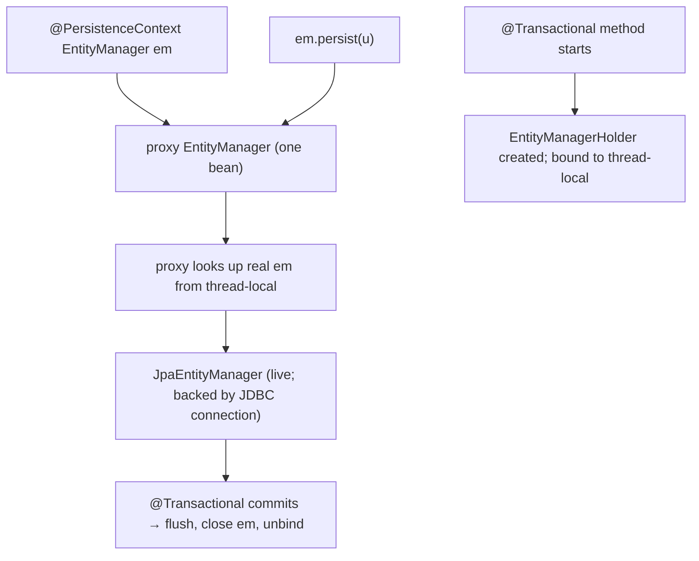

# JPA fundamentals (entities, EntityManager)

JPA (Jakarta Persistence API; before Jakarta EE rename, JSR-338 / JPA 2.x; current Jakarta Persistence 3.x) is the Java standard for object-relational mapping. The spec defines: **what an entity is** (a POJO annotated `@Entity`); **how to identify and generate keys** (`@Id`, `@GeneratedValue`); **how to persist, read, update, delete** (the `EntityManager` API); **how to express queries** (JPQL, the Criteria API); **how lifecycle callbacks work** (`@PrePersist`, etc.); and **how to configure** the persistence provider (Hibernate / EclipseLink). Spring Boot's `spring-boot-starter-data-jpa` wires the whole stack — provider, datasource, transaction manager, entity manager factory, repositories — with sensible defaults; you rarely write `persistence.xml` or call `EntityManager` directly. But **understanding the underlying API is the foundation** for everything else in C02. When Spring Data JPA's magic doesn't do what you want, you drop to `EntityManager`. When N+1 happens, you diagnose by reading the queries the `EntityManager` issued. When transactions roll back unexpectedly, you trace through `persist` / `flush` / `commit`.

This topic is the deep introduction to the JPA API itself — the entity, the manager, the lifecycle. T05 dedicates a full topic to the **persistence context** (the in-memory cache + identity scope that lives inside an `EntityManager`); T03 to relationships; T06 to fetching; T07 to N+1. Here we lay the groundwork: what is an entity at the bytecode level (a class enhanced by the provider with extra fields for state tracking); how the `EntityManager` is constructed, threaded, scoped, and integrated with Spring's transaction manager; and how Spring Boot's defaults translate to the underlying spec calls.

The depth-bar this topic clears: at the **language layer**, every standard annotation (`@Entity`, `@Table`, `@Id`, `@GeneratedValue`, `@Column`, `@Embedded`, `@Transient`, `@Lob`, `@Enumerated`, `@Temporal` legacy, lifecycle callbacks), the `EntityManager` API (`persist`, `merge`, `remove`, `find`, `getReference`, `flush`, `clear`, `detach`, `contains`, `refresh`, `lock`), and `EntityManagerFactory` lifecycle. At the **memory layer**, what Hibernate adds to your `@Entity` class at runtime — bytecode enhancement injects state-tracking fields, lazy-init proxies, dirty-checking handles; an entity instance is ~40–80 bytes heavier than its pure-POJO equivalent. At the **architecture layer** — the heart — the **Spring-JPA integration**: how `JpaAutoConfiguration` wires `LocalContainerEntityManagerFactoryBean`, `HikariCP`, `JpaTransactionManager`; how `@PersistenceContext` injects a *proxy* `EntityManager` that, on each call, picks the thread-bound real `EntityManager` from the active transaction; and the canonical patterns for `@Transactional` boundaries that make the whole machine work.

> [!NOTE]
> Prerequisites: [ORM concepts (T01)](./T01-orm-concepts-and-the-impedance-mismatch.md). [Spring AOP (L4/C01/T05)](../C01-spring-framework/T05-spring-aop.md) for transactional proxy mechanics. Familiarity with SQL DDL.

## What an Entity Is

```java
@Entity
@Table(name = "users")
public class User {

    @Id
    @GeneratedValue(strategy = GenerationType.IDENTITY)
    private Long id;

    @Column(name = "name", nullable = false, length = 80)
    private String name;

    @Column(unique = true)
    private String email;

    @Enumerated(EnumType.STRING)
    @Column(nullable = false)
    private UserStatus status = UserStatus.ACTIVE;

    @Column(name = "created_at", nullable = false, updatable = false)
    private Instant createdAt = Instant.now();

    @Transient
    private transient int loginAttempts;   // not persisted

    protected User() { }                  // JPA requires a no-arg constructor

    public User(String name, String email) {
        this.name = name;
        this.email = email;
    }

    // getters, setters, equals, hashCode
}
```

Anatomy:

- `@Entity` marks this class as a JPA entity. Required.
- `@Table(name = "users")` overrides the default table name (which would be `user`). Optional.
- `@Id` marks the primary-key field. Required.
- `@GeneratedValue` specifies how the key is generated (next section). Optional.
- `@Column` overrides column attributes. Optional but pragmatic.
- `@Enumerated(EnumType.STRING)` stores the enum as its string name (vs the default `ORDINAL` — fragile; never use).
- `@Transient` excludes the field from persistence.
- The no-arg constructor is **mandatory** (JPA uses reflection to instantiate; can be `protected` so callers can't misuse).

### Bytecode Enhancement — What Hibernate Adds

JPA providers typically use **bytecode enhancement** (instrumentation) at build time or runtime to add state-tracking fields and dirty-checking hooks to your entities. Hibernate's default is runtime enhancement (via Javassist or ByteBuddy); build-time enhancement (via the Hibernate Maven/Gradle plugin) is faster at runtime.

Enhanced classes contain:

- A `$$_hibernate_*` flag for dirty tracking.
- Lazy-loading interceptors on `@ManyToOne` and collection fields.
- Equality / hash hooks that respect identity.

Your `User` instance in heap is ~40–80 bytes heavier than the bare POJO would be (extra refs + flags). For 100 K entities loaded simultaneously, that's ~6 MB of overhead — negligible relative to the actual data.

### Identity — The Hard Part

```java
@Id
@GeneratedValue(strategy = GenerationType.IDENTITY)
private Long id;
```

Four `GenerationType` strategies:

| Strategy | How | Pros / Cons |
|----------|-----|-------------|
| `IDENTITY` | DB auto-increment column | simple; one round-trip per insert; no batching of inserts |
| `SEQUENCE` | DB sequence (Postgres, Oracle) | batchable; cleaner; SEQ exists outside transaction |
| `AUTO` | provider chooses | unpredictable; pin explicitly |
| `TABLE` | dedicated id-allocation table | portable but slow; rarely worth it |
| `UUID` | JPA 3.1+ for `UUID` ids | type-safe; no DB sequence; distributed-safe |

**Pin to `IDENTITY` for MySQL** (default), **`SEQUENCE` for Postgres/Oracle**, **`UUID` for distributed systems**.

`SEQUENCE` lets Hibernate fetch the next 50 IDs from the sequence in one call, then locally allocate them. Combined with JDBC batch inserts, this gives 10× insert throughput vs `IDENTITY` (which forces one-insert-at-a-time because the DB assigns the id on insert).

```yaml
spring:
  jpa:
    properties:
      hibernate:
        jdbc:
          batch_size: 50
        order_inserts: true
        order_updates: true
```

Custom sequence:

```java
@Id
@GeneratedValue(strategy = GenerationType.SEQUENCE, generator = "user_seq")
@SequenceGenerator(name = "user_seq", sequenceName = "user_id_seq", allocationSize = 50)
private Long id;
```

`allocationSize = 50` means Hibernate increments the sequence by 50 on each fetch, then hands out 50 ids in JVM memory.

### Composite Keys

For natural composite keys (rare in modern code; prefer surrogate `Long`):

```java
@Embeddable
public record OrderItemId(long orderId, long lineNumber) implements Serializable { }

@Entity
public class OrderItem {
    @EmbeddedId
    private OrderItemId id;
    private int quantity;
    // ...
}
```

Or `@IdClass`. Both are noisy; modern preference is **always** a surrogate `Long` or `UUID` plus a `UNIQUE` constraint on the natural key columns.

## The `EntityManager`

`EntityManager` is the central API:

```java
public interface EntityManager {
    // CRUD
    void persist(Object entity);              // mark as managed; INSERT on flush
    <T> T merge(T entity);                    // re-attach a detached entity
    void remove(Object entity);               // mark for DELETE
    <T> T find(Class<T> type, Object id);     // SELECT by id
    <T> T getReference(Class<T> type, Object id);   // lazy proxy; no SELECT yet

    // Lifecycle
    void flush();                             // execute pending SQL
    void refresh(Object entity);              // reload from DB
    void clear();                             // detach everything; clear context
    void detach(Object entity);               // detach one entity
    boolean contains(Object entity);

    // Queries
    Query createQuery(String jpql);
    <T> TypedQuery<T> createQuery(String jpql, Class<T> resultClass);
    Query createNativeQuery(String sql);

    // Locking
    void lock(Object entity, LockModeType mode);

    // Transaction
    EntityTransaction getTransaction();       // for unmanaged contexts; almost never in Spring

    // Properties
    void setFlushMode(FlushModeType mode);
}
```

Spring Boot constructs and injects a transactional `EntityManager` for you. Pattern:

```java
@Service
@Transactional
public class UserService {

    @PersistenceContext
    private EntityManager em;

    public User create(String name, String email) {
        User u = new User(name, email);
        em.persist(u);
        return u;
    }

    public User load(long id) {
        return em.find(User.class, id);
    }

    public void delete(long id) {
        User u = em.find(User.class, id);
        em.remove(u);
    }
}
```

The `@PersistenceContext` annotation injects a **shared proxy** `EntityManager`. On each call the proxy looks up the *real* `EntityManager` bound to the current transaction (via `TransactionSynchronizationManager`'s thread-local). This is how Spring + JPA gives you per-request entity-manager scoping without you ever calling `EntityManagerFactory.createEntityManager()` yourself.



### Thread Safety

`EntityManager` is **not thread-safe**. The proxy makes it look thread-safe by binding a fresh one per transaction. **Never share an `EntityManager` across threads.**

`EntityManagerFactory` *is* thread-safe — it's the singleton factory from which managers are created.

### `find` vs `getReference`

```java
User u = em.find(User.class, 42L);           // SELECT now; null if not exists
User ref = em.getReference(User.class, 42L); // lazy proxy; no SELECT; throws on access if not exists
```

Use `getReference` when you only need the entity to *set a foreign key* on another:

```java
Order o = new Order();
o.setCustomer(em.getReference(Customer.class, customerId));  // no SELECT on customer
em.persist(o);
```

This saves a SELECT round trip. The `o.customer` field holds a proxy; if you access it (`o.getCustomer().getName()`), Hibernate lazily fetches.

### `flush` and `clear`

`flush()` forces Hibernate to issue pending INSERT/UPDATE/DELETE statements *now* (without committing). Useful before issuing a query that depends on uncommitted writes:

```java
em.persist(newUser);
em.flush();  // INSERT now
long count = em.createQuery("SELECT count(u) FROM User u", Long.class).getSingleResult();
// the count includes newUser
```

`clear()` detaches every managed entity, effectively resetting the persistence context. Useful in batch processing to control memory:

```java
for (int i = 0; i < 100_000; i++) {
    em.persist(new Event(...));
    if (i % 1000 == 0) {
        em.flush();
        em.clear();   // release memory; without this, 100K entities accumulate
    }
}
```

`flush()` + `clear()` is the standard batch-processing pattern. T05 covers persistence-context size limits.

## The `EntityManagerFactory`

The factory is a heavy object — it holds:

- The persistence-unit configuration (entities, mapping metadata).
- A connection pool reference.
- The L2 cache (T11).
- Provider-specific state.

One per persistence unit per JVM. Spring Boot creates it via `LocalContainerEntityManagerFactoryBean`:

```java
@Bean
public LocalContainerEntityManagerFactoryBean entityManagerFactory(DataSource ds) {
    LocalContainerEntityManagerFactoryBean emf = new LocalContainerEntityManagerFactoryBean();
    emf.setDataSource(ds);
    emf.setPackagesToScan("com.example.domain");
    emf.setJpaVendorAdapter(new HibernateJpaVendorAdapter());
    emf.setJpaProperties(jpaProperties());
    return emf;
}
```

Spring Boot wires this automatically from `spring.jpa.*` properties. Tweak:

```yaml
spring:
  jpa:
    hibernate:
      ddl-auto: validate     # never auto-create in prod; use Flyway/Liquibase
    show-sql: false           # never in prod; use SQL logger instead
    properties:
      hibernate:
        format_sql: true
        jdbc:
          batch_size: 50
          time_zone: UTC
        order_inserts: true
        order_updates: true
        generate_statistics: false   # enable in dev for query stats
    open-in-view: false        # ALWAYS false in REST services
```

### `open-in-view` — The One Property To Disable

Boot's default is `spring.jpa.open-in-view=true`. This keeps the `EntityManager` open *for the entire HTTP request*, allowing lazy loads inside the controller / view layer. In a REST API this is a **catastrophe** — it hides lazy loads, encourages N+1, leaks the persistence context into HTTP-layer code, and holds DB connections far longer than needed.

**Set `spring.jpa.open-in-view=false`** in every REST service. Force lazy loads to happen inside the `@Transactional` service layer, where they belong.

### `ddl-auto` — Production Reality

`spring.jpa.hibernate.ddl-auto` values:

| Value | Action |
|-------|--------|
| `none` | do nothing |
| `validate` | check the schema matches the entities; fail if not |
| `update` | apply missing changes (additive) |
| `create` | drop + recreate every startup |
| `create-drop` | create + drop on shutdown |

**Production: `validate` or `none`.** Schema changes via Flyway (T03 of C03) or Liquibase. Never `update` — Hibernate's update logic is conservative and won't handle drops, rename, or destructive changes; in mid-2020s Hibernate also makes some changes that surprise teams.

**Dev: `create-drop` for tests; `validate` against a Postgres container** is the right discipline.

## Entity Lifecycle — A First Look

T05 covers this in depth. The states an entity can be in:

```mermaid
stateDiagram-v2
  [*] --> Transient
  Transient --> Managed: persist
  Managed --> Detached: detach / clear / close
  Detached --> Managed: merge
  Managed --> Removed: remove
  Removed --> [*]
  Managed --> [*]: garbage collected
  Transient: not yet known to JPA (new instance)
  Managed: tracked in the persistence context
  Detached: no longer in a persistence context
  Removed: marked for DELETE; deleted on flush
```



- **Transient**: `new User(...)`. Not known to JPA.
- **Managed**: `em.persist(user)` or `em.find(...)`. Tracked; dirty-checked; INSERT/UPDATE on flush.
- **Detached**: persistence context closed (transaction ended). Object still in heap; mutations no longer tracked.
- **Removed**: `em.remove(user)`. DELETE will run on flush.

### Lifecycle Callbacks

Hooks fired by JPA at each transition:

| Annotation | When |
|------------|------|
| `@PrePersist` | before INSERT |
| `@PostPersist` | after INSERT |
| `@PreUpdate` | before UPDATE |
| `@PostUpdate` | after UPDATE |
| `@PreRemove` | before DELETE |
| `@PostRemove` | after DELETE |
| `@PostLoad` | after SELECT loads the entity |

```java
@Entity
public class User {

    @Id @GeneratedValue Long id;
    String name;
    @Column(updatable = false) Instant createdAt;
    Instant updatedAt;

    @PrePersist
    void onCreate() {
        createdAt = Instant.now();
        updatedAt = createdAt;
    }

    @PreUpdate
    void onUpdate() {
        updatedAt = Instant.now();
    }
}
```

Spring Data JPA's `@CreatedDate` / `@LastModifiedDate` (T13 of C01) does this declaratively via auditing.

## Querying — Brief Look

Three query styles:

### JPQL — Object Query Language

```java
List<User> users = em.createQuery(
    "SELECT u FROM User u WHERE u.status = :status ORDER BY u.createdAt DESC",
    User.class)
    .setParameter("status", UserStatus.ACTIVE)
    .setMaxResults(20)
    .getResultList();
```

JPQL talks about entities and their fields, not tables and columns. Translated to SQL by Hibernate. **Strongly preferred** for queries that fit object navigation.

### Native SQL

```java
List<UserSummary> summaries = em.createNativeQuery(
    "SELECT u.id, u.name, COUNT(o.id) AS order_count " +
    "FROM users u LEFT JOIN orders o ON o.customer_id = u.id " +
    "GROUP BY u.id, u.name HAVING COUNT(o.id) > 10",
    "UserSummaryMapping")
    .getResultList();
```

For complex queries JPQL can't express (CTEs, window functions, dialect-specific features). T10 covers in depth.

### Criteria API

```java
CriteriaBuilder cb = em.getCriteriaBuilder();
CriteriaQuery<User> q = cb.createQuery(User.class);
Root<User> u = q.from(User.class);
q.where(cb.equal(u.get("status"), UserStatus.ACTIVE));
q.orderBy(cb.desc(u.get("createdAt")));
List<User> users = em.createQuery(q).setMaxResults(20).getResultList();
```

Type-safe but verbose. T08 covers Criteria; in practice most teams reach for JPQL or jOOQ instead.

## Spring Data JPA — The Modern Layer

Most production Spring code never touches `EntityManager` directly. Instead, **Spring Data JPA** (T13 of C01) provides repository interfaces:

```java
public interface UserRepository extends JpaRepository<User, Long> {
    Optional<User> findByEmail(String email);
    @Query("SELECT u FROM User u WHERE u.status = ?1 ORDER BY u.createdAt DESC")
    List<User> findRecentlyActive(UserStatus status, Pageable pageable);
}

@Service
public class UserService {
    private final UserRepository repo;
    public UserService(UserRepository repo) { this.repo = repo; }
    public User create(String name, String email) {
        return repo.save(new User(name, email));
    }
}
```

Behind the scenes the repository methods delegate to `EntityManager` (specifically `SimpleJpaRepository` which wraps it). Knowing the underlying API means you can drop into `@PersistenceContext EntityManager em` for special cases without losing the rest of the abstraction.

## Worked Example — End-to-End

```yaml
spring:
  datasource:
    url: jdbc:postgresql://localhost:5432/orders
    username: app
    password: secret
  jpa:
    hibernate.ddl-auto: validate
    open-in-view: false
    properties:
      hibernate:
        jdbc:
          batch_size: 50
        order_inserts: true
```

```java
@Entity
@Table(name = "users")
public class User {

    @Id
    @GeneratedValue(strategy = GenerationType.SEQUENCE, generator = "user_seq")
    @SequenceGenerator(name = "user_seq", sequenceName = "user_id_seq", allocationSize = 50)
    private Long id;

    @Column(nullable = false, length = 80)
    private String name;

    @Column(nullable = false, unique = true)
    private String email;

    @Enumerated(EnumType.STRING)
    @Column(nullable = false, length = 20)
    private UserStatus status = UserStatus.ACTIVE;

    @Column(name = "created_at", nullable = false, updatable = false)
    private Instant createdAt;

    @PrePersist void onCreate() {
        if (createdAt == null) createdAt = Instant.now();
    }

    protected User() { }
    public User(String name, String email) { this.name = name; this.email = email; }
    // accessors
}

public interface UserRepository extends JpaRepository<User, Long> {
    Optional<User> findByEmail(String email);
}

@Service
@Transactional
public class UserService {
    private final UserRepository repo;
    public UserService(UserRepository repo) { this.repo = repo; }

    public User create(String name, String email) {
        if (repo.findByEmail(email).isPresent()) throw new DuplicateEmailException();
        return repo.save(new User(name, email));
    }

    @Transactional(readOnly = true)
    public User load(long id) {
        return repo.findById(id).orElseThrow();
    }

    public User updateName(long id, String newName) {
        User u = repo.findById(id).orElseThrow();
        u.setName(newName);
        return u;   // dirty-tracked; UPDATE runs at transaction commit
    }
}
```

Flow on `create(...)`:

1. `@Transactional` on the method starts a transaction; binds an `EntityManager` to the thread.
2. `repo.findByEmail(email)` issues `SELECT u FROM users WHERE email = ?`.
3. If duplicate, throws → tx rolls back.
4. `new User(...)` creates a transient entity.
5. `repo.save(...)` delegates to `em.persist(...)`. The entity becomes managed.
6. `@PrePersist` runs → sets `createdAt`.
7. Method returns; `@Transactional` commits.
8. Hibernate flushes: `SELECT user_id_seq.nextval` (only every 50 inserts), then `INSERT INTO users (id, name, email, status, created_at) VALUES (?, ?, ?, ?, ?)`.
9. Tx commits; connection released.

Every call to `EntityManager` is *implicit* through the repository. Drop to `@PersistenceContext` only when needed.

## Common Pitfalls

> [!WARNING]
> **No `@Transactional` on a write method.** `em.persist(...)` succeeds; commit never happens; nothing is saved. Spring throws `TransactionRequiredException` since the EntityManager has no active transaction. Always annotate service methods.

> [!WARNING]
> **`open-in-view=true` in production.** Hides N+1; leaks the session; holds connections during view rendering. Disable.

> [!WARNING]
> **`ddl-auto: update` in production.** Schema-drift bug factory. Migrate with Flyway/Liquibase.

> [!WARNING]
> **`@Enumerated(EnumType.ORDINAL)`.** A renumber or reorder of the enum breaks every persisted value silently. Always `EnumType.STRING`.

> [!WARNING]
> **`@GeneratedValue(IDENTITY)` on Postgres without sequence batching.** One round-trip per INSERT. Switch to `SEQUENCE` with `allocationSize`.

> [!WARNING]
> **Calling `em.find(...)` for entities you only want to set as FK.** Use `em.getReference(...)`.

> [!WARNING]
> **Forgetting the no-arg constructor.** `Cannot find constructor: ...` at runtime. Make it `protected` if you don't want callers to use it.

> [!WARNING]
> **Calling `em.persist` on a detached entity.** Throws `EntityExistsException`. Use `merge` to re-attach.

> [!WARNING]
> **Mutating an entity outside `@Transactional`.** Changes aren't tracked; not persisted. Either re-attach via `merge` or do mutations inside transactions.

## Practice

1. Build a Boot app with one `@Entity` and one repository. Use Postgres in Testcontainers. Enable `show-sql=true` and inspect the generated DDL and SELECT/INSERT statements.
2. Compare `IDENTITY` vs `SEQUENCE` with `allocationSize=50`. Insert 1000 entities; measure time and count round trips (Hibernate stats or pg_stat).
3. Try `@GeneratedValue(strategy = UUID)`. Compare the schema and inserts.
4. Build a composite-key entity with `@EmbeddedId`. Compare ergonomics to a surrogate `Long` key.
5. Demonstrate `getReference()`: set a FK without loading the parent. Confirm via SQL log that no SELECT fired.
6. Enable `format_sql=true` and `generate_statistics=true`. Run a service operation; read the stats — entity loads, collection fetches, query count.
7. Toggle `open-in-view` between true and false. Trigger a lazy load in a controller; see the behavior diverge.
8. Force a `@PrePersist` to fail. Confirm the transaction rolls back; no row inserted.

## Recap

You should now be able to:

- Define an entity with `@Entity`, `@Id`, `@GeneratedValue`, `@Column`, `@Embedded`, `@Enumerated(STRING)`, `@Transient` correctly.
- Choose the right `GenerationType` (`IDENTITY` for MySQL, `SEQUENCE` with `allocationSize` for Postgres, `UUID` for distributed) and configure batch inserts.
- Use the `EntityManager` API: `persist`, `merge`, `remove`, `find`, `getReference`, `flush`, `clear`, `refresh`, `detach`, `contains`, `lock`.
- Explain how Spring's `@PersistenceContext` injects a thread-aware proxy backed by transaction-bound `EntityManager` instances.
- Configure `LocalContainerEntityManagerFactoryBean` indirectly via Spring Boot's `spring.jpa.*` properties.
- Disable `open-in-view` and set `ddl-auto: validate` in production; rely on Flyway/Liquibase for schema.
- Recognize the four entity states (Transient, Managed, Detached, Removed) and use lifecycle callbacks (`@PrePersist`, `@PreUpdate`, …) for audit fields.
- Choose between JPQL, native SQL, and Criteria for queries; understand Spring Data JPA wraps `EntityManager`.
- Avoid the canonical pitfalls: missing `@Transactional`, `open-in-view=true`, `ddl-auto: update`, `EnumType.ORDINAL`, `IDENTITY` on Postgres.

## Next

Continue to [Entity mappings & relationships (@OneToMany, etc.)](./T03-entity-mappings-and-relationships-onetomany-etc.md) for `@OneToOne`, `@OneToMany`, `@ManyToOne`, `@ManyToMany`, owning side vs inverse side, the FK column, join tables, `mappedBy`, cascade types, and orphan removal — the heart of the association mismatch.
