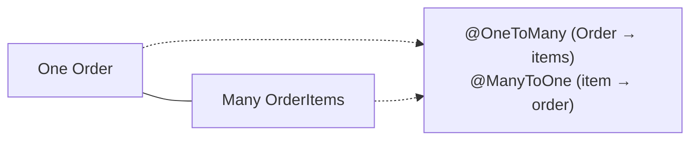
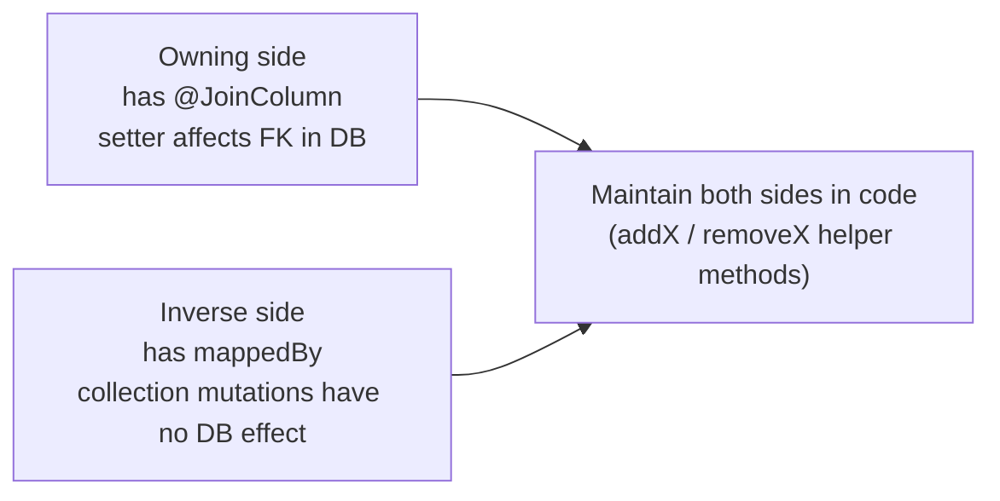
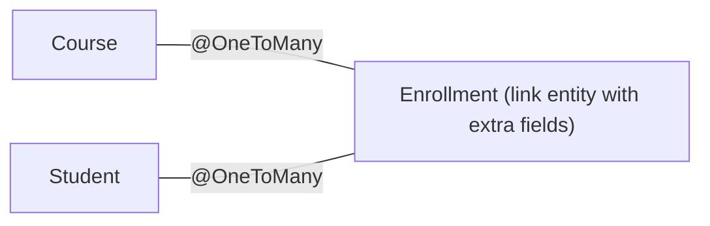
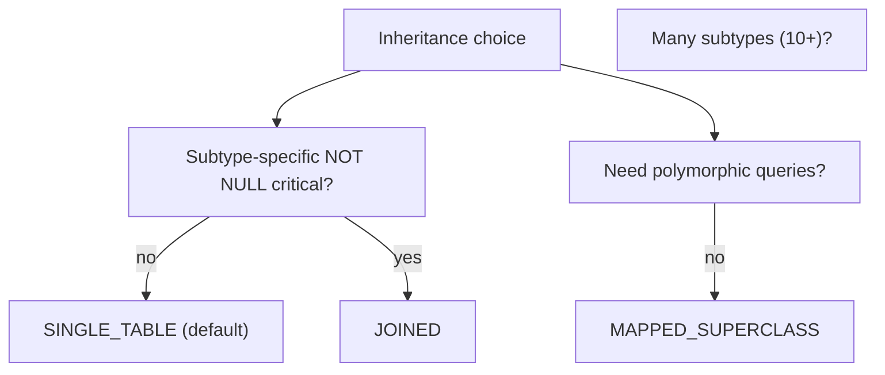

# Entity mappings & relationships (@OneToMany, etc.)

Relationships are where ORM earns its complexity. A flat entity (one table, no associations) is straightforward — JPA's value-add over plain JDBC is modest. The moment two entities reference each other, JPA does something genuinely useful: navigates the link, decides which side owns the foreign key, lazily loads, cascades operations, removes orphans. It also gives you ~12 ways to get the same mapping subtly wrong, with consequences ranging from a missing update to N+1 queries to entire tables of orphaned rows.

This topic is the **deep treatment of associations** — every cardinality (`@OneToOne`, `@OneToMany`, `@ManyToOne`, `@ManyToMany`), every directionality (unidirectional, bidirectional), the **owning side vs inverse side** distinction that drives every confused beginner, cascade semantics, orphan removal, collection mappings (`List` vs `Set` vs `Bag`), embeddable types, and inheritance mapping. T06 follows up with lazy vs eager fetching; T07 with the N+1 problem; this topic establishes the *mapping vocabulary* both depend on.

The depth-bar this topic clears: at the **language layer**, every relationship annotation with its attributes (`@JoinColumn`, `@JoinTable`, `mappedBy`, `cascade`, `fetch`, `optional`, `orphanRemoval`); collection mapping options; inheritance strategies; embeddable types; element collections. At the **memory layer**, what each cardinality emits as SQL — `@ManyToOne` is a FK column on this entity's row; `@OneToMany(mappedBy=...)` is the *inverse* (no FK column, a lazy proxy that issues a SELECT when iterated); `@ManyToMany` is a join table with composite key. At the **architecture layer** — the heart — **the owning-side rule** (the owning side is the one with the `@JoinColumn`; updates only on the owning side affect the DB), the **bidirectional-sync requirement** (you must keep both sides consistent in Java code), **cascade semantics** (which operations cross associations and which don't), and the **mapping decisions that drive query shapes downstream** — get them right or fight Hibernate every day.

> [!NOTE]
> Prerequisites: [ORM concepts (T01)](./T01-orm-concepts-and-the-impedance-mismatch.md), [JPA fundamentals (T02)](./T02-jpa-fundamentals-entities-entitymanager.md). Familiarity with FK/PK relationships in SQL.

## The Four Cardinalities

A relationship has two endpoints; each can be "one" or "many":



| Annotation | Example | DB shape |
|------------|---------|----------|
| `@OneToOne` | User ↔ Profile | FK on either side; usually with UNIQUE constraint |
| `@ManyToOne` | OrderItem → Order | FK column on the *many* side |
| `@OneToMany` | Order → items | no column on this side; the *many* side has the FK |
| `@ManyToMany` | Course ↔ Student | join table with two FKs |

The number of associations in a real app is usually 80% `@ManyToOne`, 15% `@OneToOne`, 5% `@ManyToMany` (and `@OneToMany` is always paired with a `@ManyToOne` on the other side).

## Unidirectional vs Bidirectional

A relationship is **unidirectional** if only one side has a Java field referencing the other; **bidirectional** if both do.

```java
// Unidirectional ManyToOne — only OrderItem knows about Order
@Entity public class OrderItem {
    @ManyToOne Order order;
    // ...
}
@Entity public class Order {
    // no items field
}

// Bidirectional OneToMany / ManyToOne — both sides have references
@Entity public class OrderItem {
    @ManyToOne Order order;
}
@Entity public class Order {
    @OneToMany(mappedBy = "order") List<OrderItem> items;
}
```

The DB is **the same** for both — a FK column `orders_id` on the `order_items` table. The difference is purely Java-side.

When to choose:

- **Unidirectional** is simpler. Use when only one side ever needs to navigate to the other.
- **Bidirectional** is convenient when both sides need access. Costs: more code to keep in sync; more complex queries.

## Owning Side vs Inverse Side — The One Rule To Remember

In a bidirectional association, **one side is the owning side and the other is the inverse**.

> **The owning side is the side with the `@JoinColumn` (or, for `@ManyToMany`, the `@JoinTable`).** The inverse side has `mappedBy = "fieldNameOnOwningSide"`.

> **Updates to the owning-side field are reflected in the DB. Updates to the inverse-side collection are NOT.**

```java
// Order is the INVERSE side
@OneToMany(mappedBy = "order")
List<OrderItem> items;

// OrderItem is the OWNING side
@ManyToOne
@JoinColumn(name = "order_id")
Order order;
```

If you do this:

```java
Order order = orderRepo.findById(1L).get();
OrderItem item = new OrderItem();
order.getItems().add(item);   // adds to inverse side; NO FK is set!
em.persist(item);
// ⇒ the item is saved with NULL order_id;
// the FK is the owning-side field, which was never set
```

The correct pattern:

```java
item.setOrder(order);          // set the OWNING side
order.getItems().add(item);     // also update the inverse for in-memory consistency
em.persist(item);
```

Best practice: write helper methods that always update both sides:

```java
@Entity public class Order {
    @OneToMany(mappedBy = "order", cascade = CascadeType.ALL, orphanRemoval = true)
    List<OrderItem> items = new ArrayList<>();

    public void addItem(OrderItem item) {
        items.add(item);
        item.setOrder(this);
    }
    public void removeItem(OrderItem item) {
        items.remove(item);
        item.setOrder(null);
    }
}
```



## `@ManyToOne` — The Most Common Mapping

```java
@Entity
@Table(name = "order_items")
public class OrderItem {

    @Id @GeneratedValue Long id;

    @ManyToOne(fetch = FetchType.LAZY, optional = false)
    @JoinColumn(name = "order_id", nullable = false)
    private Order order;

    @ManyToOne(fetch = FetchType.LAZY)
    @JoinColumn(name = "product_id")
    private Product product;

    private int quantity;
}
```

DDL:

```sql
CREATE TABLE order_items (
    id BIGINT PRIMARY KEY,
    order_id BIGINT NOT NULL REFERENCES orders(id),
    product_id BIGINT REFERENCES products(id),
    quantity INT
);
```

Attributes:

- **`fetch = LAZY`** (the right default; covered in T06). Without it, every `OrderItem` load *eagerly* loads its `Order` and `Product` — major N+1 risk.
- **`optional = false`** — JPA hint that the FK is not nullable. Enables some optimizations and matches the DB-level constraint.
- **`@JoinColumn(name = "order_id")`** — specifies the FK column name. Defaults to `<field-name>_id` if omitted.

`@ManyToOne` is the **default association** for any "many things belong to one parent" model. Almost always lazy, almost always non-null.

## `@OneToMany` — Inverse of `@ManyToOne`

```java
@Entity
public class Order {

    @OneToMany(mappedBy = "order", cascade = CascadeType.ALL, orphanRemoval = true)
    private List<OrderItem> items = new ArrayList<>();
}
```

Attributes:

- **`mappedBy = "order"`** — this is the inverse side; the owning field on `OrderItem` is called `order`.
- **`cascade = CascadeType.ALL`** — persist / merge / remove / refresh / detach all cascade to children (covered below).
- **`orphanRemoval = true`** — removing a child from the collection deletes it from the DB (covered below).

**No `@JoinColumn`** — this is the inverse side; no FK lives here.

Without `mappedBy`, JPA assumes the association is *unidirectional* and creates a **join table** (which is almost never what you want for a one-to-many). Always specify `mappedBy` for true one-to-many.

### Unidirectional `@OneToMany` — Avoid

```java
@OneToMany
@JoinColumn(name = "order_id")
private List<OrderItem> items;   // ⚠️ no mappedBy
```

Hibernate **without `@JoinColumn`** creates a join table `order_items_link(order_id, item_id)`. With `@JoinColumn` it's a unidirectional FK but the *child* (OrderItem) has no back-reference, which is awkward and prevents many optimizations.

Modern Hibernate (6+) handles unidirectional better than 4.x did, but the canonical answer is: **always use bidirectional `@OneToMany` / `@ManyToOne` with `mappedBy`.**

## `@OneToOne`

Two flavors: **shared primary key** (the dependent shares the parent's id) or **foreign key** (a separate FK column).

**Shared-primary-key OneToOne** (preferred for "extension" relationships):

```java
@Entity
public class User {
    @Id @GeneratedValue Long id;
    @OneToOne(mappedBy = "user", cascade = CascadeType.ALL)
    private UserProfile profile;
}

@Entity
public class UserProfile {
    @Id Long id;
    @MapsId
    @OneToOne
    @JoinColumn(name = "id")
    private User user;
    private String bio;
}
```

The `UserProfile` row has `id` equal to the user's `id`. One FK; one primary key. No null FK; no UNIQUE constraint needed.

**Foreign-key OneToOne**:

```java
@Entity
public class User {
    @OneToOne(mappedBy = "user")
    private UserProfile profile;
}
@Entity
public class UserProfile {
    @Id @GeneratedValue Long id;
    @OneToOne
    @JoinColumn(name = "user_id", unique = true)
    private User user;
    private String bio;
}
```

The `user_profiles.user_id` is a FK with a UNIQUE constraint. Slightly more flexible (the profile can exist without a user temporarily during creation) but requires the UNIQUE.

## `@ManyToMany`

```java
@Entity public class Course {
    @Id @GeneratedValue Long id;
    @ManyToMany
    @JoinTable(
        name = "course_students",
        joinColumns = @JoinColumn(name = "course_id"),
        inverseJoinColumns = @JoinColumn(name = "student_id"))
    Set<Student> students = new HashSet<>();
}
@Entity public class Student {
    @Id @GeneratedValue Long id;
    @ManyToMany(mappedBy = "students")
    Set<Course> courses = new HashSet<>();
}
```

A separate join table `course_students(course_id, student_id)` with composite primary key. Hibernate handles INSERTs and DELETEs on the join table automatically.

**Caveat**: pure `@ManyToMany` is *limited* because the join table can hold only the two FKs. The moment you need a field on the link itself (`enrolled_at`, `grade`), promote the join table to an entity:

```java
@Entity
@Table(name = "enrollments")
public class Enrollment {
    @EmbeddedId
    EnrollmentId id;
    @ManyToOne @MapsId("courseId") Course course;
    @ManyToOne @MapsId("studentId") Student student;
    Instant enrolledAt;
    Grade grade;
}
@Embeddable
public record EnrollmentId(long courseId, long studentId) implements Serializable { }
```

Now `Enrollment` is a first-class entity. `Course` and `Student` become `@OneToMany` to `Enrollment`. **This is the right shape for almost every "many-to-many with extra fields" case.**



## Cascade Types

`CascadeType` controls which operations propagate from parent to child:

| Cascade | Effect on parent operation |
|---------|---------------------------|
| `PERSIST` | persisting the parent persists the children |
| `MERGE` | merging the parent merges the children |
| `REMOVE` | removing the parent removes the children |
| `REFRESH` | refreshing the parent refreshes the children |
| `DETACH` | detaching the parent detaches the children |
| `ALL` | all of the above |

**`CascadeType.ALL` is the right default for parent-child relationships** where the child has no independent identity (order → items, user → addresses).

**Avoid `CascadeType.ALL` for shared relationships** (user → orders is *not* parent-child; an order can outlive a user logically, and you don't want deleting a user to delete their orders).

### Orphan Removal

```java
@OneToMany(mappedBy = "order", cascade = CascadeType.ALL, orphanRemoval = true)
private List<OrderItem> items = new ArrayList<>();
```

With `orphanRemoval = true`, removing a child from the parent's collection issues a DELETE for that child:

```java
order.getItems().remove(item);   // → DELETE FROM order_items WHERE id = ?
```

Without `orphanRemoval`, the child becomes an orphan (its FK is set to NULL if the column allows it, or the operation fails). Always set `orphanRemoval = true` for true parent-child relationships.

## Collection Types — `List` vs `Set` vs `Map`

```java
@OneToMany List<OrderItem> items;       // List
@OneToMany Set<OrderItem> items;        // Set
@OneToMany Map<String, OrderItem> items; // Map keyed by something
@OneToMany List<OrderItem> items;       // Bag (unordered, allows duplicates) without @OrderColumn
@OneToMany @OrderColumn(name = "position") List<OrderItem> items;  // Indexed list
```

**`List` without `@OrderColumn`** is a "bag" — ordered by whatever the DB returns; duplicates allowed. Hibernate has historical surprises with bags (cannot fetch two bags eagerly in the same query).

**`Set`** — unique by `equals` (be careful with managed entities and the surrogate key problem; see below).

**`Map`** — keyed by an attribute of the value (`@MapKey`) or by an explicit key column.

**`List` with `@OrderColumn`** — Hibernate maintains a `position` column; insert/remove updates the column. Useful for genuinely-ordered collections (playlist, comments by position). Costs: extra column; reordering on insert/delete; only one list per parent can have `@OrderColumn`.

The right defaults:

- **`Set<Child>` with `equals/hashCode` based on natural keys** — for unordered children where uniqueness matters.
- **`List<Child>` (bag)** for "just a collection, don't care about order or uniqueness."
- **`@OrderColumn`** only when order *is* business data.

### The `equals/hashCode` Trap on Entities In Sets

```java
@Entity
public class OrderItem {
    @Id @GeneratedValue Long id;
    // generated equals/hashCode based on id
}

Set<OrderItem> items = new HashSet<>();
OrderItem fresh = new OrderItem();    // id == null
items.add(fresh);
em.persist(fresh);                    // now id == 42
items.contains(fresh);                // → false! (hashCode changed)
```

The id changed from `null` to `42` after persist; the `hashCode()` changed; the set "lost" the object.

The fix: **use a natural business key for `equals/hashCode` if you have one**. If only a surrogate key exists, override to use the *initial* identity (`Objects.hash(getClass(), ...)`) or use `@NaturalId` (Hibernate-specific) or just always use `List` (bag) and check uniqueness explicitly.

## Embedded Types — Granularity Done Right

```java
@Embeddable
public record Address(String line1, String line2, String city, String country) { }

@Entity
public class User {
    @Embedded
    private Address billingAddress;

    @Embedded
    @AttributeOverrides({
        @AttributeOverride(name = "line1", column = @Column(name = "shipping_line1")),
        @AttributeOverride(name = "line2", column = @Column(name = "shipping_line2")),
        // ...
    })
    private Address shippingAddress;
}
```

Both addresses are *value types* — no separate table, no identity, flat in the `users` row. `@Embeddable` (T01's granularity-mismatch answer) is the right answer for any "this small group of fields conceptually belongs together but doesn't deserve its own table" pattern.

DDL:
```sql
CREATE TABLE users (
    id BIGINT PRIMARY KEY,
    line1 VARCHAR(100), line2 VARCHAR(100), city VARCHAR(40), country VARCHAR(40),
    shipping_line1 VARCHAR(100), shipping_line2 VARCHAR(100), shipping_city VARCHAR(40), shipping_country VARCHAR(40)
);
```

## `@ElementCollection` — Collections of Value Types

For a list of *value types* (not entities):

```java
@Entity
public class User {
    @ElementCollection
    @CollectionTable(name = "user_tags", joinColumns = @JoinColumn(name = "user_id"))
    @Column(name = "tag")
    private Set<String> tags = new HashSet<>();

    @ElementCollection
    @CollectionTable(name = "user_phones", joinColumns = @JoinColumn(name = "user_id"))
    private List<Phone> phones = new ArrayList<>();
}

@Embeddable
public record Phone(String type, String number) { }
```

A separate table `user_tags(user_id, tag)` or `user_phones(user_id, type, number)`. The value type has no entity-level identity; the row's PK is the composite of all columns. Operations: on add/remove, Hibernate runs DELETE + INSERT (no UPDATE since there's no id).

Use for genuinely-value collections — tags, phone numbers per user, scopes per role. Cleaner than promoting to an entity.

## Inheritance Mapping

Four strategies (T01's inheritance mismatch). `@Inheritance(strategy = ...)`:

### `SINGLE_TABLE` (default)

```java
@Entity
@Inheritance(strategy = InheritanceType.SINGLE_TABLE)
@DiscriminatorColumn(name = "payment_type", discriminatorType = DiscriminatorType.STRING)
public abstract class Payment {
    @Id @GeneratedValue Long id;
    BigDecimal amount;
}

@Entity
@DiscriminatorValue("CARD")
public class CardPayment extends Payment {
    String cardNumberLast4;
}

@Entity
@DiscriminatorValue("BANK")
public class BankPayment extends Payment {
    String bankAccount;
}
```

One table `payments` with a `payment_type` column. Polymorphic queries are fast (one table, no join). NULLs for subtype columns. NOT NULL constraints on subtype-specific columns are impossible.

**Default and almost always the right choice** unless subtype-specific NOT NULL is critical.

### `JOINED`

```java
@Entity
@Inheritance(strategy = InheritanceType.JOINED)
public abstract class Payment { ... }
@Entity @PrimaryKeyJoinColumn(name = "payment_id") public class CardPayment extends Payment { ... }
@Entity @PrimaryKeyJoinColumn(name = "payment_id") public class BankPayment extends Payment { ... }
```

One table per class. Each subtype row JOINs the parent. NOT NULL constraints work; columns are typed. Polymorphic queries JOIN N tables — slower for large hierarchies.

Use when subtype-specific NOT NULL matters and the hierarchy is small.

### `TABLE_PER_CLASS`

```java
@Entity
@Inheritance(strategy = InheritanceType.TABLE_PER_CLASS)
public abstract class Payment { ... }
```

One table per concrete class, no parent table. Polymorphic queries do `UNION ALL` across all subtype tables — slow. Each class has its own id sequence (a problem if you want unique cross-class ids).

Rarely the right choice.

### `MAPPED_SUPERCLASS`

```java
@MappedSuperclass
public abstract class AuditableEntity {
    @CreatedDate Instant createdAt;
    @LastModifiedDate Instant updatedAt;
}

@Entity
public class User extends AuditableEntity { ... }
```

The parent is **not** an entity — just a Java mixin. No polymorphic queries on `AuditableEntity`. Each subclass has its own table; no parent table or column. The right tool for shared audit / metadata fields, not for true polymorphism.



## `@SecondaryTable`

Split one entity across two tables when legacy schema requires:

```java
@Entity
@Table(name = "users")
@SecondaryTable(name = "user_details", pkJoinColumns = @PrimaryKeyJoinColumn(name = "user_id"))
public class User {
    @Id Long id;
    String name;
    @Column(table = "user_details") String bio;
}
```

`@Column(table = "user_details")` puts that field in the secondary table. JPA JOINs on every load. **Use sparingly** — usually a `@OneToOne` to a child entity is cleaner.

## Worked Example — Full Order Domain

```java
@Entity
@Table(name = "orders")
public class Order {

    @Id @GeneratedValue Long id;

    @ManyToOne(fetch = FetchType.LAZY, optional = false)
    @JoinColumn(name = "customer_id", nullable = false)
    private Customer customer;

    @OneToMany(mappedBy = "order", cascade = CascadeType.ALL, orphanRemoval = true)
    private List<OrderItem> items = new ArrayList<>();

    @Embedded
    @AttributeOverrides({
        @AttributeOverride(name = "amount", column = @Column(name = "total_amount")),
        @AttributeOverride(name = "currency", column = @Column(name = "total_currency"))
    })
    private Money total;

    public void addItem(OrderItem item) {
        items.add(item);
        item.setOrder(this);
    }
    public void removeItem(OrderItem item) {
        items.remove(item);
        item.setOrder(null);
    }
}

@Entity
@Table(name = "order_items")
public class OrderItem {
    @Id @GeneratedValue Long id;
    @ManyToOne(fetch = FetchType.LAZY, optional = false)
    @JoinColumn(name = "order_id", nullable = false)
    private Order order;
    @ManyToOne(fetch = FetchType.LAZY)
    @JoinColumn(name = "product_id")
    private Product product;
    private int quantity;
    @Embedded
    private Money unitPrice;
}

@Embeddable
public record Money(BigDecimal amount, String currency) { }
```

Persisting:

```java
Order o = new Order();
o.setCustomer(em.getReference(Customer.class, customerId));   // no SELECT
OrderItem item = new OrderItem();
item.setProduct(em.getReference(Product.class, productId));
item.setQuantity(2);
o.addItem(item);   // updates both sides
em.persist(o);     // cascades to item; both INSERT on flush
```

Hibernate emits one INSERT into `orders`, one INSERT into `order_items` — no SELECTs (we used `getReference`).

## Common Pitfalls

> [!WARNING]
> **Forgetting to set the owning side.** `order.items.add(item)` without `item.setOrder(order)` saves the item with `NULL` FK or fails the not-null constraint. Always use bidirectional helper methods.

> [!WARNING]
> **`@OneToMany` without `mappedBy`.** Hibernate creates a join table. Almost always wrong.

> [!WARNING]
> **`fetch = FetchType.EAGER` on `@OneToMany`.** Loads every child on every parent fetch. Catastrophic for N children. Default lazy; reach for `JOIN FETCH` per-query.

> [!WARNING]
> **`@ManyToMany` with extra fields on the link.** Promote to an entity. `@ManyToMany` is for "just a relationship" — no link metadata.

> [!WARNING]
> **`CascadeType.ALL` on non-parent-child relationships.** Deleting one entity unexpectedly deletes the other. Use cascade only for true parent-child ownership.

> [!WARNING]
> **`Set<Entity>` with id-based `equals/hashCode`.** Items lost when persist assigns the id. Use natural key or `List` (bag).

> [!WARNING]
> **`@OrderColumn` on a high-write list.** Every insert / delete updates `position` on subsequent rows. Avoid for large lists.

> [!WARNING]
> **Recursive `toString()` in bidirectional relationships.** Lombok's `@ToString` recurses both sides → stack overflow. Exclude with `@ToString(exclude = "items")`.

> [!WARNING]
> **`@Inheritance(JOINED)` on a 50-class hierarchy.** Polymorphic queries JOIN 50 tables. Switch to `SINGLE_TABLE`.

> [!WARNING]
> **Missing `nullable = false` on a non-optional `@ManyToOne`.** Schema allows NULL; data integrity suffers. Always be explicit.

## Practice

1. Build the order domain (Order, OrderItem, Customer, Product) with proper bidirectional mappings, cascades, orphan removal. Generate DDL; review.
2. Try `cascade = ALL, orphanRemoval = true` on Order → items. Remove an item from the collection; observe the DELETE.
3. Try `@ManyToMany` between Course and Student. Then promote the join to an `Enrollment` entity with extra fields.
4. Build inheritance with each strategy (`SINGLE_TABLE`, `JOINED`, `MAPPED_SUPERCLASS`). Compare the generated DDL and the SQL emitted for `SELECT * FROM Payment WHERE amount > 100`.
5. Implement an `@Embeddable Money`. Use it in three entities. Try `@AttributeOverride` to remap columns per usage.
6. Add `@ElementCollection Set<String> tags` to a `User`. Add and remove tags; observe SQL.
7. Trigger the `Set` + surrogate-id hashcode bug. Switch to natural-key-based equals; verify it goes away.
8. Build a self-referential association (Employee → manager Employee). Choose unidirectional or bidirectional; observe how cycles are handled.

## Recap

You should now be able to:

- Distinguish unidirectional from bidirectional associations and choose deliberately.
- Identify the **owning side** of any association (the one with `@JoinColumn` / `@JoinTable`); always update the owning side to affect the DB.
- Write helper methods (`addX`/`removeX`) that maintain both sides of a bidirectional relationship.
- Use `@ManyToOne` as the default; lazy by default; `optional = false` for not-null FKs.
- Use `@OneToMany(mappedBy = ...)` for true one-to-many; never unidirectional `@OneToMany` without `@JoinColumn`.
- Choose between shared-PK `@OneToOne` and FK-based `@OneToOne` per use case.
- Promote `@ManyToMany` to a join entity (`Enrollment`) when the link needs fields.
- Choose `CascadeType.ALL + orphanRemoval = true` for parent-child; nothing or limited cascade for shared relationships.
- Pick collection types (`List` bag, `Set`, `List` with `@OrderColumn`, `Map`) based on order/uniqueness needs.
- Use `@Embeddable` / `@Embedded` for value types; `@ElementCollection` for collections of values.
- Choose inheritance strategy (`SINGLE_TABLE` default, `JOINED` when subtype NOT NULL matters, `MAPPED_SUPERCLASS` for mixins) deliberately.
- Avoid the canonical pitfalls: missing owning-side set, missing `mappedBy`, eager `@OneToMany`, `Set` with id-based hash, cascade on shared relationships.

## Next

Continue to [Hibernate architecture](./T04-hibernate-architecture.md) for the inside of the JPA provider — `SessionFactory` vs `EntityManagerFactory`, `Session` vs `EntityManager`, the action queue, the event listeners, the SPI for customization, and the metamodel — the layer underneath every annotation you wrote here.
