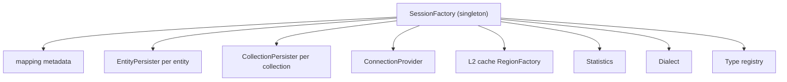
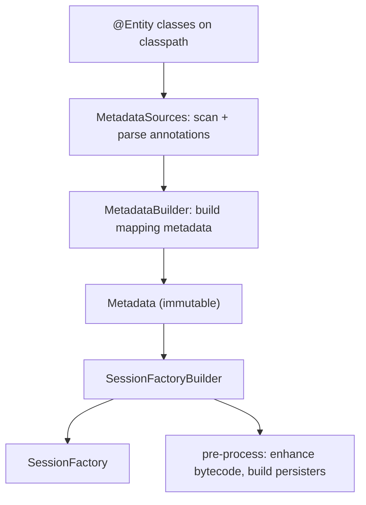
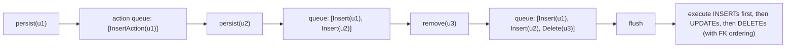
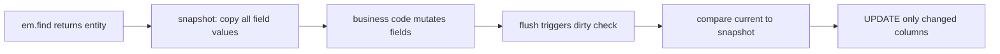
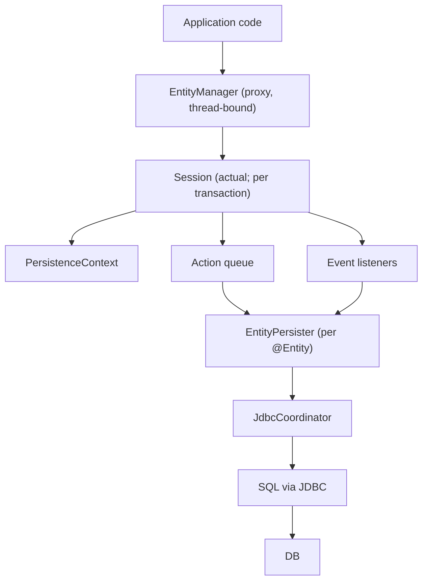

# Hibernate architecture

JPA is the *spec*; Hibernate is the *implementation* (the dominant JPA provider for ~20 years). Every `@Entity` annotation, every `EntityManager` call, every JPQL query goes through Hibernate's internal machinery: a `SessionFactory` (the heavyweight container of mapping metadata), a `Session` (the lightweight per-transaction work unit), an **action queue** of pending INSERT/UPDATE/DELETE operations, a chain of **event listeners** that handle each lifecycle event, a metamodel of every entity and association, a per-entity `EntityPersister` that knows how to convert that entity to/from SQL. Understanding this internal architecture is the difference between *using* Hibernate (writing entities and queries that mostly work) and *debugging* Hibernate (why is the flush issuing five queries; why isn't dirty checking firing; what is this `SessionFactory.close` blocking on).

A senior engineer needs to know the architecture for three reasons. **Diagnosing performance**: SQL emitted at unexpected times, double-flushes, lazy-init exceptions — all explained by knowing the action queue and flush ordering. **Customizing behavior**: custom `UserType`, custom event listeners, custom `RegionFactory` for caching — all SPI extensions that require knowing the layer where they plug in. **Spanning to other JPA providers**: knowing what's spec vs Hibernate-specific lets you write portable code or use Hibernate's extra features deliberately.

This topic is the **inside view**. T05 explains the persistence-context behavior from the user's angle; this topic explains the machinery that produces that behavior. We cover: `SessionFactory` and `Session` (the Hibernate names for JPA's `EntityManagerFactory` and `EntityManager`); the bootstrap process that turns annotations into the `SessionFactory`; the metamodel; the action queue and how flush walks it; the event-listener chain that handles every persist/load/update; the SPI for plugging in custom behavior; the `StatelessSession` for batch work; the JDBC coordinator that handles connections and transactions.

The depth-bar this topic clears: at the **language layer**, the Hibernate-specific API alongside JPA (`Session`, `SessionFactory`, `Criteria`, `StatelessSession`, `MultiIdentifierLoadAccess`); the SPI for extension (`UserType`, `EventListener`, `RegionFactory`, `MultiTenantConnectionProvider`). At the **memory layer**, the `SessionFactory` heap profile — ~10–50 MB for a typical schema; the per-`Session` ~50 KB plus per-entity ~200 B; the action queue's heap during a large transaction; the bytecode-enhanced entity's extra fields. At the **architecture layer** — the heart — **the bootstrap pipeline** (annotations → mapping metadata → SessionFactory), **the flush sequence** (action queue ordering, dirty check, SQL emission), **the event-listener chain** that makes every lifecycle hookable, and **the SPI customization points** (where to plug a custom type or a custom cache).

> [!NOTE]
> Prerequisites: [JPA fundamentals (T02)](./T02-jpa-fundamentals-entities-entitymanager.md), [Entity mappings (T03)](./T03-entity-mappings-and-relationships-onetomany-etc.md), [Spring AOP (L4/C01/T05)](../C01-spring-framework/T05-spring-aop.md) for proxy mechanics.

## JPA → Hibernate Mapping

Most JPA types have a Hibernate counterpart:

| JPA | Hibernate |
|-----|-----------|
| `EntityManagerFactory` | `SessionFactory` |
| `EntityManager` | `Session` |
| `EntityTransaction` | `Transaction` |
| `Query` | `Query` (Hibernate's) |
| `Criteria` API (JPA) | `Criteria` API (Hibernate; deprecated) |

You can always get the Hibernate type from the JPA type:

```java
Session session = em.unwrap(Session.class);
SessionFactory sf = em.getEntityManagerFactory().unwrap(SessionFactory.class);
```

Use this to access Hibernate-specific features (`@NaturalId` lookup, `MultiIdentifierLoadAccess`, statistics).

## The `SessionFactory`

The factory is the heavyweight thread-safe singleton. It holds:

- **Mapping metadata** — every `@Entity`, every column, every association.
- **`EntityPersister`** — one per entity class; knows how to read/write that entity to/from SQL.
- **`CollectionPersister`** — one per `@OneToMany` / `@ManyToMany` collection.
- **Connection provider** — typically wraps HikariCP.
- **Transaction coordinator** — JTA or resource-local.
- **L2 cache region factory** — Caffeine / Ehcache / Redis (T11).
- **Statistics** — query count, hit rates, etc.
- **Dialect** — SQL flavor (PostgreSQL, MySQL, Oracle, …).
- **Type system** — Java-to-SQL type converters.

Cost: a typical Boot app with 50 entities has a `SessionFactory` consuming ~10–30 MB heap. Boot time: ~500 ms–2 s on cold JVM. One per application; never recreated at runtime.



## The `Session`

The `Session` (= JPA `EntityManager`) is the **lightweight per-transaction work unit**. It holds:

- **Persistence context** — the identity map of managed entities (T05 deep dive).
- **Action queue** — pending INSERT/UPDATE/DELETE statements.
- **JDBC connection** — held while there's pending work.
- **Transaction state**.
- **Flush mode**.

Cost: ~50 KB base + ~200 B per managed entity. **Not thread-safe**; one per transaction.

Spring's `JpaTransactionManager` ensures a `Session` is opened on transaction begin, bound to the thread, closed on commit/rollback.

## The Bootstrap Pipeline

Going from `@Entity` classes to a working `SessionFactory`:



Spring Boot wraps this in `LocalContainerEntityManagerFactoryBean`. Tweak via `spring.jpa.properties.hibernate.*`:

```yaml
spring:
  jpa:
    properties:
      hibernate:
        physical_naming_strategy: org.hibernate.boot.model.naming.CamelCaseToUnderscoresNamingStrategy
        implicit_naming_strategy: org.springframework.boot.orm.jpa.hibernate.SpringImplicitNamingStrategy
        jdbc.lob.non_contextual_creation: true
        bytecode.use_reflection_optimizer: true
```

## The `EntityPersister`

For each `@Entity`, Hibernate builds an `EntityPersister` at startup. It is a pre-compiled SQL generator:

- `loadSql` — `SELECT id, name, email FROM users WHERE id = ?`
- `insertSql` — `INSERT INTO users (id, name, email) VALUES (?, ?, ?)`
- `updateSql` — generated per-flush (depends on dirty columns)
- `deleteSql` — `DELETE FROM users WHERE id = ?`
- accessor methods — reflective field set/get with bytecode-optimization

At runtime, `em.find(User.class, 42)` → `EntityPersister.load(42)` → bind and execute the pre-compiled SQL.

## The Action Queue

When you call `em.persist(user)`, Hibernate does **not** issue INSERT immediately. It:

1. Assigns an id (via the configured strategy).
2. Adds the entity to the persistence context as **managed**.
3. Appends an **`EntityInsertAction`** to the action queue.

The SQL is emitted only on **flush** (commit, an explicit `em.flush()`, or before a query that might depend on uncommitted writes — depending on `flushMode`).

Action types:

| Action | Trigger |
|--------|---------|
| `EntityInsertAction` | `persist` |
| `EntityUpdateAction` | dirty check at flush |
| `EntityDeleteAction` | `remove` |
| `CollectionRecreateAction` / `CollectionUpdateAction` / `CollectionRemoveAction` | collection changes |
| `BulkOperationCleanupAction` | clear collections after bulk DML |



### Flush Ordering

Hibernate orders actions to respect FK constraints:

1. **Inserts** (parent before child).
2. **Updates** (dirty entities).
3. **Collection actions**.
4. **Deletes** (child before parent).

This ordering allows you to mix INSERTs and DELETEs in the same transaction without temporarily-invalid FK states.

### Flush Modes

```java
em.setFlushMode(FlushModeType.COMMIT);    // flush only at commit
em.setFlushMode(FlushModeType.AUTO);      // flush before queries that might be affected (default)
```

`AUTO` is the JPA default — Hibernate flushes before a query if the query might read entities you just mutated. `COMMIT` defers everything until commit (faster but the query may return stale data).

## Dirty Checking

How Hibernate detects which managed entities were mutated:

1. On load, Hibernate **snapshots** every field of the entity (stores in the persistence context).
2. On flush, Hibernate compares current field values to the snapshot.
3. For each changed field, generate an `EntityUpdateAction` with only those columns in the SQL.

```java
User u = em.find(User.class, 42);
u.setEmail("new@x.io");
// no save() call needed; dirty check at flush will issue UPDATE
```

Memory cost: ~one snapshot per managed entity, roughly the same size as the entity. For 10 K managed entities, that's ~200 MB. **The reason batch jobs need `em.flush() + em.clear()` every 1000 records.**

Bytecode-enhanced entities can use **dirty-track instrumentation** — fields know when they're modified, no snapshot needed. Reduces memory and speeds the dirty check at the cost of build-time enhancement.



## The Event Listener Chain

Every operation (`persist`, `load`, `flush`, `update`, `delete`) goes through a chain of event listeners. Default listeners handle the standard logic; custom listeners can intercept.

```java
@Component
public class AuditListener implements PreInsertEventListener, PreUpdateEventListener {
    @Override public boolean onPreInsert(PreInsertEvent event) {
        Object entity = event.getEntity();
        if (entity instanceof Auditable a) {
            a.setCreatedAt(Instant.now());
        }
        return false;  // false = continue with insert
    }
    // ...
}

@Component
public class AuditListenerRegistrar {
    public AuditListenerRegistrar(EntityManagerFactory emf, AuditListener listener) {
        SessionFactoryImpl sf = emf.unwrap(SessionFactoryImpl.class);
        EventListenerRegistry registry = sf.getServiceRegistry().getService(EventListenerRegistry.class);
        registry.appendListeners(EventType.PRE_INSERT, listener);
        registry.appendListeners(EventType.PRE_UPDATE, listener);
    }
}
```

The event types:

| EventType | When |
|-----------|------|
| `PERSIST` | em.persist |
| `MERGE` | em.merge |
| `DELETE` | em.remove |
| `LOAD` / `POST_LOAD` | em.find / SELECT |
| `FLUSH` / `PRE_FLUSH` / `POST_FLUSH` | em.flush |
| `PRE_INSERT` / `POST_INSERT` | INSERT |
| `PRE_UPDATE` / `POST_UPDATE` | UPDATE |
| `PRE_DELETE` / `POST_DELETE` | DELETE |
| `DIRTY_CHECK` | dirty check |
| `REFRESH` | em.refresh |
| `INITIALIZE_COLLECTION` | lazy collection load |

Modern best practice: prefer JPA's `@PrePersist` / `@PreUpdate` (T02) for entity-specific logic. Use event listeners only for cross-cutting infrastructure (audit, encryption, multi-tenancy).

## Bytecode Enhancement

Hibernate adds two things at build time (or runtime via Javassist/ByteBuddy):

- **Dirty tracking flags** — fields know when they're set; eliminates the snapshot.
- **Lazy interceptors** on `@ManyToOne` and collection fields — accessing a lazy field triggers a load.

Build-time enhancement (via the Hibernate Maven/Gradle plugin) is faster at runtime, doesn't require Javassist on the classpath, and works with GraalVM. Runtime enhancement is the default but adds startup overhead and complicates Native Image.

Enable build-time:

```xml
<plugin>
    <groupId>org.hibernate.orm.tooling</groupId>
    <artifactId>hibernate-enhance-maven-plugin</artifactId>
    <executions>
        <execution>
            <configuration>
                <enableLazyInitialization>true</enableLazyInitialization>
                <enableDirtyTracking>true</enableDirtyTracking>
                <enableAssociationManagement>true</enableAssociationManagement>
            </configuration>
            <goals><goal>enhance</goal></goals>
        </execution>
    </executions>
</plugin>
```

`enableAssociationManagement` automatically syncs bidirectional associations — `order.setCustomer(c)` updates `c.getOrders()` too. Convenient but surprising; opt in deliberately.

## The Type System

Hibernate has a registry of Java-to-SQL converters:

- **`BasicType<T>`** — primitive types and common JDK types (`int`, `String`, `Instant`, `UUID`).
- **`UserType<T>`** — custom types (`Money`, `Email`, JSON blobs).
- **`CompositeUserType<T>`** — for multi-column types beyond what `@Embeddable` handles.

JPA's `@AttributeConverter` is the spec-portable alternative; Hibernate's `UserType` is more powerful (custom dirty-checking, nullability).

Hibernate 6 simplified the type system — `BasicType<T>` is what most code uses; `UserType` reserved for genuinely custom cases.

### JSON Columns

```java
@Entity public class Settings {
    @Id Long id;

    @JdbcTypeCode(SqlTypes.JSON)
    private Map<String, Object> preferences;
}
```

Hibernate 6+ recognizes `SqlTypes.JSON`; Postgres → `jsonb`, MySQL → `JSON`. Automatically (de)serializes via Jackson. Cleaner than the historical `@Convert(converter = JsonConverter.class)` pattern.

## `StatelessSession` — Batch Without the Overhead

For bulk operations, the `StatelessSession` bypasses the persistence context, cascade, dirty checks, listeners, L1/L2 cache. Effectively a JDBC-shaped API with entity mapping:

```java
SessionFactory sf = emf.unwrap(SessionFactory.class);
try (StatelessSession ss = sf.openStatelessSession()) {
    Transaction tx = ss.beginTransaction();
    try (ScrollableResults<User> rs = ss.createQuery("FROM User", User.class).scroll()) {
        while (rs.next()) {
            User u = rs.get();
            u.markProcessed();
            ss.update(u);
        }
    }
    tx.commit();
}
```

No dirty tracking; you call `ss.update(...)` explicitly. No L1 cache; no memory accumulation. **The right tool for ETL.**

Caveat: no cascade. You manage child entities manually.

## Multi-Tenancy

Hibernate has first-class multi-tenancy support:

- **`DATABASE`** — one schema per tenant; switch DataSource per request.
- **`SCHEMA`** — one schema per tenant; switch search path per request.
- **`DISCRIMINATOR`** — one row column per tenant; `tenant_id` added to every WHERE.

```java
public class TenantResolver implements CurrentTenantIdentifierResolver {
    @Override public String resolveCurrentTenantIdentifier() {
        return TenantContext.get();   // ThreadLocal set by your filter
    }
    @Override public boolean validateExistingCurrentSessions() { return true; }
}

public class TenantConnectionProvider implements MultiTenantConnectionProvider {
    @Override public Connection getConnection(Object tenant) throws SQLException {
        return dataSources.get(tenant).getConnection();
    }
    // ...
}
```

Configure:

```yaml
spring:
  jpa:
    properties:
      hibernate:
        multiTenancy: DATABASE
        multi_tenant_connection_provider: com.example.TenantConnectionProvider
        tenant_identifier_resolver: com.example.TenantResolver
```

Every `Session` is opened on the tenant's connection. Application code uses `EntityManager` normally; tenant isolation is invisible.

## Statistics

Hibernate's built-in stats:

```yaml
spring:
  jpa:
    properties:
      hibernate:
        generate_statistics: true
```

Access:

```java
SessionFactory sf = emf.unwrap(SessionFactory.class);
Statistics stats = sf.getStatistics();
System.out.println("queries: " + stats.getQueryExecutionCount());
System.out.println("entity loads: " + stats.getEntityLoadCount());
System.out.println("collection fetches: " + stats.getCollectionLoadCount());
System.out.println("L2 hits: " + stats.getSecondLevelCacheHitCount());
```

Wire to Micrometer (`hibernate-micrometer`) for Prometheus export. **Essential for diagnosing N+1 and cache effectiveness.**

## The Whole Picture



A `persist` call:

1. Application → `EntityManager.persist(u)`.
2. Proxy resolves to thread-bound `Session`.
3. `Session` puts `u` in persistence context.
4. Persist event fires; listeners run.
5. `EntityInsertAction` added to queue.
6. On flush: queue walked; for each insert action, `EntityPersister.insert(u)`.
7. Persister binds params to its precompiled INSERT SQL.
8. `JdbcCoordinator` executes via the JDBC connection.

## Common Pitfalls

> [!WARNING]
> **Calling `em.flush()` in business code "just to be safe."** Defeats batching; loses dirty-check optimization. Let the transaction boundary flush.

> [!WARNING]
> **Treating `SessionFactory` as cheap.** It's a singleton; never create per-request.

> [!WARNING]
> **Adding event listeners that throw.** A listener exception aborts the transaction. Catch and log; rethrow only for genuine errors.

> [!WARNING]
> **Using `StatelessSession` for general business logic.** No dirty tracking, no cascade — surprising omissions. Reserve for batch / ETL.

> [!WARNING]
> **Multi-tenancy via runtime queries (`WHERE tenant_id = ?`) in code.** Easy to forget; data leaks possible. Use Hibernate's multi-tenant support to make it framework-enforced.

> [!WARNING]
> **`physical_naming_strategy` mismatch with Flyway migrations.** Hibernate generates `user_profiles`; Flyway expects `userProfiles`. Pin the strategy.

> [!WARNING]
> **Bytecode enhancement disabled but `lazy = true`.** Without enhancement, lazy `@ManyToOne` uses subclass proxies that don't work with `final` classes / methods. Enable build-time enhancement for cleaner lazy semantics.

> [!WARNING]
> **`Statistics` enabled in production.** Some stat collection is cheap, some isn't. Profile before keeping on.

## Practice

1. Print the boot time of your app's `SessionFactory`. Compare with vs without bytecode enhancement.
2. Enable `generate_statistics`; trigger a service operation; print the resulting stats. Identify the hottest entity load.
3. Use `em.unwrap(Session.class)` to access Hibernate-specific methods. Try `bySimpleNaturalId(User.class).load(email)`.
4. Add a `PreInsertEventListener` that audits every entity insert. Verify it fires.
5. Implement a `UserType` for a custom value object. Compare to the JPA `@AttributeConverter` alternative.
6. Use `StatelessSession` for a 100 K-row ETL. Compare time/memory vs a normal `Session` with `flush()+clear()` every 1000.
7. Set up DATABASE multi-tenancy with two tenants and two DataSources. Confirm queries hit the right one based on a `ThreadLocal` tenant id.
8. Enable build-time bytecode enhancement. Inspect a `.class` file (use javap); compare to the non-enhanced version.

## Recap

You should now be able to:

- Distinguish `SessionFactory` from `Session`, and explain how Spring's `JpaTransactionManager` wires per-transaction `Session`s onto the thread.
- Walk the bootstrap pipeline: annotations → MetadataSources → MetadataBuilder → SessionFactory.
- Explain the role of `EntityPersister` and `CollectionPersister` as pre-compiled SQL generators.
- Describe the action queue and flush ordering (inserts → updates → collection actions → deletes), and reason about why a flush emits the SQL it does.
- Explain dirty checking (snapshot at load; compare at flush) and the bytecode-enhanced alternative (dirty-track flags).
- Plug into the event-listener chain for cross-cutting infrastructure (audit, encryption, multi-tenancy).
- Use `StatelessSession` for ETL where dirty-tracking and L1 cache cost more than they save.
- Configure multi-tenancy via Hibernate's `DATABASE` / `SCHEMA` / `DISCRIMINATOR` modes with `CurrentTenantIdentifierResolver`.
- Use the type system: `@JdbcTypeCode(SqlTypes.JSON)` for JSON columns; `@AttributeConverter` or `UserType` for custom types.
- Use `Statistics` for production observability of entity loads, query counts, cache hits.
- Avoid the canonical pitfalls: per-request `SessionFactory`, throwing listeners, `StatelessSession` outside batch, naming-strategy mismatch with migrations.

## Next

Continue to [Persistence context & entity lifecycle](./T05-persistence-context-and-entity-lifecycle.md) for the deep treatment of the persistence context as the identity map and dirty-checking workspace — the four entity states (transient, managed, detached, removed), `persist` vs `merge`, the L1 cache, the size limits and clear pattern, and how Spring's `@Transactional` boundaries shape it.
