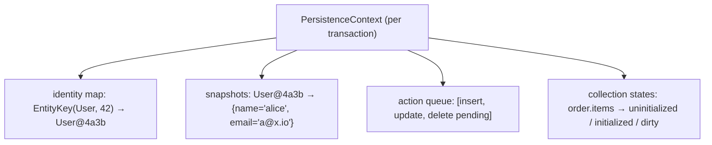
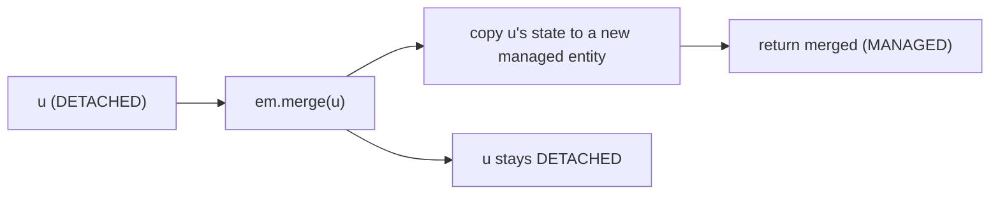
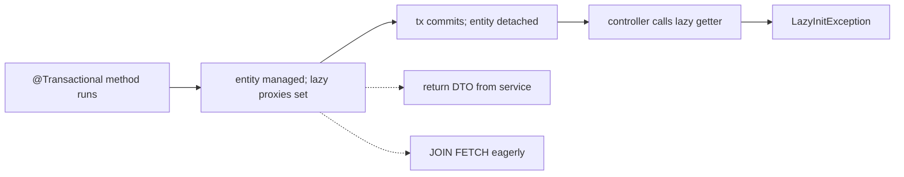

# Persistence context & entity lifecycle

The **persistence context** is the most important concept in JPA — and the most misunderstood. It is **the in-memory cache and identity map** that lives inside a `Session` / `EntityManager` for the duration of one transaction (typically). Every entity you load, persist, merge, or interact with goes *through* it. It guarantees that two `em.find(User.class, 42)` calls in one transaction return *the same Java reference*. It tracks the entities you've mutated so the right UPDATE statements fire at flush. It coordinates cascading. It's also the source of the most frustrating Spring JPA bugs: `LazyInitializationException`, "why isn't my UPDATE running", detached-entity nightmares, OOM on batch jobs.

A senior engineer needs to think of the persistence context as **a working set** — an explicit data structure with an explicit scope, contents, and operations. T01 mentioned it; T02 showed how to use `EntityManager`; T04 showed how Hibernate implements it; this topic *makes it concrete*. We cover: the four entity states (transient, managed, detached, removed) and the transitions between them; `persist` vs `merge` (the most-confused operation pair); the size of the persistence context and the OOM risk; the `flush + clear` batch pattern; the lazy-init exception and its causes; Spring's `@Transactional` boundaries as persistence-context boundaries; the `OpenEntityManagerInView` anti-pattern revisited; and the discipline of returning DTOs (not entities) to the caller.

The depth-bar this topic clears: at the **language layer**, every entity state transition, every `EntityManager` operation that drives it, and every lifecycle callback. At the **memory layer**, the persistence context as a `Map<EntityKey, Object>` with auxiliary structures for snapshots, collection-state tracking, and pending actions; per-entity ~200 B + the snapshot ≈ same size as the entity; for 10 K entities, ~400 MB heap. At the **architecture layer** — the heart — **the persistence context is the scope** that defines identity, dirty tracking, lazy loading, and cascade. Get its boundaries right (transactional scope, `flush + clear` in batches, DTOs at the controller) and Hibernate sings; get them wrong and you get OOMs and N+1 traps.

> [!NOTE]
> Prerequisites: [JPA fundamentals (T02)](./T02-jpa-fundamentals-entities-entitymanager.md), [Entity mappings (T03)](./T03-entity-mappings-and-relationships-onetomany-etc.md), [Hibernate architecture (T04)](./T04-hibernate-architecture.md). Spring `@Transactional` (T05 of C01).

## What The Persistence Context Is

A `Map<EntityKey, Object>` holding every entity the `EntityManager` is currently tracking, plus per-entity snapshots for dirty checking, plus pending actions:



**Identity map**: same primary key → same Java reference. `em.find(User.class, 42)` twice returns the same object.

**Snapshots**: copy of every field at load time, for dirty checking (T04).

**Action queue**: pending INSERT/UPDATE/DELETE (T04).

**Collection states**: per `@OneToMany` / `@ManyToMany`, whether the collection has been initialized, whether it's dirty.

## The Four States

```mermaid
stateDiagram-v2
  [*] --> Transient: new User()
  Transient --> Managed: persist
  Detached --> Managed: merge
  Managed --> Detached: tx end, clear, detach, close
  Managed --> Removed: remove
  Removed --> Managed: persist again (rare; usually mistake)
  Managed --> [*]: GC after detach
  Transient: not known to JPA
  Managed: tracked; dirty-checked; in identity map
  Detached: not tracked; mutations don't persist
  Removed: marked for DELETE; row deleted on flush
```

### Transient

A new instance not yet known to JPA:

```java
User u = new User("alice", "alice@x.io");
// u.id == null; not in any persistence context
```

The DB has no row for it. No dirty tracking. If you mutate and don't persist, it stays in heap, GC'd when no references remain.

### Managed

After `em.persist(u)` or `em.find(...)`:

```java
em.persist(u);   // u is now MANAGED
// u.id != null; persistence context tracks u
u.setEmail("new@x.io");   // dirty-tracked
// at flush: UPDATE users SET email='new@x.io' WHERE id=u.id
```

Managed entities are in the identity map. Mutations are tracked. The right state for the duration of a transaction.

### Detached

When the persistence context closes (transaction commits, `em.clear()`, or `em.detach(u)`):

```java
// At @Transactional end:
User u = userService.load(42);   // managed
// transaction commits; em closes
// u is now DETACHED
u.setEmail("new@x.io");   // mutation in heap; NOT tracked; NOT persisted
```

The Java object still exists in heap; its fields are still set. But Hibernate no longer knows about it. To re-attach, use `merge`.

### Removed

`em.remove(u)`:

```java
User u = em.find(User.class, 42);
em.remove(u);
// u is now REMOVED; at flush: DELETE FROM users WHERE id = 42
// the Java object still exists in heap until GC
```

The row is deleted on flush. The Java object is now meaningless (referencing a non-existent row).

## `persist` vs `merge`

The classic source of confusion.

### `persist(u)` — For New Entities

```java
User u = new User("alice", "a@x.io");
em.persist(u);
// u becomes MANAGED
// at flush: INSERT
```

**Required**: `u` must be transient or already managed (no-op). Persisting a *detached* entity throws `PersistenceException` ("detached entity passed to persist").

### `merge(u)` — For Detached Entities

```java
// u was loaded in a previous transaction; we have a reference but it's now detached
User merged = em.merge(u);
// merged is a NEW managed entity with u's data; u remains DETACHED
// at flush: UPDATE
```

**The key catch**: `merge` does *not* re-attach `u`. It copies `u`'s state into a *new* managed entity (`merged`) and returns it. `u` stays detached. **You must use the return value.**

```java
em.merge(u);          // ⚠️ bug: result discarded
em.merge(u).setEmail("x");   // ✅ correct
```



### When To Use Each

| Scenario | Method |
|----------|--------|
| New entity to insert | `persist` |
| Loaded entity, still in same tx, mutate-and-save | nothing (dirty-tracked) |
| Detached entity from a previous tx | `merge` |
| Re-attaching from cache / external source | `merge` (or `find` first then mutate) |
| Cascade from a managed parent | `cascade = PERSIST` or `MERGE` handles it |

**Spring Data JPA's `save(u)`**: if `u.id == null` → `persist`; else → `merge`. Convenient but ambiguous; you don't always know which path runs.

## The `flush + clear` Pattern For Batch

A 100 K-row batch with default settings:

```java
@Transactional
public void importAll(List<UserData> data) {
    for (UserData d : data) {
        em.persist(new User(d.name(), d.email()));
        // each new entity stays in the persistence context
    }
    // at commit, 100K INSERTs fire
    // the persistence context held 100K entities + 100K snapshots → ~40 MB
}
```

Two problems: 100 K snapshots in memory; flush at commit is one giant transaction.

The fix:

```java
@Transactional
public void importAll(List<UserData> data) {
    int i = 0;
    for (UserData d : data) {
        em.persist(new User(d.name(), d.email()));
        if (++i % 1000 == 0) {
            em.flush();    // execute pending INSERTs
            em.clear();    // detach everything; release memory
        }
    }
    em.flush();
    em.clear();
}
```

Plus configure batch inserts:

```yaml
spring:
  jpa:
    properties:
      hibernate:
        jdbc.batch_size: 50
        order_inserts: true
```

Now 100 K inserts flush in 100 batches of 1000 (with 50-row JDBC batches inside each), memory stays bounded, throughput is ~30× higher than the default.

**For truly large jobs, use `StatelessSession` (T04) — bypass the persistence context entirely.**

## Lazy Initialization & The Detached-Entity Problem

### `LazyInitializationException`

The infamous error:

```
org.hibernate.LazyInitializationException: could not initialize proxy [User#42] - no Session
```

What happened:

```java
@Transactional(readOnly = true)
public User loadUser(long id) {
    return userRepo.findById(id).orElseThrow();
}

// in controller:
User u = userService.loadUser(42);
String customerName = u.getOrder().getCustomer().getName();   // 💥 LazyInitException
```

The flow:

1. `loadUser` transaction starts; loads `u`.
2. `u.getOrder()` is `LAZY`; Hibernate stores a proxy.
3. Transaction commits; `u` becomes detached.
4. Controller accesses `u.getOrder().getCustomer().getName()`.
5. The proxy tries to initialize; needs a session; there isn't one → exception.

Three fixes, in order of preference:

1. **Return a DTO, not the entity.** Map inside the `@Transactional` method.
   ```java
   @Transactional(readOnly = true)
   public UserResponse loadUser(long id) {
       User u = userRepo.findById(id).orElseThrow();
       return new UserResponse(u.getId(), u.getName(),
           u.getOrder().getCustomer().getName());   // access while managed
   }
   ```
2. **Eagerly fetch what you need via JOIN FETCH or `@EntityGraph`.**
   ```java
   @Query("SELECT u FROM User u JOIN FETCH u.order o JOIN FETCH o.customer WHERE u.id = ?1")
   Optional<User> findByIdWithOrderAndCustomer(long id);
   ```
3. **NEVER** enable `open-in-view`. It papers over the bug but holds the session for the entire HTTP request.



### The Anti-Pattern: `open-in-view`

```yaml
spring.jpa.open-in-view: true   # default in Boot; FALSE in any sensible app
```

Keeps the `EntityManager` open until the HTTP response is rendered. The lazy load triggers a SELECT *during view rendering*. Three downsides:

- **N+1 hides**: each lazy access fires a SELECT in the view layer.
- **DB connection held longer**: from controller invocation to response done, including JSON serialization.
- **Layering leaks**: persistence concerns reach into HTTP layer.

**Always disable in REST services.** Use DTOs.

### `Hibernate.initialize` — The Bandaid

```java
@Transactional(readOnly = true)
public User loadUser(long id) {
    User u = userRepo.findById(id).orElseThrow();
    Hibernate.initialize(u.getOrder());
    Hibernate.initialize(u.getOrder().getCustomer());
    return u;
}
```

Forces the lazy proxies to load. Works but is N+1 — three SELECTs (user, order, customer). Use `JOIN FETCH` instead.

## DTOs at the Boundary — The Discipline

Mature Spring services have a strict rule: **entities never cross the service-controller boundary.** The service returns DTOs (records); the controller serializes the DTOs. Two reasons:

1. **Detached-entity issues vanish.** The DTO has no lazy proxies.
2. **API contract decoupled from schema.** Rename a column without changing the JSON; add fields to DTOs without exposing entities.

```java
@Service
@Transactional(readOnly = true)
public class UserService {
    public UserResponse loadUser(long id) {
        User u = userRepo.findById(id).orElseThrow();
        return new UserResponse(u.getId(), u.getName(), u.getEmail(),
            u.getOrders().stream().map(this::toOrderSummary).toList());
    }
    private OrderSummary toOrderSummary(Order o) {
        return new OrderSummary(o.getId(), o.getStatus(), o.getTotal());
    }
}

@RestController
public class UserController {
    @GetMapping("/api/users/{id}")
    public UserResponse get(@PathVariable long id) {
        return userService.loadUser(id);
    }
}
```

Mapping inside the transactional method ensures every lazy field is touched while managed. Outside, the DTO is plain data.

## `@Transactional(readOnly = true)`

A hint Hibernate honors:

- Skips dirty checking (no snapshots; less memory; no UPDATE attempts).
- Flush mode set to `MANUAL` (no implicit flushes before queries).
- Database driver may use a read-only connection (depends on the connection pool).

Always annotate read-only service methods. Saves memory on large reads.

## `em.refresh` and `em.detach`

```java
User u = em.find(User.class, 42);
// time passes; another tx mutates the row
em.refresh(u);   // re-read from DB; discard local changes; reset snapshot
```

Useful when you suspect the entity is stale.

```java
em.detach(u);   // remove u from the persistence context
u.setEmail("x");   // no longer tracked; no UPDATE
```

Rarely needed in modern code; relevant for explicit detached-entity workflows.

## `em.contains` and `em.getReference`

```java
em.contains(u);   // is u in this persistence context?

User u = em.getReference(User.class, 42);  // no SELECT; lazy proxy
```

`getReference` is the right tool for "I only need this for setting a FK":

```java
Order o = new Order();
o.setCustomer(em.getReference(Customer.class, customerId));   // no SELECT
em.persist(o);
```

If you later access `o.getCustomer().getName()`, the proxy initializes (one SELECT). If you don't, you saved the SELECT.

## Persistence-Context Scope — Spring's `@Transactional` Boundaries

Spring's `JpaTransactionManager` opens a persistence context (a `Session`) on transaction begin and closes it on commit/rollback. So:

```java
@Service
public class UserService {
    @Transactional
    public User create(String name, String email) {
        // tx start: persistence context opens
        User u = new User(name, email);
        em.persist(u);
        // ... 
        return u;
        // tx commit: persistence context closes; u becomes detached
    }
}
```

Two `@Transactional` methods called from different beans use *different* persistence contexts. Two `@Transactional` methods called sequentially from the same outer non-transactional method use *separate* persistence contexts.

**A propagation note**: `@Transactional(propagation = REQUIRED)` (the default) joins an existing transaction if one is active; this means the persistence context is shared too. So:

```java
@Service
public class ServiceA {
    @Transactional
    public void doA() {
        // tx start, pc open
        serviceB.doB();   // joins THIS pc
        // tx commit, pc closes
    }
}

@Service
public class ServiceB {
    @Transactional
    public void doB() {
        // joins existing tx & pc
    }
}
```

`REQUIRES_NEW` opens a fresh transaction and fresh pc. Use rarely.

## Persistence-Context Size — OOM Watch

The persistence context grows with every entity touched. A loop loading entities accumulates:

```java
@Transactional
public void process(List<Long> ids) {
    for (Long id : ids) {                     // 100 K iterations
        User u = userRepo.findById(id).get(); // each is added to PC
        process(u);
    }
    // PC now holds 100K entities + their snapshots → ~40-80 MB
}
```

Same answers as before: `flush + clear`, or `StatelessSession`, or limit batch size with pagination.

The dirty-check time is also proportional to PC size. A 100 K-entity flush spends most of its time on diffs, not SQL.

## Conversation-Scoped Persistence Contexts

JPA has a notion of an **extended persistence context** — one that spans multiple transactions:

```java
@PersistenceContext(type = PersistenceContextType.EXTENDED)
private EntityManager em;
```

Used for multi-step user workflows (wizards) where entities live across HTTP requests. **Rare in Spring** (Spring's transaction model defaults to TX-scoped). Generally avoid; use DTOs and re-load per request.

## Worked Example — Full Lifecycle

```java
@Service
@Transactional
public class UserService {

    @PersistenceContext
    private EntityManager em;

    public User create(String name, String email) {
        User u = new User(name, email);  // TRANSIENT
        em.persist(u);                    // → MANAGED
        // at commit, INSERT fires
        return u;
    }

    @Transactional(readOnly = true)
    public UserResponse load(long id) {
        User u = em.find(User.class, id); // MANAGED (loaded from DB; or cache hit)
        return UserResponse.of(u);         // map to DTO while still managed
        // at method end, em closes; u becomes DETACHED; UserResponse is unaffected
    }

    public User updateName(long id, String newName) {
        User u = em.find(User.class, id);  // MANAGED
        u.setName(newName);                // dirty-tracked
        return u;
        // at commit, dirty check fires UPDATE; no save() needed
    }

    public void delete(long id) {
        User u = em.find(User.class, id);  // MANAGED
        em.remove(u);                       // → REMOVED
        // at commit, DELETE fires
    }

    @Transactional
    public User reattachAndUpdate(User stale) {  // stale is DETACHED
        User merged = em.merge(stale);            // copy state into a new managed
        merged.setName("updated");                // dirty-tracked on merged
        return merged;
        // commit fires UPDATE based on merged's current state
    }
}
```

Each method shows a different transition:

- `create`: Transient → Managed (persist).
- `load`: from DB into Managed; ends Detached after tx.
- `updateName`: Managed throughout; mutation dirty-tracked.
- `delete`: Managed → Removed.
- `reattachAndUpdate`: detached merged into managed (a *new* object).

## Common Pitfalls

> [!WARNING]
> **Calling `em.merge(u)` and not using the return value.** `u` stays detached; the managed copy is the return value. Always `User saved = em.merge(u);`.

> [!WARNING]
> **Calling `setX(...)` on a detached entity expecting a save.** Not tracked. Either re-load with `find`, then mutate, or `merge`.

> [!WARNING]
> **Lazy access outside `@Transactional`.** `LazyInitializationException`. Return DTOs from service.

> [!WARNING]
> **`open-in-view = true` in production.** Hides N+1; leaks layering; holds connections.

> [!WARNING]
> **Persistence-context not cleared in batch.** OOM. Use `flush + clear` every N or `StatelessSession`.

> [!WARNING]
> **Calling `em.flush()` manually mid-business-logic.** Defeats batching; risks premature constraint failure. Trust the transaction commit.

> [!WARNING]
> **Persisting a detached entity.** `PersistenceException`. Use `merge`.

> [!WARNING]
> **Manual `em.refresh()` on every read "to be safe".** Doubles every read. Use only when you know stale data is possible.

> [!WARNING]
> **Returning entities from REST controllers (with `@OneToMany` collections).** Jackson serialization touches every lazy field → infinite recursion or N+1 explosion. Return DTOs.

## Practice

1. Trace an entity through all four states: create transient, persist (managed), commit (detached), merge back (managed again), remove. Print the state at each step (`em.contains(u)`).
2. Trigger the persist-vs-merge confusion: try `em.persist(detached)`; observe the exception.
3. Demonstrate `merge` not returning the same instance: assert `merged != original`.
4. Trigger `LazyInitializationException` deliberately. Fix three ways: (a) JOIN FETCH, (b) DTO mapping in service, (c) `@EntityGraph`. Compare emitted SQL.
5. Batch-insert 100K entities; measure heap with and without `flush+clear`. Profile with VisualVM.
6. Use `em.getReference` for a FK; confirm no SELECT via SQL log.
7. Compare `@Transactional(readOnly=true)` vs `@Transactional`. Profile a 1000-entity read; observe the dirty-check memory difference.
8. Pin `spring.jpa.open-in-view=false`. Build a controller that returns an entity with a lazy collection; expect failure. Fix by returning a DTO.

## Recap

You should now be able to:

- Define the persistence context as the per-transaction identity map + snapshot store + action queue + collection states.
- Walk every entity transition (Transient ↔ Managed ↔ Detached, Managed → Removed) and name the API that triggers each.
- Distinguish `persist` (transient → managed) from `merge` (detached → managed); always use `merge`'s return value.
- Use `em.find` for actual loads, `em.getReference` for FK-only references.
- Use `em.flush + em.clear` in batch loops (or `StatelessSession`) to keep persistence-context size bounded.
- Diagnose `LazyInitializationException`: the entity left the persistence context; either re-shape the load (JOIN FETCH / `@EntityGraph`) or return a DTO.
- Disable `open-in-view` and adopt the discipline of returning DTOs from service methods.
- Annotate read methods `@Transactional(readOnly = true)` for the dirty-check skip and connection hint.
- Reason about `@Transactional` propagation (REQUIRED joins, REQUIRES_NEW splits) and its effect on persistence-context scope.
- Avoid the canonical pitfalls: discarding merge result, mutating detached entities, lazy access outside tx, manual flush, OOM batch loops, returning entities from controllers.

## Next

Continue to [Lazy vs eager loading](./T06-lazy-vs-eager-loading.md) for the precise mechanics of `FetchType.LAZY` and `FetchType.EAGER` — what proxies look like at the bytecode level, when each is triggered, and the fetching strategies (`JOIN FETCH`, `@EntityGraph`, batch fetching, subselect) that close the lazy-vs-N+1 gap.
