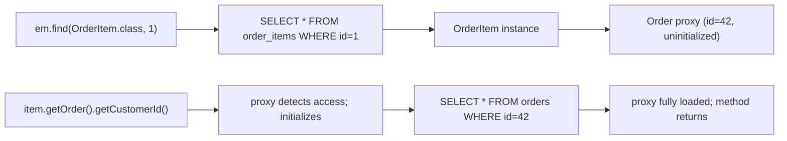
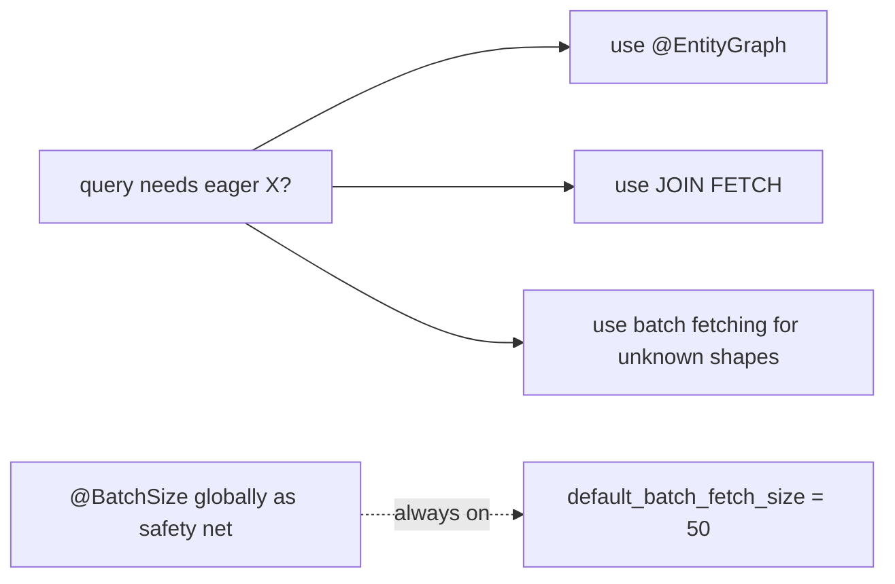

# Lazy vs eager loading

When you load an `Order` from the database, what about its `Customer`? Its `OrderItems`? Their `Products`? Their `Categories`? An object graph that "looks finite" in the model can transitively reach hundreds of entities; loading them all on every query is wasteful and slow. **Lazy loading** is JPA's answer: load the entity you asked for; replace associations with **proxies** that look like the related entity but only hit the database when accessed. **Eager loading** is the opposite: load every association at the same time as the parent, in joined or extra queries.

The decision between lazy and eager is one of the **two most-impactful performance choices** in a JPA app (the other being transaction boundaries). Lazy correctly applied avoids loading data you don't need. Lazy incorrectly applied produces the **N+1 problem** (T07) — load 100 orders, access `order.customer` for each, fire 1 + 100 SELECTs. Eager applied to a `@OneToMany` collection multiplies result-set rows in JOINs and can crash a query. Getting the balance right requires understanding *how* lazy loading is implemented (Hibernate proxies; bytecode interceptors; collection wrappers), *when* the load triggers (field access; not getter call when bytecode-enhanced), and *which fetching strategy* (JOIN FETCH, `@EntityGraph`, batch fetching, subselect fetching) to apply per query.

This topic covers the mechanism end-to-end. T07 dedicates a full topic to N+1; this topic builds the vocabulary and tools: `FetchType.LAZY` vs `EAGER` per association; how Hibernate proxies are built and what they look like; the four **fetching strategies** (default per-association fetch, JOIN FETCH per query, `@EntityGraph`, batch fetching, subselect fetching) and when each applies; the `MultipleBagsFetchException` and how to avoid it; bytecode-enhanced lazy loading; `Hibernate.initialize` and `Hibernate.isInitialized`.

The depth-bar this topic clears: at the **language layer**, every fetch-related annotation, `@EntityGraph` (static and dynamic), JPQL JOIN FETCH syntax, `@BatchSize`, `@Fetch(SUBSELECT)`. At the **memory layer**, the Hibernate proxy as a CGLIB / ByteBuddy subclass (~96 B per instance), the `PersistentCollection` wrappers around `List` / `Set` (each ~150 B unloaded), and the cost trade-off — a lazy proxy is cheap; a lazy load when access happens costs one round-trip; eager joining N collections produces N-way Cartesian products if not bounded. At the **architecture layer** — the heart — **the per-query fetch plan** (annotations are *defaults*; per-query strategies override them), **the right balance** (lazy by default on associations; eager via JOIN FETCH or `@EntityGraph` per query that needs it), and the **bytecode-enhanced lazy attribute** (Hibernate 6+) that extends lazy loading to scalar fields.

> [!NOTE]
> Prerequisites: [Entity mappings (T03)](./T03-entity-mappings-and-relationships-onetomany-etc.md), [Hibernate architecture (T04)](./T04-hibernate-architecture.md), [Persistence context (T05)](./T05-persistence-context-and-entity-lifecycle.md).

## Defaults — What JPA Specifies

The default fetch type per association cardinality (JPA spec):

| Annotation | Default |
|------------|--------|
| `@ManyToOne` | EAGER |
| `@OneToOne` | EAGER |
| `@OneToMany` | LAZY |
| `@ManyToMany` | LAZY |
| `@Basic` (scalar fields) | EAGER |
| `@ElementCollection` | LAZY |

**Both default-eager defaults are wrong for production.** A `@ManyToOne` that's eager hides itself; you don't realize 10 SELECTs fire on a list query.

**The right baseline: make every association LAZY explicitly:**

```java
@ManyToOne(fetch = FetchType.LAZY)
@OneToOne(fetch = FetchType.LAZY)
@OneToMany(fetch = FetchType.LAZY)
@ManyToMany(fetch = FetchType.LAZY)
```

Then use JOIN FETCH / `@EntityGraph` per query to fetch eagerly *when needed*.

## How Lazy `@ManyToOne` Works

```java
@Entity public class OrderItem {
    @ManyToOne(fetch = FetchType.LAZY)
    Order order;
}
```

At load time:

1. SELECT loads the `OrderItem` row.
2. Instead of fetching the `Order`, Hibernate creates a **proxy** for `Order` with id = `order_id`.
3. The proxy is a CGLIB / ByteBuddy subclass of `Order` with intercepted method calls.
4. `orderItem.order` references the proxy. The Java field type checks out (`Order order`), but the actual instance is `Order$HibernateProxy$abc123`.

When you call `orderItem.getOrder().getCustomerId()`:

1. The proxy's `getCustomerId()` triggers `initialize()`.
2. `initialize()` issues `SELECT * FROM orders WHERE id = ?` and populates the proxy's state.
3. From now on, accesses go to the loaded state.



**Key point**: `item.getOrder()` does *not* trigger initialization! It returns the proxy. The init fires when a method other than `getId()` is called on the proxy. `getId()` is special — Hibernate knows it from the FK, no DB call needed.

Memory cost: one proxy per uninitialized association ≈ 96 B. For 100 K orders each holding a lazy `Customer` proxy, that's ~10 MB.

## How Lazy Collections Work

```java
@Entity public class Order {
    @OneToMany(mappedBy = "order", fetch = FetchType.LAZY)
    List<OrderItem> items;
}
```

At load time, Hibernate sets `items` to a **`PersistentBag`** (or `PersistentList`, `PersistentSet`) wrapper:

```java
order.items   // → PersistentBag, uninitialized
```

The wrapper holds the parent reference and the metadata; no rows are loaded. Triggering any operation that needs data — `items.size()`, `items.iterator()`, `items.contains(...)`, `items.get(0)` — fires `SELECT * FROM order_items WHERE order_id = ?`.

Same memory and cost as a lazy entity proxy.

## When To Use Eager

Genuinely eager only for:

- Small, always-needed value collections (`@ElementCollection Set<String> tags` on a User if every controller shows tags).
- Mandatory `@ManyToOne` where you *always* immediately need the parent and the parent is small.

In practice, **make everything lazy and use JOIN FETCH per-query**. The cost of "I forgot to fetch X for this endpoint" is one query change; the cost of "this endpoint fires 50 SELECTs because of eager loading" is hours of profiling.

## JOIN FETCH — The Per-Query Solution

The right tool for "load these orders with their customers in one query":

```java
@Query("SELECT o FROM Order o JOIN FETCH o.customer WHERE o.status = ?1")
List<Order> findByStatusWithCustomer(OrderStatus status);
```

Hibernate emits:

```sql
SELECT o.*, c.* FROM orders o
INNER JOIN customers c ON c.id = o.customer_id
WHERE o.status = ?
```

One query; no N+1; both entities populated.

For `@OneToMany`:

```java
@Query("SELECT o FROM Order o JOIN FETCH o.items WHERE o.id = ?1")
Order findByIdWithItems(long id);
```

```sql
SELECT o.*, i.* FROM orders o
LEFT JOIN order_items i ON i.order_id = o.id
WHERE o.id = ?
```

The N rows in the result map to one `Order` (the same id) plus N `OrderItem`s. Hibernate de-duplicates.

### The `MultipleBagsFetchException`

```java
@Query("SELECT o FROM Order o JOIN FETCH o.items JOIN FETCH o.payments WHERE o.id = ?1")
Order findFull(long id);
// throws: cannot simultaneously fetch multiple bags
```

The issue: two `LEFT JOIN`s on two collections produce a Cartesian product (every item × every payment). Hibernate refuses with bags (unordered List).

Fixes:

1. **Use `Set` instead of `List`** for one or both collections.
2. **Two queries** — fetch items first, then payments.
3. **`@EntityGraph` with subselect or batch fetching** (next sections).

### Cartesian Bloat

Even with `Set`, fetching multiple collections in one query produces a big result set:

```sql
-- 1 order × 10 items × 5 payments = 50 result rows
SELECT o.*, i.*, p.* FROM orders o
LEFT JOIN order_items i ON i.order_id = o.id
LEFT JOIN payments p ON p.order_id = o.id
WHERE o.id = 1;
```

Hibernate de-dups in memory but you've still pulled 50 rows for 16 entities. For larger products this is catastrophic.

**Rule of thumb**: JOIN FETCH at most one collection per query. Multiple collections → batch fetching or subselect fetching.

## `@EntityGraph` — Declarative Fetch Plan

A more flexible way to specify the fetch plan, per-query or globally:

```java
@Entity
@NamedEntityGraph(
    name = "Order.withCustomerAndItems",
    attributeNodes = {
        @NamedAttributeNode("customer"),
        @NamedAttributeNode(value = "items", subgraph = "items-subgraph")
    },
    subgraphs = @NamedSubgraph(
        name = "items-subgraph",
        attributeNodes = @NamedAttributeNode("product")
    )
)
public class Order { ... }

public interface OrderRepository extends JpaRepository<Order, Long> {
    @EntityGraph(value = "Order.withCustomerAndItems")
    Optional<Order> findById(long id);

    @EntityGraph(attributePaths = {"customer", "items.product"})  // dynamic
    Optional<Order> findById(long id);   // overrides above
}
```

`@EntityGraph` tells Hibernate which associations to fetch eagerly for *this query* — overriding the default lazy settings. The fetch type:

- `EntityGraphType.FETCH` (default for `attributePaths`) — listed attributes are fetched; others stay lazy.
- `EntityGraphType.LOAD` — listed are fetched eagerly; others use their default.

Cleaner than JPQL JOIN FETCH for many use cases; especially for nested associations (the subgraph syntax).

## Batch Fetching

Hibernate can group lazy-init queries:

```java
@OneToMany(mappedBy = "order", fetch = LAZY)
@BatchSize(size = 50)
List<OrderItem> items;
```

When iterating a list of 100 orders and accessing `order.items` for each:

- Without batch: 100 SELECTs (the N+1).
- With `@BatchSize(50)`: 2 SELECTs (one for the first 50; one for the next 50).

```sql
-- batch 1
SELECT * FROM order_items WHERE order_id IN (1, 2, ..., 50);
-- batch 2
SELECT * FROM order_items WHERE order_id IN (51, ..., 100);
```

Set globally for all collections / many-to-one:

```yaml
spring:
  jpa:
    properties:
      hibernate:
        default_batch_fetch_size: 50
```

**Strong recommendation**: set `default_batch_fetch_size = 50` at the global level. It's the "safety net" against forgotten JOIN FETCH — instead of N+1, you get ~N/50 + 1 queries. Still suboptimal but acceptable.

## Subselect Fetching

For `@OneToMany`, when you've loaded a set of parents and want to load all their children in one query:

```java
@OneToMany(mappedBy = "order")
@Fetch(FetchMode.SUBSELECT)
List<OrderItem> items;
```

```sql
-- parent query (your original)
SELECT * FROM orders WHERE status = 'NEW';
-- child query (auto-generated; uses parent's WHERE as a subselect)
SELECT * FROM order_items
WHERE order_id IN (SELECT id FROM orders WHERE status = 'NEW');
```

One child query regardless of parent count. Useful when you know you'll iterate the whole parent set.

Trade-off: not all queries benefit; subselect is wasted if you only access `items` for a few parents.

## Bytecode-Enhanced Lazy

With bytecode enhancement enabled (T04), `@Basic(fetch = LAZY)` works for scalar fields:

```java
@Entity public class User {
    @Id Long id;
    String name;
    @Lob @Basic(fetch = LAZY) byte[] avatar;   // ~50 KB blob
}
```

Without enhancement, `@Basic(fetch = LAZY)` is ignored — scalar fields are always loaded with the row.

With enhancement, accessing `user.avatar` triggers a SELECT for just that column. **Excellent for large blobs / clobs you don't always need.**

```yaml
# in pom.xml: enable hibernate-enhance-maven-plugin (T04)
```

## `Hibernate.initialize` and `Hibernate.isInitialized`

For one-off lazy init inside a transactional method:

```java
@Transactional(readOnly = true)
public UserResponse load(long id) {
    User u = userRepo.findById(id).orElseThrow();
    Hibernate.initialize(u.getOrders());            // forces collection load
    boolean loaded = Hibernate.isInitialized(u.getOrders());  // true
    return UserResponse.of(u);
}
```

A finer-grained tool than JOIN FETCH for cases where you've already loaded the parent and now want a specific lazy field. Almost always JOIN FETCH or `@EntityGraph` is cleaner — they batch in one query.

## Per-Query Fetch Plan Override

JPA gives several mechanisms to override the entity's fetch defaults per query:

1. **JPQL JOIN FETCH** — `SELECT o FROM Order o JOIN FETCH o.customer`
2. **`@EntityGraph` (named or dynamic)** — Spring Data JPA repository method.
3. **`Hibernate.initialize(...)`** — imperative.
4. **Native query + result mapping** — escape hatch.

Pick per query based on which is clearer for that specific shape.



## Worked Example — Order Detail Endpoint

```java
@Entity
public class Order {
    @Id Long id;
    @ManyToOne(fetch = LAZY) Customer customer;
    @OneToMany(mappedBy = "order", fetch = LAZY)
    @BatchSize(size = 50)
    List<OrderItem> items;
}

@Entity
public class OrderItem {
    @Id Long id;
    @ManyToOne(fetch = LAZY) Order order;
    @ManyToOne(fetch = LAZY)
    @BatchSize(size = 50)
    Product product;
}

public interface OrderRepository extends JpaRepository<Order, Long> {

    @EntityGraph(attributePaths = {"customer", "items", "items.product"})
    Optional<Order> findDetailById(long id);

    @Query("SELECT o FROM Order o JOIN FETCH o.customer WHERE o.status = ?1")
    Page<Order> listByStatus(OrderStatus status, Pageable pageable);
}
```

For the detail endpoint, `findDetailById` fetches everything in (at most) 2 queries (one for the entity + joined customer + items, one batch for products via `@BatchSize`).

For the list endpoint, the JOIN FETCH brings the customer; `items` would be N+1 if accessed, but with `@BatchSize`, it's at most `count / 50` queries.

## Common Pitfalls

> [!WARNING]
> **Relying on default `@ManyToOne` EAGER.** Hidden eager loads multiply queries silently. Pin LAZY explicitly on every association.

> [!WARNING]
> **JOIN FETCH multiple collections in one query.** `MultipleBagsFetchException` or massive Cartesian. Use Set, two queries, or `@EntityGraph` + subselect.

> [!WARNING]
> **`@EntityGraph` with `EntityGraphType.LOAD`** when you meant FETCH. LOAD respects the entity's default for non-listed associations; FETCH forces lazy. Pick deliberately.

> [!WARNING]
> **Eager `@OneToMany`.** Every parent load fetches its full collection — even when you don't need it. Always LAZY; use `@EntityGraph` per query.

> [!WARNING]
> **Trusting that `Hibernate.initialize(...)` is a fix.** It works but is per-call — N+1 risk. Use JOIN FETCH or `@EntityGraph`.

> [!WARNING]
> **Lazy proxy outside the session.** `LazyInitializationException`. The persistence-context discipline of T05 is mandatory.

> [!WARNING]
> **`@BatchSize` not set globally.** N+1 risk every time you forget JOIN FETCH. Set the default.

> [!WARNING]
> **Subselect when only a small fraction of parents need children.** All children loaded even for the unneeded parents. Use batch instead.

> [!WARNING]
> **`@Lob` field eagerly loaded by default.** Without bytecode enhancement, the blob loads with every row. Enable enhancement + `@Basic(fetch=LAZY)`.

## Practice

1. Make every association `LAZY` in your domain. Run a list endpoint; observe the SQL. Identify implicit lazy loads.
2. Add JOIN FETCH for one expected lazy load. Observe the change to one query.
3. Add `@EntityGraph` to a Spring Data repository method. Compare to JOIN FETCH for the same fetch plan.
4. Trigger `MultipleBagsFetchException` deliberately. Fix three ways: Set, two queries, batch fetching.
5. Set `default_batch_fetch_size=50` globally. Profile a 1000-order list with lazy customers; observe queries dropping from 1001 to ~21.
6. Add `@Fetch(SUBSELECT)` on a collection. Observe one subquery instead of N.
7. Enable bytecode enhancement; add `@Basic(fetch=LAZY)` on a big BLOB; confirm the BLOB column is omitted from main SELECT.
8. Trace a `LazyInitializationException` to its root cause; fix by returning a DTO assembled inside `@Transactional`.

## Recap

You should now be able to:

- Pin every association to `FetchType.LAZY` by default; recognize the JPA defaults (EAGER for `@ManyToOne`/`@OneToOne`) as wrong for production.
- Explain how a lazy proxy is built (CGLIB / ByteBuddy subclass; id known; rest deferred) and when it initializes (any non-id method call).
- Recognize that `PersistentBag` / `PersistentSet` wrappers behave the same — accessing size / iterator / contains triggers a SELECT.
- Use JOIN FETCH for per-query eager loading; understand `MultipleBagsFetchException` and avoid it (Set, two queries, batch / subselect).
- Use `@EntityGraph` (named or dynamic) as a cleaner alternative to JPQL JOIN FETCH; distinguish FETCH vs LOAD.
- Set `@BatchSize` per-association and `default_batch_fetch_size` globally as a safety net against N+1.
- Use `@Fetch(SUBSELECT)` when you'll iterate a whole parent set and need their children together.
- Use bytecode enhancement to enable lazy scalar fields (`@Basic(fetch=LAZY)`) for big blobs/clobs.
- Avoid the canonical pitfalls: relying on EAGER defaults, multiple-bags fetch, lazy access outside transaction, missing global batch size.

## Next

Continue to [The N+1 problem & fixes](./T07-the-n-plus-1-problem-and-fixes.md) — the single most impactful performance topic in JPA — covering exactly how N+1 happens, how to detect it (Hibernate statistics, query log), and the full toolkit of fixes (JOIN FETCH, `@EntityGraph`, batch fetching, subselect, DTO projections, bulk loads).
