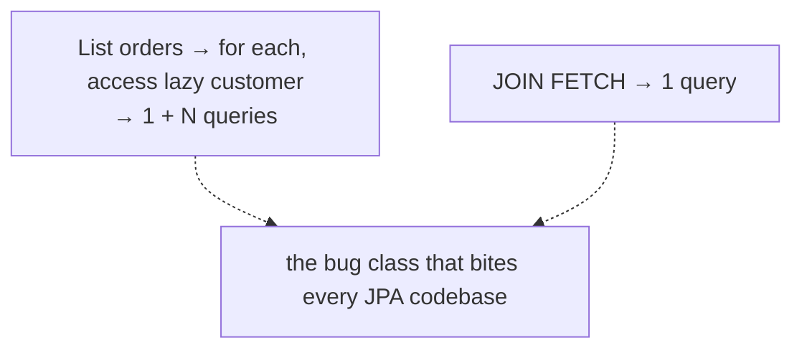
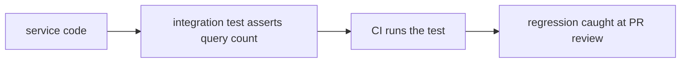
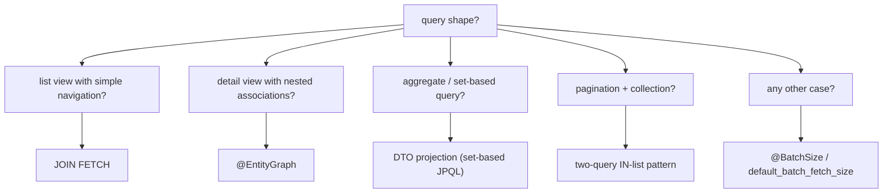

# The N+1 problem & fixes

If JPA had only one performance bug worth writing a topic about, it would be **N+1**. The pattern is universal: load a collection of N parent entities (the "1" query), then per parent navigate to a related entity (lazy-triggered, N queries). One list endpoint becomes **101 queries** for 100 orders — silent in development with 10 rows, catastrophic in production with 10,000. N+1 is the **single most common performance bug** in Spring JPA codebases. It hides behind clean object-oriented code (`order.getCustomer().getName()`); it appears only at scale; it usually shows up in the second week of production traffic.

A senior engineer can (1) **diagnose** N+1 — recognize when a service operation issues more queries than it should, by reading SQL logs / Hibernate statistics / query-counting tests; (2) **fix it** with the right tool — JOIN FETCH for single-association reads, `@EntityGraph` for multi-association reads, batch fetching as a safety net, DTO projections for set-shaped queries, two-step IN-list loads when the shape doesn't fit JOIN FETCH; (3) **prevent regressions** with integration tests that assert query counts.

This topic is dedicated to N+1 because it deserves its own treatment. T06 introduced lazy / eager fetch types and listed JOIN FETCH / `@EntityGraph` / batch / subselect; this topic shows the *bug pattern in depth*, the *detection toolkit*, and the *full menu of fixes* with concrete examples. We cover: the canonical N+1 shape with a worked SQL trace; how to detect via `hibernate.show_sql`, Hibernate statistics, P6Spy / DataSource-Proxy / log4jdbc, integration test assertions; the five fix strategies and when each applies; the IN-list two-query pattern (useful when JOIN FETCH won't work); GraphQL's DataLoader as a related pattern; and how the L2 cache (T11) mitigates N+1 for steady-state read-heavy workloads.

The depth-bar this topic clears: at the **language layer**, every fix technique (JOIN FETCH, `@EntityGraph`, `@BatchSize`, `@Fetch(SUBSELECT)`, DTO projections, IN-list two-query pattern). At the **memory layer**, the per-query cost (~1–5 ms each on a fast local DB; 5-20 ms across networks) so a 101-query response runs ~500 ms-2 s vs the 5 ms of an optimal one-query version. At the **architecture layer** — the heart — **the detection discipline** (every team needs query-count tests for hot endpoints), **the fix-selection matrix** (JOIN FETCH for clear navigation; `@EntityGraph` for nested; batch as fallback; DTO for set-shaped), and the **operational reality**: every senior Spring engineer has shipped an N+1 bug and learned the discipline.

> [!NOTE]
> Prerequisites: [Lazy vs eager loading (T06)](./T06-lazy-vs-eager-loading.md), [Persistence context (T05)](./T05-persistence-context-and-entity-lifecycle.md), [Hibernate architecture (T04)](./T04-hibernate-architecture.md).

## The Canonical N+1

```java
@Entity public class Order {
    @Id Long id;
    @ManyToOne(fetch = LAZY) Customer customer;
    String status;
    // ...
}

@Entity public class Customer {
    @Id Long id;
    String name;
}

@Service
@Transactional(readOnly = true)
public class OrderService {

    public List<OrderResponse> listByStatus(OrderStatus status) {
        return orderRepo.findByStatus(status).stream()
            .map(o -> new OrderResponse(o.getId(), o.getCustomer().getName()))
            .toList();
    }
}
```

Looks innocent. Reads the orders; for each, reads the customer's name; returns a DTO.

The SQL Hibernate emits:

```sql
-- the "1" query
SELECT id, status, customer_id FROM orders WHERE status = ?;

-- for each of 100 orders, a separate query:
SELECT id, name FROM customers WHERE id = 1;
SELECT id, name FROM customers WHERE id = 2;
SELECT id, name FROM customers WHERE id = 3;
...
SELECT id, name FROM customers WHERE id = 100;
```

**101 queries**. Each customer is a separate round trip. Total latency: 100 × 2 ms (DB round trip) = 200 ms minimum, often much more.

The optimal version is **one query**:

```sql
SELECT o.id, c.name FROM orders o
INNER JOIN customers c ON c.id = o.customer_id
WHERE o.status = ?;
```

~5 ms. **40× faster.**



## Why It Hides In Development

A development DB with 10 orders → 11 queries → 22 ms. Imperceptible.

Same code at production scale (10,000 orders matching the filter): 10,001 queries → 30 seconds. Customer-facing endpoint timing out.

**N+1 is exponential in production, invisible in development.** This is why query-count tests (next section) matter.

## Detecting N+1

### 1. SQL Logging

Boot's basic switch:

```yaml
spring:
  jpa:
    show-sql: true
    properties:
      hibernate:
        format_sql: true
```

But this is ugly (no parameters, no timing, no caller). Better: a dedicated logger like **P6Spy** or **DataSource-Proxy**:

```xml
<dependency>
    <groupId>com.github.gavlyukovskiy</groupId>
    <artifactId>p6spy-spring-boot-starter</artifactId>
</dependency>
```

```yaml
decorator:
  datasource:
    p6spy:
      enable-logging: true
      log-format: "[ms=%(executionTime)] [count=%(connectionId)] [sql=%(sql)]"
```

Each query is logged with its bound parameters and execution time. Read the logs during integration tests.

### 2. Hibernate Statistics

Built-in counters:

```yaml
spring:
  jpa:
    properties:
      hibernate:
        generate_statistics: true
```

```java
Statistics stats = sessionFactory.getStatistics();
long queryCount = stats.getQueryExecutionCount();
long entityLoads = stats.getEntityLoadCount();
long collectionFetches = stats.getCollectionLoadCount();
```

Read at known points (start of operation, end of operation). A list endpoint that loads 100 customers should *not* show `entityLoadCount=100` for customers.

Wire to Micrometer:

```xml
<dependency>
    <groupId>org.hibernate.orm</groupId>
    <artifactId>hibernate-micrometer</artifactId>
</dependency>
```

Now `hibernate.query.executions` is a Prometheus metric. Set alerts on unusual spikes.

### 3. Query-Count Tests (The Right Discipline)

The most effective N+1 defense: integration tests that *assert* query counts.

```java
@Test
@Sql("/test-data/orders-100.sql")
void listByStatus_doesNotN_plus_1() {
    AssertSqlCount.reset();

    List<OrderResponse> result = orderService.listByStatus(OrderStatus.NEW);

    assertThat(result).hasSize(100);
    assertThat(AssertSqlCount.selectCount()).isLessThanOrEqualTo(2);  // one for orders + one for customer batch
}
```

A small library (or your own counter wrapping a DataSource proxy) tracks queries during the test. Add the assertion for every list/detail endpoint. If a future refactor introduces N+1, the test fails immediately — catastrophe averted.

Libraries to use: **Hypersistence Utils** (`io.hypersistence:hypersistence-utils-hibernate-63`) ships query counters and N+1 detection.



## Fix 1 — JOIN FETCH

The most direct fix:

```java
@Query("SELECT o FROM Order o JOIN FETCH o.customer WHERE o.status = ?1")
List<Order> findByStatusWithCustomer(OrderStatus status);

@Service
public List<OrderResponse> listByStatus(OrderStatus status) {
    return orderRepo.findByStatusWithCustomer(status).stream()
        .map(o -> new OrderResponse(o.getId(), o.getCustomer().getName()))
        .toList();
}
```

One query. Works for single-association reads.

For two associations *non-collection*:

```java
@Query("SELECT o FROM Order o JOIN FETCH o.customer JOIN FETCH o.shippingAddress WHERE o.status = ?1")
List<Order> findByStatusWithCustomerAndAddress(OrderStatus status);
```

For one collection + one to-one:

```java
@Query("SELECT DISTINCT o FROM Order o JOIN FETCH o.customer JOIN FETCH o.items WHERE o.id = ?1")
Optional<Order> findDetailById(long id);
```

(The `DISTINCT` keyword tells JPA to de-duplicate the parent rows that the LEFT JOIN with items would otherwise produce.)

## Fix 2 — `@EntityGraph`

A cleaner alternative when the query is otherwise default:

```java
@EntityGraph(attributePaths = {"customer"})
List<Order> findByStatus(OrderStatus status);
```

Spring Data JPA generates the right SQL automatically; no JPQL needed.

For nested:

```java
@EntityGraph(attributePaths = {"customer", "items", "items.product"})
Optional<Order> findById(long id);
```

Use `@EntityGraph` when the derived query name (`findByStatus`) is fine and you just need to control fetching.

## Fix 3 — Batch Fetching

The safety-net solution: configure Hibernate to batch lazy loads.

```yaml
spring:
  jpa:
    properties:
      hibernate:
        default_batch_fetch_size: 50
```

Now 100 lazy customer loads become:

```sql
SELECT * FROM orders WHERE status = ?;
SELECT * FROM customers WHERE id IN (1, 2, 3, ..., 50);
SELECT * FROM customers WHERE id IN (51, 52, ..., 100);
```

3 queries instead of 101. Not as good as 1 (JOIN FETCH) but a major improvement and works *automatically* — no per-query work.

Set it globally; treat it as a safety net. JOIN FETCH the truly hot endpoints; batch handles the rest.

## Fix 4 — DTO Projection (The Set-Based Answer)

For set-shaped queries (aggregate reports, list summaries), skip the entity entirely:

```java
public interface OrderRepository extends JpaRepository<Order, Long> {

    @Query("""
        SELECT new com.example.OrderSummary(o.id, c.name, o.status, o.total)
        FROM Order o
        JOIN o.customer c
        WHERE o.status = ?1
    """)
    List<OrderSummary> summariesByStatus(OrderStatus status);
}

public record OrderSummary(Long id, String customerName, OrderStatus status, BigDecimal total) { }
```

One query, no entities loaded, no lazy proxies, no risk. **The right answer for list views.**

Alternatively use **interface projections**:

```java
public interface OrderSummary {
    Long getId();
    @Value("#{target.customer.name}") String getCustomerName();
    OrderStatus getStatus();
    BigDecimal getTotal();
}

List<OrderSummary> findByStatus(OrderStatus status);
```

Spring Data builds a proxy implementing the interface. Cleaner than constructor projections if you have many projections.

## Fix 5 — Two-Query IN-List Pattern

When JOIN FETCH doesn't fit (e.g., `LIMIT` + `JOIN FETCH` on a collection produces wrong row counts), do it in two queries:

```java
// step 1: paginated parent query
List<Order> orders = orderRepo.findByStatusOrderByCreatedAtDesc(status, Pageable.ofSize(20));
Set<Long> orderIds = orders.stream().map(Order::getId).collect(toSet());

// step 2: bulk load children by parent ids
List<OrderItem> items = orderItemRepo.findByOrderIdIn(orderIds);
Map<Long, List<OrderItem>> itemsByOrderId = items.stream().collect(groupingBy(i -> i.getOrder().getId()));

// step 3: assemble DTO with both
return orders.stream().map(o -> new OrderResponse(o.id(), itemsByOrderId.getOrDefault(o.id(), List.of()))).toList();
```

Two queries — explicit, predictable, scales linearly. Useful when `JOIN FETCH` would multiply rows beyond what pagination allows.

**This is the GraphQL DataLoader pattern at the JPA layer** — batch by ID, then dispatch.

## Fix 6 — L2 Cache Mitigation

For frequently-accessed reference data (customer tier definitions, country lookup), enable Hibernate L2 cache (T11). Lazy loads then become cache hits:

```java
@Entity
@Cache(usage = CacheConcurrencyStrategy.READ_ONLY)
public class Country { ... }
```

A naive N+1 over a 100-country lookup now hits the L2 cache 99 times and the DB once. **Mitigates but doesn't fix** — the fundamental coding pattern is still broken. Use only for genuinely-static reference data.

## The Fix Selection Matrix



## The IN-Clause Limit

Postgres handles `IN (1, 2, ..., 10000)` fine. Oracle 11g caps at 1000 elements; Hibernate batches around it. SQL Server is similar. **For large IN-lists, chunk by 1000 or use a temp table**.

Hibernate's `hibernate.query.in_clause_parameter_padding=true` pads to standard sizes (10, 100, 1000) for query plan caching — important when running thousands of IN queries with different sizes.

## Worked Example — Order Service Refactor

Original (with N+1):

```java
@Service
@Transactional(readOnly = true)
public class OrderService {

    public List<OrderResponse> list(OrderStatus status) {
        // bad: lazy loads customer + items per order
        return orderRepo.findByStatus(status).stream()
            .map(o -> new OrderResponse(
                o.getId(),
                o.getCustomer().getName(),
                o.getItems().size(),
                o.getTotal()))
            .toList();
    }
}
```

Test:

```java
@Test
void list_executes_at_most_3_queries() {
    sql.reset();
    orderService.list(OrderStatus.NEW);
    assertThat(sql.selectCount()).isLessThanOrEqualTo(3);
    // baseline fail: actual = 1 + N (customer) + N (items)
}
```

Fix v1 — DTO projection:

```java
@Query("""
    SELECT new com.example.OrderResponse(o.id, c.name, SIZE(o.items), o.total)
    FROM Order o JOIN o.customer c
    WHERE o.status = ?1
""")
List<OrderResponse> findResponseByStatus(OrderStatus status);

public List<OrderResponse> list(OrderStatus status) {
    return orderRepo.findResponseByStatus(status);
}
```

One query. Test passes with count=1. **The clean answer for a list endpoint.**

Detail endpoint with full graph:

```java
@EntityGraph(attributePaths = {"customer", "items", "items.product"})
Optional<Order> findDetailById(long id);

public OrderDetailResponse loadDetail(long id) {
    Order o = orderRepo.findDetailById(id).orElseThrow();
    return OrderDetailResponse.of(o);   // mapped while managed; lazy fields already fetched
}
```

## Common Pitfalls

> [!WARNING]
> **Treating Hibernate logs as sufficient detection.** Logs scroll fast; humans skip them. Tests catch consistently.

> [!WARNING]
> **`open-in-view = true` hiding N+1.** The view triggers lazy loads outside the service — silent N+1. Disable.

> [!WARNING]
> **`@OneToMany(fetch = EAGER)` "to avoid N+1".** Replaces N+1 with eager-cartesian; far worse on lists. Always LAZY; per-query JOIN FETCH or `@EntityGraph`.

> [!WARNING]
> **JOIN FETCH on a paginated query with a collection.** Hibernate warns about applying limit in memory; pagination breaks. Use two queries.

> [!WARNING]
> **`@BatchSize=50` declared everywhere "to fix N+1".** Reduces to N/50 queries, still scales with N. Use as a safety net; JOIN FETCH the hot paths.

> [!WARNING]
> **Returning entities from controllers + Jackson lazy serialization.** Jackson touches every getter → fires every lazy load. Always DTO at the boundary.

> [!WARNING]
> **Sending the same entity through many transformations.** Once detached, can't lazy-load. Map once, inside the transaction.

> [!WARNING]
> **N+1 introduced silently by a refactor.** A previously-eager association switched to LAZY is a likely culprit. Query-count tests catch it.

> [!WARNING]
> **GraphQL data fetchers without DataLoader.** Same N+1 pattern at the resolver layer. Use DataLoader or batch-by-id loaders.

## Practice

1. Build an `OrderService.list(...)` that lazy-loads customer and items per order. Insert 100 orders. Hit the service; count queries (P6Spy log or stats). Confirm 1 + 100 + 100 = 201.
2. Fix with JOIN FETCH for customer; verify drop to 1 + 100. Add `@EntityGraph` for items; drop to 1.
3. Add query-count integration test asserting ≤ 1. Make it part of CI.
4. Set `default_batch_fetch_size=50` globally. Remove JOIN FETCH. Run again; observe drop to ~3-4 queries.
5. Convert one list endpoint to a DTO projection via JPQL constructor. Confirm zero entity loads in stats.
6. Build a pagination + collection scenario; trigger the JOIN FETCH-with-LIMIT warning; fix with two-query IN-list.
7. Wire Hibernate Micrometer metrics to Prometheus. Set an alert on query-per-request anomalies.
8. Profile an L2 cache for reference data; observe cache-hit metrics; confirm DB load drops.

## Recap

You should now be able to:

- Recognize the N+1 pattern in code (a loop or stream over loaded entities accessing a lazy association) and in SQL logs (1 query + N identical queries differing only in WHERE id).
- Detect N+1 via SQL logging (P6Spy / DataSource-Proxy), Hibernate Statistics, Micrometer metrics, and query-count integration tests.
- Choose the right fix: JOIN FETCH for single-association reads, `@EntityGraph` for nested or multi-association, batch fetching as safety net, DTO projections for set-based queries, two-query IN-list pattern for pagination+collection.
- Configure `default_batch_fetch_size` globally as a baseline defense.
- Use L2 cache to mitigate N+1 for reference data only.
- Write query-count tests that assert maximum SQL emissions per endpoint, making regressions visible.
- Reason about the Cartesian-bloat trade-off between deep JOIN FETCH and multi-query approaches.
- Avoid the canonical pitfalls: open-in-view hiding N+1, eager fetch as "fix", JOIN FETCH with pagination, controllers returning entities.

## Next

Continue to [JPQL & Criteria API](./T08-jpql-and-criteria-api.md) for the deep treatment of the query languages — JPQL syntax, named parameters, projections, joins (inner/left/fetch), subqueries, scalar/aggregate functions, and the type-safe Criteria API as the dynamic alternative.
