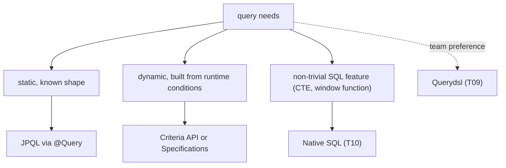

# JPQL & Criteria API

JPA's query languages serve the set-thinking side of the impedance mismatch (T01). Where the `EntityManager` API navigates entities by id, the query languages let you express "give me all orders with status = NEW, joined to their customer, ordered by date, paginated" as a single expression — typed against your *entity model*, not against tables. Two flavors of query language are in the spec:

- **JPQL** (Java Persistence Query Language) — a string-based language that looks like SQL but talks about entities and fields, not tables and columns. The query is a String; parameters are positional or named.
- **Criteria API** — a programmatic, type-safe equivalent. Build the query as a tree of objects. Refactor-friendly; verbose.

Hibernate's older equivalent is **HQL** (Hibernate Query Language) — a superset of JPQL. Modern Hibernate (6+) has converged the two; "JPQL" and "HQL" are interchangeable for most purposes, with HQL offering a few extensions.

A senior engineer reaches for one or the other most days. Spring Data's `@Query` annotation accepts JPQL. The Criteria API is for dynamic queries (`if (name != null) addNameFilter()`). When neither fits, native SQL (T10) takes over. **Querydsl** (T09) is the popular third-party type-safe alternative that many teams prefer over Criteria.

This topic is the deep treatment of JPQL syntax (every clause: SELECT / FROM / JOIN / WHERE / GROUP BY / HAVING / ORDER BY) and the Criteria API. T09 covers Querydsl as an alternative; T10 covers native SQL. After this topic you can write essentially any JPA-shaped query.

The depth-bar this topic clears: at the **language layer**, full JPQL grammar (entity navigation, parameter binding, JOIN types, JOIN FETCH, subqueries, scalar / aggregate functions, polymorphic queries, `TREAT`, `TYPE`); Criteria API (`CriteriaBuilder`, `CriteriaQuery`, `Root`, `Path`, `Predicate`, `Selection`, `Order`); the static metamodel for type-safe path access. At the **memory layer**, query parsing and translation — JPQL is parsed by Hibernate's HQL parser into an AST, translated to SQL using the dialect, cached per query string; Criteria queries are built as objects, translated to JPQL conceptually, then to SQL. At the **architecture layer** — the heart — **when to use which** (JPQL for static queries; Criteria for dynamic; Querydsl when team prefers type-safe DSL; native SQL when JPQL can't express), and **the query lifecycle** (parse, plan-cache, execute, hydrate entities).

> [!NOTE]
> Prerequisites: [JPA fundamentals (T02)](./T02-jpa-fundamentals-entities-entitymanager.md), [Entity mappings (T03)](./T03-entity-mappings-and-relationships-onetomany-etc.md), [Lazy vs eager (T06)](./T06-lazy-vs-eager-loading.md), SQL fluency.

## JPQL — The String-Based Language

### A Tour

```java
// simple SELECT
List<User> users = em.createQuery(
    "SELECT u FROM User u WHERE u.status = :status",
    User.class)
    .setParameter("status", UserStatus.ACTIVE)
    .getResultList();

// with multiple conditions, ordering, pagination
List<Order> recent = em.createQuery("""
    SELECT o FROM Order o
    WHERE o.customer.id = :customerId
      AND o.createdAt >= :since
      AND o.status IN (:statuses)
    ORDER BY o.createdAt DESC
    """, Order.class)
    .setParameter("customerId", 42L)
    .setParameter("since", Instant.now().minus(30, DAYS))
    .setParameter("statuses", List.of(OrderStatus.NEW, OrderStatus.PROCESSING))
    .setFirstResult(0)
    .setMaxResults(20)
    .getResultList();

// projection to DTO
List<OrderSummary> summaries = em.createQuery("""
    SELECT new com.example.OrderSummary(o.id, c.name, o.total)
    FROM Order o JOIN o.customer c
    WHERE o.status = :status
    """, OrderSummary.class)
    .setParameter("status", OrderStatus.NEW)
    .getResultList();

// aggregate
Long count = em.createQuery(
    "SELECT COUNT(o) FROM Order o WHERE o.status = :status", Long.class)
    .setParameter("status", OrderStatus.NEW)
    .getSingleResult();

// UPDATE / DELETE
int updated = em.createQuery(
    "UPDATE User u SET u.status = 'INACTIVE' WHERE u.lastLoginAt < :before")
    .setParameter("before", Instant.now().minus(90, DAYS))
    .executeUpdate();
```

Key syntax:

- `SELECT u FROM User u` — `User` is the entity class name (not the table); `u` is the alias.
- Field navigation: `u.status`, `o.customer.id`. JPA follows associations as object navigation.
- Parameters: `:name` (named, recommended) or `?1` (positional). Bind with `setParameter`.
- DTO projection: `new com.example.OrderSummary(...)` — constructor call inside JPQL.
- Pagination: `setFirstResult` + `setMaxResults`. Translated to LIMIT/OFFSET (or row-fetch on Oracle, etc.).
- DML: UPDATE and DELETE work. Bulk operations bypass the persistence context (no cascade, no listeners).

### Entity Navigation

JPQL navigates the object graph:

```sql
-- JPQL
SELECT o FROM Order o WHERE o.customer.name = 'Alice'

-- generates SQL
SELECT o.* FROM orders o JOIN customers c ON c.id = o.customer_id WHERE c.name = 'Alice'
```

The `o.customer.name` is *implicit JOIN* — Hibernate adds it automatically. **Implicit joins are convenient but limited** — only INNER JOIN, no control over fetch, no aliasing.

For more control, use explicit JOIN:

```sql
SELECT o FROM Order o JOIN o.customer c WHERE c.name = 'Alice'
```

### JOIN Types

JPQL supports:

| JPQL | SQL equivalent |
|------|----------------|
| `JOIN` / `INNER JOIN` | INNER JOIN |
| `LEFT JOIN` / `LEFT OUTER JOIN` | LEFT JOIN |
| `JOIN FETCH` | INNER JOIN + populate the collection / association |
| `LEFT JOIN FETCH` | LEFT JOIN + populate |

```java
"SELECT o FROM Order o JOIN FETCH o.items WHERE o.id = ?1"
```

The `JOIN FETCH` triggers eager loading just for this query (T06 / T07).

### Subqueries

```java
// scalar subquery
"SELECT o FROM Order o WHERE o.total > (SELECT AVG(o2.total) FROM Order o2)"

// EXISTS
"""
SELECT u FROM User u
WHERE EXISTS (
    SELECT 1 FROM Order o WHERE o.customer = u AND o.status = 'NEW'
)
"""

// IN with subquery
"""
SELECT o FROM Order o
WHERE o.customer.id IN (SELECT u.id FROM User u WHERE u.status = 'PREMIUM')
"""

// correlated subquery
"""
SELECT u FROM User u
WHERE (SELECT COUNT(o) FROM Order o WHERE o.customer = u) > 10
"""
```

JPQL supports the same subquery constructs as SQL.

### Aggregate Functions

```java
"SELECT COUNT(o), AVG(o.total), MIN(o.total), MAX(o.total), SUM(o.total) FROM Order o"
```

With grouping:

```java
"""
SELECT c.name, COUNT(o), SUM(o.total)
FROM Order o JOIN o.customer c
WHERE o.createdAt >= :since
GROUP BY c.name
HAVING COUNT(o) > 5
ORDER BY SUM(o.total) DESC
"""
```

Returns `List<Object[]>` unless you project to a DTO with `new`.

### Scalar Functions

JPA spec functions:

```
LENGTH(str), UPPER(str), LOWER(str), TRIM(str), CONCAT(s1, s2), SUBSTRING(s, from, len)
ABS(n), MOD(a, b), SQRT(n), SIZE(coll)
CURRENT_DATE, CURRENT_TIME, CURRENT_TIMESTAMP
COALESCE(a, b, c), NULLIF(a, b)
CASE WHEN ... THEN ... ELSE ... END
```

For dialect-specific functions (PostgreSQL `jsonb_extract_path`, MySQL `JSON_EXTRACT`):

```java
"SELECT FUNCTION('jsonb_extract_path_text', e.data, 'key') FROM Event e"
```

`FUNCTION(...)` calls the underlying SQL function. Hibernate emits it directly.

### Polymorphic Queries

```java
@Entity
@Inheritance(strategy = SINGLE_TABLE)
@DiscriminatorColumn(name = "type")
public abstract class Payment { ... }

@Entity @DiscriminatorValue("CARD") public class CardPayment extends Payment { ... }
@Entity @DiscriminatorValue("BANK") public class BankPayment extends Payment { ... }

// returns all payments (any subtype)
"SELECT p FROM Payment p"

// filter by type
"SELECT p FROM Payment p WHERE TYPE(p) = CardPayment"

// project subtype-specific field
"SELECT p FROM CardPayment p WHERE p.cardNumberLast4 = ?1"

// TREAT (downcast in query)
"SELECT p FROM Payment p WHERE TREAT(p AS CardPayment).cardNumberLast4 = ?1"
```

JPA's polymorphic semantics are built in; `SELECT p FROM Payment p` returns the right subtype-typed instances for each row.

### Named Queries

Define at the entity level, reuse:

```java
@Entity
@NamedQueries({
    @NamedQuery(name = "Order.findByStatus",
        query = "SELECT o FROM Order o WHERE o.status = :status"),
    @NamedQuery(name = "Order.countByCustomer",
        query = "SELECT COUNT(o) FROM Order o WHERE o.customer.id = :customerId")
})
public class Order { ... }

// use
List<Order> result = em.createNamedQuery("Order.findByStatus", Order.class)
    .setParameter("status", OrderStatus.NEW)
    .getResultList();
```

Spring Data JPA recognizes named queries automatically: a method `findByStatus(OrderStatus status)` on a repository looks for `Order.findByStatus` first before falling back to derivation.

Validated at startup (parse error fails the application); cached forever.

### Query Hints

Tune behavior per query:

```java
em.createQuery("SELECT u FROM User u", User.class)
    .setHint(QueryHints.HINT_READONLY, true)         // mark as read-only; skip dirty check
    .setHint(QueryHints.HINT_FETCH_SIZE, 1000)       // JDBC fetch size
    .setHint(QueryHints.HINT_TIMEOUT, 5)             // 5s timeout
    .setHint("javax.persistence.query.timeout", 5000) // alternative
    .getResultList();
```

For Spring Data JPA:

```java
@QueryHints({@QueryHint(name = "org.hibernate.readOnly", value = "true")})
List<User> findByStatus(UserStatus status);
```

## Spring Data JPA — `@Query`

Most production code uses Spring Data's `@Query` annotation rather than the raw `EntityManager`:

```java
public interface OrderRepository extends JpaRepository<Order, Long> {

    @Query("SELECT o FROM Order o WHERE o.status = ?1 ORDER BY o.createdAt DESC")
    List<Order> findRecentByStatus(OrderStatus status);

    @Query("""
        SELECT new com.example.OrderSummary(o.id, c.name, o.total)
        FROM Order o JOIN o.customer c
        WHERE o.status = :status
    """)
    List<OrderSummary> summaries(@Param("status") OrderStatus status);

    @Modifying
    @Query("UPDATE User u SET u.status = 'INACTIVE' WHERE u.lastLoginAt < ?1")
    int deactivateStaleUsers(Instant before);

    @Query(value = "SELECT * FROM users WHERE email ~ :regex", nativeQuery = true)
    List<User> findByEmailRegex(@Param("regex") String regex);
}
```

`@Modifying` is required for UPDATE / DELETE. `nativeQuery = true` switches to native SQL.

## The Criteria API

For dynamic queries built from runtime conditions:

```java
public List<Order> search(String customerName, OrderStatus status, Instant since) {
    CriteriaBuilder cb = em.getCriteriaBuilder();
    CriteriaQuery<Order> q = cb.createQuery(Order.class);
    Root<Order> o = q.from(Order.class);

    List<Predicate> predicates = new ArrayList<>();
    if (customerName != null) {
        Join<Order, Customer> c = o.join("customer");
        predicates.add(cb.equal(c.get("name"), customerName));
    }
    if (status != null) {
        predicates.add(cb.equal(o.get("status"), status));
    }
    if (since != null) {
        predicates.add(cb.greaterThanOrEqualTo(o.get("createdAt"), since));
    }

    q.where(predicates.toArray(new Predicate[0]));
    q.orderBy(cb.desc(o.get("createdAt")));

    return em.createQuery(q).setMaxResults(20).getResultList();
}
```

Type-unsafe because `o.get("customer")` is a `String`. The **JPA metamodel** fixes this:

### The Metamodel

A class generator (`jpa-metamodel-generator` annotation processor) produces type-safe descriptors at build time:

```java
@StaticMetamodel(Order.class)
public class Order_ {
    public static volatile SingularAttribute<Order, Long> id;
    public static volatile SingularAttribute<Order, Customer> customer;
    public static volatile SingularAttribute<Order, OrderStatus> status;
    public static volatile SingularAttribute<Order, Instant> createdAt;
    public static volatile ListAttribute<Order, OrderItem> items;
}
```

Used in Criteria:

```java
Root<Order> o = q.from(Order.class);
predicates.add(cb.equal(o.get(Order_.status), status));   // type-safe!
predicates.add(cb.greaterThanOrEqualTo(o.get(Order_.createdAt), since));
```

Now a typo on `status` is a compile error; renaming a field updates the metamodel.

Configure in build:

```xml
<dependency>
    <groupId>org.hibernate.orm</groupId>
    <artifactId>hibernate-jpamodelgen</artifactId>
    <scope>provided</scope>
</dependency>
```

### Specifications (Spring Data)

Spring Data JPA wraps Criteria into `Specification<T>`:

```java
public interface OrderSpecs {
    static Specification<Order> hasStatus(OrderStatus s) {
        return (root, q, cb) -> cb.equal(root.get(Order_.status), s);
    }
    static Specification<Order> createdAfter(Instant t) {
        return (root, q, cb) -> cb.greaterThan(root.get(Order_.createdAt), t);
    }
}

// compose
List<Order> result = orderRepo.findAll(
    OrderSpecs.hasStatus(NEW).and(OrderSpecs.createdAfter(yesterday)));
```

The repository extends `JpaSpecificationExecutor<Order>`. Compositions are reusable across endpoints.

### Criteria Joins and Fetch

```java
Root<Order> o = q.from(Order.class);
Join<Order, Customer> c = o.join(Order_.customer);
o.fetch(Order_.items, JoinType.LEFT);
```

The `fetch(...)` returns a `Fetch` that doesn't bind a path you can use in predicates — fetch is for *loading*, not filtering.

## When To Use Which



| Scenario | Pick |
|----------|-------|
| Static query | JPQL (`@Query`) |
| Dynamic filters | Criteria + metamodel or Spring Data `Specification` |
| Type safety required | Querydsl or metamodel-based Criteria |
| Window functions, CTEs | Native query (T10) |
| Set-shaped DTO | JPQL with constructor projection |

## Worked Example — Search Endpoint

```java
public interface OrderRepository extends JpaRepository<Order, Long>, JpaSpecificationExecutor<Order> {

    // 1. simple JPQL for known queries
    @Query("SELECT o FROM Order o JOIN FETCH o.customer WHERE o.status = ?1 ORDER BY o.createdAt DESC")
    Page<Order> findByStatus(OrderStatus status, Pageable pageable);

    // 2. DTO projection for list views
    @Query("""
        SELECT new com.example.OrderSummary(o.id, c.name, o.status, o.total, o.createdAt)
        FROM Order o JOIN o.customer c
        WHERE o.status = :status
    """)
    Page<OrderSummary> summaries(@Param("status") OrderStatus status, Pageable pageable);

    // 3. dynamic search via Specifications
}

@Service
public class OrderSearchService {
    private final OrderRepository repo;

    public Page<OrderSummary> search(OrderSearchRequest req, Pageable pageable) {
        Specification<Order> spec = Specification.where(null);
        if (req.status() != null) spec = spec.and(OrderSpecs.hasStatus(req.status()));
        if (req.customerName() != null) spec = spec.and(OrderSpecs.customerNameLike(req.customerName()));
        if (req.from() != null) spec = spec.and(OrderSpecs.createdAfter(req.from()));
        if (req.to() != null) spec = spec.and(OrderSpecs.createdBefore(req.to()));

        return repo.findAll(spec, pageable).map(OrderSummary::of);
    }
}
```

Combination: JPQL for the static known queries; Specifications for the dynamic search; DTO projections for list shapes; per-query JOIN FETCH for known associations.

## Common Pitfalls

> [!WARNING]
> **Concatenating user input into JPQL.** SQL injection. Always use named/positional parameters.

> [!WARNING]
> **`@Query` JPQL with table names instead of entity names.** `SELECT * FROM users` fails — JPQL needs `SELECT u FROM User u`. Native query (`nativeQuery=true`) for table-based syntax.

> [!WARNING]
> **`@Modifying` missing on UPDATE/DELETE.** JPA throws "Not supported for select queries". Add `@Modifying`.

> [!WARNING]
> **Bulk DML without `clearAutomatically` or `flushAutomatically`.** The persistence context still holds the old state. Use `@Modifying(clearAutomatically = true)` or call `em.clear()` after.

> [!WARNING]
> **Constructor projection with mismatched constructor signature.** Compile-error-free, runtime explosion. Test.

> [!WARNING]
> **Criteria query with stringly-typed `get("fieldName")`.** Typos break runtime. Use the metamodel.

> [!WARNING]
> **Implicit JOIN in JPQL on a lazy `@ManyToOne`.** Hibernate generates an extra JOIN; can be surprising for performance. Make it explicit.

> [!WARNING]
> **JPQL JOIN FETCH with Pageable.** Hibernate warns about in-memory limit; pagination breaks. Use two-query pattern.

> [!WARNING]
> **Forgetting to wire `hibernate-jpamodelgen` annotation processor.** Build succeeds; metamodel classes missing; Criteria queries fail at runtime.

> [!WARNING]
> **Heavy reliance on Criteria for static queries.** Verbose and unreadable. Use JPQL for static; reserve Criteria for genuinely dynamic.

## Practice

1. Write a JPQL query joining three entities and projecting to a DTO via constructor expression. Verify the SQL Hibernate emits.
2. Add a query hint `org.hibernate.readOnly=true` to a read-heavy query; verify no dirty-check overhead.
3. Convert a JPQL query to Criteria with the metamodel. Compare verbosity and refactor-safety.
4. Build a `Specification<Order>` library: 5 reusable specs combined with `and` / `or`. Use in a search endpoint.
5. Add a polymorphic query with `TYPE(p) = SubType` and one with `TREAT(p AS SubType).subTypeField`. Inspect the generated SQL.
6. Use `FUNCTION('regexp_match', ...)` to call a Postgres function from JPQL. Confirm it works.
7. Build a bulk UPDATE with `@Modifying(clearAutomatically=true)`. Verify subsequent reads see the new state.
8. Use named queries; observe the startup-time validation when you introduce a syntax error.

## Recap

You should now be able to:

- Write JPQL covering every clause (SELECT / FROM / JOIN / WHERE / GROUP BY / HAVING / ORDER BY), parameter binding (named/positional), DTO projections (`new`), aggregate / scalar functions, subqueries, polymorphic queries with `TYPE` / `TREAT`.
- Choose between implicit joins (`o.customer.name`) and explicit joins (`JOIN o.customer c`) based on control needs.
- Use `JOIN FETCH` for per-query eager loading; recognize the Pageable interaction.
- Define named queries (`@NamedQuery`) for startup-validated reusable JPQL.
- Apply query hints (read-only, fetch size, timeout) via `@QueryHints` or `setHint`.
- Use Spring Data's `@Query` with `@Modifying` for DML, `@Param` for named parameters, and native query mode.
- Build Criteria queries with `CriteriaBuilder` / `CriteriaQuery` / `Root` / `Predicate` / `Selection` / `Order`.
- Use the JPA metamodel (`Entity_.field`) for type-safe path access.
- Compose Spring Data `Specification<T>` for dynamic search.
- Choose between JPQL (static), Criteria/Specifications (dynamic), Querydsl (alternative DSL), and native SQL (T10) per query.
- Avoid the canonical pitfalls: injection via concatenation, missing `@Modifying`, missing metamodel codegen, JOIN FETCH + pagination.

## Next

Continue to [QueryDSL](./T09-querydsl.md) for the type-safe DSL alternative — annotation processor, `Q` classes, predicate building, JPA / SQL adapters, and the trade-off vs Criteria API.
