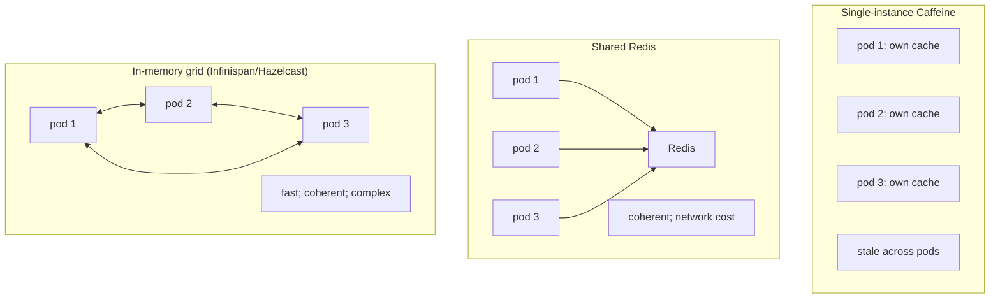

# Caching (first/second level)

JPA has two distinct caches with very different semantics. The **first-level (L1) cache** is the persistence context itself (T05) — implicit, mandatory, per-transaction, populated as you load entities; it's the identity map that makes two `em.find(User, 42)` calls return the same Java reference. You've been using it since T02. The **second-level (L2) cache** is explicit, optional, *shared across transactions*, configured per-entity, backed by a pluggable store (Caffeine / Ehcache / Redis / Infinispan); it caches entity state across the persistence-context boundary so that a `find` in transaction B can hit in-memory data populated by transaction A.

L2 is the "Hibernate caching" people mean when they say "we cache our entities". It can deliver enormous performance gains for read-heavy reference data (currency lookups, country codes, role definitions, category trees) and steady-state read-mostly entities (catalog products with low write volume). It can also be **the source of incredibly subtle bugs** — stale reads under concurrent writes, cache-coherence problems in clusters, doubled memory footprint, masked N+1s. A senior engineer enables L2 deliberately, per-entity, with the right concurrency strategy, and with metrics flowing.

This topic covers: the L1 cache mechanics (review from T05); enabling L2 globally; choosing a provider (Caffeine for single-instance; Redis / Infinispan / Hazelcast for clusters); annotating entities with `@Cache` and the four concurrency strategies (READ_ONLY, NONSTRICT_READ_WRITE, READ_WRITE, TRANSACTIONAL); the collection cache for `@OneToMany`; the query cache for JPQL results; the natural-id cache (Hibernate-specific, for lookup-by-business-key); cache invalidation (automatic on writes from this app; manual otherwise); statistics + Micrometer integration; the distributed-cache challenges (stale data, cluster coherence, partition tolerance).

The depth-bar this topic clears: at the **language layer**, every cache annotation (`@Cache`, `@Cacheable`, `@CacheConcurrencyStrategy`, `@NaturalIdCache`) and Hibernate config property. At the **memory layer**, the L2 cache is a `Map<EntityKey, CachedEntry>` where each entry stores the entity's column data (NOT the Java instance — Hibernate rehydrates on hit) plus a version; a 100K-entity cache is ~30–100 MB. At the **architecture layer** — the heart — **when each strategy is correct** (READ_ONLY for immutable; NONSTRICT for mostly-static; READ_WRITE for the default; TRANSACTIONAL for XA), **the invalidation model** (Hibernate invalidates on flush; *other apps* mutating the DB bypass it), and the **distributed-cache choice** (Caffeine for single instance; Redis / Hazelcast / Infinispan for clusters with their own coherence trade-offs).

> [!NOTE]
> Prerequisites: [Persistence context (T05)](./T05-persistence-context-and-entity-lifecycle.md), [Hibernate architecture (T04)](./T04-hibernate-architecture.md), [Lazy vs eager (T06)](./T06-lazy-vs-eager-loading.md).

## L1 Cache — Recap

The persistence context (T05) acts as L1:

- Per `EntityManager` (per transaction in Spring).
- Implicit; can't disable.
- Identity map: two `find(User, 42)` calls return the same Java reference.
- Cleared on `em.clear()` / tx end.
- Snapshots support dirty checking.

L1 alone gives huge wins within a transaction: a single SELECT for a given id; subsequent navigations return the same object without reload. But each transaction starts fresh — N transactions loading the same hot entity = N SELECTs.

L2 fills this gap.

## L2 Cache — Setup

```xml
<dependency>
    <groupId>org.hibernate.orm</groupId>
    <artifactId>hibernate-jcache</artifactId>
</dependency>
<dependency>
    <groupId>com.github.ben-manes.caffeine</groupId>
    <artifactId>jcache</artifactId>   <!-- Caffeine JCache provider -->
</dependency>
```

Enable in YAML:

```yaml
spring:
  jpa:
    properties:
      hibernate:
        cache:
          use_second_level_cache: true
          use_query_cache: true
          region.factory_class: jcache
        javax.cache.provider: com.github.benmanes.caffeine.jcache.spi.CaffeineCachingProvider
        generate_statistics: true
```

Mark entities `@Cacheable` + `@Cache`:

```java
@Entity
@Cacheable
@Cache(usage = CacheConcurrencyStrategy.READ_WRITE, region = "country")
public class Country {
    @Id String code;   // "US", "DE", ...
    String name;
    String currency;
}
```

Now `em.find(Country.class, "US")` populates the cache. Subsequent reads from any transaction hit the cache; no SELECT.

## Cache Concurrency Strategies

| Strategy | When to use | Reads | Writes | Coherence |
|----------|-------------|-------|--------|-----------|
| `READ_ONLY` | data never changes after insert (currency codes, ISO countries) | from cache | DB only; cache populated once | trivial |
| `NONSTRICT_READ_WRITE` | rare writes; brief staleness tolerable | from cache | DB; *eventually* update cache | weak |
| `READ_WRITE` | typical; mutations + reads concurrent | from cache | atomic update of cache + DB via soft locks | strong (transactional consistency) |
| `TRANSACTIONAL` | XA-transactional cache (Infinispan only) | from cache | inside JTA transaction | strict |

**Pick READ_WRITE as default**. READ_ONLY for genuinely immutable data. NONSTRICT and TRANSACTIONAL are rare.

### `READ_ONLY`

```java
@Entity
@Cache(usage = CacheConcurrencyStrategy.READ_ONLY)
public class Currency {
    @Id String code;
    String symbol;
}
```

Attempting to update a READ_ONLY-cached entity throws an exception. Use for genuinely immutable reference data.

### `READ_WRITE`

```java
@Entity
@Cache(usage = CacheConcurrencyStrategy.READ_WRITE)
public class Product { ... }
```

Hibernate uses **soft locks**: on update, the cache entry is locked; concurrent readers either wait briefly or hit DB; writer flushes; lock releases; readers see new value. Atomic from the perspective of a single Hibernate instance.

### `NONSTRICT_READ_WRITE`

Skip the lock. Writes invalidate the cache entry; the next read repopulates from DB. Brief window where reader sees stale data. Cheaper than READ_WRITE.

## Collection Cache

To cache `@OneToMany` collections separately:

```java
@Entity
@Cache(usage = READ_WRITE)
public class Department {
    @Id Long id;

    @OneToMany(mappedBy = "department")
    @Cache(usage = READ_WRITE)
    private List<Employee> employees;
}
```

The collection cache stores *the list of FKs/ids*, not the full entities. On hit, Hibernate fetches each entity (hitting their own entity cache if cached) to build the list.

Without collection cache: every `dept.getEmployees()` fires a SELECT.
With collection cache: a hit returns the id list; entities themselves come from entity cache.

**Caveat**: collection cache requires the entity cache on `Employee` to be effective. Otherwise you save the collection-load SELECT but still fire N SELECTs for the entities.

## Query Cache

Cache the *results* of JPQL queries:

```java
@QueryHints({@QueryHint(name = "org.hibernate.cacheable", value = "true")})
@Query("SELECT u FROM User u WHERE u.active = true")
List<User> findActive();
```

On hit, Hibernate returns the cached id list and looks up each entity in the entity cache. Without an entity cache, the query cache is mostly useless (you save the WHERE-clause work, still N SELECTs for entities).

**Query cache is fragile** — any change to *any* entity in the queried table invalidates *all* query-cache entries for that table. A heavy-write table makes query cache useless.

Configure regions:

```java
@QueryHints({
    @QueryHint(name = "org.hibernate.cacheable", value = "true"),
    @QueryHint(name = "org.hibernate.cacheRegion", value = "queries.activeUsers")
})
@Query("SELECT u FROM User u WHERE u.active = true")
List<User> findActive();
```

## Natural ID Cache

Hibernate-specific: cache lookups by a business key:

```java
@Entity
@NaturalIdCache
public class User {
    @Id Long id;
    @NaturalId String email;
    String name;
}

User u = session.byNaturalId(User.class)
    .using("email", "alice@x.io")
    .load();
```

A cache hit returns the entity immediately; a miss fires one SELECT (by email), then caches by both id and natural id. Excellent for "look up user by email" hot paths.

## Distributed Caches — The Cluster Case

A single-instance Caffeine cache works for one JVM. In a cluster:

- **Caffeine** — single-instance only; each pod has its own cache; an update on pod A doesn't invalidate pod B's cache. Stale-read window = TTL or until pod B reads from DB.
- **Redis (via Spring Data Redis L2 adapter)** — shared cache. Updates from any pod invalidate the shared entry. ~1-3 ms per cache op (network round-trip).
- **Infinispan / Hazelcast** — distributed in-memory grid. ~10-100 µs per op. Cluster-coherent updates. More complex ops.



The trade-off:

- Single Caffeine: fast (~50 ns); brittle in cluster.
- Redis: slower (~1 ms); always coherent; cheap to operate.
- Grid: fast (~100 µs); coherent; harder to operate.

For most clusters in 2026: **Caffeine for genuinely-immutable data (READ_ONLY); Redis for everything else**.

## Cache Invalidation — What Goes Wrong

Hibernate invalidates cache entries:

- When **this Hibernate instance** writes to an entity (UPDATE/DELETE goes through `EntityPersister`, which evicts the cache).
- When **this instance** runs bulk DML (UPDATE/DELETE via JPQL).

Hibernate **does NOT** invalidate when:

- Another application updates the DB.
- A native query or direct JDBC mutates a row.
- A scheduled job in another pod updates the DB (in a cluster with single-instance Caffeine).

This is the source of L2's worst bugs. A daily sync job updates `Country.name`; the cache holds the old name; for the next TTL window, queries return stale data. Hours-long bug.

Mitigations:

- **Use READ_ONLY for genuinely immutable data only.**
- **Short TTLs** for mutable cached entities (5-15 min).
- **`em.unwrap(Session.class).getSessionFactory().getCache().evictEntity(...)`** to manually evict after external changes.
- **Shared cache (Redis / Infinispan)** for clusters so writes from any pod invalidate.

## Cache Statistics

```java
Statistics stats = sessionFactory.getStatistics();
stats.getSecondLevelCacheHitCount();
stats.getSecondLevelCacheMissCount();
stats.getSecondLevelCachePutCount();
```

Per region:

```java
stats.getSecondLevelCacheStatistics("country").getHitCount();
```

Hit rate < 80%? Investigate. Either the cache isn't being hit (wrong access pattern; mostly different ids) or invalidations are wiping it (heavy concurrent writes). Either way the cache is wasted memory.

Wire to Micrometer via `hibernate-micrometer`. Set alerts on regions with low hit rate.

## When NOT To Use L2

| Anti-pattern | Why |
|--------------|-----|
| Heavy-write entities | constant invalidation; ~0% hit rate |
| Entities with many associations | cache holds dehydrated state; rehydration still fires N+1 |
| Large entities (BLOBs) | huge memory footprint |
| Per-user data | cache cardinality = users; tiny hit rate |
| Data updated by external systems | stale reads |
| Quick wins for an "is this slow?" investigation | masks the real problem; SQL profiling first |

**L2 is the wrong answer to N+1.** Fix the N+1 (T07) instead of caching around it.

## Worked Example — Country Lookup

```java
@Entity
@Cacheable
@Cache(usage = CacheConcurrencyStrategy.READ_ONLY)
public class Country {
    @Id String code;     // "US", "DE", "JP"
    String name;
    String currency;
}

@Service
@Transactional(readOnly = true)
public class UserService {
    public UserResponse load(long id) {
        User u = userRepo.findById(id).orElseThrow();
        Country c = countryRepo.findById(u.getCountryCode()).orElseThrow();   // L2 hit
        return UserResponse.of(u, c);
    }
}
```

A `User` endpoint loading a country: first request fires SELECT for `Country.US`; subsequent requests hit L2; ~50 ns per lookup. For 1000 users in the same country, 999 cache hits.

For genuinely immutable reference data, L2 is a clear win.

## Common Pitfalls

> [!WARNING]
> **L2 enabled globally.** Every entity is cached; OOM. Mark `@Cacheable` per entity.

> [!WARNING]
> **READ_ONLY on a mutable entity.** Update throws. Pick READ_WRITE.

> [!WARNING]
> **Single-instance Caffeine in a cluster with writes.** Stale reads across pods. Use Redis or shorten TTL drastically.

> [!WARNING]
> **External DB mutations bypassing the cache.** Stale data. Manual eviction or short TTL.

> [!WARNING]
> **Query cache on a write-heavy table.** Hit rate ~0. Disable.

> [!WARNING]
> **L2 as a fix for slow queries.** Mask, not fix. Profile the SQL first.

> [!WARNING]
> **Cache hit rate not monitored.** Wasted memory; lurking bugs. Wire to Micrometer.

> [!WARNING]
> **Mixing native SQL and L2 cache.** Native UPDATEs bypass cache invalidation. Use `em.clear()` and / or manual evict.

> [!WARNING]
> **Collection cache without entity cache on the children.** Saves one query, fires N. Cache both or neither.

## Practice

1. Enable L2 with Caffeine; mark a `Country` entity `READ_ONLY`. Hit `findById` 1000 times; verify 1 SELECT + 999 cache hits in stats.
2. Mark a frequently-updated entity READ_WRITE. Run concurrent reads and writes (JMH or `@RepeatedTest`); verify no stale reads.
3. Enable query cache on a specific `findActive()` query. Update a User; observe the query cache region invalidate.
4. Test in a 2-pod simulated cluster with Caffeine: update on pod A; verify pod B still sees stale data. Switch to Redis; verify coherence.
5. Set up natural-id cache for `User.email`; verify a single SELECT per unique email regardless of caller.
6. Trigger external-mutation staleness: update a row via psql; verify the cached entity is stale; add manual eviction.
7. Use Hibernate statistics to identify regions with low hit rate; remove caching from those entities.
8. Profile memory before and after enabling L2 on 5 entities; size the cache appropriately.

## Recap

You should now be able to:

- Distinguish L1 (per-transaction; implicit) from L2 (cross-transaction; explicit; per-entity).
- Enable L2 globally with a JCache provider (Caffeine for single instance; Redis / Infinispan / Hazelcast for cluster).
- Annotate entities with `@Cacheable + @Cache(usage = ...)` and pick the right concurrency strategy (READ_ONLY for immutable; READ_WRITE default; NONSTRICT for weak coherence; TRANSACTIONAL rarely).
- Cache collections and JPQL query results when the underlying entity cache is also configured.
- Use natural-id cache for lookups by business key.
- Understand cache invalidation semantics: Hibernate evicts on its own writes, NOT on external DB mutations or other-pod writes (without shared cache).
- Choose a distributed-cache strategy based on cluster needs: single-instance Caffeine for immutable READ_ONLY; Redis for general cross-pod coherence.
- Monitor cache stats via Hibernate Statistics + Micrometer; act on low hit rates.
- Recognize when L2 is the wrong tool: heavy writes, per-user data, masking N+1, large blobs.
- Avoid the canonical pitfalls: global L2 enabled, READ_ONLY on mutable, cluster Caffeine, external mutations bypassing invalidation, query cache on write-heavy table.

## Next

Continue to [Transactions with JPA](./T12-transactions-with-jpa.md) for the deep treatment of Spring `@Transactional` + JPA — propagation modes, isolation levels, rollback semantics, the JTA / resource-local choice, and the discipline of transaction boundaries.
