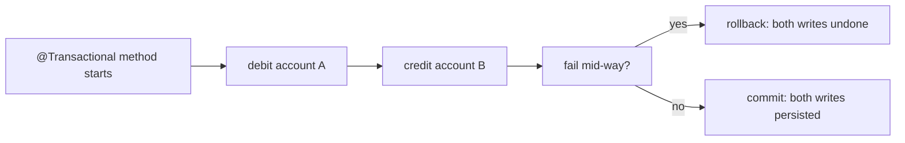
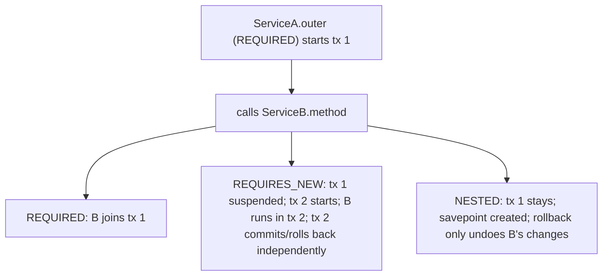

# Transactions with JPA

A transaction is the unit of atomicity: a set of operations that **either all happen or none**. In JPA, transactions delimit the **persistence context** (T05), control **when SQL flushes**, decide **what rolls back on failure**, set the **isolation level** that determines what concurrent transactions can see. Spring's `@Transactional` annotation is the production-grade declarative interface — wrap a method, and Spring's AOP advisor opens a transaction on entry, commits on success, rolls back on exception, all via the configured `PlatformTransactionManager`. Get the boundaries right (per logical business operation; not per query; not per HTTP request) and the system stays correct under concurrent load; get them wrong and you get lost updates, dirty reads, deadlocks, half-applied writes, or fully-correct-but-glacially-slow throughput.

A senior engineer treats transactions as **the first-class architectural primitive** they are. This topic covers Spring's `@Transactional` from the JPA angle: how it interacts with `EntityManager`, when commits flush, how rollback rolls back the persistence context plus the DB, the seven propagation modes, the four ANSI isolation levels, rollback rules (default `RuntimeException` rolls back; checked exceptions do not), self-invocation (the AOP trap from T05 of C01), programmatic `TransactionTemplate` for fine-grained control, transactional event listeners (`@TransactionalEventListener`), and JTA vs resource-local transactions (when multi-resource XA is needed, when avoiding it is wiser).

The depth-bar this topic clears: at the **language layer**, `@Transactional` with every attribute (`propagation`, `isolation`, `rollbackFor`, `noRollbackFor`, `readOnly`, `timeout`), `TransactionTemplate`, `@TransactionalEventListener`. At the **memory layer**, what Spring binds to the thread on transaction start (`EntityManagerHolder`, `ConnectionHolder`, `SynchronizationManager`) and how nested transactions reuse vs split it. At the **architecture layer** — the heart — **the transaction boundary as the unit of correctness** (one logical operation = one transaction), the four big bugs (long transactions blocking other writers, ACID-isolation-level mismatches, propagation surprises like REQUIRES_NEW deadlocking against its parent, lost updates from too-low isolation), and the **discipline** of `@Transactional` annotated on service methods (not repositories, not controllers) at exactly one layer.

> [!NOTE]
> Prerequisites: [Persistence context (T05)](./T05-persistence-context-and-entity-lifecycle.md), [Spring AOP (L4/C01/T05)](../C01-spring-framework/T05-spring-aop.md), DB transaction fundamentals (ACID).

## Why Transactions

A simple "transfer money" operation: debit account A, credit account B. Two SQL statements. If the first succeeds and the second fails (network hiccup, crash), account A is debited but B is not — money disappeared. The DB's transaction primitive makes the two atomic: both or neither.

JPA adds another dimension: the persistence context is also transactional. A `persist(user)` that doesn't commit doesn't make it to the DB. A flush followed by a rollback undoes the INSERT.



## `@Transactional` In Practice

```java
@Service
public class TransferService {

    private final AccountRepository accounts;
    public TransferService(AccountRepository accounts) { this.accounts = accounts; }

    @Transactional
    public void transfer(long fromId, long toId, BigDecimal amount) {
        Account from = accounts.findById(fromId).orElseThrow();
        Account to = accounts.findById(toId).orElseThrow();

        if (from.balance().compareTo(amount) < 0)
            throw new InsufficientFundsException();

        from.debit(amount);
        to.credit(amount);
        // dirty-tracked; UPDATE at commit
    }
}
```

What happens at runtime:

1. Caller invokes `transferService.transfer(...)`.
2. Spring's AOP advisor intercepts. Opens a JPA transaction; gets a `Connection` from the pool; sets autocommit off; starts a Hibernate `Session`; binds both to the thread.
3. `accounts.findById(...)` runs within the transaction; loads from DB; entities managed.
4. Mutations dirty-tracked.
5. Method returns normally.
6. Advisor calls `commit`: Hibernate flushes (UPDATE statements fire), connection commits, session closes, thread-local cleaned.

Or, on exception:

1. Throws `InsufficientFundsException` (a `RuntimeException`).
2. Advisor catches; calls `rollback`. DB rollback; session closes; entities discarded.

## The Transaction Manager

Spring abstracts the underlying transaction primitive via `PlatformTransactionManager`. Choices:

- **`JpaTransactionManager`** (default for Spring Boot JPA) — wraps a JPA `EntityManagerFactory`. Single-DB.
- **`DataSourceTransactionManager`** — wraps a `DataSource` directly. Used with JdbcTemplate; no JPA.
- **`JtaTransactionManager`** — JTA / XA. Multi-resource (DB + JMS + DB2). Requires a JTA provider (Atomikos, Narayana).

Spring Boot wires `JpaTransactionManager` automatically. The reason to switch: multi-resource transactions.

## Propagation — How Transactions Combine

`@Transactional(propagation = ...)` chooses behavior when a transactional method calls another:

| Propagation | If no tx active | If tx active |
|-------------|-----------------|--------------|
| `REQUIRED` (default) | start new | join existing |
| `REQUIRES_NEW` | start new | **suspend existing**, start new |
| `SUPPORTS` | run non-transactional | join |
| `NOT_SUPPORTED` | run non-transactional | suspend existing |
| `MANDATORY` | throw | join |
| `NEVER` | run non-transactional | throw |
| `NESTED` | start new | start savepoint (sub-transaction) |



### `REQUIRED` (Default)

Joins the existing transaction. If `transfer()` calls `audit()` and both are `@Transactional`, they share the transaction. A failure in either rolls back everything.

This is the right default.

### `REQUIRES_NEW`

Suspends the outer transaction, runs in its own, commits independently. Useful for audit logs / metrics that must persist *even if the outer transaction rolls back*:

```java
@Transactional
public void transfer(long fromId, long toId, BigDecimal amount) {
    // ... attempt transfer
    if (somethingFails) {
        auditService.logAttempt(fromId, toId, amount, false);  // REQUIRES_NEW; survives our rollback
        throw new TransferFailedException();
    }
    auditService.logAttempt(fromId, toId, amount, true);
}

@Service
public class AuditService {
    @Transactional(propagation = REQUIRES_NEW)
    public void logAttempt(long from, long to, BigDecimal amount, boolean success) { ... }
}
```

**Caveat — connection pool**: `REQUIRES_NEW` requires *two* connections simultaneously (the suspended outer + the new inner). On a tight pool, this deadlocks. Always allow capacity for the deepest REQUIRES_NEW stack.

### `NESTED`

A savepoint within the outer transaction. Roll back just the inner work; the outer continues.

```java
@Transactional
public Order placeOrderWithFallback(OrderRequest req) {
    try {
        return placeOrderWithPreferredPayment(req);   // NESTED
    } catch (PaymentDeclinedException e) {
        return placeOrderWithFallbackPayment(req);    // outer tx survives the rollback
    }
}

@Transactional(propagation = NESTED)
public Order placeOrderWithPreferredPayment(OrderRequest req) { ... }
```

NESTED requires DB support for savepoints (Postgres, MySQL, Oracle all do). JTA doesn't support NESTED.

### Self-Invocation

The classic AOP bug from L4/C01/T05:

```java
@Service
public class OrderService {

    public void placeMany(List<OrderRequest> reqs) {
        for (OrderRequest req : reqs) {
            this.place(req);   // ❌ direct call; @Transactional not applied
        }
    }

    @Transactional
    public Order place(OrderRequest req) { ... }
}
```

The proxy is in front of `OrderService`. `placeMany` is called through the proxy; the proxy sees a non-transactional method and doesn't open a tx. Inside `placeMany`, `this.place(req)` is a direct call on the target — bypasses the proxy. No transaction opens. **All `place` calls run without transactions.**

Fix: split into two beans, or use `AopContext.currentProxy()`, or refactor `placeMany` to delegate.

## Isolation Levels — What Concurrent Transactions See

ANSI SQL defines four levels:

| Level | Dirty Read | Non-Repeatable Read | Phantom Read |
|-------|:----------:|:-------------------:|:------------:|
| READ UNCOMMITTED | possible | possible | possible |
| READ COMMITTED | prevented | possible | possible |
| REPEATABLE READ | prevented | prevented | possible |
| SERIALIZABLE | prevented | prevented | prevented |

- **Dirty read**: see another tx's uncommitted data. Almost never desired.
- **Non-repeatable read**: same SELECT in same tx returns different rows.
- **Phantom read**: same SELECT returns a different *set* of rows (a row inserted concurrently appears).

Postgres defaults to READ COMMITTED. MySQL InnoDB defaults to REPEATABLE READ. Oracle defaults to READ COMMITTED.

```java
@Transactional(isolation = Isolation.REPEATABLE_READ)
public OrderReport monthlyReport() { ... }
```

Per-transaction override. **Use the DB default unless you have a specific concurrency need**:

- READ COMMITTED is fine for almost everything.
- REPEATABLE READ for reports needing snapshot consistency across queries.
- SERIALIZABLE for hard-correctness (financial, inventory) — at the cost of throughput.

Higher isolation = more locks / more transaction conflicts = lower throughput.

## Rollback Rules

Spring's default:

- **`RuntimeException` (including unchecked) and `Error`** → rollback.
- **Checked exceptions** → commit (yes, really; the inherited Java EE semantics).

Always confusing. Override:

```java
@Transactional(rollbackFor = {Exception.class, MyCheckedException.class})
public void doSomething() throws MyCheckedException { ... }

@Transactional(noRollbackFor = {NotFoundException.class})
public Foo find() throws NotFoundException { ... }
```

Most Spring teams ban checked exceptions entirely in service code; this whole problem then goes away.

## `@Transactional(readOnly = true)`

A hint Hibernate honors (T05):

- Skips dirty checking.
- Sets flush mode to MANUAL.
- May enable some DB optimizations.

Annotate every read-only service method. Smaller persistence-context overhead; clearer intent.

## Timeout

```java
@Transactional(timeout = 5)   // seconds
public void slowOp() { ... }
```

Spring asks the DB to abort the transaction after 5 s. The transaction throws; rolls back.

Defend against runaway queries. Pair with statement-level timeouts in your connection pool config.

## Programmatic Transactions — `TransactionTemplate`

For fine-grained control:

```java
@Service
public class CustomService {

    private final TransactionTemplate tx;
    public CustomService(PlatformTransactionManager tm) {
        this.tx = new TransactionTemplate(tm);
        this.tx.setPropagationBehavior(PROPAGATION_REQUIRES_NEW);
        this.tx.setIsolationLevel(ISOLATION_SERIALIZABLE);
    }

    public Result doSomething() {
        return tx.execute(status -> {
            // ... work
            if (someError) status.setRollbackOnly();
            return new Result();
        });
    }
}
```

Rarely needed; `@Transactional` covers 95% of cases. Use for: dynamic propagation, multiple commit points in one method, partial rollback via savepoints.

## Transactional Event Listeners

`@TransactionalEventListener` lets you react to events tied to transaction phases:

```java
@Component
public class OrderEventListener {

    @TransactionalEventListener(phase = AFTER_COMMIT)
    public void onOrderPlaced(OrderPlacedEvent e) {
        emailService.sendConfirmation(e.orderId());
        // runs ONLY if the publishing transaction committed
    }

    @TransactionalEventListener(phase = AFTER_ROLLBACK)
    public void onRollback(OrderPlacedEvent e) {
        metrics.incrementFailureCount();
    }
}

@Service
public class OrderService {
    private final ApplicationEventPublisher publisher;

    @Transactional
    public Order place(OrderRequest req) {
        Order o = orderRepo.save(new Order(req));
        publisher.publishEvent(new OrderPlacedEvent(o.getId()));
        // event fires AT COMMIT; the listener runs after DB write is durable
        return o;
    }
}
```

Phases: `BEFORE_COMMIT`, `AFTER_COMMIT` (default), `AFTER_ROLLBACK`, `AFTER_COMPLETION`.

**The right pattern for "send email after order placed"** — the email goes out only if the DB write succeeds. The alternative (sending inside the transaction) risks sending and then failing to commit; the user gets a confirmation for an order that doesn't exist.

## JTA / XA — When You Need It

Resource-local transactions (default) handle one resource — your JPA datasource. If your operation needs to atomically commit to *two* resources (DB + JMS broker; two DBs), you need JTA / XA.

```java
// JTA-enabled config
@Bean
public PlatformTransactionManager transactionManager(UserTransaction userTx) {
    return new JtaTransactionManager(userTx);
}
```

The XA two-phase commit (prepare; commit) coordinates resources. Real cost: ~3-10× slower than single-resource; complex failure modes (in-doubt transactions need recovery).

**The mature pattern in 2026 is to avoid XA**:

- For DB + Kafka: use **transactional outbox** (L4/C01/T22) — write to outbox table in the same DB tx; separate poller publishes to Kafka.
- For DB + another DB: usually a sign of a missing service boundary; consider event-based replication.
- For DB + email: send via transactional event listener at `AFTER_COMMIT`.

JTA is the right answer in some legacy / enterprise scenarios; in new code, design to avoid.

## Common Pitfalls

> [!WARNING]
> **Self-invocation.** `this.method()` bypasses the proxy; no transaction starts. Use the proxy or refactor.

> [!WARNING]
> **`@Transactional` on private methods.** Proxy can't intercept. Spring 5+ ignores silently.

> [!WARNING]
> **Long-running transactions.** Hold locks; block other writers. Keep transactions short; do I/O outside.

> [!WARNING]
> **`REQUIRES_NEW` exceeding pool capacity.** Two connections per call; deadlock under load. Size the pool.

> [!WARNING]
> **Checked exception thrown; transaction commits.** Default rollback is on `RuntimeException` only. Use `rollbackFor = Exception.class` or avoid checked.

> [!WARNING]
> **Read-only transaction missed.** Slower; bigger memory. Always annotate readers.

> [!WARNING]
> **Calling external services inside `@Transactional`.** Outbound HTTP for 5 s = 5 s of held DB connection + locks. Do I/O outside the tx.

> [!WARNING]
> **`AFTER_COMMIT` listener that itself opens a transaction.** Fine but separate tx; can fail independently. Make it idempotent.

> [!WARNING]
> **Transaction timeout shorter than statement timeout.** Statement runs forever; tx aborts. Set both consistently.

> [!WARNING]
> **JTA / XA "to be safe".** 3-10× perf hit. Use transactional outbox for cross-resource semantics.

## Practice

1. Build a `transfer` service with `@Transactional`. Throw mid-way; verify both writes roll back.
2. Add a `@Transactional(propagation = REQUIRES_NEW)` audit; verify it persists despite the outer rollback.
3. Demonstrate the self-invocation bug; fix three ways: extract method, AopContext.currentProxy, refactor caller.
4. Test isolation levels: two concurrent transactions reading + writing; observe the difference between READ COMMITTED and REPEATABLE READ.
5. Throw a checked exception; verify the default behavior commits; add `rollbackFor`; verify rollback.
6. Add `@TransactionalEventListener(phase = AFTER_COMMIT)`. Throw mid-method; verify the listener does not fire.
7. Set `@Transactional(timeout = 1)` on a 2-s operation; verify the timeout fires.
8. Try to scale REQUIRES_NEW under load; observe pool exhaustion; increase pool.

## Recap

You should now be able to:

- Annotate service methods (not repositories, not controllers) with `@Transactional`; keep boundaries at logical operations.
- Choose the right propagation: REQUIRED for default; REQUIRES_NEW for audit / metrics that must survive parent rollback; NESTED for savepoint semantics.
- Set isolation per-method only when needed; default to the DB's default (READ COMMITTED on Postgres).
- Use `rollbackFor` to ensure checked exceptions also roll back.
- Annotate read methods `readOnly = true` for the dirty-check skip.
- Use `TransactionTemplate` programmatically for fine-grained control.
- Use `@TransactionalEventListener(phase = AFTER_COMMIT)` for "do X only if commit succeeded" patterns.
- Reach for JTA only when truly needed; prefer transactional outbox.
- Recognize self-invocation; size pools for REQUIRES_NEW; avoid long-running transactions.
- Avoid the canonical pitfalls: checked-exception commits, I/O inside tx, runaway transactions, missing readOnly, JTA when outbox suffices.

## Next

Continue to [Optimistic vs pessimistic locking](./T13-optimistic-vs-pessimistic-locking.md) for the deep treatment of concurrent-update protection — `@Version` for optimistic; `@Lock(PESSIMISTIC_WRITE)` for explicit row locks; the trade-offs (retry vs block; throughput vs simplicity); and the patterns for high-write systems (account balances, inventory).
