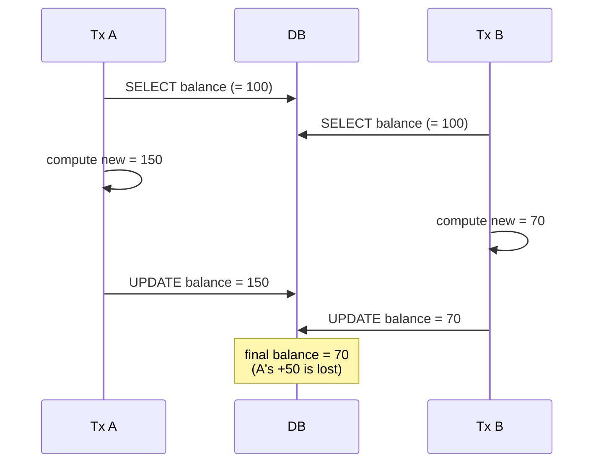
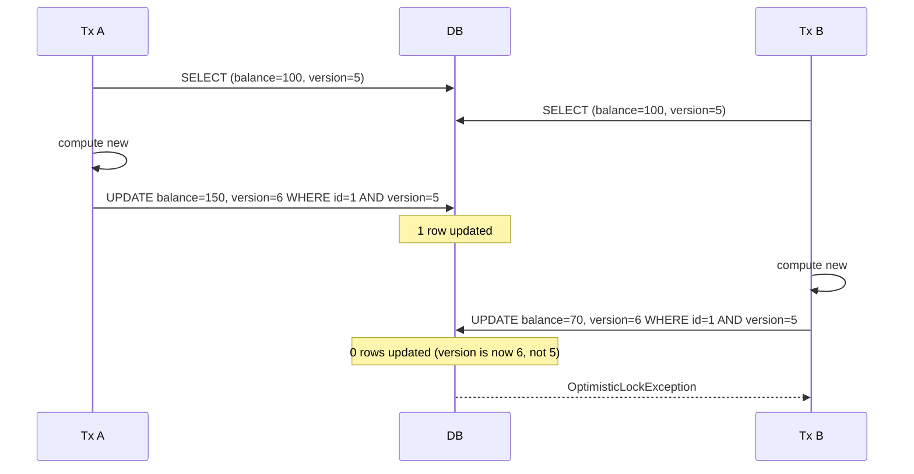
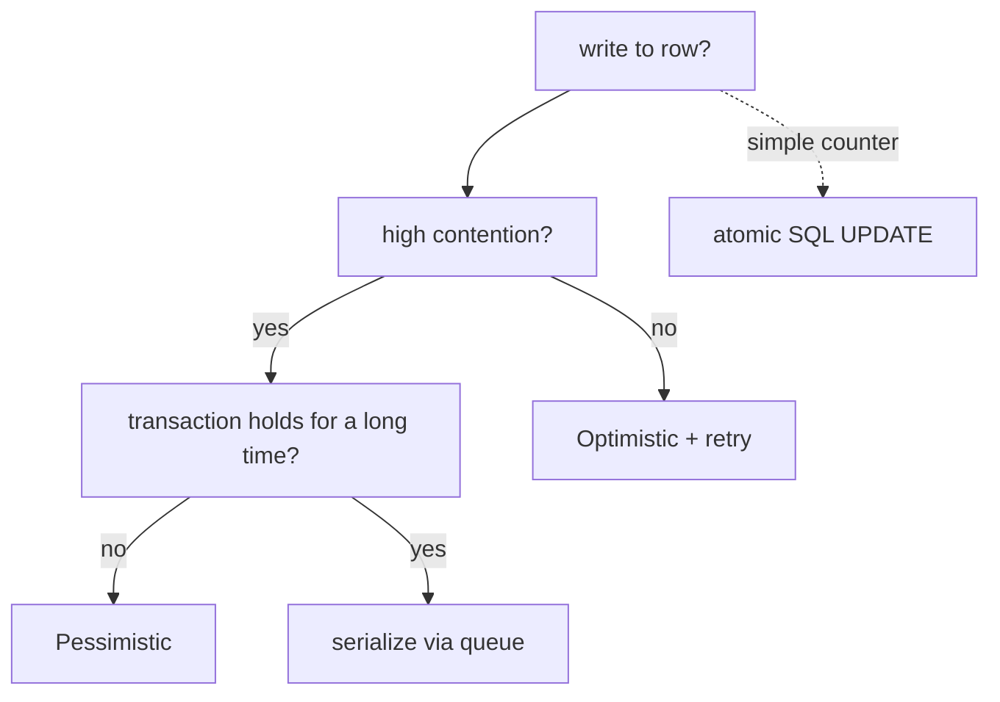

# Optimistic vs pessimistic locking

When two transactions try to update the same row concurrently, one of three things happens: (1) **lost update** — the second commit silently overwrites the first (bad); (2) **detected conflict** — one of them fails with an exception so the application can retry (optimistic); (3) **serialized access** — one waits while the other completes (pessimistic). The DB-level options (without help) range from "READ COMMITTED lets lost updates happen" to "SERIALIZABLE prevents them at huge cost." JPA's locking machinery sits between: **optimistic locking** via `@Version` (each row carries a version; UPDATE checks it matches; conflicts surface as `OptimisticLockException`) and **pessimistic locking** via `@Lock(PESSIMISTIC_WRITE)` (issues `SELECT ... FOR UPDATE`; other readers block until commit).

A senior engineer treats locking as a deliberate architectural choice per entity. **Optimistic is the right default for most domains** — no row-level locking; high concurrency; retry on the rare conflict. **Pessimistic is the answer for hot rows with frequent writes** — account balance, inventory quantity — where conflict rate is high enough that optimistic retries thrash. Mixing the two within an entity ("optimistic by default; pessimistic for inventory") is a common and correct pattern.

This topic covers: the lost-update problem and why naive ORM code suffers from it; `@Version` and how Hibernate's UPDATE statement includes the version check; the `OptimisticLockException` → application retry pattern; pessimistic lock modes (`READ`, `WRITE`, `FORCE_INCREMENT`) and how `@Lock` integrates with Spring Data; the SQL each generates (`SELECT ... FOR UPDATE`, `FOR SHARE`, dialect variants); deadlocks and timeouts; the ETag pattern using `@Version` for HTTP-level concurrency; and worked examples for the canonical "account transfer" and "inventory reservation" use cases.

The depth-bar this topic clears: at the **language layer**, the JPA `LockModeType` enum, `@Version`, `@Lock`, `EntityManager.lock()`. At the **memory layer**, the version-column overhead (8 B per row for `long`); the lock-acquisition cost (~1-2 ms for a contended `FOR UPDATE`; nothing for optimistic). At the **architecture layer** — the heart — **the decision matrix** (optimistic for most; pessimistic for hot rows), **the retry pattern** as part of the application contract, **the ETag bridge** between optimistic locking and HTTP, and the **avoidance of explicit locks where possible** (use idempotency, CAS, or message-based serialization instead — JPA locks are a tool of last resort for the genuinely-hot case).

> [!NOTE]
> Prerequisites: [Transactions (T12)](./T12-transactions-with-jpa.md), [Persistence context (T05)](./T05-persistence-context-and-entity-lifecycle.md), DB isolation level basics.

## The Lost Update Problem

```java
// Transaction A
Account a = repo.findById(1L).get();   // balance=100
a.setBalance(a.balance() + 50);         // local: 150

// meanwhile, Transaction B
Account a2 = repo.findById(1L).get();  // balance=100
a2.setBalance(a2.balance() - 30);       // local: 70

// A commits: UPDATE accounts SET balance = 150 WHERE id = 1
// B commits: UPDATE accounts SET balance = 70 WHERE id = 1
// Final: 70 (A's +50 is lost)
```

The DB issued two valid UPDATEs. Neither saw the other's pending change at SELECT time (READ COMMITTED). Result: a lost +50. **The most subtle and damaging concurrency bug in CRUD apps.**



## Optimistic Locking — `@Version`

The fix: add a version column. Every UPDATE checks the version matches what was loaded; mismatch → exception.

```java
@Entity
public class Account {
    @Id Long id;
    @Version int version;     // Hibernate manages this
    BigDecimal balance;
}
```

Now every UPDATE includes the version:

```sql
UPDATE accounts SET balance = ?, version = ? + 1 WHERE id = ? AND version = ?
```



The second transaction's UPDATE affects 0 rows; Hibernate throws `OptimisticLockException`. The application catches and retries.

### The Retry Pattern

```java
@Service
public class TransferService {

    @Retryable(retryFor = OptimisticLockException.class, maxAttempts = 3,
               backoff = @Backoff(delay = 50, multiplier = 2))
    @Transactional
    public void deposit(long accountId, BigDecimal amount) {
        Account a = repo.findById(accountId).orElseThrow();
        a.setBalance(a.balance().add(amount));
    }
}
```

Spring Retry (T19 of C01) handles the retry automatically. Each attempt is a *fresh transaction*; loads the latest version; applies the delta; commits.

**Critical**: the operation must be **idempotent given the current state** — applying `+50` is correct regardless of intermediate state. A `setBalance(150)` would *not* be — if B already changed it to 70, A's retry would set it to 150 again, losing B's change.

### Version Strategy

`@Version` supports:

- `int` / `long` / `Integer` / `Long` — incrementing counter.
- `Timestamp` / `Instant` — last-modified timestamp.

Integer is preferred — smaller column; no clock-drift issue.

### Optimistic Locking on Read-Only Queries

`@Lock(LockModeType.OPTIMISTIC)` on a read forces version check on flush:

```java
@Lock(LockModeType.OPTIMISTIC)
Optional<Account> findById(Long id);
```

Even if you don't mutate, Hibernate will verify on commit that the version hasn't changed. Useful for "verify nothing changed under me" patterns.

`OPTIMISTIC_FORCE_INCREMENT` bumps the version unconditionally — useful for triggering parent updates when only children changed.

## Pessimistic Locking — `@Lock(PESSIMISTIC_WRITE)`

For hot rows where conflicts are frequent:

```java
public interface AccountRepository extends JpaRepository<Account, Long> {
    @Lock(LockModeType.PESSIMISTIC_WRITE)
    Optional<Account> findById(Long id);
}
```

Hibernate issues:

```sql
SELECT * FROM accounts WHERE id = ? FOR UPDATE
```

The DB acquires a row-level write lock. Other transactions trying to read with `FOR UPDATE`, or write, **block** until this transaction commits. Plain SELECTs (no `FOR UPDATE`) still work (their isolation determines what they see).

```mermaid
sequenceDiagram
  participant A as Tx A
  participant DB as DB
  participant B as Tx B
  A->>DB: SELECT * FROM accounts WHERE id=1 FOR UPDATE
  Note over DB: row lock granted to A
  B->>DB: SELECT * FROM accounts WHERE id=1 FOR UPDATE
  Note over DB: B blocks
  A->>DB: UPDATE balance = ...
  A->>DB: COMMIT (releases lock)
  Note over DB: B unblocks; sees A's new balance
  B->>DB: UPDATE based on new balance
  B->>DB: COMMIT
```

Both transactions complete; no lost updates; no exception. Cost: B waited for A. Under high contention, average latency rises but throughput is bounded by lock-hold time.

### Lock Modes

| Mode | SQL | Effect |
|------|-----|--------|
| `PESSIMISTIC_READ` | `SELECT ... FOR SHARE` (Postgres) | other shared-readers OK; other writers block |
| `PESSIMISTIC_WRITE` | `SELECT ... FOR UPDATE` | exclusive; no readers/writers |
| `PESSIMISTIC_FORCE_INCREMENT` | + version bump | combines pessimistic + optimistic-version-bump |

`PESSIMISTIC_READ` is rarely needed — most apps want WRITE.

### Timeout

A pessimistic lock can block forever (in theory). Set a timeout:

```java
@Lock(LockModeType.PESSIMISTIC_WRITE)
@QueryHints({@QueryHint(name = "javax.persistence.lock.timeout", value = "5000")})  // 5s
Optional<Account> findByIdForUpdate(Long id);
```

After 5 s of waiting, throws `LockTimeoutException`. The application can retry or fail.

## Choosing — The Decision Matrix

| Scenario | Pick |
|----------|------|
| Low write contention (most entities) | **Optimistic** |
| Document edit, profile update | **Optimistic** + ETag (HTTP-level) |
| Hot row: account balance, inventory item | **Pessimistic** or queue-based |
| Counter increments (page views) | **Atomic SQL** (`UPDATE counter = counter + 1`) instead |
| Long-running edit session | **Optimistic** with explicit version on save |
| Batch job mutating a shared row | **Pessimistic** to avoid retry storms |



## Account Transfer Worked Example

Two accounts; debit one, credit the other. With optimistic:

```java
@Service
public class TransferService {

    @Retryable(retryFor = OptimisticLockException.class, maxAttempts = 3)
    @Transactional
    public void transfer(long fromId, long toId, BigDecimal amount) {
        Account from = repo.findById(fromId).orElseThrow();
        Account to = repo.findById(toId).orElseThrow();
        if (from.balance().compareTo(amount) < 0) throw new InsufficientFundsException();
        from.debit(amount);
        to.credit(amount);
    }
}
```

For a hot account where retries thrash (a corporate payroll account with 1000 concurrent transfers):

```java
@Transactional
public void transfer(long fromId, long toId, BigDecimal amount) {
    Account from = lockingRepo.findByIdForUpdate(fromId);   // PESSIMISTIC_WRITE
    Account to = lockingRepo.findByIdForUpdate(toId);
    // ... ordered to avoid deadlock
}
```

**Always acquire locks in a consistent order** (lower id first, say) to avoid deadlock.

## Deadlock

Two transactions, each holding a lock the other wants:

```
Tx A: SELECT * FROM accounts WHERE id=1 FOR UPDATE   (holds lock on 1)
Tx B: SELECT * FROM accounts WHERE id=2 FOR UPDATE   (holds lock on 2)
Tx A: SELECT * FROM accounts WHERE id=2 FOR UPDATE   (waits)
Tx B: SELECT * FROM accounts WHERE id=1 FOR UPDATE   (waits)
→ deadlock
```

The DB detects this and kills one transaction with a deadlock-detected error. The application catches and retries.

Avoidance: **always acquire locks in a consistent order** (e.g., lowest id first):

```java
long lowerId = Math.min(fromId, toId);
long higherId = Math.max(fromId, toId);
Account lower = lockingRepo.findByIdForUpdate(lowerId);
Account higher = lockingRepo.findByIdForUpdate(higherId);
```

Now both A and B grab id=1 first, then id=2; one waits cleanly; no deadlock.

## ETag — HTTP-Level Optimistic Locking

`@Version` plays directly into HTTP ETags for REST APIs:

```java
@GetMapping("/api/users/{id}")
public ResponseEntity<UserResponse> get(@PathVariable long id) {
    User u = userService.find(id);
    return ResponseEntity.ok()
        .eTag(String.valueOf(u.getVersion()))
        .body(UserResponse.of(u));
}

@PutMapping("/api/users/{id}")
public ResponseEntity<UserResponse> update(
        @PathVariable long id,
        @RequestHeader("If-Match") String ifMatch,
        @RequestBody UpdateUserRequest req) {
    User u = userService.find(id);
    if (!String.valueOf(u.getVersion()).equals(ifMatch.replace("\"", ""))) {
        return ResponseEntity.status(412).build();   // Precondition Failed
    }
    User updated = userService.update(id, req);
    return ResponseEntity.ok().eTag(String.valueOf(updated.getVersion())).body(UserResponse.of(updated));
}
```

The client GETs, edits, PUTs with `If-Match: "5"`. If another client updated in between, the version is no longer 5; the server responds 412; the client refreshes and retries. Same optimistic pattern, exposed at the HTTP layer.

## Alternatives To JPA Locks

For high-write hot rows, often **better than either JPA lock**:

### Atomic Counter UPDATE

```java
@Modifying
@Query("UPDATE Counter c SET c.value = c.value + ?1 WHERE c.id = ?2")
int incrementBy(long delta, long id);
```

Direct UPDATE; no SELECT; no version check; DB's row-level lock serializes. Cleanest for counters.

### CAS Loop

Read current value; compute new; UPDATE WHERE current = expected. Equivalent to optimistic with `@Version` but doesn't need the version column.

### Queue / Single-Writer

For inventory: every reservation goes through a queue; one worker per SKU processes serially. No DB-level concurrency; throughput bounded by single-worker speed, but no conflicts.

### Distributed Lock (Redis, ZooKeeper)

When the contention crosses DB boundaries. More complex; introduces a new system. Used for "exactly one process can do X" patterns.

## Common Pitfalls

> [!WARNING]
> **Forgetting `@Version` on a write-heavy entity.** Lost updates silently. The most damaging bug. Always have versions.

> [!WARNING]
> **Optimistic retry with non-idempotent business logic.** Retries amplify the bug. Use deltas / state-based updates.

> [!WARNING]
> **Pessimistic locks held during external I/O.** Block other transactions while waiting on an HTTP call. Lock briefly; release fast.

> [!WARNING]
> **Inconsistent lock ordering.** Deadlock. Always order by id (or some fixed sort).

> [!WARNING]
> **Long-running transactions with pessimistic locks.** Block others for the transaction's lifetime. Short transactions only.

> [!WARNING]
> **No retry on deadlock.** Application throws. Add Spring Retry on deadlock-related exceptions.

> [!WARNING]
> **Mixing `@Version` and pessimistic in confusing ways.** Decide per entity; document.

> [!WARNING]
> **ETag exposed but server-side version check skipped.** Client thinks it's safe; server overwrites anyway. Wire both.

> [!WARNING]
> **PESSIMISTIC on H2 / SQLite for tests.** Different semantics. Test against the production DB via Testcontainers.

## Practice

1. Build an `Account` with `@Version`. Concurrently update from two threads; verify one gets `OptimisticLockException`. Add `@Retryable` and verify both eventually succeed.
2. Build a hot row (inventory item with `qty`). Run 100 concurrent decrement-by-1 transactions; observe optimistic retry contention. Switch to `PESSIMISTIC_WRITE`; observe serialized but stable throughput.
3. Force a deadlock with two transactions acquiring two rows in opposite order. Confirm the deadlock-detection exception.
4. Implement the ETag pattern. Test with curl; verify 412 on stale `If-Match`.
5. Replace a counter `@Version` retry pattern with `UPDATE counter SET value = value + 1`. Measure throughput improvement.
6. Add lock-timeout hint; verify a `LockTimeoutException` after the configured wait.
7. Implement consistent lock ordering for a transfer; remove deadlocks.
8. Profile retry storm with optimistic on a hot row vs pessimistic. Decide where the threshold is.

## Recap

You should now be able to:

- Recognize the lost-update problem in any naive ORM update flow.
- Add `@Version` to write-prone entities; understand Hibernate's version check at UPDATE.
- Implement the retry pattern (Spring Retry) for `OptimisticLockException`; ensure idempotency.
- Use `@Lock(PESSIMISTIC_WRITE)` with Spring Data for hot rows; understand the `FOR UPDATE` SQL and the wait semantics.
- Choose between optimistic and pessimistic per entity / per use case: optimistic by default; pessimistic for hot rows; atomic SQL UPDATE for counters; queue for inventory.
- Avoid deadlocks via consistent lock ordering.
- Set lock timeouts to bound waits.
- Bridge optimistic locking to HTTP via ETag / If-Match.
- Avoid the canonical pitfalls: missing `@Version`, non-idempotent retries, I/O inside lock, inconsistent ordering, ETag without server check, testing on H2 with different semantics.

## Next

Continue to [Spring Data JPA repositories](./T14-spring-data-jpa-repositories.md) for the per-layer treatment of the repository pattern from the JPA angle — `JpaRepository`'s methods, custom repository fragments, projections, locking integration, and the modern idioms for Spring Data 3.x repositories.
