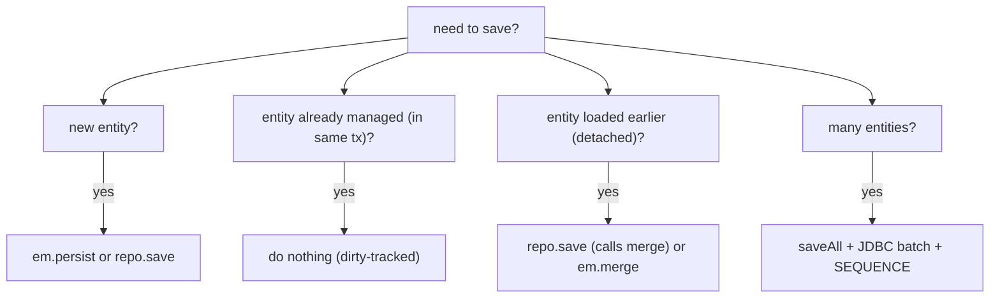

# Spring Data JPA repositories

L4/C01/T13 introduced Spring Data as a *cross-store* abstraction — repositories that work over JPA, Mongo, Redis, Cassandra, R2DBC. This topic focuses on **the JPA flavor specifically** — how `JpaRepository` is implemented (`SimpleJpaRepository` wrapping `EntityManager`), the JPA-specific extension methods (`flush`, `saveAndFlush`, `deleteInBatch`, `getReferenceById`), how Spring Data integrates with the locking (T13), caching (T11), `@EntityGraph` (T06), and Specifications (T08) machinery from the rest of C02. Most production Spring code touches `EntityManager` only indirectly through `JpaRepository`; understanding the *JPA-aware* surface is what separates "using the magic" from "knowing what the magic does."

This topic builds on L4/C01/T13 (the generic Spring Data treatment) — there we covered query derivation, `@Query`, projections, Specifications, custom fragments. Here we go deeper on the JPA pieces: the `JpaRepository` hierarchy and its extra methods; the `SimpleJpaRepository` implementation; saving (`save` vs `persist` vs `merge`); batch operations; `@EntityGraph` integration; locking integration; query hints; native-query specifics for JPA; the `JpaSpecificationExecutor` and `JpaSpecificationExecutorWithProjections`; the Spring Data 3.x modernizations.

The depth-bar this topic clears: at the **language layer**, every JPA-specific repository interface and method, the `@EntityGraph` / `@QueryHints` / `@Lock` annotations on repository methods, custom fragment composition. At the **memory layer**, how `SimpleJpaRepository` dispatches to `EntityManager` (one `@PersistenceContext` field; per-call dispatch); the per-method query parse + cache; the cost of `findAll(Specification)` vs derived methods (same — both compile to one SQL). At the **architecture layer** — the heart — **the repository as the *primary* JPA-touch boundary** (services use repos; rarely touch `EntityManager`), **the right division** between derived methods (simple), `@Query` JPQL (medium), Specifications / Querydsl (dynamic), `@PersistenceContext EntityManager` (custom), and how to compose all of them in one `Repository` interface.

> [!NOTE]
> Prerequisites: [Spring Data (L4/C01/T13)](../C01-spring-framework/T13-spring-data.md), [JPA fundamentals (T02)](./T02-jpa-fundamentals-entities-entitymanager.md), [Persistence context (T05)](./T05-persistence-context-and-entity-lifecycle.md), [JPQL & Criteria (T08)](./T08-jpql-and-criteria-api.md).

## The `JpaRepository` Hierarchy — JPA Extras

`JpaRepository<T, ID>` extends `PagingAndSortingRepository<T, ID>` (Spring Data common) and adds JPA-specific methods:

```java
public interface JpaRepository<T, ID> extends ListCrudRepository<T, ID>,
        ListPagingAndSortingRepository<T, ID>, QueryByExampleExecutor<T> {

    void flush();
    <S extends T> S saveAndFlush(S entity);
    <S extends T> List<S> saveAllAndFlush(Iterable<S> entities);

    void deleteAllInBatch(Iterable<T> entities);
    void deleteAllByIdInBatch(Iterable<ID> ids);
    void deleteAllInBatch();

    T getReferenceById(ID id);
    // (deprecated) T getOne(ID id);
}
```

Each JPA-only extra:

| Method | What it adds over `save`/`delete`/`findById` |
|--------|---------------------------------------------|
| `flush()` | force pending SQL to run now (without committing) |
| `saveAndFlush(e)` | save and immediately flush |
| `deleteAllInBatch(...)` | one bulk DELETE statement (vs per-row deletes); **bypasses cascade & listeners** |
| `getReferenceById(id)` | lazy proxy; no SELECT (T05) |

### `save` Internals

Spring Data's `SimpleJpaRepository.save(e)`:

```java
@Override
public <S extends T> S save(S entity) {
    if (entityInformation.isNew(entity)) {
        em.persist(entity);
        return entity;
    } else {
        return em.merge(entity);
    }
}
```

The decision: is the entity "new"? Default heuristic: id is null or `@Version` is null. Override `isNew` for custom logic via `Persistable<ID>` interface implementation:

```java
@Entity
public class User implements Persistable<Long> {
    @Id Long id;     // pre-assigned (e.g., UUID, business key)
    @Transient boolean isNew = true;
    @Override public boolean isNew() { return isNew; }
    @PostLoad @PostPersist void markNotNew() { isNew = false; }
}
```

Without this, an entity with a pre-assigned id would always go through `merge` (extra SELECT to check existence). For `IDENTITY`/`SEQUENCE` ids, the default heuristic works fine.

### `saveAll` and Batch Inserts

```java
List<User> saved = userRepo.saveAll(users);
```

`SimpleJpaRepository.saveAll(...)` loops over `save`. The performance comes from configuring JDBC batch inserts:

```yaml
spring:
  jpa:
    properties:
      hibernate:
        jdbc.batch_size: 50
        order_inserts: true
        order_updates: true
```

With `batch_size=50`, every 50 INSERTs are sent as one JDBC batch. **Combined with `SEQUENCE` generation + `allocationSize` (T02), this gives ~10–30× speedup** over `IDENTITY`-based one-at-a-time inserts.

Note: `IDENTITY` generation **disables batching** — Hibernate must round-trip per row to get the assigned id. `SEQUENCE` is the right choice for high-volume insert paths.

### `deleteAllInBatch` vs `deleteAll`

```java
userRepo.deleteAll(users);          // loads, fires PreRemove, fires DELETE per row
userRepo.deleteAllInBatch(users);    // one DELETE WHERE id IN (...)
```

`deleteAllInBatch` is **much faster** but:

- Does not invoke `@PreRemove` callbacks.
- Does not cascade.
- Persistence context not cleared; stale state possible.

Use for cleanup / bulk operations where callbacks aren't needed.

## `@EntityGraph` On Repository Methods

T06 introduced this; specifically for repositories:

```java
public interface OrderRepository extends JpaRepository<Order, Long> {

    @EntityGraph(attributePaths = {"customer", "items.product"})
    Optional<Order> findById(Long id);

    @EntityGraph(value = "Order.withCustomerAndItems", type = EntityGraph.EntityGraphType.LOAD)
    List<Order> findByStatus(OrderStatus status);
}
```

Override `findById` to add eager fetching for the detail endpoint. The list version uses a named entity graph defined on the entity.

`EntityGraphType.FETCH` (default): listed attributes are eager; others stay lazy.
`EntityGraphType.LOAD`: listed are eager; others use their default (which is often EAGER for `@ManyToOne` if you forgot to set LAZY).

## `@Lock` On Repository Methods

T13:

```java
public interface AccountRepository extends JpaRepository<Account, Long> {

    @Lock(LockModeType.PESSIMISTIC_WRITE)
    @QueryHints({@QueryHint(name = "javax.persistence.lock.timeout", value = "5000")})
    Optional<Account> findById(Long id);   // overrides; locks
}
```

Adding the lock per-method or per-query is the cleanest pattern.

## `@QueryHints`

Per-method hints:

```java
@QueryHints({
    @QueryHint(name = "org.hibernate.readOnly", value = "true"),
    @QueryHint(name = "org.hibernate.fetchSize", value = "1000"),
    @QueryHint(name = "org.hibernate.cacheable", value = "true"),
    @QueryHint(name = "org.hibernate.cacheRegion", value = "users.active")
})
@Query("SELECT u FROM User u WHERE u.active = true")
List<User> findActive();
```

Common hints: `readOnly` (T05 — skip dirty check), `fetchSize` (JDBC batch row fetch), `cacheable` + `cacheRegion` (T11 — query cache).

## `@Modifying` — Write Queries

T08:

```java
public interface UserRepository extends JpaRepository<User, Long> {

    @Modifying(clearAutomatically = true, flushAutomatically = true)
    @Query("UPDATE User u SET u.status = 'INACTIVE' WHERE u.lastLoginAt < :before")
    int deactivateStaleUsers(@Param("before") Instant before);

    @Modifying(clearAutomatically = true)
    @Query("DELETE FROM User u WHERE u.status = 'DELETED' AND u.deletedAt < :before")
    int purgeOldDeleted(@Param("before") Instant before);
}
```

`flushAutomatically = true` flushes pending changes before the update runs. `clearAutomatically = true` clears the persistence context after — important so subsequent reads don't see stale L1 cache.

Bulk DML bypasses cascade and listeners; this is by design but worth knowing.

## Specifications — `JpaSpecificationExecutor`

T08 covered Specifications. To use them, extend the executor:

```java
public interface OrderRepository extends JpaRepository<Order, Long>, JpaSpecificationExecutor<Order> { }

@Service
public class OrderSearchService {
    private final OrderRepository repo;

    public Page<Order> search(OrderSearchRequest req, Pageable pageable) {
        Specification<Order> spec = Specification.where(null);
        if (req.status() != null) spec = spec.and(OrderSpecs.status(req.status()));
        if (req.customerId() != null) spec = spec.and(OrderSpecs.customerId(req.customerId()));
        return repo.findAll(spec, pageable);
    }
}
```

`JpaSpecificationExecutor` adds:

- `findAll(Specification<T>)`
- `findOne(Specification<T>)`
- `findAll(Specification<T>, Pageable)`
- `findAll(Specification<T>, Sort)`
- `count(Specification<T>)`
- `exists(Specification<T>)`
- `delete(Specification<T>)`

## Custom Repository Fragments

T13 introduced; here's the JPA-aware version:

```java
public interface UserRepositoryCustom {
    List<UserStats> computeMonthlyStats(int year);
}

public class UserRepositoryImpl implements UserRepositoryCustom {

    @PersistenceContext
    EntityManager em;

    @Override
    public List<UserStats> computeMonthlyStats(int year) {
        return em.createNativeQuery("""
            SELECT extract(month from created_at), count(*)
            FROM users WHERE extract(year from created_at) = :year
            GROUP BY 1 ORDER BY 1
        """, "UserStatsMapping")
        .setParameter("year", year)
        .getResultList();
    }
}

public interface UserRepository extends JpaRepository<User, Long>, UserRepositoryCustom { }
```

The naming convention (`*Impl`) makes Spring auto-wire. The `Impl` class holds the `@PersistenceContext` and can drop to raw `EntityManager` for cases where the abstraction is too limiting.

Multiple fragments compose:

```java
public interface UserRepositoryCustom { /* method A */ }
public interface UserRepositoryReporting { /* method B */ }

public class UserRepositoryImpl implements UserRepositoryCustom { ... }
public class UserRepositoryReportingImpl implements UserRepositoryReporting { ... }

public interface UserRepository extends JpaRepository<User, Long>, UserRepositoryCustom, UserRepositoryReporting { }
```

Spring Data 2.0+ composes the fragments into the proxy.

## Projections — JPA Specifics

T13 covered projections generically. JPA flavors:

### Interface Projection

```java
public interface UserSummary {
    Long getId();
    String getName();
    String getEmail();
}

public interface UserRepository extends JpaRepository<User, Long> {
    List<UserSummary> findByActiveTrue();
}
```

Spring Data builds a proxy. Hibernate generates a SQL that selects only those columns — **smaller payload, no entity allocation, no L1 cache pollution**.

### Class Projection (DTO)

T08:

```java
@Query("SELECT new com.example.UserSummary(u.id, u.name, u.email) FROM User u WHERE u.active = true")
List<UserSummary> activeDto();
```

Constructor projection. The DTO needs a matching constructor.

### Dynamic Projection

```java
<T> List<T> findByActiveTrue(Class<T> projection);

List<UserSummary> summaries = repo.findByActiveTrue(UserSummary.class);
List<User> entities = repo.findByActiveTrue(User.class);
```

The same method, different return types based on the runtime class argument. Convenient for one-method-many-views patterns.

### Open Projection (SpEL)

```java
public interface UserDisplay {
    @Value("#{target.firstName + ' ' + target.lastName}")
    String getFullName();

    @Value("#{target.orders.size()}")
    int getOrderCount();
}
```

Uses SpEL (T06 of C01) to compute. **Caveat**: open projections fetch the *whole* entity, then evaluate SpEL — defeats the projection performance benefit. Use only when the computation is non-trivial.

## Native Queries On Spring Data JPA Repositories

T10 covered native queries. Repository-specific:

```java
@Query(value = "SELECT * FROM users WHERE active = true", nativeQuery = true)
List<User> findActiveNative();

@Query(value = "SELECT id, name FROM users WHERE active = true",
       countQuery = "SELECT count(*) FROM users WHERE active = true",
       nativeQuery = true)
Page<UserSummary> findActiveSummariesNative(Pageable pageable);
```

For paginated native queries, supply both `value` (data) and `countQuery` (count). Without `countQuery`, Spring tries to derive it by string manipulation; fails on non-trivial queries.

## Saving Strategies — When To Use What



`Repository.save(e)`:

- New entity (no id) → `em.persist` → INSERT at flush.
- Existing entity (has id; in current tx) → just dirty-track; UPDATE at flush. **`save` is unnecessary here** but harmless.
- Detached entity → `em.merge` → SELECT then UPDATE.

The "is it new" check costs a SELECT for entities with pre-assigned ids that aren't `Persistable`. Use `Persistable<ID>` interface to override.

## Worked Example — Full Repository

```java
public interface OrderRepository
        extends JpaRepository<Order, Long>,
                JpaSpecificationExecutor<Order>,
                QuerydslPredicateExecutor<Order>,
                OrderRepositoryCustom {

    // simple derived
    Optional<Order> findByExternalId(String externalId);

    // pagination + eager fetch
    @EntityGraph(attributePaths = {"customer"})
    Page<Order> findByStatus(OrderStatus status, Pageable pageable);

    // JPQL with hints
    @QueryHints(@QueryHint(name = "org.hibernate.readOnly", value = "true"))
    @Query("""
        SELECT new com.example.OrderSummary(o.id, c.name, o.status, o.total)
        FROM Order o JOIN o.customer c
        WHERE o.status = :status
    """)
    Page<OrderSummary> summaries(@Param("status") OrderStatus status, Pageable pageable);

    // locking
    @Lock(LockModeType.PESSIMISTIC_WRITE)
    Optional<Order> findByIdForUpdate(Long id);

    // bulk DML
    @Modifying(clearAutomatically = true)
    @Query("UPDATE Order o SET o.status = 'ARCHIVED' WHERE o.createdAt < :before")
    int archiveOldOrders(@Param("before") Instant before);

    // native for complex SQL
    @Query(value = """
        SELECT customer_id, COUNT(*) AS order_count, SUM(total) AS total_revenue
        FROM orders WHERE created_at >= :since
        GROUP BY customer_id
        ORDER BY total_revenue DESC
        LIMIT :limit
    """, nativeQuery = true)
    List<Object[]> topCustomers(@Param("since") Instant since, @Param("limit") int limit);
}

public interface OrderRepositoryCustom {
    Map<OrderStatus, Long> countByStatus();
}

public class OrderRepositoryImpl implements OrderRepositoryCustom {
    @PersistenceContext EntityManager em;

    @Override
    public Map<OrderStatus, Long> countByStatus() {
        return em.createQuery("SELECT o.status, COUNT(o) FROM Order o GROUP BY o.status", Object[].class)
            .getResultList().stream()
            .collect(toMap(r -> (OrderStatus) r[0], r -> (Long) r[1]));
    }
}
```

One repository, one entity, every Spring Data + JPA + Querydsl + native + locking + custom-fragment idiom composed cleanly.

## Common Pitfalls

> [!WARNING]
> **`save(managed)` when not needed.** `repo.save(managed)` runs merge — extra work. Just mutate; dirty-tracked.

> [!WARNING]
> **`deleteAllInBatch` skips lifecycle callbacks.** Audit / cascade silently skipped. Be deliberate.

> [!WARNING]
> **Open projection fetching everything.** Defeats projection benefit. Use constructor or interface (closed) projections.

> [!WARNING]
> **`@Modifying` without `clearAutomatically`.** Stale L1 cache. Add it.

> [!WARNING]
> **Paginated native query without `countQuery`.** Spring's auto-derivation fails on complex queries. Supply count.

> [!WARNING]
> **Custom fragment `Impl` not on the classpath.** Spring silently doesn't compose. Verify the naming convention.

> [!WARNING]
> **Specifications used for trivial static queries.** Verbose for no benefit. Use derived methods or `@Query`.

> [!WARNING]
> **`Pageable` + derived method with JOIN FETCH.** The collection-fetch + LIMIT semantics break; Hibernate warns. Use two-query pattern.

## Practice

1. Build a full `OrderRepository` combining derived methods, `@Query` JPQL, Specifications, Querydsl, custom fragment, native query. Use in a service.
2. Profile `save` vs direct mutation: confirm direct mutation requires no `save` call (dirty tracking handles it).
3. Use `saveAll` for 10K entities; profile with and without `batch_size`; observe ~20× speedup.
4. Convert one query to use `@EntityGraph` for eager loading; verify single SQL.
5. Implement a custom repository fragment with `EntityManager`; verify composition.
6. Use `@Lock(PESSIMISTIC_WRITE)` on a repository method; test under concurrent load.
7. Compare interface projection vs constructor projection vs open projection vs full entity. Profile memory.
8. Override `isNew` via `Persistable` for an entity with pre-assigned UUID id; verify no SELECT-then-merge overhead.

## Recap

You should now be able to:

- Use `JpaRepository`'s JPA-specific methods (`flush`, `saveAndFlush`, `getReferenceById`, `deleteAllInBatch`).
- Understand `SimpleJpaRepository.save`'s persist-vs-merge logic; override via `Persistable<ID>` for pre-assigned ids.
- Configure JDBC batch inserts globally and use `saveAll` for high-volume writes.
- Use `deleteAllInBatch` deliberately; understand its bypass of cascade and lifecycle.
- Combine `@EntityGraph`, `@Lock`, `@QueryHints`, `@Modifying` on repository methods.
- Use Specifications via `JpaSpecificationExecutor` and Querydsl via `QuerydslPredicateExecutor`.
- Compose custom repository fragments for `EntityManager`-touching code.
- Choose projections per use case: interface (cheap, common), constructor (explicit), dynamic (multi-view), open (computed but careful).
- Use native queries via repositories with `countQuery` for pagination.
- Avoid the canonical pitfalls: redundant `save`, `deleteAllInBatch` bypassing callbacks, open projection performance, missing `clearAutomatically`, paginated native without count.

## Next

Continue to [Projections & DTO mapping](./T15-projections-and-dto-mapping.md) for the deep treatment of mapping entities to API DTOs — the discipline that ends the persistence-layer leakage from T05, the mapper libraries (MapStruct, manual, ModelMapper), and the per-endpoint projection patterns.
