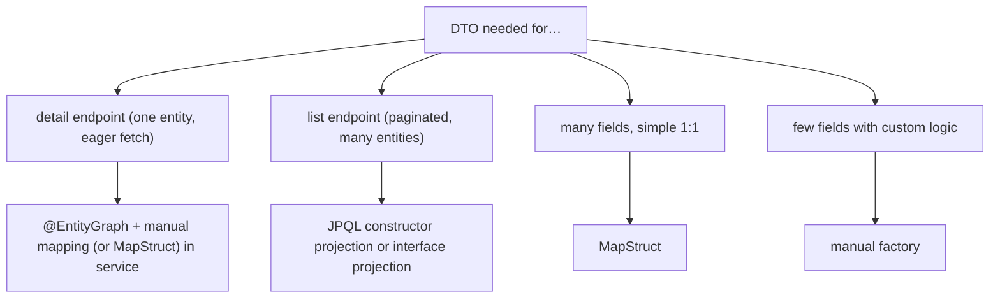

# Projections & DTO mapping

T05 established the discipline: **entities never cross the service-controller boundary**. The service returns **DTOs** (data transfer objects — pure data records). The controller serializes them. This avoids `LazyInitializationException`, decouples API contract from schema, prevents N+1 from Jackson serialization, and keeps the persistence concerns inside the persistence layer. The question of *how to map entity to DTO* is the topic of this chapter.

Three approaches: **manual mapping** (a static factory method on the DTO, fully under your control), **MapStruct** (compile-time annotation processor that generates the mapping code), and **JPA-level projections** (the entity never materialized; DTO loaded directly via JPQL constructor expression or interface projection — covered in T14 and elsewhere). Each is right for different scenarios. Manual is great when the mapping is non-trivial (computed fields, conditional logic). MapStruct is great for big DTOs with many fields. JPA projections are great when you can avoid loading the full entity.

The depth-bar this topic clears: at the **language layer**, the three mapping styles with concrete examples; MapStruct's annotation surface; manual mapper patterns. At the **memory layer**, the cost of each — manual is the cheapest (one method call); MapStruct generates the same code at compile time (cheap); ModelMapper uses reflection (slow); JPA projections avoid entity allocation entirely (cheapest). At the **architecture layer** — the heart — **the discipline of one DTO per response shape** (not per entity; different endpoints have different shapes), **the right tool per case** (manual for small / computed; MapStruct for big / repetitive; JPA projection when you can avoid the entity entirely), and **the connection to N+1** (mapping inside `@Transactional` is mandatory; mapping touches lazy fields).

> [!NOTE]
> Prerequisites: [Spring Data JPA repositories (T14)](./T14-spring-data-jpa-repositories.md), [Persistence context (T05)](./T05-persistence-context-and-entity-lifecycle.md), [Lazy vs eager (T06)](./T06-lazy-vs-eager-loading.md).

## Why DTOs

Three reasons, recap from T05:

1. **No lazy proxies cross the layer boundary.** Detached entities at the controller cause `LazyInitializationException`.
2. **API contract decoupled from schema.** Rename a column without breaking the JSON.
3. **No N+1 from JSON serialization.** Jackson on an entity touches every getter; lazy fields fire SELECTs.

A DTO is *plain data*. Java records make this idiomatic:

```java
public record UserResponse(Long id, String name, String email, String fullName) { }
public record OrderResponse(Long id, String customerName, OrderStatus status, BigDecimal total) { }
public record OrderDetailResponse(Long id, CustomerResponse customer, List<OrderItemResponse> items, BigDecimal total) { }
```

Different endpoints → different DTOs. Don't share one "User" DTO across 10 endpoints — the differences accumulate as nullable fields and conditional logic.

## Manual Mapping — The Baseline

```java
public record UserResponse(Long id, String name, String email) {
    public static UserResponse of(User u) {
        return new UserResponse(u.getId(), u.getName(), u.getEmail());
    }
}

@Service
public class UserService {
    @Transactional(readOnly = true)
    public UserResponse load(long id) {
        return UserResponse.of(userRepo.findById(id).orElseThrow());
    }
}
```

Pros: explicit, fully under control, easy to debug, no extra dependency, easy to handle computed fields:

```java
public record UserResponse(Long id, String fullName, String avatarUrl) {
    public static UserResponse of(User u) {
        return new UserResponse(
            u.getId(),
            u.getFirstName() + " " + u.getLastName(),
            "https://cdn.example.com/avatars/" + u.getId() + ".jpg"
        );
    }
}
```

Cons: writing 30 lines of `new XResponse(e.getX(), e.getY(), ...)` for a 30-field DTO is tedious; subject to typos; refactoring a field requires updating both entity and mapper.

**Recommendation**: manual mapping for ≤ 10 fields per DTO; switch to MapStruct beyond.

## MapStruct — Compile-Time Generated

```xml
<dependency>
    <groupId>org.mapstruct</groupId>
    <artifactId>mapstruct</artifactId>
    <version>1.5.5.Final</version>
</dependency>
<plugin>
    <groupId>org.apache.maven.plugins</groupId>
    <artifactId>maven-compiler-plugin</artifactId>
    <configuration>
        <annotationProcessorPaths>
            <path>
                <groupId>org.mapstruct</groupId>
                <artifactId>mapstruct-processor</artifactId>
                <version>1.5.5.Final</version>
            </path>
            <path>  <!-- if using Lombok -->
                <groupId>org.projectlombok</groupId>
                <artifactId>lombok-mapstruct-binding</artifactId>
                <version>0.2.0</version>
            </path>
        </annotationProcessorPaths>
    </configuration>
</plugin>
```

Define a mapper interface:

```java
@Mapper(componentModel = "spring")
public interface UserMapper {
    UserResponse toResponse(User u);
    List<UserResponse> toResponses(List<User> users);
}
```

MapStruct generates the implementation at compile time:

```java
// generated: UserMapperImpl.java
@Component
public class UserMapperImpl implements UserMapper {
    @Override
    public UserResponse toResponse(User u) {
        if (u == null) return null;
        return new UserResponse(u.getId(), u.getName(), u.getEmail());
    }
    // ...
}
```

The generated code is the same as manual but written for you. Compile-time = no runtime reflection cost.

### Custom Mapping Rules

```java
@Mapper(componentModel = "spring")
public interface OrderMapper {

    @Mapping(target = "customerName", source = "customer.name")
    @Mapping(target = "itemCount", expression = "java(o.getItems().size())")
    @Mapping(target = "createdAt", source = "createdAt", dateFormat = "yyyy-MM-dd HH:mm:ss")
    OrderResponse toResponse(Order o);

    @Mapping(target = "id", ignore = true)   // skip when mapping a new entity from request
    Order toEntity(CreateOrderRequest req);
}
```

Various `@Mapping` capabilities:

- `source` — path inside the source entity.
- `target` — DTO field name (defaults to matching).
- `expression` — Java expression (`"java(...)"`).
- `defaultValue` / `defaultExpression`.
- `ignore = true`.
- `qualifiedByName` — call a custom method.

### Nested Mappings

```java
@Mapper(componentModel = "spring", uses = {CustomerMapper.class, OrderItemMapper.class})
public interface OrderMapper {
    OrderDetailResponse toDetail(Order o);
}
```

MapStruct discovers nested mappers from `uses`; it'll call `customerMapper.toResponse(o.getCustomer())` automatically.

### Lifecycle Hooks

```java
@AfterMapping
default void enrich(@MappingTarget OrderResponse.Builder b, Order o) {
    if (o.getStatus() == OrderStatus.CANCELLED) {
        b.cancellationReason(o.getCancellationReason());
    }
}
```

For post-processing after the standard fields are mapped.

### Spring Integration

`componentModel = "spring"` makes the generated mapper a Spring `@Component`. Inject like any other bean:

```java
@Service
public class OrderService {
    private final OrderRepository repo;
    private final OrderMapper mapper;
    public OrderService(OrderRepository repo, OrderMapper mapper) {
        this.repo = repo;
        this.mapper = mapper;
    }
    @Transactional(readOnly = true)
    public OrderResponse load(long id) {
        return mapper.toResponse(repo.findById(id).orElseThrow());
    }
}
```

## ModelMapper — Avoid

`ModelMapper` does it at runtime via reflection. Slower; less debuggable; more "magic". Not recommended for new code; MapStruct is the modern winner.

## JPA-Level Projections — Skip The Entity

T08 / T14: when you don't need the entity at all, project directly into the DTO:

```java
@Query("""
    SELECT new com.example.OrderResponse(o.id, c.name, o.status, o.total)
    FROM Order o JOIN o.customer c
    WHERE o.status = ?1
""")
List<OrderResponse> findResponsesByStatus(OrderStatus status);
```

The SELECT pulls only the four columns; no entity hydration; no L1 cache; no lazy proxies. Fastest possible path. **Use this for list endpoints.**

Or interface projection (T13):

```java
public interface OrderSummary {
    Long getId();
    String getCustomerName();
    OrderStatus getStatus();
    BigDecimal getTotal();
}

List<OrderSummary> findByStatus(OrderStatus status);
```

Same performance; cleaner repository.

## The Right Mix



| Scenario | Tool |
|----------|------|
| Detail endpoint, ≤10 fields, simple mapping | Manual factory |
| Detail endpoint, 30+ fields | MapStruct |
| List endpoint, performance critical | JPA projection (JPQL `new` or interface) |
| Bulk export, computed fields | JPA projection + Streams |
| Request body → entity | MapStruct (one method) or manual |
| Polymorphic (multiple entity types → one DTO) | Manual or MapStruct with `@SubclassMapping` |

## Mapping Inside `@Transactional`

T05's lesson: always map inside the transaction:

```java
@Service
public class UserService {

    @Transactional(readOnly = true)
    public UserDetailResponse loadDetail(long id) {
        User u = userRepo.findById(id).orElseThrow();
        // map here; lazy collections initialize while tx is active
        return new UserDetailResponse(
            u.getId(), u.getName(),
            u.getOrders().stream().map(OrderResponse::of).toList(),
            u.getProfile().getBio()
        );
    }
}

@RestController
public class UserController {
    @GetMapping("/api/users/{id}")
    public UserDetailResponse get(@PathVariable long id) {
        return userService.loadDetail(id);   // DTO; no lazy fields
    }
}
```

The DTO crosses the boundary. The controller has no JPA exposure.

## Worked Example — Order Endpoints

```java
// === DTOs ===
public record OrderSummary(Long id, String customerName, OrderStatus status, BigDecimal total) { }
public record OrderDetailResponse(Long id, CustomerResponse customer, List<OrderItemResponse> items, BigDecimal total) { }
public record CustomerResponse(Long id, String name, String email) { }
public record OrderItemResponse(Long id, String productName, int quantity, BigDecimal unitPrice) { }
public record CreateOrderRequest(long customerId, List<CreateOrderItemRequest> items) { }

// === Mapper for detail (MapStruct) ===
@Mapper(componentModel = "spring")
public interface OrderMapper {
    OrderDetailResponse toDetail(Order o);
    CustomerResponse toCustomer(Customer c);
    @Mapping(target = "productName", source = "product.name")
    OrderItemResponse toItem(OrderItem i);
}

// === Repository ===
public interface OrderRepository extends JpaRepository<Order, Long> {

    // list: JPA projection — fastest
    @Query("""
        SELECT new com.example.OrderSummary(o.id, c.name, o.status, o.total)
        FROM Order o JOIN o.customer c
        WHERE o.status = :status
    """)
    Page<OrderSummary> summariesByStatus(@Param("status") OrderStatus status, Pageable pageable);

    // detail: load + map via MapStruct
    @EntityGraph(attributePaths = {"customer", "items.product"})
    Optional<Order> findDetailById(long id);
}

// === Service ===
@Service
public class OrderService {
    private final OrderRepository repo;
    private final OrderMapper mapper;

    public OrderService(OrderRepository repo, OrderMapper mapper) {
        this.repo = repo;
        this.mapper = mapper;
    }

    @Transactional(readOnly = true)
    public Page<OrderSummary> list(OrderStatus status, Pageable pageable) {
        return repo.summariesByStatus(status, pageable);   // no mapping needed
    }

    @Transactional(readOnly = true)
    public OrderDetailResponse loadDetail(long id) {
        Order o = repo.findDetailById(id).orElseThrow();
        return mapper.toDetail(o);                          // MapStruct
    }
}
```

Each endpoint uses the right tool: list uses JPA projection (fastest); detail uses entity + MapStruct (clean for the rich shape). Both inside `@Transactional`.

## Common Pitfalls

> [!WARNING]
> **Returning entities from controllers.** Lazy proxies + Jackson = N+1 + LazyInitException. Always DTOs.

> [!WARNING]
> **Mapping outside `@Transactional`.** Lazy fields trigger; session is closed; exception. Map inside.

> [!WARNING]
> **Sharing one big DTO across endpoints.** Accumulates nullable fields and conditional fields. One DTO per response shape.

> [!WARNING]
> **MapStruct without annotation processor configured.** No generated `Impl`. Mapper bean missing at runtime.

> [!WARNING]
> **MapStruct + Lombok without `lombok-mapstruct-binding`.** Generated mapper sees Lombok-generated methods but the binding is needed for correct ordering.

> [!WARNING]
> **ModelMapper for performance-critical paths.** Reflection cost. Use MapStruct.

> [!WARNING]
> **Manual mapper that lazy-loads N+1 inside.** Forgot to JOIN FETCH in the query.

> [!WARNING]
> **`@Mapping(expression = "java(...)")` with complex logic.** Hard to read; hard to test. Extract a helper method and call via `qualifiedByName`.

## Practice

1. Set up MapStruct. Define a mapper for an entity with 10+ fields; verify generated code; compare to manual mapping.
2. Map a JPQL constructor projection vs a MapStruct mapping for the same DTO. Compare emitted SQL and DTO instance allocation.
3. Use MapStruct's nested-mapper `uses` for a 2-level entity graph. Verify clean composition.
4. Profile manual vs MapStruct vs ModelMapper for the same mapping. Confirm the order: ModelMapper << manual ≈ MapStruct.
5. Build a DTO with computed fields (full name, age from birthdate); implement once via `@Mapping(expression)` and once as a default method on the mapper interface. Decide which reads cleaner.
6. Map a polymorphic entity (Payment with subtypes) to a sealed-record DTO. Use `@SubclassMapping`.
7. Move mapping outside `@Transactional` deliberately; verify the lazy-init exception. Move back inside; verify resolution.
8. For one list endpoint, use a JPA projection; for the equivalent detail, use entity + MapStruct. Justify the split.

## Recap

You should now be able to:

- Articulate why DTOs cross the layer boundary (no lazy proxies; decoupled contract; no N+1 from Jackson).
- Write manual factory methods for simple DTOs (≤ 10 fields).
- Use MapStruct for larger DTOs with `@Mapper`, `@Mapping`, nested `uses`, `@AfterMapping`, Spring component model.
- Use JPA constructor projection or interface projection when the entity isn't needed at all — fastest path.
- Choose between the three strategies per endpoint based on shape and performance needs.
- Always map inside `@Transactional` so lazy fields are loadable.
- Avoid the canonical pitfalls: entities at the controller, shared DTOs, ModelMapper for hot paths, missing MapStruct annotation processor, mapping outside transactions.

## Next

Continue to [Auditing](./T16-auditing.md) — the last C02 topic — for the deep treatment of audit fields (created/modified timestamps, user attribution), Spring Data JPA Auditing, `AuditorAware`, soft-delete patterns, and the audit log itself as a separate concern.
