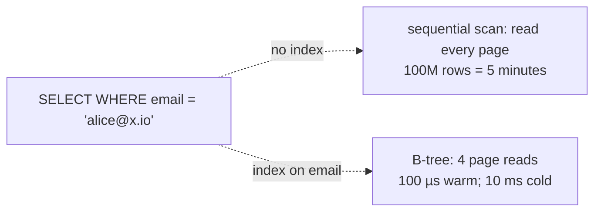
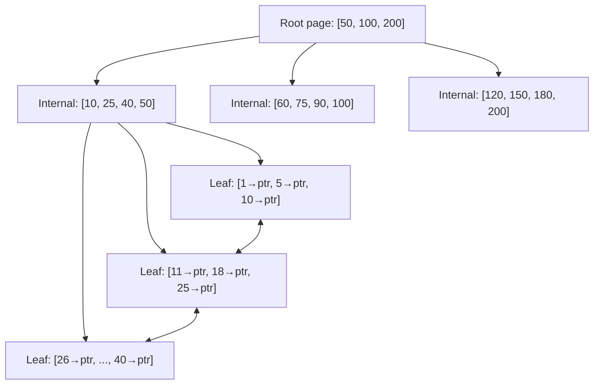
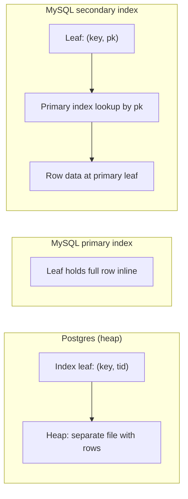
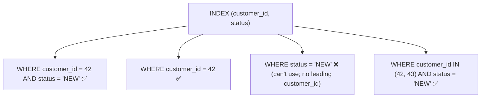
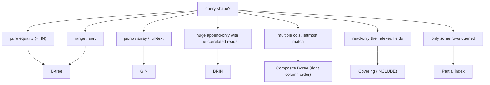

# Indexing & index types

A query without an index does a **sequential scan**: read every row in the table, compare each to the WHERE predicate, discard non-matches. For a 100-row table this is fine; for a 100-million-row table it's catastrophic (gigabytes scanned, seconds per query). **Indexes** are auxiliary data structures the DB engine maintains alongside the table — sorted, balanced, or hashed structures that let the engine jump straight to the rows matching a predicate in `O(log N)` (B-tree) or `O(1)` (hash) instead of `O(N)`. They are the single most important DB performance feature and the most frequently mis-applied: too few and queries are slow; too many and writes become slow (each INSERT/UPDATE touches every index); the wrong type and the optimizer ignores them; without the right column order they're useless for some queries.

This is the first topic in C03 *Databases — Advanced* — a section that drops below the ORM layer of C02. Even with the cleanest JPA mapping and the most carefully avoided N+1, the DB still has to find rows. A senior engineer reasons in indexes: every WHERE / JOIN ON / ORDER BY / GROUP BY clause is a hint about an index that would speed it up; every "this query is slow" investigation starts with `EXPLAIN` (T02). Picking the right indexes — and *only* the right indexes — is the discipline.

This topic covers the **index types** every Postgres / MySQL / Oracle / SQL Server engine ships: **B-tree** (the universal default), **hash** (equality-only), **GIN** (inverted index for arrays / jsonb / full-text), **GiST / SP-GiST** (geometry, full-text variants), **BRIN** (block-range for huge sequential data). It also covers **composite indexes** (multiple columns, leftmost-prefix rule), **covering indexes** (include columns to enable index-only scans), **partial indexes** (`WHERE` clause indexing only a subset of rows), **expression indexes** (index `lower(email)` to speed case-insensitive queries), **unique indexes**, and the **operational** concerns: index bloat, online index builds (`CREATE INDEX CONCURRENTLY`), the write-amplification cost of indexes on hot tables.

The depth-bar this topic clears: at the **language layer**, the SQL DDL for every index variant in Postgres and MySQL. At the **memory layer**, what a B-tree looks like on disk — fixed-size pages (typically 8 KB on Postgres, 16 KB on InnoDB), each holding ~100 keys + pointers; a 100-million-row B-tree has ~4 levels (root → 2 internal → leaf); each lookup is 3–4 page reads; with the inner pages cached, equality lookups are ~100 µs. At the **architecture layer** — the heart — **which index type fits which query** (B-tree for equality + range; GIN for arrays / jsonb / full-text; BRIN for huge append-only tables), **the leftmost-prefix rule** that defines which composite index a query can use, the **index-only scan** that's the fastest possible read (no table access), the **write cost** of indexes (every INSERT writes ~N+1 pages on a table with N indexes), and the **bloat-vacuum** dynamics that turn well-tuned indexes into dead weight if maintenance is skipped.

> [!NOTE]
> Prerequisites: SQL fundamentals (SELECT/INSERT/UPDATE/DELETE). The conceptual model of pages and rows. No JPA / Spring required for this topic.

## Why Indexes — The Sequential-Scan Cost

```sql
SELECT * FROM users WHERE email = 'alice@example.com';
```

Without an index, the engine reads every page of the `users` table from disk, scans every row, compares `email`, returns matches. For 100 M rows (~20 GB on disk), this is ~5 minutes of disk I/O even on fast SSDs.

With a B-tree index on `email`:

```sql
CREATE INDEX idx_users_email ON users(email);
```

The engine reads ~4 index pages (root → 2 internal → leaf), finds the row's table location (the row id / heap tuple id), reads ~1 table page, returns the row. ~4 page reads = ~100 µs from memory; ~10 ms cold.



That's 6 orders of magnitude. The performance of a non-trivial DB application is dominated by indexing decisions.

## The B-Tree — The Universal Index

The B-tree (more precisely, B+ tree in modern engines) is the default for every column index in every relational DB. Structure:



Key properties:

- **Fixed-size pages** (8 KB Postgres / 16 KB InnoDB). Each page holds ~100 keys + child pointers.
- **Balanced tree**: every leaf at the same depth. For a 100 M-row table, depth ~3–4.
- **Leaves linked**: each leaf points to the next, enabling fast range scans.
- **Sorted**: keys in each page sorted; whole tree sorted by key.

What's stored at the leaf:

- **Postgres** (heap-organized table): leaf holds key + **heap tuple id** (block + row number). The actual row is in a separate heap file; index lookup → one extra heap read.
- **MySQL InnoDB** (clustered table): leaf of the *primary key* index holds the full row data inline. Secondary index leaves hold key + PK, then look up the row via the PK index. Two-step for secondary index reads.



InnoDB's clustered table means PK reads are very fast (single index lookup); secondary reads cost two index traversals.

### B-Tree Lookup Cost

| Operation | Cost |
|-----------|------|
| Equality (`=`) | O(log N) — 3-4 page reads for 100M rows |
| Range (`>`, `<`, `BETWEEN`) | O(log N) to find start; O(matching) to scan |
| Sorted retrieval (`ORDER BY`) | free if matches index order |
| `IN (1, 2, 3, ...)` | one B-tree lookup per element |

### B-Tree Fanout Math

A B-tree page holds ~100 keys. The fanout is ~100 (each page has ~100 children). For 100 million rows:

- 1 root page → ~100 internal pages
- 100 internal pages → ~10,000 leaf pages
- 10,000 leaf pages → ~1 million keys
- Need ~100 M / 100 = 1 M leaf pages → 1 more level

So ~4 levels for 100 M rows. Root and most internal pages stay cached in memory; only leaf reads cost disk I/O. **A page-cached B-tree resolves any equality lookup in microseconds.**

## Composite (Multi-Column) Indexes

```sql
CREATE INDEX idx_orders_customer_status ON orders(customer_id, status);
```

The index is sorted by `customer_id`, then within each `customer_id` by `status`.

**Leftmost-prefix rule**: the index is usable when the query filters on a leading prefix of the columns.

```sql
-- Uses idx_orders_customer_status fully
SELECT * FROM orders WHERE customer_id = 42 AND status = 'NEW';

-- Uses idx_orders_customer_status (only customer_id prefix)
SELECT * FROM orders WHERE customer_id = 42;

-- Does NOT use idx_orders_customer_status (skips customer_id)
SELECT * FROM orders WHERE status = 'NEW';
```

The order of columns matters. Put the most-selective / most-filtered column first. **Common mistake**: indexing `(status, customer_id)` when `status` has only 5 distinct values across 100M rows — the index is useless for `status = 'NEW'` because 20M rows still match.



### How To Order Composite Index Columns

Rules of thumb (apply in order):

1. **Equality before range**. `WHERE a = ? AND b > ?` → index on `(a, b)`. Equality narrows; then range scan.
2. **Selectivity descending**. Most selective column first.
3. **Common queries first**. Columns appearing in *all* relevant queries first.

For "all orders for a customer in a date range":

```sql
-- bad: status first (only 5 values), wastes the leading column
CREATE INDEX bad ON orders(status, customer_id, created_at);

-- good: equality customer_id first, then range on created_at
CREATE INDEX good ON orders(customer_id, created_at);
```

## Covering Indexes (`INCLUDE`)

A query that touches only indexed columns can be answered by the index alone — no heap fetch. This is an **index-only scan** and is ~5× faster than index-then-fetch.

```sql
CREATE INDEX idx_orders_customer_covering
ON orders(customer_id) INCLUDE (status, created_at, total);

-- This query is answered entirely from the index
SELECT status, created_at, total FROM orders WHERE customer_id = 42;
```

The `INCLUDE` columns are not part of the search key — they ride along at the leaf. No effect on lookup logic; full effect on read avoidance.

**Trade-off**: bigger index. The leaf pages hold more bytes per key. Use covering indexes for hot read paths where the included columns are small (status, ids, ints). Don't include huge text or JSON.

Postgres supports `INCLUDE` since 11; MySQL InnoDB doesn't (but the primary clustered index *is* effectively covering since rows live at PK leaves).

## Partial Indexes

Index only a subset of rows:

```sql
CREATE INDEX idx_orders_active_only
ON orders(customer_id)
WHERE status IN ('NEW', 'PROCESSING');
```

The index is smaller (only active rows); writes that don't match the predicate skip the index entirely. Excellent for:

- Soft-delete tables (`WHERE deleted = false`).
- Status-based queries (`WHERE status = 'ACTIVE'`).
- Time-bounded queries (`WHERE created_at > NOW() - INTERVAL '90 days'`).

Postgres supports partial indexes natively. MySQL 8 has them via functional indexes (workaround).

## Expression (Functional) Indexes

Index a computed expression rather than a column:

```sql
CREATE INDEX idx_users_email_lower ON users(lower(email));

-- Now uses the index
SELECT * FROM users WHERE lower(email) = lower('Alice@Example.com');
```

Without the expression index, the engine can't use a plain `idx_users_email` for the `lower(email)` query because the lowercasing changes the value the index was sorted on.

Other examples:

```sql
CREATE INDEX idx_orders_date ON orders(date_trunc('day', created_at));
CREATE INDEX idx_users_age ON users((extract(year from age(birthdate))::int));
CREATE INDEX idx_events_payload_user ON events((payload->>'userId'));
```

The last is jsonb-aware — extract `userId` from a JSON column and index it for fast lookup.

## Unique Indexes

```sql
CREATE UNIQUE INDEX idx_users_email_unique ON users(email);
-- or
ALTER TABLE users ADD CONSTRAINT users_email_uk UNIQUE (email);
```

Unique indexes enforce uniqueness *and* act as regular indexes for reads. They're the canonical way to enforce "no two users with the same email." They also enable upsert (`INSERT ... ON CONFLICT DO UPDATE`) using the index as conflict target.

## GIN — Generalized Inverted Index

For columns containing *multiple values per row* (arrays, jsonb, tsvector — full-text search):

```sql
-- jsonb path-query speedup
CREATE INDEX idx_users_prefs_gin ON users USING GIN (preferences);

SELECT * FROM users WHERE preferences @> '{"theme": "dark"}';

-- array containment
CREATE INDEX idx_articles_tags ON articles USING GIN (tags);

SELECT * FROM articles WHERE tags @> ARRAY['java', 'spring'];

-- full-text search
CREATE INDEX idx_posts_fts ON posts USING GIN (to_tsvector('english', body));

SELECT * FROM posts WHERE to_tsvector('english', body) @@ to_tsquery('spring & boot');
```

GIN inverts: for each *value*, store the list of *rows* containing it. Lookup by value is O(1) into the value list; intersection of multiple value lists is fast.

Trade-offs:

- Slow writes (each value × row insert → many index entries).
- Large index size.
- Excellent read performance for the patterns above.

GIN is right for: jsonb path queries, array containment, full-text search.

## GiST — Generalized Search Tree

For ranges, geometry, geometric types, custom data structures:

```sql
CREATE EXTENSION btree_gist;
CREATE INDEX idx_room_availability ON room_availability USING GIST (room_id, period);

-- Exclude overlapping reservations
ALTER TABLE reservations ADD CONSTRAINT no_overlap EXCLUDE USING GIST (
    room_id WITH =,
    period WITH &&
);
```

GiST supports custom operators. Used heavily for:

- PostGIS geographic queries (find places within 5 km).
- Range types (overlap detection).
- Trigram fuzzy search (with `pg_trgm` extension).

Generally specialty; B-tree is the default.

## BRIN — Block Range Index

For huge tables where the data is *physically sorted* by the indexed column (time-series, append-only logs):

```sql
CREATE INDEX idx_events_brin ON events USING BRIN (created_at);
```

BRIN stores the min/max value of the indexed column **per block** (a "block range" of typically 128 pages = 1 MB). To find rows matching `created_at > '2026-01-01'`, the engine scans BRIN, finds which block ranges contain matching values, scans only those blocks.

Sizes:

- B-tree: ~30 GB for a 100M-row table with timestamp.
- BRIN: ~1 MB for the same.

BRIN is right when: the table is huge, the column is correlated with physical storage order (append-only insert), and the queries are range scans. Not right for: random-access lookups, columns with no correlation to row order.

## Hash Indexes

Equality-only; O(1) lookup; doesn't support range or sort:

```sql
CREATE INDEX idx_sessions_token_hash ON sessions USING HASH (token);
```

Postgres hash indexes were unreliable until Postgres 10 (didn't WAL-log, didn't survive crash). Modern Postgres hash indexes are durable. For pure equality on a high-cardinality string, hash is ~30% smaller than B-tree and slightly faster. **Use rarely** — B-tree handles equality nearly as well and also supports range.

## The Write Cost Of Indexes

Every index on a table adds work to every INSERT, UPDATE (when an indexed column changes), DELETE:

- INSERT: write the new row to the heap + write the new entry to every index.
- UPDATE: write the new heap row, mark the old dead; if any indexed column changed, write to those indexes too. Postgres MVCC requires a new row version even for unchanged columns under some conditions (HOT update is the optimization).
- DELETE: mark the heap row dead; index entries become dead later (vacuumed up).

A table with 10 indexes is roughly 10× slower to write than the same table with 1 index. **Don't over-index hot-write tables.**

Index your **read patterns**. Drop indexes that don't appear in `pg_stat_user_indexes.idx_scan` over a representative period.

## Index Bloat

In MVCC databases (Postgres, MySQL with multi-version concurrency), updates and deletes leave dead row versions. Indexes accumulate dead entries until vacuumed.

Symptoms:

- Index sizes growing without corresponding row-count growth.
- Query performance degrading on tables with high churn.

Diagnose:

```sql
SELECT schemaname, indexrelname, pg_size_pretty(pg_relation_size(indexrelid))
FROM pg_stat_user_indexes
WHERE idx_scan = 0 OR idx_scan < 10
ORDER BY pg_relation_size(indexrelid) DESC LIMIT 20;
```

Fix:

- **Auto-vacuum** tuning (more aggressive on high-churn tables).
- **`REINDEX CONCURRENTLY`** (Postgres 12+) to rebuild without locking writes.
- **Periodic maintenance windows** for big rebuilds.

## Online Index Builds

Creating an index on a hot table normally locks writes. Postgres' `CONCURRENTLY` builds the index in the background:

```sql
CREATE INDEX CONCURRENTLY idx_users_email ON users(email);
```

Takes longer; consumes more I/O; doesn't block writers. The "no DDL during deploys" rule relaxes when CONCURRENTLY is available. MySQL InnoDB has similar `ALGORITHM=INPLACE LOCK=NONE` mechanisms.

**Always use `CONCURRENTLY` for indexes on production tables.**

## Choosing Indexes — The Decision Tree



## Spring Boot + Flyway/Liquibase

In a Spring app, index DDL lives in your migration tool, not in JPA annotations (the JPA `@Index` is too limited):

```sql
-- V20260608__add_indexes.sql
CREATE INDEX CONCURRENTLY idx_orders_customer_status ON orders(customer_id, status);
CREATE INDEX CONCURRENTLY idx_users_email_lower ON users(lower(email));
CREATE INDEX CONCURRENTLY idx_orders_active_only ON orders(customer_id)
    WHERE status IN ('NEW', 'PROCESSING');
```

Indexes are application-architectural — review like code.

## Common Pitfalls

> [!WARNING]
> **Over-indexing.** Every index taxes every write. A table with 15 indexes writes ~15× slower than the same with 1.

> [!WARNING]
> **Wrong column order in composite index.** Leftmost-prefix rule. Equality before range; selective before non-selective.

> [!WARNING]
> **Index on low-cardinality column.** A B-tree on `status` with 5 values does almost nothing; the optimizer often ignores it. Use partial index or compose with another column.

> [!WARNING]
> **Index on a column wrapped in a function in the query.** `WHERE lower(email) = ...` can't use a plain `email` index. Build an expression index or store normalized values.

> [!WARNING]
> **Creating indexes without `CONCURRENTLY` on prod.** Blocks writes for hours. Always concurrent.

> [!WARNING]
> **Forgetting to monitor index usage.** Dead indexes waste space and slow writes. Track `idx_scan`.

> [!WARNING]
> **`ORDER BY` on un-indexed columns with `LIMIT`.** Engine sorts the entire match set. Index the sort column (or composite include).

> [!WARNING]
> **`OR` clauses defeating index use.** `WHERE a = ? OR b = ?` often does two scans + union. Sometimes a UNION with separate indexed queries is faster.

> [!WARNING]
> **GIN on huge low-cardinality jsonb.** Index size explodes. Profile before adding.

> [!WARNING]
> **BRIN on randomly-ordered data.** Useless (block ranges are not selective). BRIN needs physical correlation.

## Practice

1. Profile a SELECT with `EXPLAIN ANALYZE`. Add an index. Re-run. Compare.
2. Create a 3-column composite index. Run queries with full-prefix, partial-prefix, and skip-prefix WHERE clauses. Confirm which use the index.
3. Add an `INCLUDE` to convert an index-then-fetch to an index-only scan. Verify in EXPLAIN.
4. Build a partial index (active rows only). Compare size and write cost vs the full index.
5. Add a GIN index on a jsonb column. Time `@>` queries vs without index.
6. Try `CREATE INDEX CONCURRENTLY` while a workload is running; confirm writes are not blocked.
7. Drop an unused index; observe write throughput improvement.
8. Use `pg_stat_user_indexes` to find a hot index and an unused one.

## Recap

You should now be able to:

- Reason in indexes: every WHERE / JOIN / ORDER BY suggests an index.
- Pick the right index type per query shape: B-tree for default; GIN for jsonb/array/FTS; GiST for geometry/range; BRIN for huge append-only; hash rarely.
- Design composite indexes following equality-before-range and selectivity-descending; recognize the leftmost-prefix rule.
- Use covering indexes (`INCLUDE`) for index-only scans on hot paths.
- Use partial indexes for active-subset queries.
- Use expression indexes for transformed/computed values (`lower()`, `jsonb_extract`).
- Quantify the write cost of indexes; drop indexes that don't appear in stats.
- Use `CREATE INDEX CONCURRENTLY` for online builds on production.
- Diagnose bloat via `pg_stat_user_indexes` and remediate via `REINDEX CONCURRENTLY` or vacuum tuning.
- Ship index DDL in migration tools (Flyway / Liquibase), not in JPA annotations.

## Next

Continue to [Query optimization & execution plans](./T02-query-optimization-and-execution-plans.md) for how the DB chooses among possible plans — sequential vs index scans; nested-loop vs hash vs merge joins; statistics; the cost model — and how to read `EXPLAIN ANALYZE` to diagnose slow queries.
