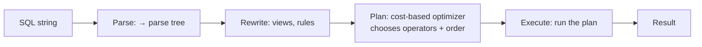
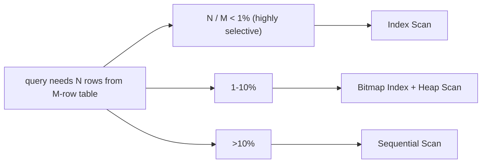
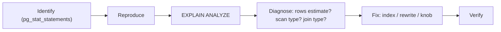

# Query optimization & execution plans

A SQL query is a *declaration* of what you want, not a procedure for getting it. The DB's **query planner** translates that declaration into an **execution plan** — a tree of operators (scans, joins, sorts, aggregations) chosen from many possibilities. For a 5-table JOIN there are thousands of plausible plans; the planner picks the one it estimates as cheapest using statistics about your data. Get the statistics right and the planner picks well; get them wrong and you get the "obviously slow" plan: a nested-loop join across 100M rows instead of a hash join; a sequential scan instead of an index scan; a sort of the entire dataset instead of using a sorted index.

Reading and reasoning about execution plans is **the single most important diagnostic skill** in DB performance work. `EXPLAIN` shows the planned operators; `EXPLAIN ANALYZE` runs the query and shows actual vs estimated rows. The gap between estimated and actual tells you whether to trust the plan or whether stale statistics are leading the planner astray. A senior engineer reads execution plans the way a programmer reads stack traces.

This topic covers: the planner's decision process; statistics (`pg_statistic`, histograms, MCV); the four join algorithms (nested loop, hash, merge, and Postgres's specifics) and when each is chosen; sequential vs index vs bitmap scans; how to read `EXPLAIN ANALYZE` output; `pg_stat_statements` for finding slow queries across the workload; auto-explain for catching slow queries in real time; the planner knobs that occasionally need tweaking (`work_mem`, `random_page_cost`, `effective_cache_size`); query-rewrite patterns that help the planner; and the practical workflow: identify slow query → read plan → identify problem → adjust (index, rewrite, or planner hint).

The depth-bar this topic clears: at the **language layer**, `EXPLAIN` / `EXPLAIN ANALYZE` syntax and the operator catalog. At the **memory layer**, what each operator costs — sequential scan = N pages; index scan = ~3-4 pages per lookup; hash join = `work_mem` for the build side; sort = `work_mem` or disk-spill. At the **architecture layer** — the heart — **how the planner converts a SQL statement into a plan tree** (parse → rewrite → plan → execute), the **cost-vs-time relationship** (cost is a planner-internal unit; actual time depends on cache state and concurrency), and the **workflow** for slow-query diagnosis (identify via `pg_stat_statements` → reproduce → `EXPLAIN ANALYZE` → tune index, rewrite, or knob).

> [!NOTE]
> Prerequisites: [Indexing (T01)](./T01-indexing-and-index-types.md). SQL fluency. Examples here are Postgres-flavored; MySQL has similar concepts (`EXPLAIN ANALYZE` since 8.0, `EXPLAIN FORMAT=JSON` for detail).

## The Planner Pipeline

A SQL query goes through five stages:



The **planner** is the interesting stage. It:

1. Enumerates possible plans (which index to use, which join order, which join algorithm).
2. Estimates cost for each plan using statistics.
3. Picks the cheapest.

The cost model is calibrated to disk + memory access patterns. Cost units are arbitrary (Postgres's "page fetch" costs 1.0 for cached sequential, ~4.0 for random). The cheapest *cost* is typically the fastest *time*.

## `EXPLAIN` And `EXPLAIN ANALYZE`

```sql
EXPLAIN SELECT * FROM orders WHERE customer_id = 42;
```

Output (Postgres):
```
                            QUERY PLAN
─────────────────────────────────────────────────────────────────
 Index Scan using idx_orders_customer on orders  (cost=0.42..8.44 rows=12 width=200)
   Index Cond: (customer_id = 42)
```

What this says:

- `Index Scan` — operator type.
- `idx_orders_customer` — index used.
- `cost=0.42..8.44` — startup..total cost (planner units).
- `rows=12` — estimated row count.
- `width=200` — estimated bytes per row.

`EXPLAIN ANALYZE` *executes* the query and adds actual figures:

```sql
EXPLAIN ANALYZE SELECT * FROM orders WHERE customer_id = 42;
```

```
 Index Scan using idx_orders_customer on orders
   (cost=0.42..8.44 rows=12 width=200)
   (actual time=0.012..0.054 rows=11 loops=1)
   Index Cond: (customer_id = 42)
 Planning Time: 0.124 ms
 Execution Time: 0.071 ms
```

Compare estimated `rows=12` to actual `rows=11`. Close → planner has good statistics. Off by 100× → run `ANALYZE` to refresh statistics; or planner's `statistics_target` is too low for this column.

## Scan Types

| Scan | When | Cost |
|------|------|------|
| **Sequential Scan** | no index; whole-table read | O(N pages) |
| **Index Scan** | high selectivity; random access | O(log N) per lookup + heap fetches |
| **Index Only Scan** | index covers needed columns | O(log N); no heap fetch |
| **Bitmap Index Scan + Heap Scan** | moderate selectivity; many rows | builds bitmap; reads heap in physical order |
| **Parallel Sequential Scan** | huge table; many CPUs | divides work across workers |
| **CTE Scan** | scanning a CTE result | depends on inner |
| **Subquery Scan** | scanning a subquery | depends on inner |



**Bitmap scan** is the middle case: many rows match the index but reading them via random heap I/O would be slow. The engine builds an in-memory bitmap of matching heap blocks, then reads the heap in physical order. Better cache locality than random index scan.

## Join Algorithms

Three flavors, optimizer picks based on row counts and indexes.

### Nested Loop Join

```
for each row in outer:
    for each row in inner matching outer:
        emit
```

Cost: O(outer × inner) without index; O(outer × log(inner)) with index on inner's join column. **Right when outer is small** (e.g., 10 rows) and inner has an index on the join column.

EXPLAIN:
```
Nested Loop  (cost=...)
  -> Seq Scan on orders  (rows=10)
  -> Index Scan on customers using customers_pkey  (rows=1 loops=10)
```

`loops=10` means the inner ran 10 times.

### Hash Join

```
build hash table on inner using inner's join column as key
for each row in outer:
    probe hash table; emit matches
```

Cost: O(outer + inner). Best when both sides are medium-to-large and at least one fits in memory (`work_mem`). The **default for most joins** in modern engines.

```
Hash Join  (cost=...)
  Hash Cond: (orders.customer_id = customers.id)
  -> Seq Scan on orders
  -> Hash
        -> Seq Scan on customers
```

### Merge Join

```
sort both sides by join column
walk both side-by-side, emitting matches
```

Cost: O(outer + inner) if both already sorted (e.g., from indexes); O(outer log outer + inner log inner) otherwise. **Right when both sides are sorted** by the join column — typically via a composite index.

```
Merge Join  (cost=...)
  Merge Cond: (orders.customer_id = customers.id)
  -> Index Scan using orders_customer_id_idx on orders
  -> Index Scan using customers_pkey on customers
```

### Join Choice Heuristics

| Both inputs | Pick |
|-------------|------|
| One small (10s of rows) + indexed inner | **Nested Loop** |
| Both medium; one fits work_mem | **Hash Join** |
| Both pre-sorted on join col | **Merge Join** |
| Both huge, no index, no sort | **Hash Join** (with spill if needed) |

The planner makes this decision based on row estimates. Bad estimates → wrong join → catastrophic slowdown.

## Statistics

The planner uses **statistics** about each column to estimate row counts:

- **`reltuples`** — total row count (approximate).
- **`null_frac`** — fraction NULL.
- **`n_distinct`** — number of distinct values (or fraction).
- **`most_common_vals`** + **`most_common_freqs`** — MCV: top-N values and their frequencies.
- **`histogram_bounds`** — equi-depth histogram for range estimation.

Run `ANALYZE` (or rely on auto-vacuum) to refresh:

```sql
ANALYZE orders;
```

For a high-cardinality column you care about, increase the statistics target:

```sql
ALTER TABLE orders ALTER COLUMN customer_id SET STATISTICS 1000;   -- default 100
ANALYZE orders;
```

A higher target = more MCVs + more histogram buckets = more accurate row estimates = better plans.

### Stale Statistics — The Common Failure

Symptoms:

- EXPLAIN ANALYZE shows `rows=10000 estimated` but `actual rows=1000000`.
- Planner picks a nested loop expecting 10 K iterations; runs 1 M iterations; takes hours.

Fix: `ANALYZE table`. For high-churn tables, `autovacuum_analyze_threshold` and `..._scale_factor` may need tuning.

## Reading A Plan — Example Trace

```sql
EXPLAIN ANALYZE
SELECT o.id, c.name, SUM(oi.quantity * oi.unit_price) AS total
FROM orders o
JOIN customers c ON c.id = o.customer_id
JOIN order_items oi ON oi.order_id = o.id
WHERE o.created_at >= NOW() - INTERVAL '30 days'
  AND o.status = 'PAID'
GROUP BY o.id, c.name
ORDER BY total DESC
LIMIT 100;
```

```
 Limit  (cost=2030.45..2030.70 rows=100) (actual time=15.23..15.45 rows=100 loops=1)
   ->  Sort  (cost=2030.45..2045.45 rows=6000) (actual time=15.23..15.34 rows=100 loops=1)
         Sort Key: (sum((oi.quantity * oi.unit_price))) DESC
         Sort Method: top-N heapsort  Memory: 25kB
         ->  HashAggregate  (cost=...)
               Group Key: o.id, c.name
               ->  Hash Join  (cost=...)
                     Hash Cond: (oi.order_id = o.id)
                     ->  Seq Scan on order_items oi  (cost=...)
                     ->  Hash  (cost=...)
                           ->  Hash Join  (cost=...)
                                 Hash Cond: (o.customer_id = c.id)
                                 ->  Index Scan using orders_created_at_status_idx on orders o
                                       Index Cond: ((created_at >= ...) AND (status = 'PAID'))
                                 ->  Hash  (cost=...)
                                       ->  Seq Scan on customers c
 Planning Time: 0.456 ms
 Execution Time: 15.612 ms
```

Reading:

- Bottom up: scan customers + orders (hash join them) + scan order_items (hash join) → aggregate → sort → limit.
- The outer Index Scan filters orders by date + status — uses a composite index.
- Hash joins assemble the result.
- HashAggregate groups by `(o.id, c.name)`.
- Top-N heapsort takes the top 100 by total without sorting everything.
- Total: 15.6 ms execution. Good.

If actual rows >> estimated, suspect stale statistics. If a Hash → Sequential Scan on a giant table appears, missing index. If Sort spills to disk (`Sort Method: external merge  Disk: 200000kB`), increase `work_mem` or fix the query.

## `pg_stat_statements` — Workload-Wide Stats

```sql
CREATE EXTENSION pg_stat_statements;
```

Then:

```sql
SELECT query, calls, total_exec_time, mean_exec_time, rows
FROM pg_stat_statements
ORDER BY total_exec_time DESC
LIMIT 20;
```

Top-20 queries by cumulative time. Often a single slow query dominates — fix it first.

For MySQL, the `performance_schema.events_statements_summary_by_digest` view is similar.

## `auto_explain` — Catch Slow Queries In Production

```sql
LOAD 'auto_explain';
SET auto_explain.log_min_duration = '1s';
SET auto_explain.log_analyze = true;
```

Any query taking ≥1 s is logged with its plan. Use in production for outlier diagnosis; turn off after.

## Planner Knobs

Most queries don't need knob tweaking. The ones that occasionally do:

| Knob | Default | When to tune |
|------|---------|--------------|
| `work_mem` | 4 MB | low; sort spills to disk. Raise to 32-128 MB for reporting. |
| `random_page_cost` | 4.0 | SSD installations; lower to 1.1 — random reads aren't 4× sequential anymore. |
| `effective_cache_size` | 4 GB | tell planner how much OS-level cache to assume. |
| `statistics_target` | 100 | raise for skewed high-cardinality columns. |
| `enable_seqscan = off` | on | rarely; force index use for diagnosis. |

**`random_page_cost = 1.1`** is the single most common production tweak. Default 4.0 assumes spinning rust; SSDs make random access nearly as fast as sequential.

## Query Rewrite Patterns

Help the planner by changing the query shape:

### Avoid `SELECT *`

Forces the planner to fetch heap rows; defeats index-only scans.

### Avoid Functions On Indexed Columns

```sql
-- doesn't use idx_users_email
WHERE lower(email) = 'alice@x.io'

-- uses idx_users_email if values stored lowercased
WHERE email = lower('Alice@X.io')

-- or build an expression index
CREATE INDEX idx_users_email_lower ON users(lower(email));
```

### Convert `OR` to `UNION`

```sql
-- often can't use either index
WHERE a = 1 OR b = 2

-- planner can use index per branch
SELECT ... WHERE a = 1
UNION
SELECT ... WHERE b = 2
```

### `EXISTS` vs `IN`

For uncorrelated subqueries with few results, `IN` is fine. For correlated or large results, `EXISTS` is usually faster.

### CTE Materialization

Postgres ≤ 11 always materialized CTEs (fence). Postgres 12+ can inline them. If you need the fence behavior:

```sql
WITH active AS MATERIALIZED (...)   -- explicit fence
```

### Predicate Pushdown

The planner pushes filter conditions as far down as possible (into subqueries, into JOIN sides). Usually automatic. If not happening, examine view definitions and subquery shapes.

## The Workflow

1. **Identify**: `pg_stat_statements` (top by total time); production slow log; Hibernate stats.
2. **Reproduce**: same parameter values; same role.
3. **Plan**: `EXPLAIN (ANALYZE, BUFFERS) ...`.
4. **Diagnose**: estimate vs actual; scan types; join algorithm; memory usage.
5. **Fix**:
   - Index added/removed/changed.
   - Statistics refreshed.
   - Query rewritten.
   - `work_mem` raised for sorts.
6. **Verify**: re-run; confirm.



## Common Pitfalls

> [!WARNING]
> **Reading `cost` as time.** Cost is a planner unit; actual time depends on cache state, concurrency, I/O.

> [!WARNING]
> **`EXPLAIN` without `ANALYZE`.** You see the plan but not whether estimates match reality. Always ANALYZE in dev.

> [!WARNING]
> **`EXPLAIN ANALYZE` on production tables you don't want to mutate.** It actually executes. Wrap in `BEGIN; ... ROLLBACK;` for `INSERT/UPDATE/DELETE` analysis.

> [!WARNING]
> **Trusting plans tested on a different size of data.** Optimizer's choices vary by row counts. Test with realistic data.

> [!WARNING]
> **Stale statistics in dev DB.** Run `ANALYZE` after big data loads.

> [!WARNING]
> **`work_mem` global vs per-session.** Raising globally affects every connection × every sort; can OOM. Raise per-session for batch / reports.

> [!WARNING]
> **Disabling `enable_seqscan` "permanently".** A workaround that breaks for tables that *should* sequentially scan. Use only for diagnosis.

> [!WARNING]
> **Heavy queries on the OLTP DB.** Reporting workloads on transactional DB choke concurrent ops. Use read replica.

> [!WARNING]
> **`SELECT *` everywhere.** Defeats index-only scans; couples to schema changes. Project explicitly.

> [!WARNING]
> **Mid-rebuild stats collection during peak.** Doubles I/O. Schedule during low traffic.

## Practice

1. Pick the slowest query in your service. Run `EXPLAIN ANALYZE`. Identify what's slow.
2. Force a sequential scan vs an index scan (`SET enable_seqscan = off` for the index version). Compare times.
3. Run a 3-table join with sufficient data. Identify which join algorithm was chosen. Force a different one (`SET enable_hashjoin = off`); compare.
4. Run `ANALYZE` on a table after a big DELETE. Compare query plans before and after.
5. Wire `pg_stat_statements`. Identify the top-5 queries by `total_exec_time` in a 24-hour window.
6. Enable `auto_explain` with `log_min_duration = 100ms`. Capture a slow query in production logs.
7. Convert a `WHERE a OR b` query to `UNION`; compare plans.
8. Raise `work_mem` to 64 MB and re-run a query that previously spilled sort to disk. Verify no spill.

## Recap

You should now be able to:

- Read `EXPLAIN` and `EXPLAIN ANALYZE` output: scan types, join algorithms, row estimates vs actuals, total time.
- Distinguish sequential, index, index-only, and bitmap scans by when each is chosen.
- Recognize the three join algorithms (nested loop, hash, merge) and the cardinality / index conditions that drive the choice.
- Use statistics: when `ANALYZE` is needed; how to raise `statistics_target` for skewed columns; when stale stats mislead the planner.
- Use `pg_stat_statements` for workload-wide profiling and `auto_explain` for outlier capture.
- Tune `work_mem`, `random_page_cost`, `effective_cache_size` when defaults don't fit.
- Rewrite queries to help the planner: expression-index-aware predicates, `UNION` instead of `OR`, explicit CTE fences when needed.
- Diagnose a slow query end-to-end: identify → reproduce → plan → diagnose → fix → verify.
- Avoid the canonical pitfalls: reading cost as time, EXPLAIN ANALYZE side effects, stale stats, global work_mem, `SELECT *`, OLTP+reporting on one DB.

## Next

Continue to [Database migrations (Flyway, Liquibase)](./T03-database-migrations-flyway-liquibase.md) for the discipline of evolving schemas safely — versioned migrations, baseline / repair, rollback strategies, zero-downtime migration patterns, and the Spring Boot integration with Flyway and Liquibase.
