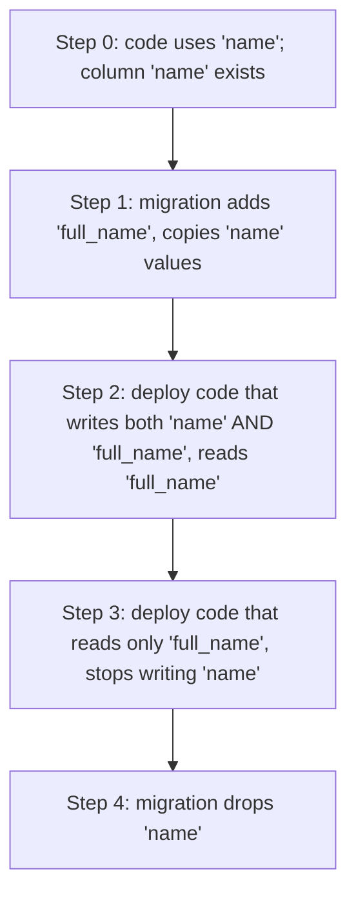

# Database migrations (Flyway, Liquibase)

A database schema evolves: new columns, new tables, new indexes, renamed columns, dropped constraints, data backfills. The naïve approach — apply changes manually in each environment via psql or DBeaver — falls apart the moment two developers diverge, or you need to roll back, or you can't replay history to bring up a fresh environment. **Schema migrations** are version-controlled, ordered SQL files (or DSL change-sets) that each environment applies in the same order to reach the same schema state. A migration tool records which migrations have been applied (in a `schema_history` table), refuses to re-apply them, and stops if checksums don't match. **Flyway** is the most popular Java migration tool (pure SQL by default); **Liquibase** is the more feature-rich alternative (XML/YAML/JSON change-set format, rollback support, conditional execution).

Beyond mechanics, **the real discipline is zero-downtime migration**. A naïve `ALTER TABLE users ADD COLUMN email NOT NULL` locks the table for minutes on a large row count, drops all writes during the lock, and breaks deployed code that doesn't know about the column. Production migrations follow **expand-and-contract**: apply backward-compatible additive changes, deploy code that uses both old and new shapes, deploy code that uses only new, then drop the old. Each step is reversible; each step keeps the running app correct.

This topic covers: Flyway and Liquibase end-to-end (file conventions, history table, baseline, repeatable migrations, callbacks); Spring Boot integration; the zero-downtime patterns (expand-and-contract for adding columns; rename via dual-write; dropping columns); locking DDL gotchas (`ALTER TABLE` on a 100M-row table); online schema-change tools (Postgres native `CREATE INDEX CONCURRENTLY`; MySQL `pt-online-schema-change`, `gh-ost`); the relationship to JPA's `ddl-auto: validate` (it should be on in prod; migrations drive the schema; JPA verifies the entity matches); schema drift detection.

The depth-bar this topic clears: at the **language layer**, Flyway and Liquibase file conventions; Spring Boot wiring. At the **memory layer**, what a migration actually does at the DB layer (transaction, locks, row rewrite); the cost difference between locking-DDL and online-DDL. At the **architecture layer** — the heart — **the migration discipline as architectural** (it's the contract between dev, ops, and the deployed code), the **expand-and-contract pattern** that turns risky DDL into a sequence of safe small steps, and the **operational reality** (Postgres's transactional DDL is a superpower; MySQL's online-DDL is a different beast with its own tools).

> [!NOTE]
> Prerequisites: [Indexing (T01)](./T01-indexing-and-index-types.md). SQL DDL. Spring Boot basics (auto-configuration / properties).

## Why Migration Tools

Without one:

- Developers run schema changes manually; environments drift.
- A fresh environment needs hours of manual setup or `pg_dump`/`pg_restore` from a known-good DB.
- Rolling back means writing inverse SQL by hand, hoping no one wrote to the table since.
- Code knows about schema A; some env still has schema B; runtime breakage.

With one:

- Migrations are *version-controlled code* alongside the app.
- A migration tool's history table records what's been applied.
- New env = blank DB + `flyway migrate` → schema at the latest version, deterministically.
- A failed migration aborts; doesn't leave a half-applied state (with transactional DDL).
- Code and schema deploy together (or carefully sequenced — see expand-and-contract).

## Flyway — File-Based, SQL-First

Add the starter:

```xml
<dependency>
    <groupId>org.flywaydb</groupId>
    <artifactId>flyway-core</artifactId>
</dependency>
<dependency>
    <groupId>org.flywaydb</groupId>
    <artifactId>flyway-database-postgresql</artifactId>
</dependency>
```

Spring Boot auto-detects and runs on startup. Place migration files in `src/main/resources/db/migration/`:

```
db/migration/
  V1__create_users.sql
  V2__add_email_to_users.sql
  V3__create_orders.sql
  V20260608120000__add_user_index.sql
  R__refresh_materialized_views.sql
```

Naming:

- **`V<version>__<description>.sql`** — versioned, applied once, in version order.
- **`R__<description>.sql`** — repeatable, re-applied whenever the checksum changes (for views, stored procedures).
- **`U<version>__<description>.sql`** — undo (commercial Flyway).

Versions are sorted numerically. Use timestamps (`V20260608120000__...`) or sequential numbers (`V1__`, `V2__`); pick one convention per team.

Each file's content is plain SQL:

```sql
-- V2__add_email_to_users.sql
ALTER TABLE users ADD COLUMN email VARCHAR(255) UNIQUE;
CREATE INDEX idx_users_email ON users(email);
```

### The Flyway Schema History

Flyway creates `flyway_schema_history` (default) tracking each applied migration:

```sql
SELECT version, description, checksum, success, installed_on
FROM flyway_schema_history ORDER BY installed_rank;
```

Key columns:

- `version` — `V1`, `V2`, …
- `checksum` — file content hash. Changing the file after application throws `FlywayValidationException` (you may not retroactively edit applied migrations).
- `success` — false → next `migrate` errors; manual repair needed.
- `installed_on` — timestamp.

### Baseline

For an existing DB you're adopting Flyway on:

```yaml
spring:
  flyway:
    baseline-on-migrate: true
    baseline-version: 0
    baseline-description: "Existing schema"
```

Flyway records `V0` as the starting point; only migrations with version > 0 are then applied. Skip the historical schema; let dev forward.

### Spring Boot Properties

```yaml
spring:
  flyway:
    enabled: true
    locations: classpath:db/migration
    schemas: public
    table: flyway_schema_history
    baseline-on-migrate: false
    validate-on-migrate: true
    out-of-order: false           # disallow inserting V2 after V3 ran
    clean-disabled: true          # disable `flyway clean` (drops everything)
```

`clean-disabled: true` is mandatory in production.

### Callbacks

```java
@Component
public class AfterMigrate implements Callback {
    @Override public boolean supports(Event event, Context context) {
        return event == Event.AFTER_MIGRATE;
    }
    @Override public boolean canHandleInTransaction(Event event, Context context) {
        return true;
    }
    @Override public void handle(Event event, Context context) {
        // ... post-migration logic
    }
    @Override public String getCallbackName() { return "AfterMigrate"; }
}
```

For pre/post-migration tasks (cache warm, dependency wire).

## Liquibase — Change-Set Format, Multi-Format

```xml
<dependency>
    <groupId>org.liquibase</groupId>
    <artifactId>liquibase-core</artifactId>
</dependency>
```

`db/changelog/db.changelog-master.yaml`:

```yaml
databaseChangeLog:
  - include:
      file: db/changelog/changes/001-create-users.sql
  - include:
      file: db/changelog/changes/002-add-email.yaml
```

A change-set file (YAML):

```yaml
databaseChangeLog:
  - changeSet:
      id: 2
      author: alice
      changes:
        - addColumn:
            tableName: users
            columns:
              - column:
                  name: email
                  type: VARCHAR(255)
                  constraints:
                    unique: true
        - createIndex:
            tableName: users
            indexName: idx_users_email
            columns:
              - column:
                  name: email
      rollback:
        - dropIndex:
            tableName: users
            indexName: idx_users_email
        - dropColumn:
            tableName: users
            columnName: email
```

Liquibase tracks applied change-sets in `DATABASECHANGELOG`. The rollback section is *declared* (not generated); when you `liquibase rollback`, it runs.

Plain-SQL change-sets are also supported via `.sql` files with formatted Liquibase headers:

```sql
--liquibase formatted sql
--changeset alice:3
ALTER TABLE users ADD COLUMN bio TEXT;
--rollback ALTER TABLE users DROP COLUMN bio;
```

### Flyway vs Liquibase

| Aspect | Flyway | Liquibase |
|--------|--------|-----------|
| Default format | SQL | XML/YAML/JSON |
| Rollback | commercial only | built-in |
| Conditional execution | callback hacks | preConditions native |
| Multi-DB portability | per-file dialect | abstraction layer |
| Complexity | simple | configurable |
| Spring integration | excellent | excellent |

Pick one per team; don't mix. Most Spring teams pick Flyway for simplicity; teams needing rollback or multi-DB portability pick Liquibase.

## JPA `ddl-auto: validate`

The right production setting (T02 of C02):

```yaml
spring:
  jpa:
    hibernate:
      ddl-auto: validate
```

At app startup, JPA checks that every `@Entity` matches the DB schema. Mismatch → fail-fast at startup. Migrations are the *source of truth*; JPA verifies the truth matches the code.

`ddl-auto: update` and `create` are wrong in production: they apply schema changes via Hibernate's limited DDL logic, bypassing the migration history. Disaster.

## Zero-Downtime Migrations — Expand And Contract

The pattern for **any** breaking change. Rename a column from `name` to `full_name`:



Each step is **backward compatible** with the previous: a rolling deploy sees one or both versions running; nothing breaks.

Other patterns:

### Adding A NOT NULL Column

Bad:

```sql
ALTER TABLE users ADD COLUMN email VARCHAR(255) NOT NULL;   -- ❌ requires default; locks table to backfill; old code breaks
```

Good (expand and contract):

```sql
-- Migration V1: add nullable
ALTER TABLE users ADD COLUMN email VARCHAR(255);
-- (no lock; tiny op)

-- Deploy code that writes email (and tolerates null on existing rows)

-- Migration V2: backfill
UPDATE users SET email = generated_email() WHERE email IS NULL;
-- (locks rows for the UPDATE duration; chunk if needed)

-- Deploy code that requires email (validates on input; tolerates legacy null cleanups)

-- Migration V3: enforce NOT NULL
ALTER TABLE users ALTER COLUMN email SET NOT NULL;
-- (full table scan to verify; fast lock; brief)
```

Three migrations + two deploys to do safely what one DDL would do unsafely.

### Adding An Index

Always use `CONCURRENTLY` (T01):

```sql
CREATE INDEX CONCURRENTLY idx_users_email ON users(email);
```

Flyway doesn't run `CONCURRENTLY` in a transaction (Postgres requires non-transactional). Configure:

```yaml
spring:
  flyway:
    placeholders:
      ...
# In the migration file itself, mark non-transactional:
-- V20260608__add_email_index.sql
-- This migration is non-transactional (uses CONCURRENTLY)
CREATE INDEX CONCURRENTLY idx_users_email ON users(email);
```

Add the comment `--non-transactional` (Liquibase) or use `flyway.executeInTransaction = false` (Flyway). Postgres rejects `CONCURRENTLY` inside a transaction.

### Dropping A Column

```sql
-- Migration V1: stop using it in code (deploy first)
-- Migration V2: actually drop
ALTER TABLE users DROP COLUMN deprecated_field;
```

Don't drop in the same deploy as the code change — if deploy rolls back, the column is gone but old code wants it.

### Adding A Foreign Key

```sql
-- Step 1: add column, no constraint
ALTER TABLE orders ADD COLUMN customer_id BIGINT;

-- Step 2: backfill

-- Step 3: add FK NOT VALID (no full-table scan)
ALTER TABLE orders ADD CONSTRAINT orders_customer_fk
    FOREIGN KEY (customer_id) REFERENCES customers(id) NOT VALID;

-- Step 4: validate (scans concurrently; doesn't block)
ALTER TABLE orders VALIDATE CONSTRAINT orders_customer_fk;
```

`NOT VALID` lets the constraint be added quickly; `VALIDATE CONSTRAINT` then validates without an `ACCESS EXCLUSIVE` lock.

## Locking DDL — The Gotcha

A naïve `ALTER TABLE ... ADD COLUMN` on a 100M-row table:

- **Postgres**: usually fast — adds the column metadata; existing rows get the default lazily (Postgres 11+) or immediately (Postgres ≤ 10). With a default, full row rewrite — minutes of `ACCESS EXCLUSIVE` lock.
- **MySQL InnoDB**: depends on the change. `ALGORITHM=INSTANT` for simple adds (5.7+); `ALGORITHM=INPLACE` for many others; otherwise full table copy (long lock).

Tools:

- **`pt-online-schema-change`** (Percona, MySQL) — creates a shadow table, copies data in chunks, swaps. No lock.
- **`gh-ost`** (GitHub, MySQL) — same idea, uses binlog stream.
- **Postgres**: `CREATE INDEX CONCURRENTLY`, `ADD CONSTRAINT NOT VALID + VALIDATE`, `pg_repack` for table rewrite.

For Spring teams, the discipline: large-table migrations get **scheduled maintenance windows** or **online tools**; never just-deploy.

## Schema Drift Detection

Schema drift = the DB has changes that aren't in your migrations. Causes: manual psql sessions, half-applied migrations, dev/prod divergence.

Tools:

- **`schemaspy`** — diff schemas between environments.
- **`migra`** (Python) — generate the SQL diff between two Postgres DBs.
- **`liquibase diff`** — built into Liquibase.
- **JPA `ddl-auto: validate`** in prod — catches entity-vs-DB mismatch.

Run quarterly; fix discrepancies via migration.

## Worked Example — Adding A Soft-Delete Column

```sql
-- V20260608120000__add_soft_delete.sql
-- Step 1: add column (nullable)
ALTER TABLE users ADD COLUMN deleted_at TIMESTAMP;
CREATE INDEX CONCURRENTLY idx_users_deleted_at ON users(deleted_at) WHERE deleted_at IS NULL;
```

```sql
-- V20260615120000__make_users_query_filter_index.sql
-- Step 2: actual queries filter on the partial index
-- (no schema change here; deploy was step 1 + code change)
```

Two days later, every code path filters `WHERE deleted_at IS NULL`. No further migration needed; soft-delete via `UPDATE ... SET deleted_at = NOW()`.

## Common Pitfalls

> [!WARNING]
> **Editing an applied migration.** Checksum mismatch on next deploy. Always make a new migration for changes.

> [!WARNING]
> **`flyway repair` casually.** Marks failed migrations as successful. Use only after manual fix.

> [!WARNING]
> **`ddl-auto: update` in prod.** Bypasses migration history. Disaster.

> [!WARNING]
> **DDL without `CONCURRENTLY` on hot tables.** Multi-minute lock. Online tools or off-hours.

> [!WARNING]
> **NOT NULL + DEFAULT on a huge table.** Full table rewrite. Use the three-step expand-contract.

> [!WARNING]
> **Migration that depends on app code state.** Schema changes shouldn't read business data. Backfills do, but with care.

> [!WARNING]
> **No baseline on an existing DB.** Flyway tries to apply V1 against an already-populated schema; fails. Set baseline.

> [!WARNING]
> **Migrations not in version control.** Different envs end up with different schemas. Always git.

> [!WARNING]
> **Mixing Flyway and Liquibase in one repo.** Two history tables; confusion. Pick one.

> [!WARNING]
> **Long-running migrations during peak.** Holds locks; blocks writers. Off-hours.

## Practice

1. Set up Flyway in a Boot project. Create migrations V1 / V2; verify they run on startup.
2. Introduce a deliberately-bad checksum (edit V1 after it's applied). Verify Flyway fails on next start. Use `flyway:repair` to fix.
3. Baseline an existing DB; verify only newer migrations are applied.
4. Execute the expand-and-contract pattern for renaming a column. Validate at each step that the running app works.
5. Add a `NOT NULL` column to a 1M-row test table via the three-step pattern. Time vs the one-shot version.
6. Add an index `CONCURRENTLY`; verify no writes blocked during build.
7. Try the same setup with Liquibase. Compare.
8. Use `migra` to diff your local dev DB vs the migration-determined schema. Identify drift.

## Recap

You should now be able to:

- Use Flyway: `V<version>__description.sql` files; understand history table, checksums, baseline, repair.
- Use Liquibase: change-sets in YAML/SQL/XML; rollback declarations; preConditions.
- Wire Spring Boot's auto-migration: `spring.flyway.*` or `spring.liquibase.*` props; configure `validate-on-migrate`, `out-of-order`, `clean-disabled`.
- Use JPA `ddl-auto: validate` as the production safety net; migrations are the source of truth.
- Apply the expand-and-contract pattern for any potentially breaking schema change.
- Use `CREATE INDEX CONCURRENTLY` (Postgres) and `ADD CONSTRAINT NOT VALID + VALIDATE` for online DDL.
- Reach for `pt-online-schema-change` / `gh-ost` for huge MySQL tables; `pg_repack` for Postgres rewrites.
- Detect and fix schema drift via diff tools, JPA validation, periodic audits.
- Avoid the canonical pitfalls: editing applied migrations, `ddl-auto: update` in prod, locking DDL during peak, NOT NULL + DEFAULT on big tables, missing baseline.

## Next

Continue to [Replication & read replicas](./T04-replication-and-read-replicas.md) for the deep treatment of streaming replication, read-replica scaling, lag handling, failover, and the application patterns (read-write split, replication-lag awareness) for high-availability Postgres / MySQL setups.
