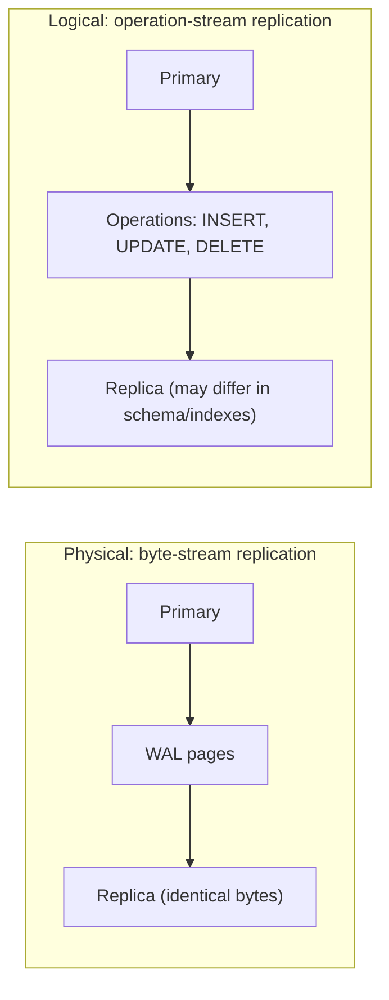
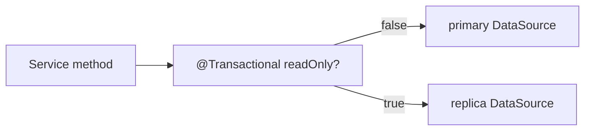

# Replication & read replicas

A single DB server is a single point of failure and a single throughput bottleneck. **Replication** copies data to one or more replicas in near real time: the **primary** (or "leader" / "writer") accepts writes; **replicas** (or "followers" / "readers") receive the change stream and replay it. The two operational uses are **high availability** (when the primary fails, a replica is promoted to primary; downtime measured in seconds, not hours) and **read scaling** (route read traffic to replicas; the primary handles all writes; total read throughput multiplies by the replica count).

A senior engineer treats replication as a *standard* feature: every production Postgres or MySQL deployment runs at least one replica. Knowing how it works (physical vs logical replication; WAL streaming; the lag math; synchronous vs asynchronous trade-offs), how to route application traffic correctly (`@Transactional(readOnly = true)` to a replica; writes to primary; reads-after-writes to primary to avoid stale data), how to monitor lag (Prometheus + `pg_stat_replication`), and how failover happens (manual; orchestrated with Patroni / orchestrator; cloud-managed RDS / Aurora / CloudSQL automatics) — that's the senior-engineer command of replication.

This topic covers: physical vs logical replication; Postgres streaming replication (`wal_level=replica`, replication slots, hot standby); MySQL binary-log replication (statement, row, mixed; GTID); synchronous vs asynchronous semantics; replication lag and how to handle it in the application; read-write split patterns in Spring (`AbstractRoutingDataSource`, `LazyConnectionDataSourceProxy`, `@Transactional(readOnly = true)`); failover orchestration (Patroni, orchestrator, cloud-managed); multi-master vs single-writer; the reality of cross-region replication; and the application discipline for handling eventual consistency on the read path.

The depth-bar this topic clears: at the **language layer**, the Postgres and MySQL primitives; the Spring routing-data-source pattern. At the **memory layer**, what a WAL segment is (typically 16 MB; recycled FIFO); lag measured in bytes (`replay_lag_bytes`) vs seconds; the network bandwidth required for replication (typically ~10× the write throughput due to WAL amplification). At the **architecture layer** — the heart — **the read-write split** as a single configurable policy, the **read-your-writes** problem and the patterns (route writers' subsequent reads to primary; use `synchronous_commit=remote_apply`; tolerate staleness), and the **failover orchestration** (manual = minutes; Patroni = ~30 s; cloud-managed = ~30 s with safer guarantees).

> [!NOTE]
> Prerequisites: [Indexing (T01)](./T01-indexing-and-index-types.md), [Query optimization (T02)](./T02-query-optimization-and-execution-plans.md), [Migrations (T03)](./T03-database-migrations-flyway-liquibase.md). Network basics (TCP, latency).

## Physical vs Logical Replication

**Physical replication** copies the WAL (write-ahead log) byte-stream from primary to replicas. The replica replays exactly what the primary wrote — at the *block / page level*. Result: an identical binary copy of the primary's data files.

**Logical replication** decodes the WAL into a stream of *logical operations* ("INSERT row (1, 'alice') into users; UPDATE row id=2 SET email='x'") and applies them on the replica. Replicas can have different schemas, different indexes, even different tables.

| Aspect | Physical | Logical |
|--------|----------|---------|
| Granularity | block / page | row-level operations |
| Schemas must match | yes (exactly) | no |
| Replicas can have other indexes | no | yes |
| Cross-version replication | usually no | yes |
| Cross-DB-engine replication | no | possible (e.g., via Debezium) |
| Standby is read-replica | yes | yes |
| Bidirectional / multi-master | rarely | possible (with conflict resolution) |
| Performance overhead | low | medium |

Most replicated-Postgres / replicated-MySQL setups use **physical replication** for the primary read-replica use case. **Logical** is for cross-version upgrades, Change Data Capture (T06), and selective replication (e.g., only replicate the `orders` table).



## Postgres Streaming Replication

The standard setup:

```ini
# primary postgresql.conf
wal_level = replica           # or 'logical' if also doing logical
max_wal_senders = 5
max_replication_slots = 5
listen_addresses = '*'
```

```ini
# replica postgresql.conf
hot_standby = on              # allow read queries
```

```ini
# replica recovery.conf (Postgres ≤ 11) or standby.signal + postgresql.conf (12+)
primary_conninfo = 'host=primary user=replicator password=...'
primary_slot_name = 'replica_slot_1'
```

Create the replication slot on primary:

```sql
SELECT pg_create_physical_replication_slot('replica_slot_1');
```

Then base-backup the replica from primary (`pg_basebackup`), start replica.

The replica connects to primary, requests WAL from a given LSN (log sequence number), receives the stream, replays. Lag is the gap between primary's current LSN and replica's last-replayed LSN.

### Synchronous vs Asynchronous

- **Asynchronous** (default): primary commits without waiting for replica acknowledgment. Lowest latency; replica may lag. Failover may lose recent writes.
- **Synchronous**: primary waits for at least one replica's `flush` ack before considering the commit done. Zero data loss on failover; higher write latency (one network round-trip per commit).
- **`remote_apply`**: primary waits for replica to *apply* the WAL — read-your-writes guarantee even on replicas.

```ini
synchronous_commit = on
synchronous_standby_names = 'replica1,replica2'
```

For financial / regulated systems: synchronous to at least one local replica. For analytics / catalog data: asynchronous.

### Replication Slots

A replication slot is a primary-side bookmark that records "this replica is at LSN X". The primary retains WAL until the slot is advanced. Without a slot, the primary may delete WAL before the replica catches up — a disconnected replica then can't reconnect; needs re-base-backup.

**Always use replication slots in production.** Monitor for slots that are far behind (the WAL is filling disk on the primary).

## MySQL Replication

Binary-log-based:

```ini
# primary
server-id = 1
log_bin = ON
binlog_format = ROW         # ROW recommended; STATEMENT has edge cases
gtid_mode = ON              # global transaction id; modern default
enforce_gtid_consistency = ON
```

```ini
# replica
server-id = 2
log_bin = ON
read_only = ON
super_read_only = ON
```

```sql
-- replica
CHANGE MASTER TO
    MASTER_HOST = 'primary',
    MASTER_USER = 'repl',
    MASTER_PASSWORD = '...',
    MASTER_AUTO_POSITION = 1;
START SLAVE;
```

GTID (global transaction id, MySQL 5.6+) tags every transaction with a unique id; failover and replica promotion become much cleaner (replica knows exactly which transactions it has).

### MySQL Replication Modes

- **Asynchronous** (default): primary doesn't wait.
- **Semi-synchronous**: primary waits for at least one replica to *receive* the binlog (not apply). Better-than-async; not full sync.
- **Group Replication / InnoDB Cluster**: Paxos-like; multi-primary or single-primary with automatic failover.

## Lag — The Operational Reality

Replication lag is *always* present:

- Network latency.
- Replica's CPU / I/O slower than primary.
- Replica running a heavy report query.
- WAL transmission queue.

Measure on Postgres:

```sql
SELECT
    application_name,
    client_addr,
    state,
    pg_size_pretty(pg_wal_lsn_diff(pg_current_wal_lsn(), sent_lsn)) AS sent_lag,
    pg_size_pretty(pg_wal_lsn_diff(pg_current_wal_lsn(), flush_lsn)) AS flush_lag,
    pg_size_pretty(pg_wal_lsn_diff(pg_current_wal_lsn(), replay_lsn)) AS replay_lag,
    EXTRACT(EPOCH FROM (now() - reply_time)) AS reply_lag_seconds
FROM pg_stat_replication;
```

Wire `pg_stat_replication` to Prometheus via `postgres_exporter`. Alert on:

- `replay_lag > 30s` (warn) / `> 5min` (critical).
- `flush_lag > 1MB` (could indicate disk/network issue).

## Read-Write Split In Spring

Configure two `DataSource`s:

```yaml
spring:
  datasource:
    primary:
      jdbc-url: jdbc:postgresql://primary:5432/app
      username: app
      password: ${DB_PASS}
    replica:
      jdbc-url: jdbc:postgresql://replica:5432/app
      username: app
      password: ${DB_PASS}
```

A routing data source dispatches based on transaction read-only flag:

```java
public class RoutingDataSource extends AbstractRoutingDataSource {
    @Override
    protected Object determineCurrentLookupKey() {
        return TransactionSynchronizationManager.isCurrentTransactionReadOnly()
            ? "replica" : "primary";
    }
}

@Configuration
public class DataSourceConfig {
    @Bean public DataSource dataSource(
            @Qualifier("primary") DataSource primary,
            @Qualifier("replica") DataSource replica) {
        RoutingDataSource ds = new RoutingDataSource();
        ds.setTargetDataSources(Map.of("primary", primary, "replica", replica));
        ds.setDefaultTargetDataSource(primary);
        return new LazyConnectionDataSourceProxy(ds);   // ← important
    }
}
```

`LazyConnectionDataSourceProxy` defers the actual connection acquisition until the first SQL — by then `TransactionSynchronizationManager` knows the read-only flag from `@Transactional(readOnly = true)`.

Now:

```java
@Transactional                       // → primary
public Order place(...) { ... }

@Transactional(readOnly = true)      // → replica
public List<Order> list() { ... }
```



### The Read-Your-Writes Problem

```java
@Transactional
public void createOrder(OrderRequest req) {
    Order o = orderRepo.save(new Order(req));
}

@Transactional(readOnly = true)
public Order getOrder(long id) {
    return orderRepo.findById(id).orElseThrow();   // goes to replica
}

// Client:
orderService.createOrder(req);       // writes to primary
orderService.getOrder(savedId);      // reads from replica — might 404!
```

The replica may lag; the just-created order isn't there yet. Three fixes:

1. **Route reads-after-writes to primary** for the same logical operation.
2. **Use `synchronous_commit = remote_apply`** so primary waits for replica to apply.
3. **Pass the just-saved object back** (no second read needed).

Pattern 3 is cleanest in most cases.

### Connection Pool Per DataSource

Each datasource has its own HikariCP. Size separately:

```yaml
spring:
  datasource:
    primary:
      hikari:
        maximum-pool-size: 20
    replica:
      hikari:
        maximum-pool-size: 40    # often higher; reads dominate
```

Sum should be < (Postgres `max_connections` - some headroom) ÷ instances.

## Failover

Three flavors:

### Manual

Operator notices primary is down; promotes a replica via `pg_ctl promote`; updates the load balancer / DNS. Downtime: minutes to hours.

### Orchestrated (Patroni / repmgr / orchestrator)

A control plane monitors the primary; on failure, picks a replica, promotes it, updates the cluster topology, redirects writes. Downtime: ~30 s. Patroni for Postgres; orchestrator for MySQL.

### Cloud-Managed (RDS, Aurora, CloudSQL)

The cloud provider runs the orchestration. Multi-AZ / region replicas; failover in ~30 s with cleaner guarantees. The trade-off: vendor lock-in and cost.

### Application-Side Resilience

The DataSource connection should survive failover:

- **HikariCP**: `validation-query`, `validation-timeout` to detect dead connections; `connection-test-query` for old drivers.
- **PgBouncer / ProxySQL** in front: handles failover transparently to the app.
- **Retry on connection failure** at the Spring layer.

Application typically sees ~30 s of errors during failover. Make critical writes idempotent so retries don't double-spend.

## Cross-Region Replication

Replicate to another region for disaster recovery or to serve a global audience.

Lag is dominated by network latency:

- Inter-AZ (same region): ~1 ms RTT; lag ~10s of ms.
- Cross-region: ~50–200 ms RTT; lag ~100s of ms to seconds.

Use cases:

- **DR replica** in another region; async; promote during major regional outage.
- **Read replica close to users** for low-latency reads (eventual consistency).

Always asynchronous. Synchronous cross-region adds RTT to every commit; throughput drops 10×.

## Multi-Master / Active-Active

Multiple primaries accepting writes:

- **MySQL Group Replication** — synchronous, single-primary by default; can be configured multi-primary.
- **Postgres BDR (commercial)** — logical multi-master.
- **CockroachDB / YugabyteDB** — distributed-from-the-ground-up multi-master.

Trade-off: **conflict resolution**. Two regions write to the same row at the same time; which wins? Last-write-wins, vector clocks, CRDTs, or business logic. Multi-master is much harder to reason about; for most apps, single-primary + replicas is enough.

## Monitoring Replication

Metrics to track:

- **Replication lag (seconds)** — per replica.
- **Replication lag (bytes)** — buffered WAL.
- **WAL throughput on primary** — pre-bandwidth-saturation.
- **Replica I/O wait** — replication thread bottleneck.
- **Last successful replication time**.

Alerts:

- Lag > 30 s warn; > 5 min critical.
- Disconnected replica > 5 min.
- WAL slot far behind > 1 GB (disk-fill risk).

## Worked Example — Spring + Postgres Replica

```java
@Configuration
public class DataSourceConfig {

    @Bean @ConfigurationProperties("spring.datasource.primary")
    public HikariDataSource primaryDs() { return new HikariDataSource(); }

    @Bean @ConfigurationProperties("spring.datasource.replica")
    public HikariDataSource replicaDs() { return new HikariDataSource(); }

    @Bean
    public DataSource routingDataSource(HikariDataSource primaryDs, HikariDataSource replicaDs) {
        RoutingDataSource r = new RoutingDataSource();
        r.setTargetDataSources(Map.of("primary", primaryDs, "replica", replicaDs));
        r.setDefaultTargetDataSource(primaryDs);
        return new LazyConnectionDataSourceProxy(r);
    }

    @Bean
    public PlatformTransactionManager transactionManager(DataSource ds) {
        return new JpaTransactionManager(...);   // ds = routingDataSource
    }
}

public class RoutingDataSource extends AbstractRoutingDataSource {
    @Override
    protected Object determineCurrentLookupKey() {
        return TransactionSynchronizationManager.isCurrentTransactionReadOnly()
            ? "replica" : "primary";
    }
}
```

Then in your service:

```java
@Service
public class OrderService {

    @Transactional(readOnly = true)
    public List<Order> list() {   // → replica
        return orderRepo.findAll();
    }

    @Transactional
    public Order place(OrderRequest req) {   // → primary
        return orderRepo.save(new Order(req));
    }
}
```

Annotation drives routing. Zero special application code per query.

## Common Pitfalls

> [!WARNING]
> **No replication slot.** Replica disconnects; primary deletes WAL; replica can't catch up. Always use slots.

> [!WARNING]
> **Synchronous replication to multiple replicas.** Each commit waits for *all* listed standbys. Tail latency explodes when any one is slow.

> [!WARNING]
> **Reading-after-write hitting stale replica.** The just-saved row isn't visible. Pass the saved object back or route to primary for follow-up reads.

> [!WARNING]
> **Heavy reports on the primary.** Defeats the read-replica investment. Always direct reports to replicas (or a dedicated analytics replica).

> [!WARNING]
> **Single replica + failover = momentary primary-less.** Always at least 2 replicas for HA.

> [!WARNING]
> **Forgetting connection-pool sizing.** Replica pool too small; reads queue. Primary pool oversized; replica idle.

> [!WARNING]
> **`max_standby_streaming_delay` too low.** Long-running queries on the replica get canceled (the replica needs to apply WAL but can't lock out the running query). Raise on read-replica servers used for analytics.

> [!WARNING]
> **Manual failover via DNS without TTL planning.** DNS clients cache; old primary still seen by some. Use a connection-aware proxy (PgBouncer, ProxySQL) instead.

> [!WARNING]
> **Treating a logical replica as a HA secondary.** Logical replication is per-table; HA needs full DB. Use physical for HA.

> [!WARNING]
> **No monitoring of replication lag.** Silent data divergence; failover surprises. Wire metrics + alerts.

## Practice

1. Set up a Postgres primary + 1 replica via Docker Compose. Insert; verify the data appears on the replica.
2. Wire a Spring routing data source; verify `@Transactional` writes go to primary; `@Transactional(readOnly = true)` reads go to replica.
3. Introduce 5 s of artificial network latency on the replication link. Measure lag with `pg_stat_replication`. Observe the read-after-write problem.
4. Configure `synchronous_commit = remote_apply` and a single sync standby. Measure write-latency change.
5. Simulate a failover: stop the primary; promote the replica; redirect Spring. Time the recovery.
6. Wire `pg_stat_replication` to Prometheus + Grafana. Build a lag dashboard.
7. Set `max_standby_streaming_delay = 30s`; run a long replica query; observe cancellation behavior.
8. Try Patroni in a 3-node cluster (Docker); test automated failover.

## Recap

You should now be able to:

- Distinguish physical (byte-stream, identical replica) from logical (operation-stream, schema-flexible) replication; pick physical for HA + read scaling, logical for cross-version / CDC.
- Set up Postgres streaming replication: WAL config, replication slots, hot standby, `pg_basebackup`.
- Set up MySQL replication with GTID and `binlog_format = ROW`.
- Choose synchronous vs asynchronous; understand the `remote_apply` mode and its read-your-writes guarantee.
- Implement read-write split in Spring with `AbstractRoutingDataSource` + `LazyConnectionDataSourceProxy` driven by `@Transactional(readOnly)`.
- Handle the read-after-write problem (pass saved objects back; route follow-ups to primary; or sync replication).
- Monitor replication lag via `pg_stat_replication` (or MySQL equivalents) → Prometheus → alerts.
- Plan failover: manual vs Patroni / orchestrator vs cloud-managed; understand the downtime budget for each.
- Reason about cross-region replication; understand multi-master is rarely the right answer.
- Avoid the canonical pitfalls: no slots, sync to many replicas, heavy reports on primary, no monitoring, single replica HA.

## Next

Continue to [Partitioning & sharding](./T05-partitioning-and-sharding.md) for the deep treatment of scaling beyond one server — table partitioning (range, list, hash) within one DB, sharding across many DBs, the application-level changes required, and the alternatives (Citus, Vitess, distributed-SQL engines).
