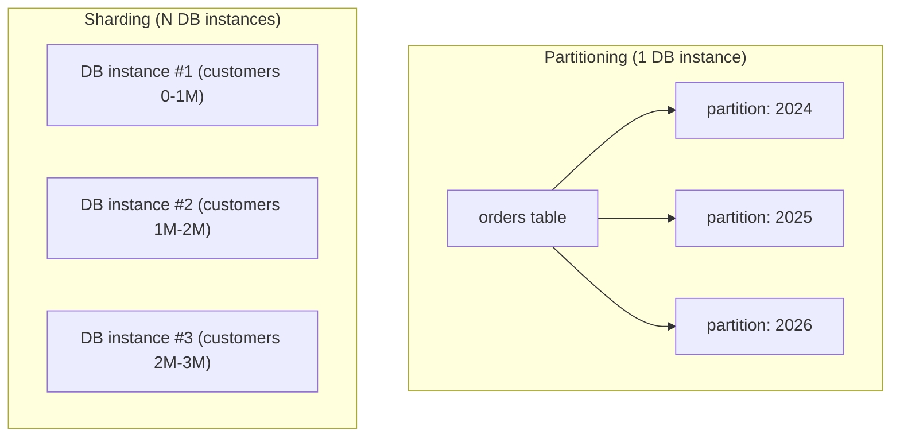
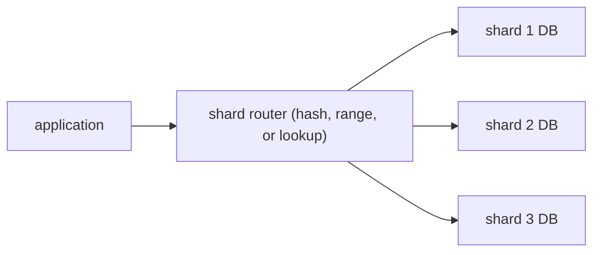
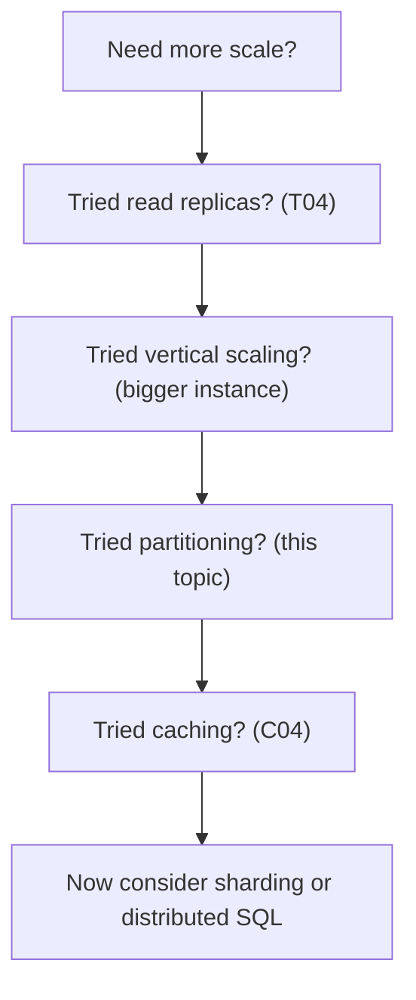

# Partitioning & sharding

A single DB server has limits: ~32 TB of practical disk, ~200K IOPS for SSD, ~1M rows/sec sustained insert. For most apps, these are enormous; for some — global-scale SaaS, IoT telemetry, ad tech, financial — they're insufficient. **Partitioning** splits a single large table into smaller physical pieces *within one DB instance* (per range of dates, per tenant, per hash); queries that filter on the partition key only scan the relevant partition; old partitions can be detached and dropped cheaply. **Sharding** goes further — splits the data across *multiple DB instances*; each instance owns a slice; the application (or a sharding proxy) routes queries to the right instance. Sharding scales horizontally; partitioning scales the operational manageability of one server.

A senior engineer reaches for partitioning early when the data has a natural partition key (time, tenant, geography). Sharding is the last resort — it imposes major application complexity (no cross-shard ACID; cross-shard queries are fan-out; routing logic per query) and is rarely the right answer until you've exhausted vertical scaling + read replicas + careful indexing. **Distributed-SQL engines** (CockroachDB, YugabyteDB, Google Spanner) offer a different trade-off: built-in sharding, distributed ACID, at the cost of higher latency and operational complexity.

This topic covers: Postgres declarative partitioning (range, list, hash); partition pruning; the operational side (detaching old partitions, attaching new); MySQL partitioning (similar concepts, different syntax); when partitioning helps and when it doesn't; sharding strategies (hash, range, lookup-table); application-level sharding (Spring routing); managed sharding (Citus on Postgres; Vitess on MySQL); distributed-SQL engines as alternatives; the cross-shard ACID problem; multi-tenant patterns; the operational reality of rebalancing.

The depth-bar this topic clears: at the **language layer**, Postgres `PARTITION BY RANGE/LIST/HASH` syntax; partition-aware queries. At the **memory layer**, partition metadata cost (each partition is essentially a separate table; ~10 KB metadata each); partition-wise joins reducing memory. At the **architecture layer** — the heart — **when partitioning is enough vs sharding required**, the **shard-key choice** as the single most important sharding decision (irreversible; defines all read paths), the **cross-shard cost** (no global transactions; fan-out queries), and the **distributed-SQL alternative** as a different shape of trade-off.

> [!NOTE]
> Prerequisites: [Indexing (T01)](./T01-indexing-and-index-types.md), [Replication (T04)](./T04-replication-and-read-replicas.md). Familiarity with table DDL.

## Partitioning vs Sharding — The Distinction



| Aspect | Partitioning | Sharding |
|--------|--------------|----------|
| Where data lives | one DB instance | many DB instances |
| Cross-partition queries | trivial (same DB) | hard (fan-out) |
| Cross-partition ACID | yes | no (or with 2PC) |
| Operationally complex | low | high |
| Scaling | within one instance's limits | nearly unbounded |
| Application changes | minimal | significant |

## Postgres Partitioning

```sql
CREATE TABLE orders (
    id BIGSERIAL,
    created_at TIMESTAMPTZ NOT NULL,
    customer_id BIGINT NOT NULL,
    total NUMERIC(10,2)
) PARTITION BY RANGE (created_at);

CREATE TABLE orders_2025 PARTITION OF orders
    FOR VALUES FROM ('2025-01-01') TO ('2026-01-01');

CREATE TABLE orders_2026 PARTITION OF orders
    FOR VALUES FROM ('2026-01-01') TO ('2027-01-01');
```

The parent `orders` table holds no rows — it's a logical table. Each child holds a range. INSERTs route automatically; SELECTs with a `WHERE created_at BETWEEN ...` clause **prune** — only the relevant partitions are scanned.

```sql
EXPLAIN SELECT * FROM orders WHERE created_at >= '2026-03-01' AND created_at < '2026-04-01';
-- Only scans orders_2026
```

### Partition Types

| Strategy | When | Postgres syntax |
|----------|------|-----------------|
| **RANGE** | time series, ordered keys | `PARTITION BY RANGE (col)` |
| **LIST** | discrete values (regions, tenants) | `PARTITION BY LIST (col)` |
| **HASH** | even distribution | `PARTITION BY HASH (col)` |

Examples:

```sql
-- LIST: per region
CREATE TABLE customers (...) PARTITION BY LIST (region);
CREATE TABLE customers_us PARTITION OF customers FOR VALUES IN ('US');
CREATE TABLE customers_eu PARTITION OF customers FOR VALUES IN ('EU');

-- HASH: even distribution across N partitions
CREATE TABLE events (...) PARTITION BY HASH (user_id);
CREATE TABLE events_0 PARTITION OF events FOR VALUES WITH (modulus 8, remainder 0);
CREATE TABLE events_1 PARTITION OF events FOR VALUES WITH (modulus 8, remainder 1);
-- ... up to events_7
```

### When To Partition

**Use partitioning when:**

- A natural partition key exists (time, tenant, region).
- The table is large enough that operational tasks (VACUUM, REINDEX, DELETE old) hurt at the table level (typically 100M+ rows).
- Most queries naturally filter on the partition key.
- You want to drop old data cheaply (`DROP PARTITION`).

**Don't partition when:**

- The table is small. Adds overhead without benefit.
- Queries rarely include the partition key. Every query becomes cross-partition.
- The "natural" key is something you write but rarely query by.

### Time-Range Partitioning — The Common Pattern

Monthly partitions for an events table:

```sql
CREATE TABLE events_y2026m06 PARTITION OF events
    FOR VALUES FROM ('2026-06-01') TO ('2026-07-01');
```

Operational benefits:

- Old partitions: `ALTER TABLE events DETACH PARTITION events_y2024m01;` then `DROP TABLE events_y2024m01;` — instant, no row-by-row DELETE.
- New partitions: created in advance by a cron job (e.g., create next 3 months).

Tools like **pg_partman** automate this.

### Partition-Wise Joins

When joining two partitioned tables on the partition key, Postgres can join per-partition:

```sql
SELECT * FROM orders JOIN order_items ON o.id = oi.order_id
WHERE o.created_at >= '2026-01-01';
```

If both `orders` and `order_items` are partitioned by `created_at` (same scheme), the join runs partition-pair by partition-pair — smaller working set, parallelizable.

Requires `enable_partitionwise_join = on`.

## MySQL Partitioning

```sql
CREATE TABLE orders (
    id BIGINT,
    created_at DATETIME,
    customer_id BIGINT
) PARTITION BY RANGE (YEAR(created_at)) (
    PARTITION p2024 VALUES LESS THAN (2025),
    PARTITION p2025 VALUES LESS THAN (2026),
    PARTITION p2026 VALUES LESS THAN MAXVALUE
);
```

MySQL has had partitioning since 5.1; conceptually similar but with rougher edges. Partitions can't include UNIQUE keys not on the partition column. Modern MySQL teams typically prefer application-level sharding or Vitess over MySQL native partitioning.

## Sharding — Splitting Across Multiple DBs

When one DB instance isn't enough. The shard key determines which instance holds a row:

- **`customer_id % 4`** for 4 shards, hash-based.
- **`customer_id` range** for range-based (customer 1–1M → shard 1, etc.).
- **Lookup table** (`SELECT shard FROM tenant_routing WHERE tenant_id = ?`) for flexibility.



### Sharding Strategies

| Strategy | Pro | Con |
|----------|-----|-----|
| **Hash** | even distribution; simple | hard to rebalance; range queries fan out |
| **Range** | range queries hit one shard | hot ranges (recent customers); rebalancing |
| **Lookup table** | flexible; rebalance-friendly | extra hop; lookup-table availability |
| **Geographic** | data locality; compliance | unbalanced (regions differ); cross-region queries |

### The Shard Key Choice — Irreversible

The shard key determines *every* read pattern:

- "Find user by id" → fast if id is the shard key; fan-out otherwise.
- "Find user by email" → fan-out unless emails are also routed.
- "All orders by customer X" → fast if customer is the shard key.
- "All orders this month across all customers" → fan-out.

Pick the shard key to match your dominant query pattern. For multi-tenant SaaS, **tenant id** is almost always right — every query is naturally scoped to one tenant.

### Cross-Shard Operations

- **Cross-shard SELECT**: fan out to all shards; combine results in app. Expensive.
- **Cross-shard JOIN**: typically impossible; restructure data (denormalize).
- **Cross-shard transaction**: 2PC (slow, brittle) or eventual consistency.
- **Global secondary index**: separate index DB or denormalized lookup.

Sharded systems get architecturally simpler when they accept these constraints — design queries to be single-shard.

### Application-Level Sharding In Spring

```java
public class ShardRouter {
    private final List<DataSource> shards;

    public DataSource forKey(long shardKey) {
        return shards.get((int)(Math.abs(shardKey) % shards.size()));
    }
}

@Service
public class UserService {
    private final ShardRouter router;

    @Transactional
    public User load(long id) {
        try (var conn = router.forKey(id).getConnection()) {
            // ... query shard
        }
    }
}
```

The routing logic lives in the app. Every method needs the shard key. Transactions are per-shard.

For a cleaner Spring integration, use `AbstractRoutingDataSource` (T04) with a `ThreadLocal` shard key set by an aspect or filter.

## Managed Sharding

### Citus (Postgres)

Citus extends Postgres with a coordinator + worker nodes. The coordinator routes queries to workers; workers store the actual shards. The application sees a normal Postgres DB:

```sql
SELECT create_distributed_table('orders', 'customer_id');
```

Now `orders` is distributed across workers by `customer_id` hash. Queries with `WHERE customer_id = ?` route to one worker; queries without it fan out.

Pros: app sees Postgres; no app changes for the common case.
Cons: cross-shard queries still cost; coordinator can be a bottleneck; some SQL features limited.

### Vitess (MySQL)

The MySQL equivalent of Citus, originally built at YouTube. Coordinator-router model; powers many large MySQL deployments (Slack, GitHub Actions, etc.).

## Distributed SQL

A different shape: the DB *is* distributed natively, with distributed ACID transactions, automatic sharding, automatic rebalancing.

- **CockroachDB** — Postgres-compatible (mostly); built on Raft; distributed across nodes.
- **YugabyteDB** — Postgres-compatible; also distributed.
- **Google Spanner** — globally consistent (TrueTime API); commercial.
- **TiDB** — MySQL-compatible.

Trade-offs vs sharded MySQL/Postgres:

| Aspect | Sharded RDBMS | Distributed SQL |
|--------|---------------|-----------------|
| App complexity | high (shard logic) | low (looks like one DB) |
| Cross-shard ACID | difficult / no | yes |
| Latency | low for in-shard | higher (Raft consensus) |
| Operational complexity | medium-high | medium |
| Maturity | very high | growing |
| Cost | usually lower | usually higher |

Distributed SQL is the right answer for new systems that need scale + ACID. Sharded RDBMS still wins for very-low-latency single-shard ops.

## Multi-Tenant Sharding

A SaaS app with many tenants. Three architectures:

### Shared DB, Shared Schema (default)

Every tenant in the same tables; `tenant_id` column. Simple; one schema; cost-effective. Scaling limit: one DB.

### Shared DB, Schema-Per-Tenant

Each tenant has its own schema (`tenant_42.users`). Isolation; some overhead per schema; harder to query across tenants. Hibernate has built-in support (T04 of C02).

### DB-Per-Tenant

Each tenant has its own DB instance. Maximum isolation; expensive; common for regulated industries.

**The de-facto modern pattern**: shared DB + shared schema with `tenant_id` index; shard by `tenant_id` when one DB isn't enough.

## Hot Shards

A shard receives disproportionate load. Causes:

- One tenant is 1000× bigger than others.
- Hash function clusters certain keys.
- Range partition: latest range hottest (recent orders).

Mitigations:

- **Sub-sharding** the hot shard.
- **Move hot tenant to a dedicated DB**.
- **Cache** read-heavy hot data.
- **Add hash salt** to break clustering.

Sharded systems often have a small fleet of "VIP" shards for the largest tenants and one "shared pool" for everyone else.

## Rebalancing

Adding a shard requires moving data. Without good design:

- Hash-based with `id % N`: changing N requires moving most data.
- Range-based: split ranges.

Solutions:

- **Consistent hashing**: only ~1/N of data moves on add/remove.
- **Logical shard IDs**: many small logical shards mapped to fewer physical instances; move logical shards without reshuffling.
- **Distributed-SQL engines**: rebalancing is automatic.

Sharding rebalancing is operationally expensive — plan capacity ahead.

## When To Reach For Sharding



Most apps never need sharding. Read replicas + a beefy primary + partitioning handles 100M+ users for many workloads.

## Common Pitfalls

> [!WARNING]
> **Partitioning a small table.** Overhead with no benefit. Wait until 100M+ rows.

> [!WARNING]
> **Partition key not in queries.** Every query scans all partitions; partitioning is wasted. Match key to access patterns.

> [!WARNING]
> **Forgetting to create future partitions.** Inserts fail. Automate via cron + pg_partman.

> [!WARNING]
> **Sharding "to be ready" before needing it.** Adds major app complexity for no win. Wait until proven necessary.

> [!WARNING]
> **Cross-shard query in a hot path.** Fan-out latency. Restructure data or accept the cost.

> [!WARNING]
> **Wrong shard key.** Irreversible without a massive migration. Choose based on dominant query.

> [!WARNING]
> **Cross-shard transactions.** 2PC is fragile. Design for single-shard transactions or use eventual consistency.

> [!WARNING]
> **Hot shard ignored.** Rolling failures. Monitor per-shard load and rebalance.

> [!WARNING]
> **Distributed SQL without measuring latency.** Raft adds ~5–10 ms to writes. May not fit your latency budget.

## Practice

1. Partition an `orders` table by month in Postgres. Insert 1M rows across 12 months. Verify partition pruning via `EXPLAIN`.
2. Detach a year-old partition and `DROP TABLE` it. Time vs `DELETE WHERE created_at < ...`.
3. Use `pg_partman` to automate monthly partition creation; verify 3 months ahead exist.
4. Build a 2-shard app-level setup in Spring with `AbstractRoutingDataSource`. Route by `customer_id % 2`.
5. Implement a cross-shard read; measure fan-out cost.
6. Try Citus in a Docker cluster; create a distributed table; observe `EXPLAIN` showing query routing.
7. Try CockroachDB; insert / query; measure single-shard vs cross-region transaction latency.
8. For a multi-tenant SaaS, design the right approach: shared DB / schema-per-tenant / DB-per-tenant. Justify.

## Recap

You should now be able to:

- Distinguish partitioning (within one DB) from sharding (across many).
- Choose partition strategy: RANGE for time series; LIST for discrete categories; HASH for even distribution.
- Partition Postgres tables with declarative syntax; understand partition pruning and partition-wise joins.
- Drop old data cheaply via `DETACH PARTITION + DROP TABLE`.
- Automate partition management with pg_partman.
- Reach for sharding only after exhausting replicas, partitioning, caching, vertical scaling.
- Choose the shard key based on dominant query pattern; understand its irreversibility.
- Reason about cross-shard operations: fan-out queries; no global ACID without 2PC; design for single-shard.
- Use managed sharding (Citus, Vitess) for "looks like one DB" abstraction.
- Consider distributed SQL (CockroachDB, YugabyteDB, Spanner) for new systems needing scale + ACID.
- Handle hot shards: sub-shard, dedicate VIP shard, cache.
- Plan rebalancing via consistent hashing or logical shard ids.
- Avoid the canonical pitfalls: small-table partitioning, partition key not used, sharding prematurely, cross-shard hot paths, wrong shard key.

## Next

Continue to [Change Data Capture (Debezium)](./T06-change-data-capture-debezium.md) for the final C03 topic — capturing every change to the DB as an event stream via logical replication, integrating Debezium with Kafka, and the patterns for keeping search / cache / analytics in sync with the operational DB.
