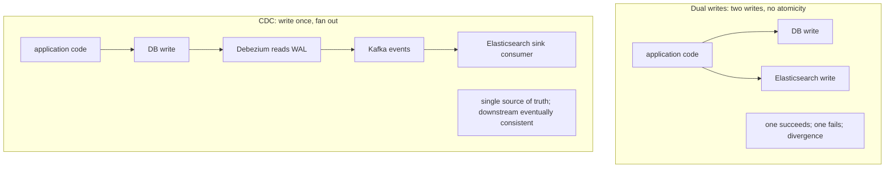
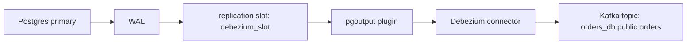
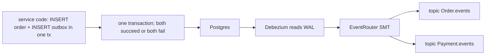

# Change Data Capture (Debezium)

A service needs to keep an Elasticsearch index, a Redis cache, and a downstream microservice in sync with the OLTP DB. The naïve approach — the service writes to the DB and then writes to each downstream system — is the **dual-write problem**: two writes that may succeed independently; one fails; data diverges; bugs forever. The cure is **Change Data Capture (CDC)** — read the DB's own change stream (Postgres WAL, MySQL binlog) and publish each row change as an event to a stream (Kafka). Downstream consumers process events; the DB and its consumers stay in sync; the application code writes only to the DB. **Debezium** is the de-facto Java-world CDC framework — a Kafka Connect source connector for Postgres / MySQL / SQL Server / Mongo / Oracle that turns logical replication into a Kafka topic of change events.

The CDC pattern is the right answer for: search-index sync; cache invalidation; cross-service replication; audit; data-warehousing pipelines; the **transactional outbox** done correctly (L4/C01/T22's outbox table + Debezium reading it, no separate poller). A senior engineer reaches for CDC whenever the question is "keep X downstream system in sync with the DB without dual writes."

This topic covers: CDC fundamentals (what's captured; before/after image); Debezium's architecture (Kafka Connect, source connector, snapshot phase, streaming phase); Postgres logical replication primitives (replication slot, output plugin like `pgoutput`); MySQL binlog mode; running Debezium (in Kafka Connect cluster vs Debezium Server); event schema (Kafka topic per table; key = primary key; value = before+after envelope); transactional outbox with Debezium and the `EventRouter` SMT; downstream sink patterns (Elasticsearch sink, JDBC sink); operational concerns (replication slot growing if consumer slow; snapshot phases; backpressure); and the alternatives (Maxwell, AWS DMS, Kinesis Data Streams).

The depth-bar this topic clears: at the **language layer**, Debezium configuration; Kafka Connect runtime; SMTs (single-message transforms). At the **memory layer**, what a change event payload looks like (~1–5 KB per row depending on column count); the throughput envelope (Debezium can stream ~10K events/s comfortably from a single connector). At the **architecture layer** — the heart — **CDC as the replacement for dual writes**, the **transactional outbox + Debezium** as the canonical "atomic DB+message" pattern, and the **operational reality** (replication slots filling disk; snapshot phases taking hours; schema changes propagating).

> [!NOTE]
> Prerequisites: [Replication (T04)](./T04-replication-and-read-replicas.md), [Partitioning (T05)](./T05-partitioning-and-sharding.md), [Spring for Kafka (L4/C01/T22)](../C01-spring-framework/T22-spring-for-kafka-amqp.md). Kafka basics (T04–T05 of C07).

## What CDC Solves — The Dual-Write Problem



The dual-write bug is a classic distributed-systems trap. CDC fixes it by making the DB the source of truth and downstream systems passive consumers of the DB's own change stream.

## What CDC Captures

A CDC event for a row change carries:

- **Operation**: INSERT, UPDATE, DELETE.
- **Before image**: row values before the change (NULL for INSERT).
- **After image**: row values after (NULL for DELETE).
- **Source metadata**: DB name, schema, table, LSN, timestamp, transaction id.
- **Schema**: the column types (so consumers can deserialize).

A Debezium Postgres event for an UPDATE looks like:

```json
{
  "op": "u",
  "ts_ms": 1717770000000,
  "source": {
    "db": "orders_db", "schema": "public", "table": "orders",
    "lsn": 12345678, "txId": 9876
  },
  "before": { "id": 42, "status": "NEW", "total": "100.00" },
  "after":  { "id": 42, "status": "PROCESSING", "total": "100.00" },
  "transaction": null
}
```

The before/after envelope makes downstream consumers trivial:

- INSERT → upsert downstream.
- UPDATE → upsert downstream (idempotent on key).
- DELETE → delete downstream.

## Postgres CDC Mechanics

Debezium reads Postgres's **logical replication** stream. Setup:

```ini
# postgresql.conf
wal_level = logical
max_replication_slots = 10
max_wal_senders = 10
```

A user with replication privileges:

```sql
CREATE ROLE debezium WITH REPLICATION LOGIN PASSWORD '...';
GRANT pg_read_server_files TO debezium;
-- per-table:
GRANT SELECT ON ALL TABLES IN SCHEMA public TO debezium;
ALTER TABLE orders REPLICA IDENTITY FULL;   -- include before-image for UPDATE/DELETE
```

`REPLICA IDENTITY FULL` makes Postgres include the full pre-image in WAL — necessary for Debezium's before-state. Without it, only PK is captured.

Debezium uses Postgres's `pgoutput` plugin (built into Postgres 10+) by default. It creates a replication slot, reads the stream, decodes events.



The replication slot tracks which WAL Debezium has consumed. **A stopped Debezium with a slot retained will fill the primary's disk** as WAL accumulates. Monitor `pg_replication_slots.active` and lag.

## MySQL CDC Mechanics

```ini
# my.cnf
server-id = 1
log_bin = ON
binlog_format = ROW
binlog_row_image = FULL
gtid_mode = ON
enforce_gtid_consistency = ON
```

Debezium connects via MySQL replication protocol (the same one used by replicas) and reads the binlog. ROW format + FULL row image gives before+after.

## Debezium Architecture

Two deployment modes:

### Kafka Connect

The classical setup: Debezium connectors run inside a **Kafka Connect** cluster (which is a separate JVM fleet from your app). Connect handles distributed coordination, offset storage, REST API for management.

```yaml
# debezium-connector.json (posted to Kafka Connect REST)
{
  "name": "orders-connector",
  "config": {
    "connector.class": "io.debezium.connector.postgresql.PostgresConnector",
    "database.hostname": "primary",
    "database.port": "5432",
    "database.user": "debezium",
    "database.password": "${DEBEZIUM_PASS}",
    "database.dbname": "orders_db",
    "topic.prefix": "orders_db",
    "schema.include.list": "public",
    "table.include.list": "public.orders,public.order_items",
    "plugin.name": "pgoutput",
    "slot.name": "debezium_slot"
  }
}
```

This produces topics:

- `orders_db.public.orders`
- `orders_db.public.order_items`

One topic per table.

### Debezium Server

A standalone embeddable runtime (no Kafka Connect needed). Sinks events to Kafka, Pulsar, Kinesis, Pub/Sub, Redis Streams, etc. Lighter footprint; less feature-rich than Connect.

## Snapshot Phase

When Debezium first starts on a table with existing rows, it can't replay history (the WAL is finite). It performs a **snapshot**: SELECT every row from the table, emit as INSERT events, then transition to streaming.

For huge tables, this is expensive:

- **Initial snapshot only**: snapshot once on first start; thereafter stream only. The default.
- **No snapshot**: skip; only stream new changes. Use when you don't need existing rows (start from now).
- **When needed**: snapshot per-table on demand.
- **Incremental snapshot** (Debezium 1.6+): snapshot a chunk at a time, interleaved with streaming. No long-lived "blocking" snapshot.

A 1-billion-row table snapshot can take days. Use incremental.

## Single Message Transforms (SMTs)

Connect's SMT framework lets you tweak events before they hit Kafka:

```json
"transforms": "unwrap,route",
"transforms.unwrap.type": "io.debezium.transforms.ExtractNewRecordState",
"transforms.unwrap.drop.tombstones": false,
"transforms.unwrap.delete.handling.mode": "rewrite",

"transforms.route.type": "io.debezium.transforms.ByLogicalTableRouter",
"transforms.route.topic.regex": "(.*)\\.public\\.(.*)",
"transforms.route.topic.replacement": "$2"
```

`unwrap` flattens the before/after envelope to just the after-state (closer to a normal Kafka record). `route` renames topics. Common SMTs:

- **unwrap** — flatten envelope.
- **route** — rename topics.
- **timestamp converter** — change date format.
- **mask** — redact PII.

## Transactional Outbox Done Right

L4/C01/T22 introduced the outbox pattern with a separate Spring poller. Debezium's `EventRouter` SMT does it without the poller:

```sql
CREATE TABLE outbox (
    id UUID PRIMARY KEY,
    aggregate_type TEXT NOT NULL,        -- "Order"
    aggregate_id TEXT NOT NULL,           -- "42"
    type TEXT NOT NULL,                    -- "OrderPlaced"
    payload JSONB NOT NULL,
    created_at TIMESTAMPTZ DEFAULT NOW()
);
```

Application code:

```java
@Transactional
public Order place(OrderRequest req) {
    Order o = orderRepo.save(new Order(req));
    outboxRepo.save(new OutboxEvent(UUID.randomUUID(), "Order", o.id().toString(),
        "OrderPlaced", toJson(new OrderPlaced(o))));
    return o;
}
```

Debezium captures inserts to `outbox`. `EventRouter` SMT:

- Reads `aggregate_type` → "Order".
- Reads `aggregate_id` → "42" (becomes the Kafka key).
- Reads `payload` → the message body.
- Routes to topic `Order.events` or per `type`.

Downstream consumers see clean events; the `outbox` table can be aggressively pruned (Debezium has captured the row; the DB row can be deleted).

```yaml
"transforms": "outbox",
"transforms.outbox.type": "io.debezium.transforms.outbox.EventRouter",
"transforms.outbox.table.field.event.type": "type",
"transforms.outbox.route.topic.replacement": "${routedByValue}.events"
```

Now `OrderPlaced` events go to `Order.events`; `PaymentSucceeded` to `Payment.events`. Single source of truth (the DB transaction); fan-out via Kafka.



## Downstream Sinks

Kafka Connect ships sink connectors:

- **Elasticsearch sink** — index documents.
- **JDBC sink** — write to another DB.
- **MongoDB sink**.
- **S3 sink** — archive raw events.
- **HDFS / Hive sink** — data lake.

For custom logic, write a Kafka consumer in your app. Both work.

## Operational Concerns

### Replication Slot Disk Pressure

A Debezium connector that's down or slow keeps its slot active. The primary retains WAL until the slot advances. WAL can fill disk in hours.

Monitor:

```sql
SELECT slot_name,
       pg_size_pretty(pg_wal_lsn_diff(pg_current_wal_lsn(), restart_lsn)) AS lag
FROM pg_replication_slots;
```

Alert when lag > 1 GB or > 30 min.

### Schema Evolution

When you ADD COLUMN to a table, the next change event has a new schema. Downstream consumers need to handle. Debezium emits schema-change events on a dedicated topic; the Avro Schema Registry tracks versions; consumers can be tolerant.

### Throughput

Debezium can sustain ~10 K events/s per connector. For higher throughput: shard the connector by table (multiple connectors per cluster) or use Debezium Server with horizontal sharding.

### Exactly-Once

Debezium gives at-least-once by default. With Kafka transactions on the Connect side and idempotent processing in consumers, you get effectively exactly-once.

## Alternatives

| Tool | Notes |
|------|-------|
| **Debezium** | Open source; Java; most featureful; standard answer. |
| **Maxwell** | MySQL only; lighter; older. |
| **AWS DMS** | Managed; supports many sources/targets; AWS-specific. |
| **Striim, Fivetran, Airbyte** | Commercial CDC products. |
| **PostgreSQL's logical streaming directly** | DIY consumer; simpler for one consumer. |

Debezium is the modern default for self-hosted CDC.

## Worked Example — Search Index Sync

```yaml
# Debezium source: Postgres orders DB
{
  "connector.class": "io.debezium.connector.postgresql.PostgresConnector",
  "database.hostname": "primary",
  "database.dbname": "orders_db",
  "table.include.list": "public.orders",
  "topic.prefix": "orders_db",
  "plugin.name": "pgoutput",
  "transforms": "unwrap",
  "transforms.unwrap.type": "io.debezium.transforms.ExtractNewRecordState"
}

# Sink: Elasticsearch
{
  "connector.class": "io.confluent.connect.elasticsearch.ElasticsearchSinkConnector",
  "topics": "orders_db.public.orders",
  "connection.url": "http://elasticsearch:9200",
  "key.ignore": "false",
  "schema.ignore": "true",
  "write.method": "upsert"
}
```

Now every order insert/update propagates to Elasticsearch within ~seconds. Application code writes only to the DB.

## Common Pitfalls

> [!WARNING]
> **`REPLICA IDENTITY DEFAULT` instead of `FULL`.** Update events have only PK in before-image; downstream consumers can't diff. Set FULL on captured tables.

> [!WARNING]
> **No monitoring on replication slot.** Disk fills; primary halts. Always alert on slot lag.

> [!WARNING]
> **First-time snapshot during peak.** Long SELECT can take hours. Schedule off-hours or use incremental snapshot.

> [!WARNING]
> **Schema changes without communication.** Consumers break. Adopt Avro + Schema Registry or coordinate deploys.

> [!WARNING]
> **Treating CDC as synchronous.** It's eventually consistent. Downstream may lag seconds.

> [!WARNING]
> **Outbox without pruning.** Table grows unbounded. Prune after Debezium captures (track LSN).

> [!WARNING]
> **Single Debezium connector for everything.** Failure stops all CDC. Run multiple connectors per concern.

> [!WARNING]
> **CDC events to non-idempotent consumers.** At-least-once = duplicates. Make consumers idempotent.

> [!WARNING]
> **No backpressure plan.** If a sink is slow, events queue in Kafka; eventually disk fills. Monitor Kafka lag.

## Practice

1. Set up Debezium on a Postgres DB via Docker Compose. INSERT a row; observe the Kafka event.
2. Implement the transactional outbox with `EventRouter` SMT. Verify events arrive on `Order.events`.
3. Wire an Elasticsearch sink; INSERT in Postgres; verify the row appears in Elasticsearch.
4. Trigger a Debezium connector failure mid-stream (kill the pod). Restart; verify it picks up from the slot's last LSN without loss.
5. Trigger schema change (ADD COLUMN); observe Debezium's schema event; update consumer to handle.
6. Profile snapshot phase on a 1M-row table; switch to incremental snapshot; compare.
7. Wire `pg_replication_slots` to Prometheus; build a slot-lag dashboard.
8. Compare Debezium with AWS DMS for the same source-sink pair.

## Recap

You should now be able to:

- Explain CDC as the cure for dual writes; recognize the dual-write bug pattern.
- Set up Debezium on Postgres (`wal_level=logical`, replication slot, `pgoutput`) and MySQL (binlog row + GTID).
- Use `REPLICA IDENTITY FULL` for proper before-image capture.
- Choose Kafka Connect vs Debezium Server based on operational fit.
- Run snapshot phases: initial vs incremental for huge tables.
- Use SMTs: `unwrap` for envelope flattening; `EventRouter` for transactional outbox.
- Implement the transactional outbox correctly: DB transaction inserts to outbox; Debezium captures and routes.
- Wire downstream sinks (Elasticsearch, JDBC, S3) via Kafka Connect.
- Monitor Debezium operationally: replication-slot lag, throughput, schema events.
- Plan schema evolution: Avro + Schema Registry; tolerant consumers.
- Avoid the canonical pitfalls: REPLICA IDENTITY DEFAULT, no slot monitoring, peak-hours snapshots, non-idempotent consumers.

## Next

C03 is complete (6 of 6 topics). Continue to [C04 NoSQL & Caching](../C04-nosql-and-caching/) for the deep treatment of NoSQL databases (MongoDB, Redis, Cassandra, Elasticsearch, graph DBs), Spring Data integration with each, and caching patterns (cache-aside, write-through, write-behind, Caffeine, distributed Redis caches, CDN caching).
