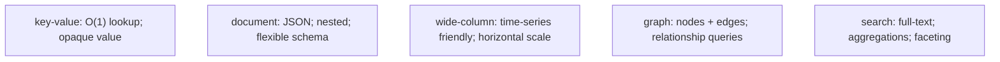
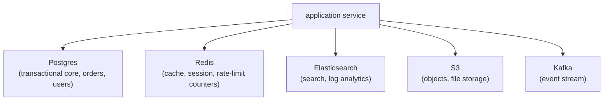

# When to use NoSQL vs SQL

"NoSQL" is an umbrella term for non-relational databases that emerged in the late 2000s to address scaling and modeling problems that relational DBs handled awkwardly. By 2026 the umbrella covers five distinct categories — **key-value stores** (Redis, DynamoDB), **document stores** (MongoDB), **wide-column stores** (Cassandra, ScyllaDB), **graph databases** (Neo4j), **search engines** (Elasticsearch / OpenSearch) — and increasingly **vector databases** (Pinecone, Weaviate, pgvector) for ML embeddings. Each makes specific trade-offs: schema flexibility vs strict types; eventual vs strong consistency; horizontal scalability vs ACID transactions; rich queries vs predictable performance.

A senior engineer's job is not to pick "NoSQL" or "SQL" but to pick the *right database for each data set*. Modern services typically use multiple databases — Postgres for the relational core, Redis for cache and session, Elasticsearch for full-text search, S3 for objects, sometimes Cassandra for time series, sometimes a graph DB for recommendation queries. This is **polyglot persistence**: pick a database per access pattern, not per service. The discipline is choosing each deliberately, knowing the trade-offs, and accepting the operational cost of running multiple data systems.

This is the opening topic of C04 *NoSQL & Caching*. We frame the entire space here so subsequent topics (T02 MongoDB, T03 Redis, T04 Cassandra, T05 Elasticsearch, T06 Graph DBs) land in context. We cover: the CAP theorem and its practical meaning; the categories of NoSQL with their representative engines; the SQL strengths NoSQL doesn't replicate (joins, ad-hoc queries, ACID, mature operational tooling); the NoSQL strengths SQL doesn't match (horizontal write scale, flexible schemas, specialized query shapes); when **Postgres-as-NoSQL** (jsonb columns, materialized views) is enough; the polyglot pattern; and the practical decision matrix per access pattern.

The depth-bar this topic clears: at the **language layer**, the vocabulary of NoSQL (consistency models, denormalization, partition key, shard, replica set). At the **memory layer**, the cost difference between systems — Postgres single-row ~50 µs; Redis ~100 µs network round-trip; DynamoDB ~10 ms; Cassandra ~5 ms; Elasticsearch ~50 ms for complex queries. At the **architecture layer** — the heart — **the decision being per-access-pattern, not per-service**, the **polyglot persistence** model as the norm in 2026, and the **default-to-Postgres** posture (rich features, ACID, jsonb, materialized views, increasingly extensions for vectors and time series) until measurement shows the need to specialize.

> [!NOTE]
> Prerequisites: C02 (JPA / Hibernate) and C03 (databases advanced). General distributed-systems concepts (replication, partitioning).

## The Five NoSQL Categories

| Category | Examples | Shape | Killer use |
|----------|----------|-------|------------|
| **Key-value** | Redis, Memcached, DynamoDB | `key → opaque value` | cache, session, counter |
| **Document** | MongoDB, Couchbase | `key → JSON document` | flexible-schema entities |
| **Wide-column** | Cassandra, ScyllaDB, HBase | `(partition, clustering) → value` | time series, write-heavy |
| **Graph** | Neo4j, ArangoDB | `nodes + edges` | networks, recommendations |
| **Search** | Elasticsearch, OpenSearch, Meilisearch | inverted-index documents | full-text, aggregations |

## CAP Theorem — The Trade-Off Frame

Eric Brewer's 2000 conjecture, proven by Gilbert & Lynch (2002): a distributed data system can guarantee at most **two** of:

- **Consistency** — every read sees the latest write.
- **Availability** — every request returns a response.
- **Partition tolerance** — the system continues despite network partitions.

Since partitions are inevitable (networks fail), every real distributed DB trades C and A. In practice:

- **CP**: prioritize consistency; refuse writes when partitioned. Examples: MongoDB (default), HBase, ZooKeeper.
- **AP**: accept writes during partition; reconcile later. Examples: Cassandra, DynamoDB (configurable), Riak.

But **single-leader RDBMSs are CP** by this lens — they refuse writes when the leader is unreachable. CAP isn't "NoSQL is AP". It's a lens for understanding any distributed system's failure-mode trade-off.

The modern refinement is **PACELC** (Daniel Abadi): when there's a Partition, choose A or C; *Else* (normal operation), choose Latency or Consistency. Real systems offer this knob — DynamoDB, Cassandra, Cosmos DB all let you pick "strong read" (slower, consistent) vs "eventual read" (faster, possibly stale) per query.

## What SQL Gives You

The strengths NoSQL trades away (and often regrets):

- **ACID transactions** across multiple rows/tables.
- **Ad-hoc queries**: any combination of WHERE / JOIN / GROUP BY without index-or-die.
- **Joins**: relational normalization works; denormalization is optional.
- **Mature operational tooling**: 30 years of monitoring, backup, replication.
- **Strict schemas**: validation at the DB layer.
- **Strong consistency** trivially (single leader).
- **Standard query language** that engineers already know.

For most CRUD applications under ~1B rows, a well-tuned Postgres handles everything. Reach for NoSQL when SQL's strengths don't match the access pattern.

## What NoSQL Gives You

The strengths SQL trades away:

- **Horizontal write scalability**: Cassandra / DynamoDB cluster up to billions of rows per second; SQL primary is bound by one server's write throughput.
- **Flexible schemas**: add a field per-document without ALTER TABLE.
- **Specialized query shapes**: full-text search, graph traversal, geographic queries — all NoSQL specialties.
- **Lower latency at scale**: Redis ~100 µs; DynamoDB sub-10ms; matches Postgres only when Postgres has the right index.
- **Built-in distribution**: many NoSQL DBs are sharded from day one; SQL sharding is bolt-on.

## The Postgres-As-NoSQL Path

Postgres has steadily absorbed NoSQL features:

- **`jsonb`** — flexible-schema documents within rows; GIN-indexed for path queries.
- **`tsvector` + GIN** — built-in full-text search (good for simple cases).
- **Range types + GiST** — interval / geometric queries.
- **Materialized views** — pre-computed aggregations.
- **PostGIS** — geographic queries (the standard).
- **TimescaleDB extension** — time series.
- **pgvector** — vector embeddings (ML).
- **Citus extension** — horizontal sharding.
- **Logical replication** — selective replication / CDC (T06 of C03).

For many use cases that "needed NoSQL" in 2014, modern Postgres is enough. **The default posture: start with Postgres; reach for specialized stores when measurement proves the need.**

## The Polyglot Persistence Pattern

A typical 2026 backend:

Each data store handles its access pattern. Synchronization between them (e.g., Postgres → Elasticsearch) typically via CDC (T06 of C03).

## Decision Matrix

For a given dataset / access pattern:

| Access pattern | Pick |
|----------------|------|
| Transactional CRUD with relations | **Postgres / MySQL** |
| Hot-key cache / session | **Redis** |
| Document with flexible schema, simple queries | **MongoDB** (or Postgres jsonb) |
| Time series, write-heavy | **Cassandra / Scylla** (or TimescaleDB) |
| Full-text search | **Elasticsearch** |
| Graph traversal | **Neo4j** (or Postgres recursive CTE) |
| ML embeddings | **pgvector / Pinecone / Weaviate** |
| Object / blob storage | **S3 / GCS** |
| Counters at extreme scale | **Redis / DynamoDB** |
| Strong global consistency | **CockroachDB / Spanner** |
| Append-only audit log | **Kafka** + **S3 archive** |

## Common Decision Mistakes

> [!WARNING]
> **"NoSQL because we need to scale".** Most apps don't scale beyond Postgres. Profile actual load before adopting.

> [!WARNING]
> **MongoDB for relational data.** Joins and transactions belong in SQL. Mongo's pricing in complexity exceeds Postgres for normalized data.

> [!WARNING]
> **Cassandra for low-write throughput.** Wasted complexity. Cassandra's value is millions of writes per second; for thousands, Postgres is simpler.

> [!WARNING]
> **Elasticsearch as primary store.** It's a search index, not a primary DB. Keep Postgres authoritative; sync to ES via CDC.

> [!WARNING]
> **Redis as primary store without persistence config.** Default is volatile. Configure AOF for durability or accept loss.

> [!WARNING]
> **Adopting N data stores for a small team.** Each is a separate ops burden. Polyglot has fixed cost per store.

> [!WARNING]
> **Believing CAP theorem prescribes which to pick.** CAP describes constraints; doesn't dictate choices. Read the actual trade-offs of each DB.

## A 2026 Default Stack

For a startup or new service, a sensible default:

- **Postgres** — primary store (transactional + jsonb for flexibility + pgvector for ML).
- **Redis** — cache + session.
- **Kafka** — event stream (only if multi-service async needed).
- **S3** — objects.

Add Elasticsearch when search becomes core. Add Cassandra / time-series when write volume demands. Add a graph DB rarely (recursive CTE in Postgres usually suffices). This stack handles 95% of services up to substantial scale.

## Common Pitfalls

> [!WARNING]
> **Over-engineering for hypothetical scale.** Most apps never reach the scale that justifies NoSQL. Start simple.

> [!WARNING]
> **Spreading data across too many stores.** Cross-store consistency is the hardest problem. Consolidate when possible.

> [!WARNING]
> **Treating NoSQL as schemaless.** Schemas exist; they're just enforced in app code or downstream consumers. Document them.

> [!WARNING]
> **Using a vector DB when pgvector would do.** A 10M-vector workload runs fine on Postgres + pgvector.

> [!WARNING]
> **Forgetting NoSQL ops cost.** Each new DB = new monitoring, backup, failover, expertise.

## Practice

1. Take your current service's data model. Categorize each dataset by access pattern. Decide which DB fits each.
2. Map a real query that's slow on Postgres. Could a specialized DB help? Quantify the gain.
3. For a hypothetical new service: design the polyglot stack. Justify each.
4. Pick a NoSQL category you haven't used. Spin up a Docker instance. Insert 10K rows; query.
5. Compare Postgres jsonb vs MongoDB for the same document workload. Measure read / write throughput.
6. Compare Redis vs Postgres for a counter workload (`INCREMENT` per HTTP request). Measure throughput.
7. Use pgvector for an embedding similarity search. Compare to a hypothetical Pinecone setup.
8. Justify your team's current stack. If you'd redo today, what would change?

## Recap

You should now be able to:

- Categorize NoSQL stores: key-value, document, wide-column, graph, search.
- Apply CAP / PACELC to reason about distributed-DB trade-offs.
- Identify SQL strengths NoSQL trades away (joins, ACID, ad-hoc queries) and NoSQL strengths SQL trades away (write scale, flexible schemas, specialized queries).
- Recognize Postgres-as-NoSQL features that reduce the need for specialized stores.
- Apply polyglot persistence: pick a DB per access pattern, not per service.
- Use the default 2026 stack (Postgres + Redis + S3 + Kafka) as the baseline; add specialized stores only when measurement justifies.
- Reach for Elasticsearch for full-text; Cassandra for write-heavy time series; MongoDB for genuinely-flexible documents; Redis for cache/session/counters; graph DB rarely.
- Recognize the ops cost of each additional store.
- Avoid the canonical pitfalls: NoSQL-because-scale-fear, MongoDB-for-relational, Elasticsearch-as-primary, Redis-without-persistence-config.

## Next

Continue to [Document stores (MongoDB)](./T02-document-stores-mongodb.md) for the deep treatment of MongoDB — document model, indexes, aggregation pipeline, Spring Data MongoDB, transaction support, and the trade-offs vs Postgres jsonb.
