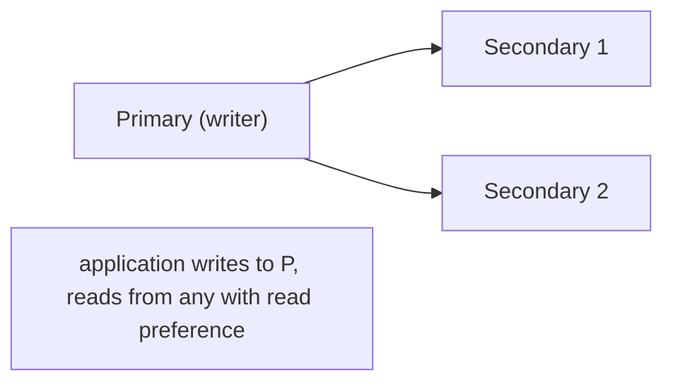
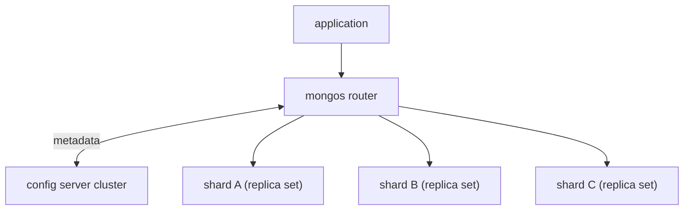

# Document stores (MongoDB)

A document store keeps data as **self-contained JSON-like documents** rather than rows in tables. Each document can have its own structure (no rigid schema); nested data is stored inline (no joins for the common case); the unit of read and write is a document. **MongoDB** has dominated the document space since ~2009. Its design philosophy: model data the way the application uses it, not the way a relational normalizer would (so an `Order` document holds its items inline as an array; you read or write the whole order in one operation). The trade-offs are real — relational queries over multiple document types are awkward; multi-document transactions are slow and feature-gated; schema flexibility means schema drift unless you discipline yourself.

A senior engineer reaches for MongoDB when (a) documents are genuinely self-contained and read together; (b) schema variation across instances is high and worth modeling as fields rather than typed columns; (c) you want simple horizontal sharding from day one. For relational, multi-entity data, Postgres remains the better default.

This topic covers: the document model (BSON, embedding vs referencing); MongoDB's index types (single-field, compound, multikey, text, geo, TTL); the aggregation pipeline as a SQL-equivalent for queries; the replica set + sharded cluster topology; consistency knobs (write concern, read preference, read concern); multi-document transactions (since 4.0; their constraints); Spring Data MongoDB (`MongoTemplate`, `MongoRepository`); change streams as Kafka-like CDC on MongoDB; time-series collections; the practical patterns; and when to keep using Postgres jsonb instead.

> [!NOTE]
> Prerequisites: [When to use NoSQL vs SQL (T01)](./T01-when-to-use-nosql-vs-sql.md), [Spring Data (L4/C01/T13)](../C01-spring-framework/T13-spring-data.md).

## The Document Model

```json
// 'orders' collection — one document per order
{
  "_id": ObjectId("6748f3aabcdef..."),
  "customerId": "cust_42",
  "status": "PROCESSING",
  "items": [
    { "sku": "WIDGET", "qty": 2, "unitPrice": 9.99 },
    { "sku": "GADGET", "qty": 1, "unitPrice": 49.99 }
  ],
  "shippingAddress": {
    "line1": "123 Main St", "city": "Boston", "zip": "02110"
  },
  "total": { "amount": 69.97, "currency": "USD" },
  "createdAt": ISODate("2026-06-08T12:00:00Z")
}
```

Equivalent in SQL would be 3–4 tables joined on FK. In MongoDB it's one document, read with one query.

**`_id`** is mandatory; default is `ObjectId` (12 bytes: timestamp + machine + counter). Custom `_id`s (UUID, business key) work.

## Embed vs Reference

The single biggest modeling decision.

**Embed** when:

- Child data is owned by parent (order's items; user's addresses).
- You always read parent and child together.
- Child doesn't exist independently.

**Reference** (store an `ObjectId` pointing to another collection) when:

- Child is shared (Product referenced by many Orders).
- Child grows unbounded (user's posts; events).
- You query child independently.

```json
// Embed: items inside order
{ "_id": ..., "items": [{ "sku": "WIDGET", ... }] }

// Reference: order points to customer
{ "_id": ..., "customerId": "cust_42", ... }
// Look up customer separately
```

References require **application-side joins** (extra round trip) or the **`$lookup`** aggregation stage (slow if used often). Embed where you can.

## Indexes

MongoDB indexes look much like SQL (B-tree underneath):

```javascript
db.orders.createIndex({ customerId: 1, createdAt: -1 });   // compound
db.orders.createIndex({ "items.sku": 1 });                  // multikey (auto on array field)
db.orders.createIndex({ status: 1 }, { partialFilterExpression: { status: { $in: ["NEW", "PROCESSING"] } } });
db.orders.createIndex({ createdAt: 1 }, { expireAfterSeconds: 86400 * 30 });  // TTL
db.posts.createIndex({ body: "text" });                     // full-text
db.locations.createIndex({ coords: "2dsphere" });           // geo
db.tokens.createIndex({ token: "hashed" });                 // hashed (sharding)
```

| Type | Use |
|------|-----|
| **Single-field** | by one field |
| **Compound** | by multiple fields; leftmost-prefix rule (same as SQL) |
| **Multikey** | auto on array fields |
| **Text** | basic full-text |
| **2dsphere / 2d** | geographic |
| **Hashed** | for hash-based sharding |
| **TTL** | auto-delete expired |
| **Partial** | filter clause |
| **Wildcard** | unknown-shape documents |

Most rules from C03/T01 apply: equality before range; selective first; covering for index-only scans.

## Aggregation Pipeline

MongoDB's set-based query language. A pipeline of stages each transforming the document stream:

```javascript
db.orders.aggregate([
  { $match: { createdAt: { $gte: ISODate("2026-06-01") } } },
  { $unwind: "$items" },
  { $group: {
      _id: "$items.sku",
      totalQty: { $sum: "$items.qty" },
      totalRevenue: { $sum: { $multiply: ["$items.qty", "$items.unitPrice"] } }
  }},
  { $sort: { totalRevenue: -1 } },
  { $limit: 10 }
]);
```

Stages map to SQL:

| Stage | SQL equivalent |
|-------|----------------|
| `$match` | WHERE |
| `$project` | SELECT (column choice) |
| `$lookup` | JOIN |
| `$unwind` | unnest array |
| `$group` | GROUP BY |
| `$sort` | ORDER BY |
| `$limit` / `$skip` | LIMIT / OFFSET |
| `$facet` | parallel sub-pipelines |
| `$bucket` | discrete bucketing |
| `$out` / `$merge` | INSERT INTO target collection |

Aggregation is **the** way to write non-trivial Mongo queries. Mastering it is mandatory.

## Replica Sets

MongoDB's HA primitive: 3 nodes (typically), one **primary** accepts writes, others are **secondaries** replicating via the **oplog** (Mongo's WAL equivalent). On primary failure, election picks a new primary in seconds.



`mongodb://node1,node2,node3/?replicaSet=rs0` — the driver discovers the set; survives failover.

## Write Concern, Read Preference, Read Concern

Three knobs covering MongoDB's consistency choices:

### Write Concern

How durable is a write?

- `w: 1` — primary ack only (fast; data loss on primary fail before replication).
- `w: "majority"` — majority of nodes ack (default for many drivers since 5.0; ~5–20 ms more).
- `w: "majority", j: true` — also wait for journal write to disk.

For financial: `w: "majority", j: true`. For analytics: `w: 1`.

### Read Preference

Which node serves reads?

- `primary` — always (consistent).
- `primaryPreferred` — primary if up, else secondary.
- `secondary` — always secondary (stale-tolerant; offloads primary).
- `nearest` — lowest latency.

### Read Concern

How fresh / safe is what you read?

- `local` — latest known (possibly uncommitted under failover).
- `majority` — only data acknowledged by majority (safe).
- `linearizable` — strongest (slow).

The combination determines actual semantics. `w: majority + readConcern: majority` gives strong consistency. `w: 1 + readPreference: secondary` is fast but stale.

## Multi-Document Transactions

MongoDB 4.0+ supports ACID transactions across multiple documents (within one replica set; 4.2+ for sharded clusters):

```java
ClientSession session = mongoClient.startSession();
session.startTransaction();
try {
    accounts.updateOne(session, eq("_id", from), inc("balance", -amount));
    accounts.updateOne(session, eq("_id", to), inc("balance", amount));
    session.commitTransaction();
} catch (Exception e) {
    session.abortTransaction();
    throw e;
}
```

Caveats:

- Slower than single-doc updates (typically 5–10×).
- 60-second timeout default.
- Limited to ~1000 operations per transaction.

**MongoDB philosophy**: design data to make multi-doc transactions rare. Embed related data in one doc when possible.

## Spring Data MongoDB

```xml
<dependency>
    <groupId>org.springframework.boot</groupId>
    <artifactId>spring-boot-starter-data-mongodb</artifactId>
</dependency>
```

```yaml
spring:
  data:
    mongodb:
      uri: mongodb://mongo:27017/orders_db
```

Define entities:

```java
@Document("orders")
public class Order {
    @Id String id;
    String customerId;
    OrderStatus status;
    List<OrderItem> items;
    Address shippingAddress;
    Money total;
    Instant createdAt;
}

public interface OrderRepository extends MongoRepository<Order, String> {
    List<Order> findByCustomerIdAndStatus(String customerId, OrderStatus status);
    List<Order> findByCreatedAtGreaterThan(Instant since);

    @Query("{ 'items.sku': ?0 }")
    List<Order> findByItemSku(String sku);

    @Aggregation(pipeline = {
        "{ $match: { createdAt: { $gte: ?0 } } }",
        "{ $group: { _id: '$status', count: { $sum: 1 } } }"
    })
    List<StatusCount> countByStatus(Instant since);
}
```

For complex queries, use `MongoTemplate`:

```java
@Service
public class OrderQueryService {
    private final MongoTemplate mongo;

    public List<Order> recent(String customerId, int limit) {
        Query q = Query.query(Criteria.where("customerId").is(customerId))
                       .with(Sort.by(Sort.Direction.DESC, "createdAt"))
                       .limit(limit);
        return mongo.find(q, Order.class);
    }
}
```

## Change Streams

MongoDB's CDC equivalent. Subscribe to a collection's change stream:

```java
mongoClient.getDatabase("orders_db").getCollection("orders")
    .watch().forEach(change -> {
        System.out.println("Operation: " + change.getOperationType());
        System.out.println("Doc: " + change.getFullDocument());
    });
```

Change streams power: search-index sync; cache invalidation; cross-service replication. Built on the oplog; tail-able and reliable.

## Time-Series Collections

MongoDB 5.0+ ships time-series collections optimized for high-frequency timestamped data:

```javascript
db.createCollection("metrics", {
   timeseries: {
      timeField: "ts",
      metaField: "host",
      granularity: "seconds"
   }
});
```

Internally bucketed by time; smaller storage; faster range queries. For pure time-series, dedicated TSDBs (InfluxDB, TimescaleDB) often outperform.

## Sharded Clusters

For horizontal scale:

- **Config servers** hold metadata.
- **mongos** routers dispatch queries.
- **Shards** are replica sets holding data partitions.

Sharded by a **shard key** (compound is fine). Hash-based shards distribute evenly; range-based shards cluster by key. Choose the key carefully — it's nearly impossible to change.



## MongoDB vs Postgres jsonb

For "I need flexible documents":

| Aspect | MongoDB | Postgres jsonb |
|--------|---------|----------------|
| Document model | first-class | second-class (in a column) |
| ACID multi-doc | possible (slow) | yes (native) |
| Joins | `$lookup` (slow) | native (fast) |
| Indexes on nested | yes (multikey) | yes (GIN on jsonb) |
| Horizontal sharding | built-in | Citus extension |
| Maturity at small scale | good | excellent |
| Operational expertise | separate | known |

**For most "document" use cases, Postgres jsonb is enough.** Reach for MongoDB when documents are >50% of your data shape and you want native sharding.

## Common Pitfalls

> [!WARNING]
> **Over-embedding.** A document that grows unbounded (chat messages embedded in conversation) eventually exceeds 16MB doc limit. Reference for unbounded children.

> [!WARNING]
> **Multi-doc transactions everywhere.** Slow; recent feature. Design embedded.

> [!WARNING]
> **No indexes on query fields.** Sequential scans on huge collections. Index every common query.

> [!WARNING]
> **Sharding too early.** Replica sets handle most workloads. Shard when measurement demands.

> [!WARNING]
> **Wrong shard key.** Irreversible. Choose to match dominant queries.

> [!WARNING]
> **Default write concern not understood.** `w: 1` can lose data on failover; `w: majority` is safer but slower.

> [!WARNING]
> **Spring Data Mongo @Document with mismatched collection name.** Defaults to lowercase class name; override via `@Document("collection")`.

> [!WARNING]
> **Schema drift untracked.** Documents accumulate variations over years. Validate schemas in app or via Mongo's schema validation.

## Practice

1. Model an Order with embedded items + referenced Customer. Insert; query; observe `$lookup` cost.
2. Create a compound index; verify it speeds your query via `explain()`.
3. Build a 4-stage aggregation: `$match`, `$unwind`, `$group`, `$sort`. Compare to equivalent SQL.
4. Set up a 3-node replica set in Docker. Kill the primary; observe failover.
5. Tune write concern from `w: 1` to `w: "majority", j: true`; measure latency impact.
6. Use Spring Data MongoDB: define a Repository; write `@Query` and `@Aggregation` methods.
7. Subscribe to change stream; trigger inserts; observe events.
8. Compare a 100K-document workload on MongoDB vs Postgres jsonb.

## Recap

You should now be able to:

- Model in documents: embed for owned/co-read; reference for shared/unbounded.
- Use MongoDB indexes (single-field, compound, multikey, text, geo, TTL, partial); apply leftmost-prefix rule.
- Write aggregation pipelines covering filter, group, sort, lookup, unwind.
- Set up replica sets for HA; understand the oplog.
- Configure write concern, read preference, read concern for the consistency-latency trade-off you need.
- Use multi-document transactions sparingly; prefer embed-based designs.
- Wire Spring Data MongoDB with `MongoRepository`, `MongoTemplate`, `@Query`, `@Aggregation`.
- Use change streams for CDC; time-series collections for ts data.
- Shard with a deliberate shard key; understand the irreversibility.
- Choose Postgres jsonb when documents are minority of workload; MongoDB when documents dominate.

## Next

Continue to [Key-value stores (Redis)](./T03-key-value-stores-redis.md) for the deep treatment of Redis — data structures, persistence, replication, pub/sub, streams, Lua scripting, and the dominant use cases (cache, session, counter, rate-limit, queue).
