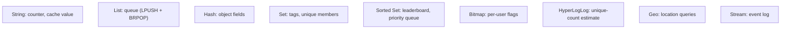
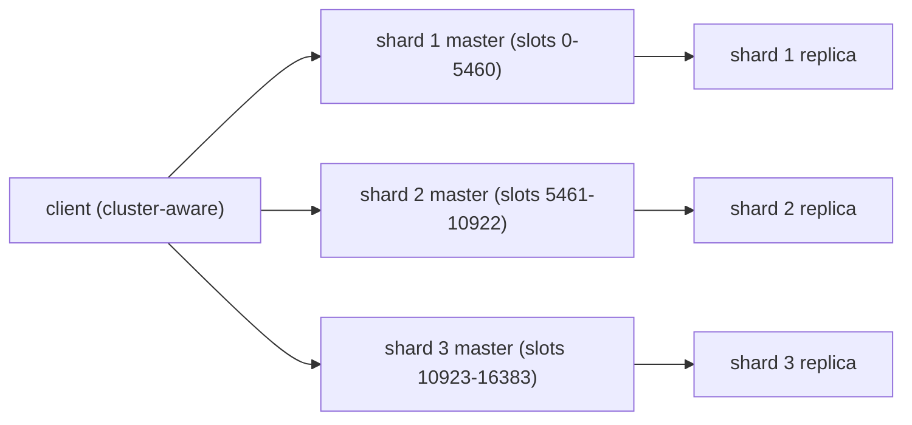

# Key-value stores (Redis)

Redis is the default in-memory data store of the 2020s. Originally a simple key→string KV store, it grew to support **rich data structures** (lists, hashes, sets, sorted sets, bitmaps, hyperloglog, streams, geo, JSON via module), **server-side scripting** (Lua, Functions), **pub/sub**, **persistence** (RDB snapshots, AOF append-only log), **replication and sharding** (Sentinel for HA, Cluster for sharded HA), and a thriving ecosystem of clients and Spring integration. Performance is the appeal: ~100 µs round-trip from an in-VPC client, ~1 M operations/sec on a single instance. The use cases: **cache**, **session store**, **counters** (page views, rate limits), **leaderboards** (sorted sets), **pub/sub**, **distributed locks**, **streams** (lightweight Kafka alternative), **queues** (lists with `BLPOP`).

A senior engineer treats Redis as a *primary infrastructure component*, not just a cache. Knowing the data structures and choosing the right one per use case (a sorted set for ranking; a hash for an object; a stream for an event log) is what separates an effective Redis user from someone using it as `String → String`.

This topic covers: every data structure with its typical use; persistence choices (RDB / AOF / both); replication and cluster topology; pub/sub vs streams; transactions (`MULTI/EXEC`) and pipelining; Lua scripting for atomicity; Spring Data Redis (Jedis vs Lettuce vs Redisson); reactive Redis; distributed locks (Redlock); rate limiting via INCR; the eviction policies and memory management.

> [!NOTE]
> Prerequisites: [When NoSQL vs SQL (T01)](./T01-when-to-use-nosql-vs-sql.md), [Spring Session (L4/C01/T23)](../C01-spring-framework/T23-spring-session.md).

## Data Structures

The killer feature.

### String

```
SET user:42 "{\"name\":\"alice\"}" EX 3600   # set with 1 hour TTL
GET user:42
INCR counter:page-views                       # atomic counter
APPEND log:today "new line\n"
```

Strings hold up to 512 MB; can be JSON, plain text, binary, counters (with `INCR`/`DECR`).

### List

```
LPUSH queue:tasks "task-1"
LPUSH queue:tasks "task-2"
RPOP queue:tasks                              # blocking variant: BRPOP
LRANGE queue:tasks 0 -1                       # whole list
```

Linked list of values. O(1) push/pop at ends; O(N) middle access. Right for queues (FIFO via LPUSH + BRPOP).

### Hash

```
HSET user:42 name "alice" email "alice@x.io" age 30
HGET user:42 email
HGETALL user:42
HINCRBY user:42 logins 1
```

Map within a key. Use for an object — cheaper than serializing JSON if you only need a field.

### Set

```
SADD active-users alice bob carol
SISMEMBER active-users alice
SINTER set1 set2                              # intersection
SCARD active-users                            # count
```

Unordered collection of unique values. Good for tags, unique-ness checks, set operations.

### Sorted Set

```
ZADD leaderboard 1500 alice 1200 bob 1800 carol
ZRANGE leaderboard 0 -1 WITHSCORES REV        # top descending
ZRANK leaderboard alice REV                   # alice's rank
ZINCRBY leaderboard 50 alice                  # bump score
```

Set with a score per member; sorted by score. Killer for leaderboards, priority queues, top-N queries.

### Bitmap

```
SETBIT activity:2026-06-08 42 1               # user 42 was active today
BITCOUNT activity:2026-06-08                  # count active users
```

Bit-level operations. 1 bit per user × N users / 8 = compact storage of "who was active today".

### HyperLogLog

```
PFADD visitors:2026-06-08 user1 user2 user3
PFCOUNT visitors:2026-06-08                   # ~unique count, ~0.81% error
```

Probabilistic cardinality estimator. Constant 12 KB regardless of unique-count. Trade accuracy for space.

### Geo

```
GEOADD locations -122.4194 37.7749 "san francisco"
GEOSEARCH locations FROMLONLAT -122.4 37.8 BYRADIUS 50 km
```

Sorted set with geohash scores. Range / nearest searches.

### Stream

```
XADD events:orders * type ORDER_PLACED orderId 42
XREAD COUNT 10 STREAMS events:orders 0
XGROUP CREATE events:orders consumers $
XREADGROUP GROUP consumers worker-1 COUNT 10 STREAMS events:orders >
```

Append-only log with consumer groups. Kafka-like semantics in a single Redis instance. Right for moderate-throughput event streaming without standing up Kafka.



## Persistence

In-memory by default; configure persistence:

- **RDB snapshot**: periodic point-in-time dump (binary file). Recovery loses recent writes. Fast restart. Low overhead.
- **AOF (Append-Only File)**: every write logged. Fully durable (with `appendfsync always`); ~30% slower writes. Slower restart (replay log).
- **Both**: snapshot + AOF for fast restart and durability.

```
# redis.conf
save 900 1                                   # RDB: snapshot if at least 1 write in 900s
save 300 10                                  # ...or 10 writes in 300s
appendonly yes
appendfsync everysec                         # fsync per second (compromise)
```

For cache use, RDB only (or nothing) is fine — restart-from-cold is acceptable. For session store, AOF + replication.

## Replication

Master-replica via async replication:

```
# replica.conf
replicaof master.host 6379
```

Replicas serve reads but can't write. For HA:

### Sentinel

3-node Sentinel cluster monitors the master; promotes a replica on failure; updates the client-discovered configuration.

```
# sentinel.conf
sentinel monitor mymaster 10.0.1.10 6379 2
sentinel down-after-milliseconds mymaster 5000
```

Clients connect to Sentinel to discover the current master.

### Cluster

Sharded HA across N shards; each shard is a master + replicas. **Slot-based sharding**: 16384 slots; each key hashes to a slot; each slot lives on one shard.



The client (or proxy) knows the slot map; routes commands. For multi-key ops on cluster, all keys must be in the same slot (use hash tags: `user:{42}:profile` and `user:{42}:settings` → same slot).

## Pub/Sub vs Streams

**Pub/Sub** is fire-and-forget: publisher sends to channel; subscribers receive *if connected*. No persistence; no consumer groups. Use for ephemeral events (cache invalidation broadcasts).

**Streams** persist; support consumer groups (Kafka-like); messages are acknowledged. Use for moderate-throughput event streams.

## Transactions and Pipelining

```
MULTI
SET counter 1
INCR counter
GET counter
EXEC
```

`MULTI/EXEC` queues commands; runs atomically. No rollback (commands in the batch can fail individually); semantically simpler than SQL transactions.

**Pipelining** sends many commands without waiting for each response; throughput jumps from ~10K/s (round-trip-bound) to 1M/s:

```java
Pipeline p = jedis.pipelined();
for (int i = 0; i < 10000; i++) p.set("key:" + i, "val:" + i);
List<Object> results = p.syncAndReturnAll();
```

## Lua Scripting

```
EVAL "return redis.call('GET', KEYS[1])" 1 mykey
```

Atomic execution server-side. Useful for compound operations (check-and-set, custom rate-limiters, locks):

```lua
-- Atomic increment with cap
local current = redis.call('GET', KEYS[1])
if current and tonumber(current) >= tonumber(ARGV[1]) then return 0 end
redis.call('INCR', KEYS[1])
return 1
```

Use `EVALSHA` after first eval to avoid resending the script.

## Spring Data Redis

```xml
<dependency>
    <groupId>org.springframework.boot</groupId>
    <artifactId>spring-boot-starter-data-redis</artifactId>
</dependency>
```

Lettuce (Netty-based, async, recommended) or Jedis (sync, older).

```yaml
spring:
  data:
    redis:
      host: redis
      port: 6379
      lettuce:
        pool:
          max-active: 16
```

`RedisTemplate` and `StringRedisTemplate`:

```java
@Service
public class CacheService {
    private final StringRedisTemplate redis;

    public void put(String key, String value, Duration ttl) {
        redis.opsForValue().set(key, value, ttl);
    }

    public Optional<String> get(String key) {
        return Optional.ofNullable(redis.opsForValue().get(key));
    }

    public long increment(String key) {
        return redis.opsForValue().increment(key);
    }
}
```

Spring's `@Cacheable` (T08–T10 of this section) abstracts this further.

### Redisson — Higher-Level

Redisson is a more featureful client offering distributed Java objects (locks, queues, semaphores, ConcurrentMap, etc.) backed by Redis. Excellent for distributed coordination.

```java
RLock lock = redisson.getLock("resource:42");
lock.lock(10, TimeUnit.SECONDS);
try {
    // critical section
} finally {
    lock.unlock();
}
```

## Distributed Locks — Redlock

A naïve `SET key value NX PX 30000` lock works for single-instance Redis. For multi-instance HA, the **Redlock** algorithm (acquire on majority of independent Redis nodes) is more robust. The Redlock algorithm itself has critics (Martin Kleppmann's critique). For most use cases, Redisson's `RLock` is fine; for high-stakes (financial), use a proper consensus system (ZooKeeper, etcd).

## Rate Limiting

```lua
-- Token bucket: refill_rate per second, capacity tokens
local tokens = tonumber(redis.call('GET', KEYS[1]) or ARGV[1])
local last_refill = tonumber(redis.call('GET', KEYS[2]) or 0)
local now = tonumber(ARGV[3])
local elapsed = now - last_refill
local new_tokens = math.min(tonumber(ARGV[1]), tokens + elapsed * tonumber(ARGV[2]))
if new_tokens >= 1 then
  redis.call('SET', KEYS[1], new_tokens - 1)
  redis.call('SET', KEYS[2], now)
  return 1
else
  return 0
end
```

Or use Bucket4j / Resilience4j for higher-level rate-limit abstractions backed by Redis.

## Eviction Policies

When memory fills:

- `noeviction` — refuse new writes (default).
- `allkeys-lru` — evict least-recently-used (good for cache).
- `allkeys-lfu` — least-frequently-used (better for hot-key caches).
- `volatile-lru` / `volatile-lfu` — only evict keys with TTL.
- `volatile-random` — random eviction of TTL keys.
- `allkeys-random` — random eviction.

For cache: `allkeys-lru` or `allkeys-lfu`. For session (no eviction wanted): `noeviction` with `maxmemory` set to never reach.

## Common Pitfalls

> [!WARNING]
> **Using `KEYS *` in production.** Blocks the server (O(N)). Use `SCAN`.

> [!WARNING]
> **Hot key.** All operations on one key serialize on one shard. Spread keys (use hash tags carefully).

> [!WARNING]
> **No eviction policy for cache.** Default `noeviction` causes write failures when memory fills. Always set `allkeys-lru`.

> [!WARNING]
> **AOF without `appendfsync` understanding.** `always` = safest, slowest. `everysec` = compromise (lose ≤ 1 s on crash).

> [!WARNING]
> **Cluster multi-key ops crossing slots.** Errors. Use hash tags or rethink.

> [!WARNING]
> **Lua scripts with side effects.** A failed script in the middle leaves state; design idempotent.

> [!WARNING]
> **Pub/Sub for important messages.** No persistence; subscribers offline = lost messages. Use Streams.

> [!WARNING]
> **Naïve SET-based distributed lock without expiry.** Holds forever on app crash. Always TTL.

## Practice

1. Use 5 different data structures (string, hash, list, sorted set, set) for 5 different use cases.
2. Configure RDB only; restart Redis; verify cache survives. Add AOF; repeat for session-like data.
3. Set up a 3-shard cluster in Docker. Use hash tags for multi-key ops within a slot.
4. Pipeline 10K SET commands; compare throughput to one-by-one.
5. Implement a Redisson distributed lock; test concurrent acquisition.
6. Build a rate limiter via Lua; test under load.
7. Stream events via XADD/XREADGROUP; consume from a Spring service.
8. Wire Spring Session with Redis backing (L4/C01/T23); verify cross-instance session continuity.

## Recap

You should now be able to:

- Pick the right Redis data structure per use case (sorted set for ranks; hash for objects; stream for events).
- Configure persistence: RDB for cache; AOF for durability; both for fast restart + durability.
- Set up HA: Sentinel for master-replica with failover; Cluster for sharded HA.
- Use pub/sub for ephemeral; Streams for persistent.
- Use `MULTI/EXEC` and pipelining; understand each's semantics.
- Write Lua scripts for server-side atomic logic.
- Wire Spring Data Redis with Lettuce; choose Redisson for distributed coordination.
- Build distributed locks (Redisson is the safer default; Redlock controversial).
- Set eviction policy to match use case.
- Avoid the canonical pitfalls: KEYS in prod, hot keys, no eviction, naïve SET locks, Pub/Sub for important data.

## Next

Continue to [Wide-column stores (Cassandra)](./T04-wide-column-stores-cassandra.md) for write-heavy distributed databases — Cassandra's data model, partition keys, clustering columns, tunable consistency, and the workload patterns it fits.
