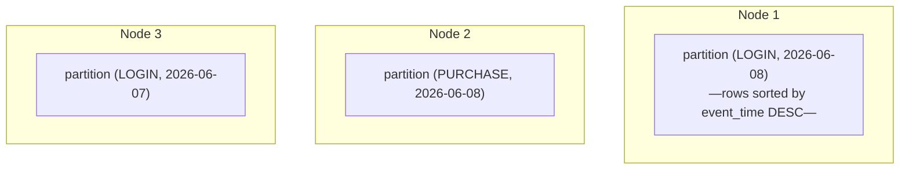
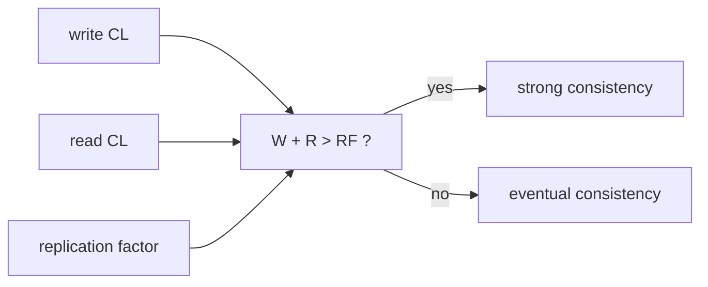
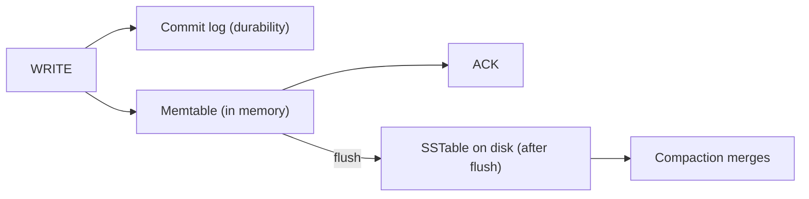

# Wide-column stores (Cassandra)

Cassandra is the database of choice when **write throughput must scale horizontally without bottlenecks**. Originally developed at Facebook (~2008) for the Inbox Search feature, then open-sourced, then refined into the production-grade Apache Cassandra and the C++-rewritten **ScyllaDB**. The signature use case is **time-series at massive scale** — IoT telemetry, user activity logs, financial tick data, ad impressions — millions of writes per second across a cluster of dozens or hundreds of nodes. Reads scale linearly too, but Cassandra's pricing is *write* throughput; reads are good but typically slower than Postgres or Redis for the same query shape.

The model is **wide-column**: a row is identified by a composite primary key (`partition_key, clustering_key1, clustering_key2, ...`), and each row holds a wide set of columns. Same logical table layout looks tabular; physical storage groups by partition key (one logical "partition" = many rows clustered on one node) for write-amortization and read-locality. Queries are nearly always *by partition key*; cross-partition queries are expensive. **You design tables per query** — denormalize, duplicate data across multiple tables to support multiple query shapes.

A senior engineer reaches for Cassandra when (a) write throughput exceeds what a sharded Postgres / MySQL handles (~50K-100K writes/s sustained per shard); (b) data has a clear time-bucketed or partition-keyed access pattern; (c) you can tolerate eventual consistency on reads; (d) you have ops capacity for a complex distributed system. For most apps, Cassandra is overkill — start with Postgres + TimescaleDB or partitioning.

This topic covers: the data model and CQL; partition keys and clustering keys; tunable consistency (ONE / QUORUM / ALL with replication factor); the write path (commit log → memtable → SSTable → compaction); read path; tombstones (the gotcha); secondary indexes and materialized views (the limits); Spring Data Cassandra; lightweight transactions (Paxos); the canonical time-series pattern; the operational complexity (gossip, repair, snitches).

> [!NOTE]
> Prerequisites: [When NoSQL vs SQL (T01)](./T01-when-to-use-nosql-vs-sql.md). Distributed systems fundamentals (consistency, replication).

## Data Model — Tables Per Query

In SQL you normalize once, query many ways. In Cassandra you **denormalize per query**:

```cql
-- Query 1: get all events for a user, recent first
CREATE TABLE events_by_user (
    user_id UUID,
    event_time TIMESTAMP,
    event_id UUID,
    event_type TEXT,
    payload TEXT,
    PRIMARY KEY (user_id, event_time, event_id)
) WITH CLUSTERING ORDER BY (event_time DESC);

-- Query 2: get all events of a type in a day
CREATE TABLE events_by_type_day (
    event_type TEXT,
    day DATE,
    event_time TIMESTAMP,
    event_id UUID,
    user_id UUID,
    payload TEXT,
    PRIMARY KEY ((event_type, day), event_time, event_id)
) WITH CLUSTERING ORDER BY (event_time DESC);
```

Two tables, same data, different keys. Application writes to both atomically (use BATCH, or async writes). The denormalization is the cost; the payoff is each query hits one partition on one node.

## Partition Key vs Clustering Key

```cql
PRIMARY KEY ((event_type, day), event_time, event_id)
```

Breaking this down:

- **Partition key**: `(event_type, day)` — determines which node holds the partition. Hash of this key picks a node.
- **Clustering keys**: `event_time, event_id` — sort order within the partition.

A **partition** is one row's worth of data with the same partition key. All clustering values for that partition live together on the same node — for our example, all events of one type on one day cluster together.



**Partition design rules**:

- Each partition should be **bounded** — ideally < 100 MB; firm cap ~10 GB.
- High cardinality → many partitions → even distribution.
- Low cardinality (e.g., partition by 5 status values) → hot partitions → cluster overload.
- Use **bucketing**: include date (or hour, or week) in the partition key to bound growth.

## Replication and Consistency

```cql
CREATE KEYSPACE app WITH replication = {
    'class': 'NetworkTopologyStrategy',
    'us-east': 3, 'us-west': 3
};
```

`replication_factor=3` per data center: each row stored on 3 nodes per DC. Cassandra is multi-master — writes go to *any* coordinator node, which forwards to replicas.

### Tunable Consistency

Per-query knobs:

- `ONE` — wait for 1 replica.
- `QUORUM` — majority (e.g., 2 of 3).
- `ALL` — all replicas (rare; loses HA).
- `LOCAL_QUORUM` — majority in the local DC (typical).
- `EACH_QUORUM` — majority in every DC.

The **CL + RF** combination determines actual consistency:

- `RF=3, write=QUORUM, read=QUORUM` → strong consistency (Q+Q > RF).
- `RF=3, write=ONE, read=ONE` → eventual; might read stale.

The classic durable + fast formula: `RF=3, write=LOCAL_QUORUM, read=LOCAL_QUORUM`. Survives one node failure per DC; strongly consistent within a DC.



## Write Path

Cassandra writes are *fast* — append-only:

1. **Commit log** on disk (durability).
2. **Memtable** in memory (sorted by key).
3. Ack to client.

Memtable fills → flushed to immutable **SSTable** on disk. Many SSTables accumulate; periodic **compaction** merges them.



This append-only design is why Cassandra writes are so fast — no in-place updates, no locks, no read-before-write.

## Read Path

Reads are slower because of multi-SSTable lookups:

1. Read from memtable.
2. Read from SSTables — multiple may have versions of the row.
3. Merge by timestamp (latest wins).
4. Return.

The reason reads are slower than writes: each partition's data may be spread across N SSTables. Compaction reduces N over time.

## Tombstones — The Big Gotcha

Cassandra deletes are also append-only: a DELETE writes a **tombstone** marker. The actual data isn't removed until compaction with a `gc_grace_seconds` window (default 10 days — must wait that long to ensure deleted-then-resurrected scenarios don't happen via repair).

Tombstones accumulate. A partition with 100K tombstones and 1K live rows scans 101K things on each read. Symptoms: slow reads on heavily-updated/deleted tables; `tombstone_warn_threshold` warnings.

**Design to avoid tombstones**:

- Use TTL on rows instead of DELETE.
- Use partitions that age out (drop the whole partition vs deleting individual rows).
- Don't update-as-delete (no `UPDATE x SET col = NULL`).

## Compaction Strategies

- **SizeTieredCompactionStrategy (STCS)**: default; merge similar-sized SSTables. Good for write-heavy.
- **LeveledCompactionStrategy (LCS)**: tighter on read amplification; more I/O. Good for read-heavy.
- **TimeWindowCompactionStrategy (TWCS)**: time-bucketed; ideal for time series with TTL.

Pick TWCS for time-series workloads (IoT, logs); LCS for read-heavy; STCS as default.

## Secondary Indexes — Use Sparingly

```cql
CREATE INDEX ON events_by_user (event_type);
```

A secondary index queries by a non-PK column. **Doesn't scale**: queries can fan out to every node. Use only when:

- The indexed column has low cardinality and selectivity is roughly even.
- The query also filters by partition key (drops fan-out).

For most lookup-by-other-column needs, **create a new table** with the desired key shape (denormalize).

## Materialized Views (Caveats)

```cql
CREATE MATERIALIZED VIEW events_by_user_type AS
    SELECT * FROM events_by_user
    WHERE user_id IS NOT NULL AND event_time IS NOT NULL AND event_id IS NOT NULL
    PRIMARY KEY (user_id, event_type, event_time, event_id);
```

Auto-maintained derived table. **Has had reliability issues** in production. Cassandra docs since 4.0 flag MVs as experimental. Many teams denormalize manually (the safer route).

## Lightweight Transactions (LWT)

Cassandra has limited transactions via **Paxos**:

```cql
INSERT INTO users (id, email) VALUES (?, ?) IF NOT EXISTS;
UPDATE accounts SET balance = ? WHERE id = ? IF balance = ?;
```

The `IF` clause triggers a Paxos round (4 round trips). **Much slower than normal writes**. Use for genuinely-must-be-atomic operations (creating with uniqueness; CAS counters); not the default.

## Spring Data Cassandra

```xml
<dependency>
    <groupId>org.springframework.boot</groupId>
    <artifactId>spring-boot-starter-data-cassandra</artifactId>
</dependency>
```

```yaml
spring:
  cassandra:
    contact-points: cass1,cass2,cass3
    keyspace-name: app
    local-datacenter: us-east
    schema-action: NONE   # never auto-create in prod
```

```java
@Table("events_by_user")
public class EventByUser {
    @PrimaryKeyColumn(name = "user_id", type = PrimaryKeyType.PARTITIONED)
    UUID userId;
    @PrimaryKeyColumn(name = "event_time", ordinal = 1, ordering = Ordering.DESCENDING)
    Instant eventTime;
    @PrimaryKeyColumn(name = "event_id", ordinal = 2)
    UUID eventId;
    String eventType;
    String payload;
}

public interface EventRepository extends CassandraRepository<EventByUser, MapId> {
    List<EventByUser> findByUserId(UUID userId);
    @AllowFiltering
    List<EventByUser> findByEventType(String eventType);
}
```

`CassandraTemplate` for non-trivial queries. `ReactiveCassandraRepository` for reactive.

## Time-Series Pattern

The canonical use case:

```cql
CREATE TABLE sensor_readings (
    sensor_id UUID,
    bucket_hour TIMESTAMP,
    reading_time TIMESTAMP,
    temperature DOUBLE,
    PRIMARY KEY ((sensor_id, bucket_hour), reading_time)
) WITH CLUSTERING ORDER BY (reading_time DESC)
  AND default_time_to_live = 2592000   -- 30 days
  AND compaction = { 'class': 'TimeWindowCompactionStrategy' };
```

- **Bucket**: `(sensor_id, bucket_hour)` — partition per sensor per hour. Bounded size.
- **TTL**: rows auto-expire.
- **TWCS**: efficient time-based compaction.
- **Order DESC**: latest first within the partition.

Querying:

```cql
SELECT * FROM sensor_readings
WHERE sensor_id = ? AND bucket_hour = ?
  AND reading_time >= ? AND reading_time < ?;
```

One partition; one node; fast. To query across multiple hours, app issues multiple queries (one per bucket) and combines.

## Cassandra vs Alternatives

| Need | Cassandra | Alternative |
|------|-----------|-------------|
| Massive write throughput | **strong** | sharded MySQL/Postgres (lots of ops) |
| Time-series ≤ 100K writes/s | overkill | **TimescaleDB / InfluxDB** |
| Strong global consistency | weak | **CockroachDB / Spanner** |
| Relational queries | weak | **Postgres** |
| Document model | weak | **MongoDB** |
| Tunable consistency, multi-DC | **strong** | hard elsewhere |
| Cheap reads via index | weak | Postgres |
| Cheap writes at scale | **strong** | DynamoDB |

ScyllaDB is API-compatible with Cassandra but rewritten in C++; 5-10× faster per node. New deployments often prefer Scylla.

## Operational Reality

Running Cassandra requires:

- **Repair**: anti-entropy process to reconcile divergent replicas. Schedule weekly per node. Network/CPU heavy.
- **Snitch**: tells Cassandra the network topology; routing-aware. Configure correctly per environment.
- **Gossip**: cluster membership chat. Auto.
- **Compaction monitoring**: backlog growth means I/O can't keep up.
- **Tombstone monitoring**: per-table.
- **Disk space**: at least 30% headroom for compaction.
- **JVM tuning**: G1GC at minimum.

This operational burden is why managed Cassandra (AWS Keyspaces, DataStax Astra) is popular.

## Common Pitfalls

> [!WARNING]
> **Wide partition.** A partition that grows unbounded crashes nodes. Always bucket by time.

> [!WARNING]
> **`ALLOW FILTERING` in production.** Fan-out scan; cluster meltdown. Design table per query.

> [!WARNING]
> **Secondary index for primary lookup pattern.** Slow. Create a new denormalized table.

> [!WARNING]
> **Tombstone-heavy workload.** Reads degrade. Use TTL and partition-aging.

> [!WARNING]
> **`UPDATE ... SET col = NULL`.** Creates tombstone per cell. Use TTL or rewrite differently.

> [!WARNING]
> **`SELECT *` on wide rows.** Pulls all columns; high overhead. Project explicitly.

> [!WARNING]
> **Materialized views in production.** Reliability issues. Denormalize manually.

> [!WARNING]
> **Cassandra for OLTP without measuring write rate.** Postgres might do fine. Profile first.

> [!WARNING]
> **Skipping repair.** Divergent replicas accumulate; reads return stale data. Schedule.

## Practice

1. Set up a 3-node Cassandra cluster in Docker. Create a keyspace `RF=3`.
2. Design two tables for the same data (events_by_user, events_by_type_day). Insert; verify both queries fast.
3. Try a wide-partition design and watch performance degrade as partition grows.
4. Insert with `CL=ONE`, read with `CL=QUORUM`; observe possible stale reads.
5. Use TTL on rows; verify they disappear after expiry.
6. Use a lightweight transaction `IF NOT EXISTS`; measure latency vs normal insert.
7. Set up Spring Data Cassandra; build a repository for the time-series pattern.
8. Compare Cassandra vs TimescaleDB on the same time-series workload at moderate scale.

## Recap

You should now be able to:

- Design wide-column tables per query (denormalize); choose partition key (cardinality + access pattern) and clustering keys (order within partition).
- Apply replication factor + consistency level to achieve strong or eventual consistency per query.
- Understand the write path (commit log → memtable → SSTable → compaction) and the read path (merge across SSTables).
- Recognize tombstone risks and design to avoid them (TTL, partition aging, no UPDATE-to-null).
- Choose compaction strategy: TWCS for time-series; LCS for read-heavy; STCS default.
- Avoid secondary indexes for primary access patterns; denormalize instead.
- Use Spring Data Cassandra for typical CRUD; drop to `CqlTemplate` for complex queries.
- Reserve lightweight transactions for genuine atomic needs.
- Implement the canonical time-series pattern: bucketed partition + TTL + TWCS.
- Plan for operational tasks: repair, monitoring tombstones / compaction backlog / partition size.
- Choose Cassandra only when write throughput justifies; pick managed services or ScyllaDB for ease/perf.
- Avoid the canonical pitfalls: wide partitions, ALLOW FILTERING, tombstone-heavy DML, materialized views in prod.

## Next

Continue to [Search engines (Elasticsearch / OpenSearch)](./T05-search-engines-elasticsearch-opensearch.md) for the deep treatment of inverted-index search, analyzers, queries, aggregations, Spring Data Elasticsearch, and the patterns for keeping a search index in sync with the OLTP DB.
