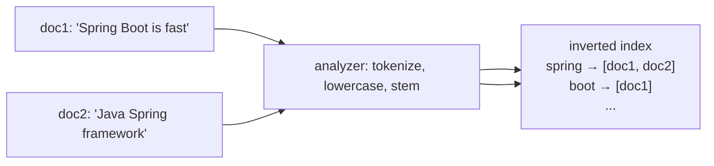
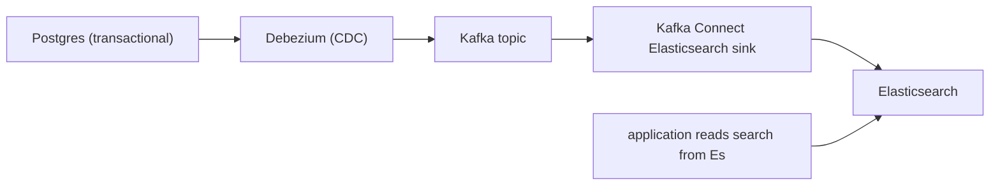

# Search engines (Elasticsearch / OpenSearch)

Elasticsearch (and its 2021 fork OpenSearch, after the AWS-Elastic licensing dispute) is the dominant Java-world search engine. Under the hood is **Apache Lucene** — a 24-year-old, still-improving inverted-index search library. Elasticsearch wraps Lucene with a distributed cluster, a JSON REST API, an expressive query DSL, real-time aggregations, and an operations / visualization story (Kibana / OpenSearch Dashboards). The use cases: **full-text search** (products, articles, support tickets); **log analytics** (the "E" of "ELK"); **observability** (metrics + traces); **autocomplete and suggestions**; **vector / kNN search** (since 8.x / OpenSearch 2.x — for embeddings).

A senior engineer treats Elasticsearch as the right answer to "I need search across text" and "I need fast aggregations across billions of events." For relational, transactional, single-record CRUD, it's the wrong tool — Postgres handles that. For "find all products whose name or description matches 'wireless headphones', filter by brand, facet by price bracket" — Elasticsearch is the only Java-native choice.

This topic covers: the inverted index conceptually; documents, indices, mappings; analyzers (tokenizer + filters + stemmer); the Query DSL (match, bool, term, range, function_score); aggregations (terms, range, histogram, date_histogram); cluster topology (master, data, ingest, coordinating); shards and replicas; relevance and BM25; the keep-Postgres-authoritative pattern via CDC sync; Spring Data Elasticsearch; reactive client; the JVM cluster characteristics (memory-hungry; needs careful tuning); the modern "OpenSearch" fork and what to choose.

> [!NOTE]
> Prerequisites: [When NoSQL vs SQL (T01)](./T01-when-to-use-nosql-vs-sql.md), [CDC (L4/C03/T06)](../C03-databases-advanced/T06-change-data-capture-debezium.md).

## The Inverted Index — Mental Model

Forward index (relational DB): row → columns.
Inverted index: token → list of documents containing it.

```
Documents:
  doc1: "Spring Boot is fast"
  doc2: "Java Spring framework"

Inverted index:
  "spring"     → [doc1, doc2]
  "boot"       → [doc1]
  "fast"       → [doc1]
  "java"       → [doc2]
  "framework"  → [doc2]
```

Query "spring framework": intersect `[doc1, doc2]` with `[doc2]` → `[doc2]`. Fast even for 100M docs.



## Analyzers

The pipeline that turns text into tokens before indexing:

1. **Character filters** — preprocess (strip HTML, normalize unicode).
2. **Tokenizer** — split into tokens (standard, whitespace, n-gram, edge-n-gram for autocomplete).
3. **Token filters** — lowercase, stop-words, stemmer (porter, snowball), synonyms, ascii-folding.

```json
PUT /products
{
  "settings": {
    "analysis": {
      "analyzer": {
        "english_analyzer": {
          "tokenizer": "standard",
          "filter": ["lowercase", "stop", "english_stemmer"]
        },
        "autocomplete": {
          "tokenizer": "edge_ngram_tokenizer",
          "filter": ["lowercase"]
        }
      },
      "tokenizer": {
        "edge_ngram_tokenizer": {
          "type": "edge_ngram", "min_gram": 2, "max_gram": 15
        }
      },
      "filter": {
        "english_stemmer": { "type": "stemmer", "language": "english" }
      }
    }
  },
  "mappings": {
    "properties": {
      "name": {
        "type": "text",
        "analyzer": "english_analyzer",
        "fields": {
          "raw": { "type": "keyword" },
          "autocomplete": { "type": "text", "analyzer": "autocomplete" }
        }
      },
      "brand": { "type": "keyword" },
      "price": { "type": "double" },
      "created_at": { "type": "date" }
    }
  }
}
```

`text` fields are analyzed (tokenized) for search. `keyword` fields are not — stored as-is for exact match / sort / aggregation.

The `fields` sub-mapping is the canonical trick: index the same value as `text` (for search) + `keyword` (for exact filter / aggregation). Use `name.raw` for `bucket by brand exact value`; `name` for `match query 'headphones'`.

## Documents, Indices, Shards

```json
POST /products/_doc/12345
{
  "name": "Wireless Headphones Pro",
  "brand": "Acme",
  "price": 199.99,
  "created_at": "2026-06-08T12:00:00Z"
}
```

- **Document**: JSON; `_id` mandatory.
- **Index**: collection of similar documents; analogous to a SQL "table" or Mongo "collection".
- **Shard**: a Lucene index slice; each index is N primary shards × M replicas. Default since 7.x: 1 primary, 1 replica.
- **Cluster**: many nodes; shards distribute across nodes.

For most workloads, 1 primary + 1 replica is fine. Increase primaries when index size exceeds ~50 GB or write throughput needs more parallelism. **Reshard is expensive** — design carefully.

## Query DSL

JSON queries.

### Basic Match

```json
GET /products/_search
{
  "query": {
    "match": { "name": "wireless headphones" }
  }
}
```

`match` analyzes the query text the same way as the field and searches. Default operator is OR; switch to AND:

```json
"match": { "name": { "query": "wireless headphones", "operator": "and" } }
```

### Bool — Compositional

```json
{
  "query": {
    "bool": {
      "must":    [{ "match": { "name": "headphones" } }],
      "filter":  [{ "term":  { "brand": "Acme" } },
                  { "range": { "price": { "lte": 300 } } }],
      "should":  [{ "match": { "description": "wireless" } }],
      "must_not":[{ "term":  { "discontinued": true } }]
    }
  }
}
```

`must` scores and filters; `filter` only filters (cacheable, faster); `should` boosts; `must_not` excludes.

### Aggregations

The killer feature beyond full-text:

```json
{
  "query": { "match_all": {} },
  "aggs": {
    "by_brand": {
      "terms": { "field": "brand", "size": 10 },
      "aggs": {
        "avg_price": { "avg": { "field": "price" } },
        "price_ranges": {
          "range": {
            "field": "price",
            "ranges": [{ "to": 100 }, { "from": 100, "to": 300 }, { "from": 300 }]
          }
        }
      }
    },
    "monthly": {
      "date_histogram": { "field": "created_at", "calendar_interval": "month" }
    }
  }
}
```

Aggregations are nested; each can have sub-aggs. Useful for faceted search, dashboards, analytics.

### Other Queries

| Query | Use |
|-------|-----|
| `term` | exact value (keyword fields) |
| `terms` | multiple exact values |
| `range` | numeric/date range |
| `wildcard` | suffix/prefix patterns (slow) |
| `regexp` | regex (slow) |
| `match_phrase` | phrase match (order matters) |
| `multi_match` | match across fields |
| `function_score` | custom scoring |
| `knn` | vector similarity (since 8.x) |

## Spring Data Elasticsearch

```xml
<dependency>
    <groupId>org.springframework.boot</groupId>
    <artifactId>spring-boot-starter-data-elasticsearch</artifactId>
</dependency>
```

```yaml
spring:
  elasticsearch:
    uris: http://elasticsearch:9200
```

```java
@Document(indexName = "products")
public class Product {
    @Id String id;
    @Field(type = FieldType.Text, analyzer = "english_analyzer")
    String name;
    @Field(type = FieldType.Keyword)
    String brand;
    @Field(type = FieldType.Double)
    Double price;
}

public interface ProductRepository extends ElasticsearchRepository<Product, String> {
    List<Product> findByBrand(String brand);
    @Query("{\"match\":{\"name\":\"?0\"}}")
    List<Product> searchByName(String text);
}
```

For complex queries, use `ElasticsearchOperations` / the new `ElasticsearchClient`:

```java
@Service
public class ProductSearch {
    private final ElasticsearchOperations ops;

    public SearchHits<Product> search(String q, String brand, double maxPrice) {
        Criteria c = new Criteria("name").matches(q);
        if (brand != null) c.and(new Criteria("brand").is(brand));
        if (maxPrice > 0) c.and(new Criteria("price").lessThanEqual(maxPrice));
        return ops.search(new CriteriaQuery(c), Product.class);
    }
}
```

## Keep Postgres Authoritative — CDC Sync

The mature pattern: **Postgres is the source of truth; Elasticsearch is a denormalized index**:



Application writes to Postgres only. Debezium captures changes; sink upserts to Elasticsearch. Search queries go to Elasticsearch. **Never write directly to Elasticsearch from the app** — guaranteed drift between systems.

Caveats:

- Eventual consistency: a just-saved item shows in search after seconds, not instantly.
- Schema evolution: changing `mapping` requires reindex (or aliases + zero-downtime reindex pattern).
- Aggregations are real-time on the Elasticsearch state.

## Reindex Pattern

Mapping changes require a reindex. The zero-downtime pattern:

1. Create new index with new mapping (`products_v2`).
2. Reindex old → new (`POST /_reindex`).
3. Switch alias: `products → products_v2`.
4. Drop `products_v1`.

Aliases make this seamless from the app perspective.

## Operational Reality

Elasticsearch is **memory-hungry**:

- JVM heap = ~50% of node RAM, max 32 GB (compressed oops boundary).
- The other 50% for OS page cache (Lucene wants it).
- Plan ~1 GB RAM per ~10 GB index data.

Other concerns:

- **Shard sizing**: aim for ~20–50 GB per shard. Too-many small shards = cluster overhead; too-large = slow operations.
- **Hot/warm/cold architecture**: recent indices on fast SSD nodes; old on slow disks.
- **ILM (Index Lifecycle Management)**: auto-roll indices by size or age; auto-delete old.
- **Snapshots**: to S3 or shared filesystem.
- **Monitoring**: cluster health (green/yellow/red), JVM heap, disk usage, query latency.

## Elasticsearch vs OpenSearch

2021 split. Elasticsearch (Elastic) went to SSPL license (not OSI-open-source); AWS forked as OpenSearch (Apache 2.0).

| Aspect | Elasticsearch | OpenSearch |
|--------|---------------|------------|
| License | SSPL (post-2021) | Apache 2.0 |
| Vendor | Elastic | AWS + community |
| Features | leads in many | catching up |
| Java client | `co.elastic.clients:elasticsearch-java` | `org.opensearch.client:opensearch-java` |
| Spring Data | both supported | community fork |

For new projects: OpenSearch is fully open; Elasticsearch has more features and commercial backing. Pick by license tolerance and feature need.

## kNN Vector Search

Elasticsearch 8 / OpenSearch 2 added vector fields:

```json
"embedding": { "type": "dense_vector", "dims": 768 }
```

```json
{
  "knn": {
    "field": "embedding",
    "query_vector": [0.1, 0.2, ...],
    "k": 10
  }
}
```

Useful for semantic search, recommendations, RAG. For pure vector workloads, dedicated vector DBs (Pinecone, Weaviate) or pgvector may be cheaper.

## Common Pitfalls

> [!WARNING]
> **Writing to Elasticsearch directly from the app.** Drift from primary DB. CDC sync.

> [!WARNING]
> **Mapping not specified.** Elasticsearch auto-infers; gets wrong (e.g., date as text). Explicitly define mapping.

> [!WARNING]
> **Wildcard / regexp on huge indices.** Slow. Use n-gram analysis for autocomplete; rethink query.

> [!WARNING]
> **`text` field used in terms aggregation.** Burns memory; usually wrong. Use `keyword` subfield.

> [!WARNING]
> **Heap too large.** > 32 GB loses compressed oops; performance hurts. Cap at 31 GB.

> [!WARNING]
> **Too many small shards.** Cluster state bloat. Aim 20–50 GB / shard.

> [!WARNING]
> **No ILM / rollover.** Old logs accumulate; disk fills. Auto-roll + delete.

> [!WARNING]
> **Mapping changes without reindex.** Existing docs don't get the new analyzer. Reindex.

> [!WARNING]
> **`refresh_interval: 1s` (default) on a heavy-write index.** Segments fragment. Raise to 30s for log workloads.

## Practice

1. Create an index with explicit mapping (text + keyword sub-field; date; double). Index 1000 products.
2. Write a `bool` query combining `must`, `filter`, `should`. Compare execution times.
3. Build a faceted aggregation (by brand, with avg price sub-agg). Render as JSON for UI.
4. Set up Debezium → Kafka → Elasticsearch sink for a Postgres `products` table. Confirm latency.
5. Build a Spring Data Elasticsearch repository; use `Criteria` queries.
6. Implement zero-downtime reindex with alias switching.
7. Try kNN search on a vector field; compare to pgvector.
8. Tune shard count for a 100 GB index; observe query latency.

## Recap

You should now be able to:

- Explain the inverted index conceptually; understand analyzer pipelines (tokenizer + filters + stemmer).
- Design mappings with `text + keyword` sub-fields, choosing field types deliberately.
- Write Query DSL: match, bool (must / filter / should / must_not), term/range, multi_match.
- Build aggregations: terms, date_histogram, range, nested aggregations.
- Use Spring Data Elasticsearch or `ElasticsearchOperations` for application access.
- Keep Postgres authoritative; sync to Elasticsearch via CDC + Kafka Connect sink.
- Apply the zero-downtime reindex pattern via aliases.
- Plan operations: heap sizing, shard sizing, hot/warm/cold tiers, ILM, snapshots.
- Choose Elasticsearch vs OpenSearch based on license / vendor preference.
- Use kNN vectors for semantic search; consider pgvector / dedicated vector DBs for pure vector workloads.
- Avoid the canonical pitfalls: direct app writes, missing mappings, wildcards on huge indices, heap > 31GB, no ILM.

## Next

Continue to [Graph databases (intro)](./T06-graph-databases-intro.md) for the deep treatment of Neo4j and graph-data modeling — when graph traversal beats recursive SQL, the property-graph model, Cypher, and Spring Data Neo4j.
