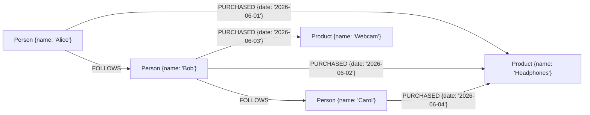

# Graph databases (intro)

A graph database stores data as **nodes** (entities) and **edges** (relationships); both can hold properties. Query language is *traversal-oriented* — "starting from this node, walk N relationships of type X, return matching nodes". For domains where relationships *are* the data — social networks (friends of friends), recommendations (people who bought X also bought Y), fraud detection (cycles in transactions), knowledge graphs (entities linked by typed predicates), routing (shortest path), org charts (transitive reports-to) — graph DBs out-perform SQL recursive CTEs by orders of magnitude.

A senior engineer recognizes when a query is fundamentally a graph traversal and reaches for a graph DB. For most apps, the answer is *don't* — Postgres recursive CTEs handle moderate-depth traversals fine, and a graph DB adds operational burden. **Neo4j** is the dominant graph DB; ArangoDB, JanusGraph (on Cassandra), Dgraph, Amazon Neptune are alternatives. Newer entrants like **graph extensions on Postgres** (Apache AGE) blur the line.

This topic is a focused introduction. We cover: the property graph model; Cypher (Neo4j's query language) basics; when graph beats SQL; common graph algorithms (shortest path, PageRank, community detection); Spring Data Neo4j; operational considerations; and the recursive-CTE comparison so you can decide whether Postgres suffices.

> [!NOTE]
> Prerequisites: [When NoSQL vs SQL (T01)](./T01-when-to-use-nosql-vs-sql.md). Basic graph theory helpful but not required.

## The Property Graph Model



- **Nodes** carry labels (`Person`, `Product`) and properties (`{name: 'Alice'}`).
- **Edges** (relationships) are directed, typed (`FOLLOWS`, `PURCHASED`), and can have properties.

The same in a relational schema:
- `persons` table
- `products` table
- `follows(follower_id, followee_id)` table
- `purchases(person_id, product_id, date)` table

Walking the graph in SQL = JOIN per hop. For depth-3 traversals, that's 3 JOINs; for arbitrary depth, recursive CTE. For 100M-row datasets and depth-5+ queries, the relational version becomes painfully slow; the graph DB stays fast.

## Cypher

Neo4j's query language. Looks like ASCII art:

```cypher
// Create
CREATE (alice:Person {name: 'Alice'})
CREATE (bob:Person {name: 'Bob'})
CREATE (alice)-[:FOLLOWS]->(bob)

// Find friends of friends
MATCH (me:Person {name: 'Alice'})-[:FOLLOWS]->(friend)-[:FOLLOWS]->(fof)
WHERE fof <> me
RETURN DISTINCT fof.name

// Recommend products
MATCH (me:Person {name: 'Alice'})-[:PURCHASED]->(p1:Product)
MATCH (other:Person)-[:PURCHASED]->(p1)
MATCH (other)-[:PURCHASED]->(p2:Product)
WHERE NOT (me)-[:PURCHASED]->(p2)
RETURN p2.name, count(*) AS score
ORDER BY score DESC LIMIT 10
```

The traversal `(me)-[:FOLLOWS]->(friend)-[:FOLLOWS]->(fof)` is **the** Cypher idiom. Reads like the graph picture.

### Variable-Length Paths

```cypher
// Shortest path between two people
MATCH path = shortestPath(
  (a:Person {name: 'Alice'})-[:KNOWS*1..6]-(b:Person {name: 'Bob'})
)
RETURN path
```

`*1..6` means "1 to 6 hops". `shortestPath` finds the shortest.

### Cypher Vs Recursive CTE

Postgres equivalent for friends-of-friends (depth 2):

```sql
WITH RECURSIVE friends AS (
  SELECT followee_id AS id, 1 AS depth FROM follows WHERE follower_id = 1
  UNION ALL
  SELECT f.followee_id, friends.depth + 1
  FROM follows f JOIN friends ON friends.id = f.follower_id
  WHERE friends.depth < 2
)
SELECT DISTINCT id FROM friends WHERE id != 1;
```

For depth 2-3 with reasonable data sizes, the CTE is fine. For depth 5+ with social-graph cardinality (one user can have 10K followers; depth 5 = 10^20 paths), the CTE explodes; the graph DB uses indexes and prunes.

## When Graph DB Wins

| Query pattern | Postgres | Graph DB |
|---------------|---------|----------|
| Depth-1 relationship lookup | trivial | trivial |
| Depth-2 (friends of friends) | JOIN + index works | works |
| Depth-3-5 | recursive CTE; slow at scale | strong |
| Arbitrary-depth (transitive closure) | recursive CTE; can be huge | strong |
| Shortest path | hard / slow | built-in |
| Variable-depth pattern matching | very hard | natural |
| PageRank-style graph algorithms | impossible | built-in (algo libs) |
| Aggregations across the graph | hard | possible |

## Common Use Cases

- **Social networks**: who follows whom; friends of friends; community detection.
- **Recommendation**: collaborative filtering as graph traversal.
- **Knowledge graphs**: entity-relationship-entity triples (people, places, things, with predicates).
- **Fraud detection**: cycle detection (`A → B → C → A` payment loops).
- **Network / IT topology**: services calling services.
- **Identity resolution**: linking accounts across systems.
- **Org charts**: reports-to with arbitrary depth.

## Spring Data Neo4j

```xml
<dependency>
    <groupId>org.springframework.boot</groupId>
    <artifactId>spring-boot-starter-data-neo4j</artifactId>
</dependency>
```

```yaml
spring:
  neo4j:
    uri: bolt://neo4j:7687
    authentication:
      username: neo4j
      password: ${NEO4J_PASS}
```

```java
@Node
public class Person {
    @Id @GeneratedValue Long id;
    String name;

    @Relationship(type = "FOLLOWS")
    Set<Person> follows;

    @Relationship(type = "PURCHASED")
    Set<Purchase> purchases;
}

@RelationshipProperties
public class Purchase {
    @RelationshipId Long id;
    @TargetNode Product product;
    LocalDate date;
}

public interface PersonRepository extends Neo4jRepository<Person, Long> {
    Optional<Person> findByName(String name);

    @Query("MATCH (me:Person {name: $name})-[:FOLLOWS]->(f)-[:FOLLOWS]->(fof) " +
           "WHERE fof <> me RETURN DISTINCT fof")
    List<Person> findFriendsOfFriends(String name);
}
```

Custom Cypher via `@Query`. The OGM (object-graph mapping) is similar to JPA but adapted to graph structures.

## Graph Algorithms

Neo4j and others ship algorithm libraries:

- **Shortest path** (Dijkstra, A*).
- **PageRank** (importance / influence).
- **Community detection** (Louvain, label propagation).
- **Centrality** (betweenness, closeness).
- **Similarity** (Jaccard, cosine).
- **Pathfinding** (BFS, DFS variants).

These are typically run as batch jobs (graph data science workloads), then results fed back to the application.

## Operational Reality

Neo4j characteristics:

- Single-leader writes (until Causal Cluster / Aura's distributed variants).
- Memory-hungry (graphs benefit from in-memory traversal).
- Backup/restore via online tools.
- Clustering for HA (Causal Cluster) — read replicas.
- Cypher learning curve is real for SQL veterans.

Operationally heavier than Postgres for the same data volume. The win is query expressivity, not throughput.

## Postgres Alternatives

- **Recursive CTEs** for moderate depth.
- **Apache AGE** — Postgres extension with Cypher-ish queries (PostgreSQL Graph extension).
- **pgrouting** — for path queries on geographic graphs.

If your graph needs are modest, stay on Postgres.

## Common Pitfalls

> [!WARNING]
> **Graph DB for non-graph data.** Adopting Neo4j because it's trendy. Use only when traversal is the dominant pattern.

> [!WARNING]
> **Modeling everything as nodes-and-edges.** Some data is just rows. Don't graph-ify a product catalog.

> [!WARNING]
> **Ignoring Postgres recursive CTEs.** Often enough.

> [!WARNING]
> **Cypher path explosion.** Variable-depth queries on dense graphs can scan billions of paths. Constrain depth; add WHERE filters.

> [!WARNING]
> **No indexes on lookup properties.** `MATCH (p:Person {email: ?})` needs an index on `Person.email` or it's full scan.

> [!WARNING]
> **Graph DB as primary store.** Slower writes; weaker ACID guarantees. Keep transactional system separate; sync to graph.

> [!WARNING]
> **Treating Cypher as SQL.** Different semantics; multi-pattern matching can return multiple matches per row.

## Practice

1. Build a small social graph (10 people, 30 follows) in Neo4j. Run friends-of-friends; observe runtime.
2. Build same in Postgres with recursive CTE. Compare.
3. Implement a product recommendation via collaborative filtering on the graph.
4. Use Spring Data Neo4j; define `@Node`, `@Relationship`; custom Cypher.
5. Run PageRank on a small graph; compare to manual computation.
6. Try Apache AGE on Postgres for a graph-ish query; compare ergonomics.
7. Profile a depth-5 traversal on Neo4j vs Postgres CTE on 1M+ nodes.
8. Design a fraud-detection query (transaction cycles). Compare graph vs SQL.

## Recap

You should now be able to:

- Identify graph data patterns: relationships *are* the data.
- Use Cypher: basic CREATE/MATCH, variable-length paths, shortest path.
- Compare with Postgres recursive CTEs and decide when graph DB is justified.
- Wire Spring Data Neo4j: `@Node`, `@Relationship`, custom `@Query`.
- Run graph algorithms (PageRank, community detection, shortest path) for analytics.
- Pick Neo4j for typical graph needs; consider ArangoDB / JanusGraph for specific scales; consider Postgres+AGE for hybrid needs.
- Plan operations: Neo4j is single-leader; Causal Cluster for HA; memory-heavy.
- Avoid the canonical pitfalls: graph DB for non-graph data, no indexes, path explosion, ignoring CTEs.

## Next

Continue to [Spring Data for NoSQL](./T07-spring-data-for-nosql.md) — the unified treatment of how Spring Data's repository abstraction extends across MongoDB, Redis, Cassandra, Elasticsearch, Neo4j (and how to choose between using its abstraction or going to the native driver).
