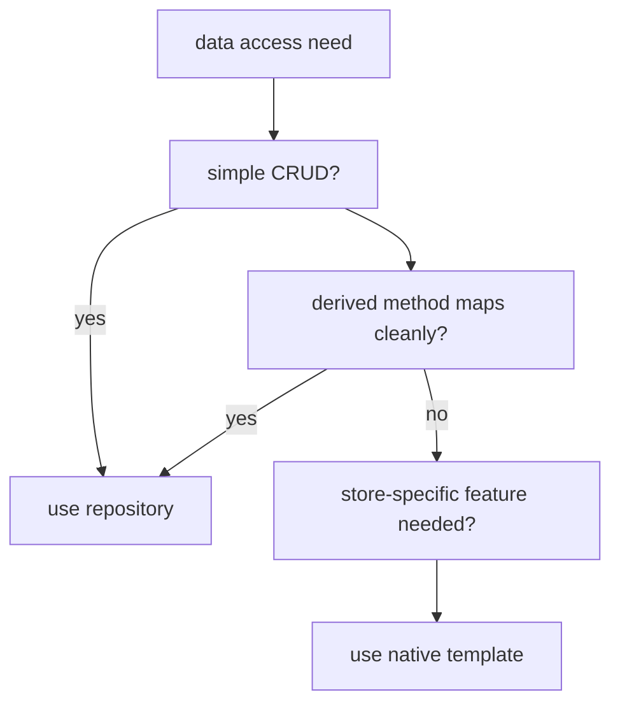

# Spring Data for NoSQL

The previous five topics covered the major NoSQL categories with their specific Spring Data modules. **This topic ties them together** — the common abstractions across Spring Data NoSQL modules, the cross-cutting features (`@Id`, derived queries, projections, Pageable), and the right way to think about repository abstractions vs native drivers. The same `Repository<T, ID>` interface from Spring Data Commons drives all of them; the store-specific module (`spring-data-mongodb`, `spring-data-redis`, `spring-data-cassandra`, etc.) provides the implementation.

A senior engineer uses Spring Data for the 80% of NoSQL access that fits its model — CRUD + simple queries — and drops to the **store's native driver / template** for the 20% that doesn't (aggregation pipelines in Mongo; Lua scripts in Redis; Cypher with parameters in Neo4j; raw CQL in Cassandra). The repository abstraction is **a productivity boost, not a replacement** for understanding the underlying store.

This is a short topic — most of the depth lives in the per-store topics (T02–T06). Here we focus on what's shared, what's different, and the decision pattern.

> [!NOTE]
> Prerequisites: [MongoDB (T02)](./T02-document-stores-mongodb.md), [Redis (T03)](./T03-key-value-stores-redis.md), [Cassandra (T04)](./T04-wide-column-stores-cassandra.md), [Elasticsearch (T05)](./T05-search-engines-elasticsearch-opensearch.md), [Graph (T06)](./T06-graph-databases-intro.md), [Spring Data (L4/C01/T13)](../C01-spring-framework/T13-spring-data.md).

## The Shared Abstraction

Every Spring Data NoSQL module extends:

```java
public interface Repository<T, ID> { }
public interface CrudRepository<T, ID> extends Repository<T, ID> { ... }
public interface PagingAndSortingRepository<T, ID> extends CrudRepository<T, ID> { ... }
```

Each store adds:

| Store | Specific interface | Adds |
|-------|--------------------|------|
| MongoDB | `MongoRepository<T, ID>` | `insert`, `findAllAndKeep`, etc. |
| Redis | `KeyValueRepository<T, ID>` | basic CRUD; minimal |
| Cassandra | `CassandraRepository<T, ID>` | `existsByPrimaryKey` etc. |
| Elasticsearch | `ElasticsearchRepository<T, ID>` | `search` returning `SearchHits` |
| Neo4j | `Neo4jRepository<T, ID>` | depth-controlled load |
| Couchbase | `CouchbaseRepository<T, ID>` | N1QL hint methods |
| R2DBC | `R2dbcRepository<T, ID>` | reactive (Mono / Flux) |

## What Works Across All

```java
public interface ProductRepository extends MongoRepository<Product, String> {
    Optional<Product> findByName(String name);
    List<Product> findByPriceLessThan(BigDecimal max);
    Page<Product> findByCategory(String category, Pageable pageable);
    long countByActiveTrue();
}
```

This *same* interface shape works for MongoDB, Cassandra, Elasticsearch, Neo4j, R2DBC. The framework translates method names to the store's query language. Switching backends from MongoDB to Cassandra mostly means changing the parent interface, the entity annotations, and the connection config — *if* the queries fit the abstraction.

## What Doesn't Cross Cleanly

| Capability | Notes |
|------------|-------|
| Mongo aggregation pipelines | use `MongoTemplate` |
| Redis data structures (sorted sets, etc.) | use `RedisTemplate` / Redisson |
| Cassandra batch / TTL clauses | use `CqlTemplate` / `@Query` annotations |
| Elasticsearch aggregations | use `ElasticsearchOperations` |
| Neo4j arbitrary Cypher with relationship projections | use `@Query` |
| Native indexes / hints | use store-specific config |

Whenever the query exceeds derived-method capability, escape:

- `MongoTemplate` for Mongo.
- `RedisTemplate` for Redis.
- `CqlTemplate` for Cassandra.
- `ElasticsearchOperations` (or `ElasticsearchClient`) for ES.
- `Neo4jTemplate` / `@Query` for Neo4j.

## Reactive Variants

For reactive use, each module has a parallel:

| Store | Reactive interface |
|-------|--------------------|
| Mongo | `ReactiveMongoRepository<T, ID>` |
| Redis | `ReactiveRedisOperations` |
| Cassandra | `ReactiveCassandraRepository<T, ID>` |
| Elasticsearch | `ReactiveElasticsearchOperations` |
| Neo4j | `ReactiveNeo4jRepository<T, ID>` |
| R2DBC | `R2dbcRepository<T, ID>` (already reactive) |

Methods return `Mono<T>` / `Flux<T>`. Use for WebFlux apps (L4/C01/T17).

## Decision: Repository vs Native



Combine: a repository for 80% of operations; a custom fragment with the native template for the other 20%. Standard pattern from L4/C01/T13.

```java
public interface ProductRepository extends MongoRepository<Product, String>, ProductRepositoryCustom { }

public interface ProductRepositoryCustom {
    List<CategoryStats> categoryStats();
}

public class ProductRepositoryImpl implements ProductRepositoryCustom {
    @Autowired MongoTemplate mongo;

    @Override
    public List<CategoryStats> categoryStats() {
        return mongo.aggregate(
            newAggregation(
                group("category").sum("inventory").as("total"),
                sort(DESC, "total")),
            Product.class, CategoryStats.class).getMappedResults();
    }
}
```

## Store-Per-Workload — The Polyglot Reality

A typical Spring Boot service:

```java
@Service
public class OrderService {
    private final OrderRepository orderRepo;            // Postgres (JPA)
    private final CartCache cartCache;                   // Redis
    private final OrderSearchRepository searchRepo;      // Elasticsearch
    private final EventStreamRepository eventRepo;       // Kafka (publish)

    @Transactional
    public Order place(OrderRequest req) {
        Order o = orderRepo.save(new Order(req));
        cartCache.clear(req.cartId());
        // Search index sync is via CDC (T06 of C03), not direct write
        eventRepo.publish(new OrderPlaced(o));
        return o;
    }
}
```

Each store is its own Spring Data module (or KafkaTemplate). Each has its own connection, repository, conventions. The application code orchestrates without polluting the cross-cutting concerns.

## When Multiple Spring Data Modules Coexist

Auto-configuration usually does the right thing. Occasional gotcha: Spring Data Repositories scanning across all modules tries to assign each repository to a store; ambiguity if the entity could be either (e.g., a `@Document` MongoDB entity might be picked up by both Mongo and Elasticsearch).

Fix via base packages:

```java
@Configuration
@EnableMongoRepositories(basePackages = "com.example.repo.mongo")
@EnableElasticsearchRepositories(basePackages = "com.example.repo.es")
public class DataConfig { }
```

Separate package per store keeps boundaries clean.

## Common Pitfalls

> [!WARNING]
> **Pretending repository abstraction makes stores interchangeable.** The queries that work are the simple ones; everything else is store-specific.

> [!WARNING]
> **Treating the abstraction as a SQL.** Method-name derivation is per-store; not all keywords work everywhere.

> [!WARNING]
> **Mixed-store repositories in one package.** Auto-config picks one; conflicts. Separate by package.

> [!WARNING]
> **Ignoring native drivers.** They're often more direct, sometimes much faster.

> [!WARNING]
> **Repository proliferation.** One repository per store is fine; per-aggregation isn't.

## Practice

1. Define the same `Product` entity in Mongo and Elasticsearch. Build repositories. Compare derived-method behavior.
2. Write the same "find products in category sorted by price" query against Mongo and Cassandra. Note differences.
3. Use a custom fragment to drop to `MongoTemplate` for an aggregation pipeline.
4. Wire a reactive Mongo repository in WebFlux; verify Mono / Flux return types.
5. Build a service that touches Postgres + Redis + Elasticsearch; orchestrate cleanly via three repos.
6. Set up separate repository packages per store; verify auto-config picks correctly.
7. Compare a complex Cypher query via Spring Data Neo4j `@Query` vs `Neo4jTemplate`.

## Recap

You should now be able to:

- Recognize the shared Repository contract across Spring Data NoSQL modules.
- Use derived methods where they fit; escape to store-specific templates (`MongoTemplate`, `RedisTemplate`, `CqlTemplate`, `ElasticsearchOperations`, `Neo4jTemplate`) where they don't.
- Pick the reactive variant for WebFlux apps.
- Combine repository abstractions with custom fragments for cross-cutting needs.
- Separate stores by base package when multiple modules coexist.
- Avoid treating the abstraction as making stores interchangeable; the simple subset overlaps, the rest is store-specific.

## Next

Continue to [Caching concepts (cache-aside, write-through, write-behind)](./T08-caching-concepts-cache-aside-write-through-write-behind.md) — the patterns of caching layered on any store, the consistency trade-offs, and the Spring Cache abstraction.
