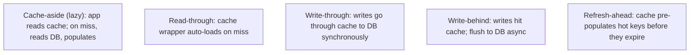

# Caching concepts (cache-aside, write-through, write-behind)

A cache is **a fast, smaller copy of slower data** placed close to its readers. The question is never "should we cache" but "*which* pattern" — there are five, each with distinct semantics. **Cache-aside** (lazy load on read) is the default for most apps. **Read-through** and **write-through** delegate cache management to a wrapper around the underlying store. **Write-behind** improves write throughput at the cost of durability. **Refresh-ahead** prevents stale data on hot keys. The cache itself can be local (Caffeine, ConcurrentHashMap), distributed (Redis, Hazelcast), or a hierarchy (L1 local + L2 distributed). Each combination has a different consistency / performance / complexity profile.

L4/C02/T11 covered Hibernate's L1 / L2 caches at the JPA layer. **This topic** is the layer above — the *application-level* caching patterns that work over any data store, the Spring Cache abstraction (`@Cacheable`, `@CachePut`, `@CacheEvict`), and the operational concerns (cache stampede, key design, invalidation). The five patterns and when each applies; the Spring annotations and how they translate; the distributed-cache reality (what changes when Caffeine becomes Redis); the cache-stampede problem and its mitigations; key design (avoid hot keys, namespace cleanly, version when schema changes).

A senior engineer treats caching as a *deliberate* technique applied per use case — not a sprinkle of `@Cacheable` over a slow service. Cache invalidation is famously the hardest problem in computer science. Get the patterns and trade-offs right, the cache helps; get them wrong, you have a stale-data bug factory plus the operational cost of the cache itself.

> [!NOTE]
> Prerequisites: [Redis (T03)](./T03-key-value-stores-redis.md), [JPA caching (L4/C02/T11)](../C02-persistence-jpa-hibernate/T11-caching-first-second-level.md).

## The Five Patterns



### Cache-Aside (Lazy Load)

```java
public User load(long id) {
    User cached = cache.get(id);
    if (cached != null) return cached;
    User u = userRepo.findById(id).orElseThrow();
    cache.put(id, u, Duration.ofMinutes(10));
    return u;
}

public void update(User u) {
    userRepo.save(u);
    cache.evict(u.getId());   // invalidate; next read repopulates
}
```

Application owns the cache. Most common pattern. Pros: simple; cache failures don't break the app (cache miss = DB hit). Cons: each cache layer is application-coded.

### Read-Through

The cache library wraps the DB; on miss it transparently loads:

```java
LoadingCache<Long, User> cache = Caffeine.newBuilder()
    .expireAfterWrite(Duration.ofMinutes(10))
    .build(id -> userRepo.findById(id).orElseThrow());

User u = cache.get(id);   // hits or loads-then-caches
```

Pros: app code stays simple. Cons: writes still need explicit invalidation; cache becomes an indirection layer.

### Write-Through

Writes go through the cache, which writes to the DB synchronously:

```java
public void update(User u) {
    cache.put(u.getId(), u);
    // cache writes to DB internally
}
```

Cache is always consistent with DB. Used in some commercial caches (Hazelcast, NCache). Cons: writes are bound by DB write latency.

### Write-Behind (Write-Back)

Writes hit cache; cache flushes to DB asynchronously:

```java
public void update(User u) {
    cache.put(u.getId(), u);
    // returns instantly; cache pushes to DB on a schedule
}
```

Fast writes. **Risk**: cache crash before flush = data loss. Used carefully for high-write workloads where some loss is acceptable.

### Refresh-Ahead

Cache pre-populates entries about to expire:

```
Entry created at T=0, TTL = 60s
At T=50 (close to expiry), background refresh fetches new value
At T=60, cache has the new value already
```

Avoids the read-after-expiry latency spike. Used in CDN caching. Caffeine supports via `refreshAfterWrite`:

```java
Caffeine.newBuilder()
    .expireAfterWrite(Duration.ofMinutes(10))
    .refreshAfterWrite(Duration.ofMinutes(8))   // start refresh at 8 min
    .build(id -> loadFromDb(id));
```

## Spring Cache Abstraction

Spring provides annotations that work over any `CacheManager`:

```java
@Configuration
@EnableCaching
public class CacheConfig {
    @Bean public CacheManager cacheManager() {
        return new CaffeineCacheManager("users", "products");
    }
}

@Service
public class UserService {

    @Cacheable("users")
    public User load(long id) {
        return userRepo.findById(id).orElseThrow();   // runs only on miss
    }

    @CachePut(value = "users", key = "#u.id")
    public User update(User u) {
        return userRepo.save(u);   // runs always; result cached
    }

    @CacheEvict("users")
    public void delete(long id) {
        userRepo.deleteById(id);   // removes from cache too
    }

    @Cacheable(value = "users", condition = "#id > 0", unless = "#result == null")
    public User loadIf(long id) { ... }

    @Cacheable(value = "users", sync = true)   // protects against stampede
    public User loadSafe(long id) { ... }
}
```

`@Cacheable` follows cache-aside semantics: check cache; on miss, call method, store result, return.

`@CachePut` always calls the method, stores result. For "update + cache" flows.

`@CacheEvict` removes entries. `allEntries = true` clears the whole cache.

`condition` skips caching when false. `unless` skips caching after the call when condition matches the result.

`sync = true` ensures only one thread loads on miss; others wait. Critical for cache stampede.

## Distributed Caches

Switching from local (Caffeine) to distributed (Redis) is a CacheManager swap:

```java
@Bean
public CacheManager cacheManager(RedisConnectionFactory cf) {
    return RedisCacheManager.builder(cf)
        .cacheDefaults(RedisCacheConfiguration.defaultCacheConfig()
            .entryTtl(Duration.ofMinutes(10))
            .serializeValuesWith(SerializationPair.fromSerializer(new Jackson2JsonRedisSerializer<>(Object.class))))
        .build();
}
```

Now `@Cacheable` writes to Redis. Cross-instance coherence; persistence (if Redis configured); operational complexity.

For high-throughput hot keys, local + distributed two-level (L1 + L2):

```java
// L1: Caffeine (per-instance, ~50 ns)
// L2: Redis (cross-instance, ~1 ms)
// On L1 miss → check L2; populate L1
```

Spring 6.1+ has `CompositeCacheManager`. Or use Cache2k, Hazelcast (with near cache), or Redisson.

## Cache Stampede

The thundering-herd problem: a hot key expires; 1000 concurrent requests all miss; all hit the DB simultaneously; DB falls over.

Mitigations:

- **`sync = true`** on `@Cacheable` — only one thread loads; others wait.
- **Jitter on TTL** — prevent everything expiring at the same time.
- **Refresh-ahead** — repopulate before expiry.
- **Probabilistic early expiration** — refresh some early, randomly.

```java
@Cacheable(value = "users", sync = true)
public User load(long id) { ... }
```

## Cache Key Design

Keys must:

- Be **unique per logical entity** (e.g., `user:42`, not just `42`).
- Be **namespaced** (per cache region; `users::42`).
- **Version** when serialization or logic changes (`user:v2:42`).
- Avoid **hot keys** (one key for global config that everyone reads — sharding may help).

Cache key SpEL examples:

```java
@Cacheable(value = "users", key = "#id")                              // simple
@Cacheable(value = "users", key = "#user.id + ':' + #user.tenant")    // composite
@Cacheable(value = "users", key = "T(java.util.Objects).hash(#a, #b)") // hashed
```

## Cache Invalidation

The hard problem. Strategies:

- **TTL** (time-based): rough but simple. Stale data possible.
- **Write-through eviction**: `@CacheEvict` on the write method.
- **Event-driven**: listen to CDC events; evict matching keys.
- **Versioning** the key on schema change; old entries naturally expire.

For distributed cache: writes from any instance need to invalidate the shared cache. Redis backed Spring Cache handles automatically (eviction goes to Redis; visible to all readers).

## Negative Caching

Cache the absence of a value:

```java
@Cacheable("users")
public Optional<User> load(long id) {
    return userRepo.findById(id);   // cache the empty Optional too
}
```

Prevents hammering DB for non-existent IDs (a common DoS vector).

## Spring Cache vs Hibernate L2

| Aspect | Spring Cache | Hibernate L2 |
|--------|--------------|--------------|
| Layer | application service | JPA persistence |
| Scope | per method | per entity / query |
| Granularity | object / query result | entity / collection |
| When triggered | service call | entity load via Hibernate |
| Invalidation | manual / @CacheEvict | automatic on Hibernate writes |
| Distributed | depends on CacheManager | depends on L2 provider |

Often used together. Spring Cache for service-level DTOs; Hibernate L2 for entity hot paths.

## Common Pitfalls

> [!WARNING]
> **Caching without thinking about invalidation.** Stale data. Plan eviction.

> [!WARNING]
> **No TTL.** Stale data; memory leak. Always set a TTL.

> [!WARNING]
> **All keys expire at the same time.** Stampede. Add jitter.

> [!WARNING]
> **Cache stampede on hot key without `sync = true`.** DB meltdown.

> [!WARNING]
> **Caching mutable objects.** A mutation leaks to other readers. Cache immutable DTOs.

> [!WARNING]
> **Caching very-large objects.** Memory blows; serialization cost; network overhead (distributed). Cache the small.

> [!WARNING]
> **`@Cacheable` on a service that throws.** Exception not cached; next call re-tries. Sometimes wanted; document.

> [!WARNING]
> **Distributed cache without coherence.** Update on one instance; stale on others. Use shared Redis or invalidation events.

> [!WARNING]
> **Versioning forgotten when schema changes.** Old cached entries deserialize wrong. Version the key.

## Practice

1. Add `@Cacheable` to a slow service method; verify cache hits in metrics.
2. Add `@CacheEvict` to the corresponding write method; verify cache stays consistent.
3. Set Caffeine for L1; configure TTL with jitter (e.g., 10 min ± 1 min).
4. Switch CacheManager from Caffeine to Redis; verify cross-instance coherence.
5. Trigger a cache stampede in load test; observe DB load. Add `sync = true`; observe relief.
6. Implement refresh-ahead with Caffeine; verify the read-after-expiry latency disappears.
7. Implement negative caching for `Optional<User>`; observe DB-hit reduction.
8. Build a 2-level cache (Caffeine + Redis). Profile latency for hits at each level.

## Recap

You should now be able to:

- Choose between cache-aside, read-through, write-through, write-behind, refresh-ahead based on the workload.
- Use Spring Cache abstraction: `@Cacheable`, `@CachePut`, `@CacheEvict`, `condition`, `unless`, `sync`.
- Switch CacheManager between local (Caffeine) and distributed (Redis) without code changes.
- Mitigate cache stampede: `sync`, jitter, refresh-ahead, probabilistic early expiration.
- Design cache keys: unique, namespaced, versioned, avoiding hot keys.
- Implement negative caching to absorb lookup-for-nonexistent-id traffic.
- Combine Spring Cache with Hibernate L2 deliberately.
- Avoid the canonical pitfalls: no invalidation plan, no TTL, stampede, mutable cached objects, version drift.

## Next

Continue to [Local caching (Caffeine)](./T09-local-caching-caffeine.md) for the deep treatment of Caffeine specifically — eviction policies (Window-TinyLFU), the builder API, async caches, statistics, and when local caching is the right answer vs distributed.
