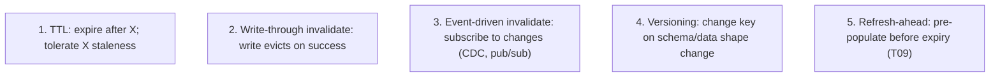
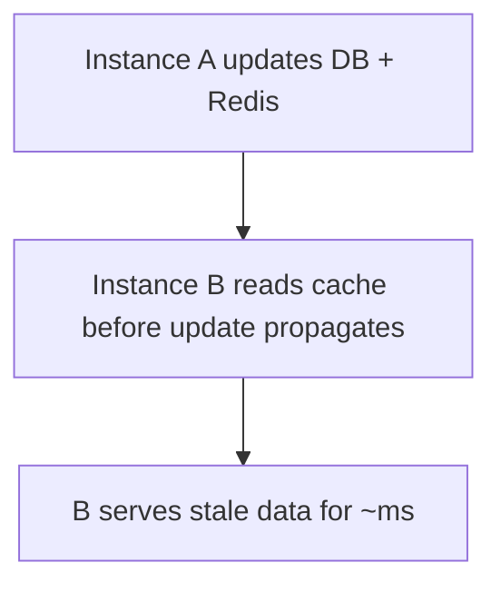

# Cache invalidation & TTLs

> "There are only two hard things in computer science: cache invalidation and naming things."  
> — Phil Karlton

The joke is famous because cache invalidation genuinely is hard. **A cached value is stale data from a previous read; the question is how stale you tolerate, how you detect it, and how you remove it.** TTL is the simplest tool (expire after X seconds; tolerate up to X seconds of staleness); event-driven invalidation (explicit eviction on write) is more precise but harder to get right in distributed systems; key versioning sidesteps invalidation by changing the key when the data shape changes.

A senior engineer designs the invalidation strategy *up front* per cached resource. This is a short topic that consolidates the patterns scattered through T08–T10. The five strategies; the operational realities of each; the famous failure modes (stale data, propagation delay, write-around dilemmas, partial invalidation); the Spring tools that help.

> [!NOTE]
> Prerequisites: [Caching concepts (T08)](./T08-caching-concepts-cache-aside-write-through-write-behind.md), [Distributed caching (T10)](./T10-distributed-caching-redis.md).

## The Five Strategies



### 1. TTL (Time-To-Live)

```java
@Cacheable(value = "products", key = "#id")
public Product load(long id) { ... }

// CacheManager configured with 10-minute TTL
```

**Pros**: simplest; no cross-system coordination; survives split-brain.
**Cons**: up to TTL of stale data; misses can be ill-timed (peak traffic + just-expired).

Right for: data that's *eventually consistent and naturally bounded staleness* (product info, configuration, leaderboards updated periodically).

### 2. Write-Through Invalidation

```java
@CachePut(value = "users", key = "#u.id")
public User update(User u) { return userRepo.save(u); }

@CacheEvict(value = "users", key = "#id")
public void delete(long id) { userRepo.deleteById(id); }
```

The same service that writes also invalidates. Works perfectly within one instance; in distributed, each instance evicts only its own L1 (unless using shared Redis cache where the eviction propagates).

**Pros**: precise; near-instant.
**Cons**: writes from elsewhere (other services, DB tools) bypass it.

### 3. Event-Driven Invalidation

Subscribe to changes:

- **CDC (Debezium → Kafka)**: every DB write produces an event; consumer evicts matching cache key.
- **Redis pub/sub**: write service publishes "invalidate user:42"; subscribers (other instances) evict their local Caffeine.
- **Application events** (Spring `ApplicationEventPublisher`): in-process broadcast.

```java
@Component
public class UserChangeListener {

    @KafkaListener(topics = "orders_db.public.users")
    public void onChange(UserChangeEvent e) {
        cache.evict(e.userId());
    }
}
```

**Pros**: precise; cross-service; cross-instance.
**Cons**: operational complexity; depends on CDC/messaging stack.

The right answer for serious systems with many writers.

### 4. Key Versioning

```java
@Cacheable(value = "users:v3", key = "#id")
public User load(long id) { ... }
```

Schema change → bump to `users:v4`. Old `users:v3` entries simply expire via TTL; no explicit invalidation. The cache region itself acts as the version namespace.

**Pros**: trivial coordination; rolling deploys safe (old and new code use different namespaces).
**Cons**: temporary cache miss as new code warms.

### 5. Refresh-Ahead

T09. Pre-populate before TTL expires; reduces miss latency.

## TTL Strategy

The single most important decision: **how stale can this data be?**

| Data | TTL |
|------|-----|
| Currency conversion rates | 5 min |
| Country / region list | 24 hr |
| Logged-in user profile | 5 min (or invalidate on edit) |
| Product catalog item | 1 hr (or CDC-evict) |
| Search results | 1 min |
| Realtime stock prices | seconds (or pub/sub) |
| Translation strings | 1 day |

**Add jitter**:

```java
Duration ttl = Duration.ofMinutes(10).plusSeconds(random.nextInt(60));
```

Without jitter, all entries created at once expire at once → stampede. With jitter, expirations spread out.

## Stale-While-Revalidate Pattern

Serve stale data while refreshing in background:

```java
public User load(long id) {
    Optional<CachedValue<User>> cached = cache.getWithMeta(id);
    if (cached.isPresent()) {
        if (cached.get().isExpired()) {
            asyncRefresh(id);   // fire-and-forget refresh
        }
        return cached.get().value();   // even if expired, return now
    }
    User u = userRepo.findById(id).orElseThrow();
    cache.put(id, u);
    return u;
}
```

User sees instant response; refresh happens async. **Stale-while-error** variant: serve stale on backend failure. The HTTP `Cache-Control: stale-while-revalidate=N` directive does this at CDN/browser level.

## The Distributed Coherence Problem



For Redis-backed shared cache: writes from any instance evict in Redis; other instances see fresh on next read. Coherent (modulo network delay).

For Caffeine local + Redis L2: when A writes, A's Caffeine has new; B's Caffeine still has old. Solutions:

- **Short Caffeine TTL** (~30 s) — acceptable staleness; brief miss.
- **Pub/sub invalidation**: A publishes "user:42 invalidated"; B evicts.
- **No L1**: pay the network cost.

## Write-Around — Skip Cache On Write

Some apps deliberately don't cache writes:

```java
public User update(User u) {
    cache.evict(u.getId());
    return userRepo.save(u);   // next read re-populates
}
```

Write-around. Reads warm the cache; writes evict. Avoids cache-poisoning issues (a tentative write seen by another reader before commit).

## Negative Caching With TTL

Cache "no result":

```java
@Cacheable(value = "users", unless = "#result == null")    // doesn't cache null
public User load(long id) { ... }

// Allow null caching with short TTL:
@Cacheable(value = "users")
public Optional<User> load(long id) {
    return userRepo.findById(id);
}
```

Caching empty results absorbs lookup-storms for non-existent IDs. Use short TTL since "doesn't exist" could become "exists" any time.

## Partial Invalidation

Sometimes you need to invalidate a *subset*:

- `@CacheEvict(value = "users", allEntries = true)` — nuclear.
- Tag-based invalidation (custom): tag each entry with categories; evict by tag.
- Versioned key prefix: `@CacheEvict` matching a prefix.

Most cache implementations don't natively support tag-based; if needed, Redis with sets (`users:tag:premium`) tracking members works.

## Operational Reality

- **Monitor hit rate**: a low rate means caching isn't helping; investigate.
- **Monitor evictions**: high eviction means cache too small.
- **Monitor stampede**: spikes of DB hits = stampede.
- **Track stale-data incidents**: bugs traced to cache = invalidation strategy weak.
- **Test invalidation**: integration tests that write + immediately read; verify fresh.

## Common Pitfalls

> [!WARNING]
> **No TTL.** Stale forever until restart.

> [!WARNING]
> **No jitter on TTL.** Synchronized expirations + stampede.

> [!WARNING]
> **Evict + write in different transactions.** Window of stale visibility. Use `transactionAware()` cache manager.

> [!WARNING]
> **`@CacheEvict` on a private method.** Proxy doesn't intercept. Same trap as `@Transactional`.

> [!WARNING]
> **Cache write before DB commit.** Rollback leaves cache poisoned. Wire to `AFTER_COMMIT`.

> [!WARNING]
> **L1 + L2 without invalidation propagation.** Inconsistent across instances.

> [!WARNING]
> **Vague "we have caching" without a strategy.** Bugs follow.

> [!WARNING]
> **Caching computed data without versioning.** Logic changes; old cached values are wrong.

## Practice

1. Set TTL with jitter on a `@Cacheable`. Force concurrent expirations; observe stampede vs no stampede.
2. Build event-driven invalidation: CDC stream → Kafka → consumer evicts cache.
3. Use Redis pub/sub to invalidate Caffeine L1 across pods.
4. Implement stale-while-revalidate with async loader.
5. Add negative caching with short TTL for `findById`; observe DB hit reduction.
6. Try `@CacheEvict` with proxy self-invocation; verify it's silently skipped; fix.
7. Schema-change a cached DTO; bump version in key; verify rolling deploy safety.
8. Audit your service: list every cache, its TTL, its invalidation strategy. Identify weak points.

## Recap

You should now be able to:

- Pick TTL based on tolerated staleness; add jitter to prevent stampede.
- Use write-through invalidation (`@CacheEvict`) for explicit, in-instance cases.
- Use event-driven invalidation (CDC, Redis pub/sub) for cross-instance precision.
- Use key versioning to make schema changes safe (rolling deploys).
- Implement refresh-ahead and stale-while-revalidate to mask miss latency.
- Recognize the L1-L2 coherence trade-off; mitigate via short L1 TTL or pub/sub.
- Apply negative caching for absent values with short TTL.
- Tie cache writes to transaction commit (`transactionAware`) to avoid poisoning.
- Audit and document each cache's TTL + invalidation strategy.
- Avoid the canonical pitfalls: no TTL, no jitter, evict outside transaction, self-invocation, no version on schema change.

## Next

Continue to [CDN caching](./T12-cdn-caching.md) — the final C04 topic — for the deep treatment of edge caching (Cloudflare, Fastly, CloudFront), HTTP cache headers, cache-control directives, and how application-level CDN integration changes the caching architecture.
