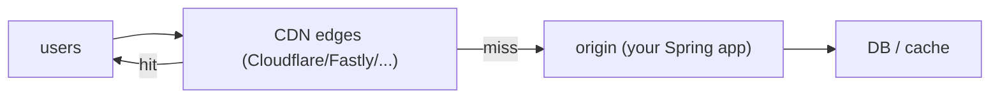

# CDN caching

The CDN (Content Delivery Network) is the cache *closest to the user* — globally distributed edge servers (Cloudflare's 300+ POPs, Fastly's 70+, CloudFront's 600+) that serve content from the nearest location, typically within ~10 ms. Original use was static assets (CSS, JS, images); modern CDNs serve **HTML, HTML fragments, API responses, even dynamic content** at the edge. Done right, CDNs absorb 90%+ of traffic before it reaches your origin, dramatically improving global latency and reducing origin load. Done wrong, they serve stale data to users for hours.

A senior backend engineer treats the CDN as **another cache layer in the architecture**, governed by HTTP cache-control headers the application emits. Understanding the headers (`Cache-Control`, `ETag`, `Last-Modified`, `Vary`, `Surrogate-Control`) is what turns a CDN from "speeds up images" to a strategic part of the system.

This topic covers: HTTP cache-control headers (max-age, public/private, no-cache vs no-store, stale-while-revalidate); ETag and Last-Modified for revalidation; Vary for content negotiation; CDN-specific headers (Surrogate-Control, Cache-Tag); purging strategies; the major CDN providers (Cloudflare, Fastly, CloudFront, Akamai) and their idiosyncrasies; edge compute (Workers, VCL); the Spring integration to emit correct headers.

> [!NOTE]
> Prerequisites: [Cache invalidation (T11)](./T11-cache-invalidation-and-ttls.md). HTTP fundamentals.

## The CDN Layer



Most requests hit a nearby CDN edge; only misses reach origin. If your CDN hit rate is 90%, you cut origin load 10×.

## HTTP Cache-Control Headers

```http
Cache-Control: public, max-age=3600, stale-while-revalidate=600
ETag: "v1-42"
Vary: Accept, Accept-Encoding
```

| Directive | Meaning |
|-----------|---------|
| `max-age=N` | cache for N seconds |
| `s-maxage=N` | for shared caches (CDN); overrides max-age for CDN |
| `public` | cacheable by shared caches |
| `private` | only by user's browser (e.g., per-user data) |
| `no-cache` | must revalidate with origin before serving (ETag check) |
| `no-store` | don't cache at all |
| `stale-while-revalidate=N` | serve stale while refreshing background |
| `stale-if-error=N` | serve stale on origin error |
| `must-revalidate` | strict; never serve stale |
| `immutable` | guarantee never changes; aggressive cache |

### Typical Patterns

```http
# Static asset (JS, CSS, image with hash in filename)
Cache-Control: public, max-age=31536000, immutable

# Public API response, can tolerate 1 minute stale
Cache-Control: public, max-age=60, stale-while-revalidate=30

# User-specific page
Cache-Control: private, max-age=0, no-cache

# Sensitive data
Cache-Control: private, no-store
```

The `s-maxage` lets you have **different TTLs at CDN vs browser**:

```http
Cache-Control: public, max-age=60, s-maxage=3600
```

Browser caches 60 s; CDN caches 1 hour. Good for pages where users want fresh-ish but you want CDN to absorb most traffic.

## ETag and Last-Modified — Revalidation

After max-age expires, the CDN/browser sends a *conditional* request:

```http
GET /api/users/42
If-None-Match: "v1-42"
```

If the resource is unchanged, origin returns `304 Not Modified` (no body); CDN serves the cached body. Saves bandwidth.

Spring:

```java
@GetMapping("/api/users/{id}")
public ResponseEntity<UserResponse> get(@PathVariable long id,
                                         @RequestHeader(value = "If-None-Match", required = false) String ifNoneMatch) {
    User u = userService.find(id);
    String etag = "\"v" + u.getVersion() + "-" + id + "\"";
    if (etag.equals(ifNoneMatch)) {
        return ResponseEntity.status(NOT_MODIFIED).build();
    }
    return ResponseEntity.ok()
        .eTag(etag)
        .cacheControl(CacheControl.maxAge(60, TimeUnit.SECONDS).cachePublic())
        .body(UserResponse.of(u));
}
```

JPA `@Version` (L4/C02/T13) bridges nicely to ETag.

## Vary

```http
Vary: Accept-Encoding, Accept-Language
```

Tells caches: this response varies by these request headers. Different cached versions for `Accept-Encoding: gzip` vs `Accept-Encoding: br`. **Don't include `Authorization`** unless you want per-user CDN caching (usually private + no-cache is better for that).

## Surrogate Headers (CDN-Specific)

Some CDNs read `Surrogate-Control` only the CDN sees:

```http
Cache-Control: private, no-store
Surrogate-Control: public, max-age=3600
```

Browser doesn't cache; CDN does. Useful for personalizing at edge while caching the surrogate.

## Cache Tags (Fastly, Cloudflare Enterprise)

```http
Surrogate-Key: user-42 product-7 category-electronics
```

Then a purge by tag:

```
POST /service/MY_SVC/purge/user-42
```

Invalidates every cached response tagged `user-42` across all edges. Much more powerful than URL-based purging.

## Purging

CDNs cache by URL. To remove a cached version:

```bash
# Cloudflare
curl -X POST "https://api.cloudflare.com/client/v4/zones/$ZONE/purge_cache" \
     -H "Authorization: Bearer $TOKEN" \
     -d '{"files": ["https://example.com/api/users/42"]}'
```

Fastly: tag-based purge. CloudFront: invalidation (limit on free per month). Cloudflare: tag-based on Enterprise.

For dynamic content, **integrate purges into your service**: every write that affects cached data triggers a purge.

## Edge Compute

Modern CDNs run code at the edge:

- **Cloudflare Workers** — V8 isolates; JavaScript / Wasm.
- **Fastly Compute@Edge** — Wasm; Rust / Go / JS / AssemblyScript.
- **CloudFront Functions / Lambda@Edge** — JS / Java / Python.

Use cases:

- A/B test routing.
- Personalization (user-aware caching at edge).
- Stub APIs / mock data.
- DDoS protection / rate limiting.
- Request rewriting.

Spring services rarely run Java at the edge (yet); but understanding edge compute helps architecture decisions (push work edge-ward).

## Practical Spring Setup

```java
@Bean
public WebMvcConfigurer mvcConfigurer() {
    return new WebMvcConfigurer() {
        @Override
        public void addResourceHandlers(ResourceHandlerRegistry registry) {
            registry.addResourceHandler("/static/**")
                .addResourceLocations("classpath:/static/")
                .setCacheControl(CacheControl.maxAge(Duration.ofDays(365)).cachePublic().immutable());
        }
    };
}

@RestController
@RequestMapping("/api/products")
public class ProductController {

    @GetMapping("/{id}")
    public ResponseEntity<ProductResponse> get(@PathVariable long id) {
        Product p = productService.find(id);
        return ResponseEntity.ok()
            .cacheControl(CacheControl.maxAge(60, TimeUnit.SECONDS).cachePublic())
            .eTag("\"v" + p.getVersion() + "\"")
            .header("Surrogate-Key", "product-" + id + " catalog")
            .body(ProductResponse.of(p));
    }
}
```

After deploying a product update, purge by tag:

```java
@Component
public class FastlyPurger {
    public void purgeProduct(long id) {
        webClient.post()
            .uri("/service/" + serviceId + "/purge/product-" + id)
            .header("Fastly-Key", apiKey)
            .retrieve().bodyToMono(Void.class).block();
    }
}

@EventListener
@Async
public void onProductChanged(ProductChangedEvent e) {
    fastlyPurger.purgeProduct(e.productId());
}
```

## CDN Selection

| CDN | Strengths |
|-----|-----------|
| **Cloudflare** | broadest free tier; DDoS protection; Workers; cheap |
| **Fastly** | VCL flexibility; Surrogate-Key tag purging; developer-friendly |
| **CloudFront** | AWS integration; signed URLs; Lambda@Edge |
| **Akamai** | enterprise; complex config; expensive |
| **Bunny.net, KeyCDN** | budget; simpler |

For Java backends: Cloudflare or Fastly are the modern defaults.

## Common Pitfalls

> [!WARNING]
> **`Cache-Control: no-store` everywhere.** No CDN benefit. Be selective.

> [!WARNING]
> **`Cache-Control: public` on user-specific data.** Other users see private data.

> [!WARNING]
> **No `Vary: Accept-Encoding`.** Gzipped response cached for non-gzip clients.

> [!WARNING]
> **Forgetting purge on write.** Stale CDN data.

> [!WARNING]
> **Purging too broadly.** Cache hit rate craters.

> [!WARNING]
> **Authentication via cookies + CDN caching.** Cookies make every user's view unique; defeats CDN. Use Authorization header + Vary or just don't cache.

> [!WARNING]
> **Personalization at origin.** Defeats CDN. Push personalization to edge (Workers) or accept origin work.

> [!WARNING]
> **ETag without proper deterministic generation.** Random ETags = never revalidate; always re-fetch.

## Practice

1. Add `Cache-Control` headers to your Spring controllers. Verify cache behavior with `curl -I`.
2. Wire ETag via `@Version`; verify 304 responses.
3. Set up Cloudflare in front of dev origin; observe hit rate.
4. Implement tag-based purge on Fastly; test via service-level events.
5. Compare s-maxage vs max-age; observe browser vs CDN behavior.
6. Implement stale-while-revalidate; observe latency profile during cache miss.
7. Use Cloudflare Workers for A/B routing without origin involvement.
8. Audit your API's Cache-Control headers; identify uncached endpoints that could be cached.

## Recap

You should now be able to:

- Set `Cache-Control` correctly per resource (public + max-age for cacheable; private + no-cache for personalized; no-store for sensitive).
- Use s-maxage for browser vs CDN TTL differentiation.
- Implement ETag + If-None-Match for revalidation; bridge to JPA `@Version`.
- Use Vary appropriately; avoid auth-based explosion.
- Use Surrogate-Control and Cache-Tag for fine-grained CDN behavior and purging.
- Build purge-on-write integration via service events.
- Choose between Cloudflare, Fastly, CloudFront based on needs.
- Push work to edge compute (Workers / VCL / Lambda@Edge) deliberately.
- Avoid the canonical pitfalls: cache-public-on-private, no Vary on gzip, missed purges, broad invalidation.

## Next

C04 is complete (12 of 12 topics). Continue to [C05 APIs — Advanced](../C05-apis-advanced/) for HTTP/2 and 3, REST maturity, idempotency, OpenAPI, GraphQL, gRPC, WebSockets, SSE, webhooks, rate limiting, and BFF patterns.
