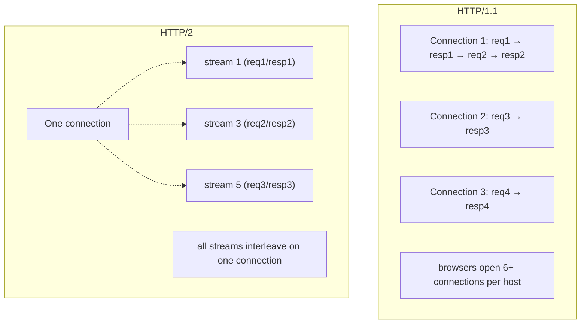
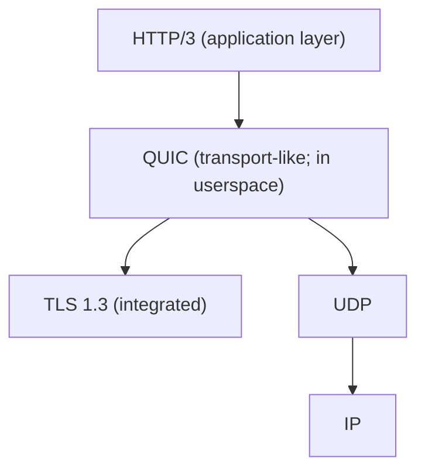

# HTTP/2 & HTTP/3

HTTP/1.1 (1997) is text-based, one-request-per-connection, head-of-line-blocked, hostile to high-fan-out modern UIs. **HTTP/2** (2015, RFC 7540) replaced the text framing with binary frames, introduced **multiplexing** (many concurrent streams on one TCP connection), and added header compression (HPACK). **HTTP/3** (2022, RFC 9114) goes further — replaces TCP with **QUIC** over UDP, eliminating TCP's head-of-line blocking, enabling connection migration across networks, and supporting 0-RTT resumption. Together they redefine the performance baseline for HTTP traffic in 2026.

A senior engineer understands these protocols because:

- Java HTTP clients (`java.net.http.HttpClient`, Spring's `WebClient`, `RestClient`, OkHttp) all speak HTTP/2 natively; choosing or not choosing it has measurable effect on backend-to-backend latency.
- gRPC (T06) is HTTP/2-only — many Spring services use it internally without realizing the protocol matters.
- Edge / CDN tier (T12 of C04) typically terminates HTTP/3 to the user; the origin sees HTTP/1.1 or HTTP/2 depending on configuration.
- Tomcat/Jetty/Undertow each enable HTTP/2 differently; Spring Boot wires HTTP/2 with one property but the gotchas (ALPN, TLS 1.3) need known.

This topic covers: HTTP/1.1's limitations; HTTP/2's binary framing, streams, multiplexing, HPACK header compression, server push, flow control, prioritization, ALPN negotiation; HTTP/3 + QUIC + UDP; the Java client / server support; the performance reality; the operational pitfalls.

> [!NOTE]
> Prerequisites: HTTP fundamentals (L2/C04/T01), TLS basics (L4/C01/T15). Connection / TCP basics.

## HTTP/1.1 — The Bottleneck

HTTP/1.1's design choices:

- **Text-based framing**: human readable, easy to parse incorrectly, large per-request overhead.
- **One request per connection at a time**: requests serialize (with keep-alive); browsers open 6+ parallel connections per host to mask this.
- **Head-of-line blocking**: even on pipelined HTTP/1.1, one slow response blocks subsequent ones.
- **No header compression**: every request/response carries duplicate `Cookie`, `User-Agent`, `Accept` headers — kilobytes per request.

For a modern web page with 100+ resources, HTTP/1.1 spends most of its time on connection management overhead.

## HTTP/2 — Binary Framing And Multiplexing

The headline feature: **one TCP connection carries many simultaneous streams**.



### Binary Framing

Everything is a **frame**. Frame types:

| Frame | Purpose |
|-------|---------|
| `HEADERS` | start a request or response with HPACK-compressed headers |
| `DATA` | body chunk |
| `SETTINGS` | connection-level config (initial window size, max frame size) |
| `WINDOW_UPDATE` | flow control |
| `PRIORITY` | stream priority hint |
| `PUSH_PROMISE` | server-initiated push (deprecated by browsers in practice) |
| `PING` | keep-alive |
| `GOAWAY` | graceful close |
| `RST_STREAM` | cancel a stream |

Each frame is small (default max 16 KB). They interleave on the wire — frame from stream 1, frame from stream 3, frame from stream 5, frame from stream 1 again, etc.

### Streams

A **stream** is a logical request/response pair within the connection. Numbered: client-initiated streams are odd, server-initiated even. Each stream has a state machine (idle → open → half-closed → closed).

A connection can host hundreds of concurrent streams (default `SETTINGS_MAX_CONCURRENT_STREAMS` is implementation-defined, often 100–1000).

### HPACK Header Compression

A `Cookie: sessionid=abc123` header repeated on 100 requests = ~3 KB of redundant bytes in HTTP/1.1. HPACK compresses:

- **Static table**: 61 common headers (`:method GET`, `:status 200`, `accept-encoding`, etc.) referenced by index.
- **Dynamic table**: headers seen in this connection added; future references are 1–2 bytes.
- **Huffman coding** on string values.

Typical reduction: 80–95%. A `GET` with 8 headers might be 300 bytes plain, 30–50 bytes HPACK.

### Server Push

Server preemptively sends resources the client will need (e.g., serving `index.html` + pushing `app.css`). **Browsers have largely deprecated push** (Chrome removed in 2022, Firefox followed) due to complexity and rare wins; gRPC and some APIs still use it.

### Flow Control And Prioritization

- **Flow control**: per-stream and per-connection window (default 64 KB). Receiver controls how much sender can send (`WINDOW_UPDATE`). Prevents overrun on slow consumers.
- **Prioritization**: client can hint priority (`HEADERS` frame with PRIORITY) so server schedules high-priority streams first. Largely abandoned in browsers (too complex; servers ignored it); HTTP/3 introduces a simpler scheme (Extensible Priorities).

### ALPN — Negotiating HTTP/2

TLS extension lets client list supported protocols (`h2`, `http/1.1`); server picks. **HTTP/2 over plaintext (`h2c`)** is possible but browsers don't implement it; in practice HTTP/2 requires TLS.

```mermaid
sequenceDiagram
  participant C as Client
  participant S as Server
  C->>S: ClientHello (ALPN: ["h2", "http/1.1"])
  S->>C: ServerHello (ALPN: "h2")
  Note over C,S: handshake completes; connection runs HTTP/2
  C->>S: HTTP/2 Preface "PRI * HTTP/2.0...\nSM\n\n"
  C->>S: SETTINGS frame
  S->>C: SETTINGS frame + ACK
  Note over C,S: ready
```

## HTTP/3 — Over QUIC

HTTP/3 keeps HTTP/2's semantics (frames, streams, HPACK→QPACK) but replaces TCP with **QUIC** over UDP. The motivations:

1. **TCP head-of-line blocking**. HTTP/2 multiplexes at the application level, but TCP serializes packets at the transport layer: one lost packet stalls *all* streams on that connection until retransmit. With QUIC, each stream has its own loss recovery.
2. **Connection migration**. TCP connections are bound to (src ip, src port, dst ip, dst port); a phone moving from Wi-Fi to LTE breaks the connection. QUIC connections have a **connection id**; the underlying IP can change without breaking the connection.
3. **0-RTT resumption**. QUIC integrates TLS 1.3 deeply; for known servers, the client can send application data with the first packet — no handshake round-trip.

### QUIC Architecture

QUIC = UDP + TLS 1.3 + stream multiplexing + congestion control + connection IDs.



QUIC runs in userspace (libraries: msquic, quiche, ngtcp2) so it can iterate independently of OS kernel TCP stacks.

### QPACK

HPACK has an ordering dependency that's incompatible with QUIC's per-stream loss recovery (header decoding requires seeing previous headers in order). QPACK is HPACK adapted: separate "encoder" and "decoder" streams; dynamic table updates are explicit.

### When HTTP/3 Wins

- **Mobile / lossy networks**: clear win (per-stream loss recovery, connection migration).
- **Long-lived connections**: cell-tower handoffs survive.
- **Latency-sensitive over distance**: 0-RTT saves a round-trip.

When HTTP/3 doesn't matter:

- **Same-data-center backend-to-backend**: TCP loss is rare; HTTP/2 is fine.
- **Short, infrequent connections**: 0-RTT savings minor.

For typical Spring backend services calling each other inside a VPC, HTTP/2 is the right answer. HTTP/3 matters at the edge — CDN-to-user.

## Java Server Support

Spring Boot enables HTTP/2 with one property (requires TLS):

```yaml
server:
  http2:
    enabled: true
  ssl:
    enabled: true
    key-store: classpath:keystore.p12
    key-store-password: ${KEY_STORE_PASS}
```

The embedded server (Tomcat, Jetty, Undertow) negotiates HTTP/2 via ALPN if the TLS implementation supports it. **Java 9+** built-in TLS supports ALPN natively; older code needed boot-classpath ALPN agents.

| Server | HTTP/2 | HTTP/3 |
|--------|:------:|:------:|
| Tomcat 9.5+/10/11 | ✅ | ❌ |
| Jetty 11+/12 | ✅ | partial (experimental) |
| Undertow | ✅ | ❌ |
| Netty (Reactor / WebFlux) | ✅ | partial via QUIC-Netty |

**HTTP/3 in Java servers is immature in 2026**. Most production HTTP/3 lives at the CDN tier (Cloudflare, Fastly, CloudFront); the CDN talks HTTP/2 to your origin.

## Java Client Support

`java.net.http.HttpClient` (Java 11+) supports HTTP/2 natively:

```java
HttpClient client = HttpClient.newBuilder()
    .version(HttpClient.Version.HTTP_2)
    .build();

HttpResponse<String> resp = client.send(
    HttpRequest.newBuilder(URI.create("https://api.example.com/orders")).build(),
    HttpResponse.BodyHandlers.ofString());
```

The client uses HTTP/2 when the server supports it (ALPN), falls back to HTTP/1.1 otherwise.

Spring's `WebClient` (reactive) and `RestClient` (Boot 3.2+) similarly support HTTP/2 via Reactor Netty or Apache HttpClient 5.

For gRPC (T06), HTTP/2 is mandatory; the gRPC Java library bundles its own.

## Performance Reality

For a typical microservices workload (REST APIs, small payloads, hundreds of requests per second):

| Metric | HTTP/1.1 | HTTP/2 | HTTP/3 |
|--------|:--------:|:------:|:------:|
| Throughput (req/s on one connection) | ~10K | ~50K | ~50K (similar) |
| Latency (LAN, p50) | 1 ms | 1 ms | 1 ms |
| Latency (Internet, p95 over loss) | high (TCP HOL) | medium | low (QUIC) |
| Connection setup | 1-2 RTT | 1-2 RTT | 0-1 RTT |
| Concurrency per connection | 1 (or pipelined fragile) | hundreds | hundreds |

For backend service-to-service in a LAN, HTTP/2 vs HTTP/1.1 is mostly about connection management (one connection vs N). For client-facing over the open Internet, HTTP/3 visibly improves p99 latency on mobile.

## Operational Pitfalls

> [!WARNING]
> **`h2c` (HTTP/2 plaintext) in production.** Browsers don't speak it; only useful for back-end-only setups. Stick to TLS h2.

> [!WARNING]
> **HTTP/2 max concurrent streams too low.** Default 100 in some Tomcat versions; clients hit limits. Raise `server.tomcat.max-concurrent-streams` if needed.

> [!WARNING]
> **Server push deployed widely.** Most browsers don't honor it; gains rare. Avoid.

> [!WARNING]
> **Mixing HTTP/2 + HTTP/1.1 in proxies without ALPN.** Mismatch can downgrade. Ensure end-to-end h2 if you want benefits.

> [!WARNING]
> **TLS 1.2 / weak ciphers blocking HTTP/2.** RFC 7540 mandates TLS 1.2+ with specific ciphers (and TLS 1.3 for HTTP/3). Server config matters.

> [!WARNING]
> **HTTP/2 on Tomcat with `worker_pool` exhaustion.** Many parallel streams on one connection can exhaust thread pools. Tune.

> [!WARNING]
> **gRPC failures during TLS issue.** gRPC requires HTTP/2; TLS or ALPN misconfig breaks gRPC silently. Test.

> [!WARNING]
> **HTTP/3 enabled on origin without LB support.** Mismatched. Confirm full chain supports each version.

## Practice

1. Enable HTTP/2 on a Spring Boot app. Use `curl --http2 -v` to verify ALPN negotiation.
2. Profile request throughput on HTTP/1.1 vs HTTP/2 for the same workload (1000 concurrent small requests).
3. Inspect a request via Wireshark; identify HEADERS frames; observe HPACK indexing across multiple requests.
4. Try `HttpClient.newBuilder().version(HTTP_2).build()` and measure connection reuse.
5. Set up Cloudflare in front; enable HTTP/3 to the edge; observe browser dev tools showing h3.
6. Run gRPC server + client; verify both speak HTTP/2.
7. Profile mobile-network simulation: HTTP/2 vs HTTP/3 with packet loss.
8. Tune Tomcat's `max-concurrent-streams` and observe behavior under load.

## Recap

You should now be able to:

- Explain HTTP/2's binary framing, multiplexing, HPACK, flow control, and ALPN.
- Distinguish HTTP/2's stream-level head-of-line vs TCP's connection-level HOL.
- Explain HTTP/3 + QUIC: per-stream loss recovery, connection migration, 0-RTT.
- Configure Spring Boot to serve HTTP/2 with TLS; understand which servers support what.
- Use Java HTTP clients with HTTP/2; understand gRPC's HTTP/2 dependency.
- Decide where HTTP/3 matters (mobile / edge) vs where HTTP/2 suffices (data-center).
- Avoid the canonical pitfalls: h2c in production, low max-streams, server push misuse, TLS/ALPN gotchas.

## Next

Continue to [Richardson Maturity Model & HATEOAS](./T02-richardson-maturity-model-and-hateoas.md) for the conceptual ladder of REST maturity from "RPC over HTTP" to "hypermedia-driven", and the practical reality of HATEOAS in 2026 (mostly unused — and why).
