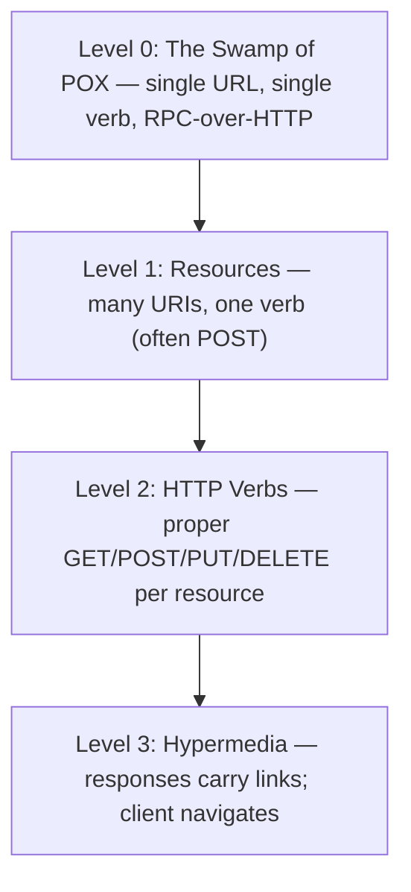

# Richardson Maturity Model & HATEOAS

Leonard Richardson's 2008 talk introduced a **four-level ladder of REST maturity**, popularized by Martin Fowler. Most "REST" APIs in production are Level 2 (resources + HTTP verbs); Level 3 (HATEOAS — hypermedia-driven) is the academic ideal codified in Roy Fielding's 2000 thesis but rarely shipped in practice. Understanding the model lets you evaluate "is this really REST?" and decide deliberately how much hypermedia your API needs (usually: a little, for pagination and discovery; not the full Fielding vision).

A senior engineer ships **Level 2 by default** (properly-versed resources, correct HTTP verbs, status codes, idempotency where mandated) and adds **selective Level 3 hypermedia** for the parts where it pays — pagination links, related-resource links, action availability. The dream of fully discoverable APIs that evolve safely via hypermedia hasn't materialized in mainstream usage; OpenAPI (T04) has won the discoverability story instead.

This topic covers: the four levels with examples; HATEOAS in detail (HAL, JSON:API, Siren formats); Spring HATEOAS for representation models; the practical reality (why most APIs skip HATEOAS); when hypermedia genuinely helps (pagination, discoverability, workflows); and the OpenAPI-vs-hypermedia trade-off.

> [!NOTE]
> Prerequisites: HTTP semantics (L2/C04/T01), [HTTP/2-3 (T01)](./T01-http-2-and-http-3.md). Spring MVC fundamentals (L4/C01/T10).

## The Four Levels



### Level 0 — POX (Plain Old XML / JSON)

One endpoint, one method, everything in the body:

```http
POST /api HTTP/1.1
Content-Type: application/json

{ "method": "getUser", "params": { "id": 42 } }
```

This is **RPC over HTTP**, not REST. SOAP, JSON-RPC, and many legacy "APIs" live here.

### Level 1 — Resources

Multiple URIs for different things:

```http
POST /users HTTP/1.1
{ "action": "get", "id": 42 }

POST /users HTTP/1.1
{ "action": "create", "name": "alice" }
```

URIs are now resource-oriented, but everything is still POST. Halfway.

### Level 2 — HTTP Verbs

The pragmatic "REST":

```http
GET /api/users/42                         → 200 with user
POST /api/users  body: {name: "alice"}    → 201 Created, Location: /api/users/43
PUT /api/users/42 body: {...}             → 200/204
DELETE /api/users/42                      → 204 No Content
```

Plus correct status codes (200/201/204/400/401/403/404/409/422/429/500), correct verb semantics (GET safe + idempotent; PUT idempotent; POST not), correct caching headers, content negotiation.

**This is what 95% of "REST APIs" are.** Adequate for almost all needs.

### Level 3 — HATEOAS

Responses carry **links** the client follows:

```json
{
  "id": 42,
  "name": "alice",
  "email": "alice@example.com",
  "_links": {
    "self":   { "href": "/api/users/42" },
    "orders": { "href": "/api/users/42/orders" },
    "edit":   { "href": "/api/users/42", "method": "PUT" }
  }
}
```

The client doesn't hard-code `/api/users/42/orders` — it discovers it. New endpoints or moves are absorbed without breaking clients (in theory).

## HAL — The Most Common Format

`application/hal+json` standardizes link representation:

```json
{
  "id": 42,
  "name": "alice",
  "_links": {
    "self":    { "href": "/api/users/42" },
    "orders":  { "href": "/api/users/42/orders" }
  },
  "_embedded": {
    "profile": {
      "_links": { "self": { "href": "/api/users/42/profile" } },
      "bio": "..."
    }
  }
}
```

`_links` for navigation; `_embedded` for inlined related resources.

## JSON:API And Siren

Other hypermedia formats:

- **JSON:API** — opinionated; document structure for resources + relationships + meta + links + included.
- **Siren** — entities + properties + actions + links + sub-entities.
- **Collection+JSON**.

Each tries to solve the same problem with slightly different shape. HAL is the simplest and most common.

## Spring HATEOAS

```xml
<dependency>
    <groupId>org.springframework.boot</groupId>
    <artifactId>spring-boot-starter-hateoas</artifactId>
</dependency>
```

Wraps DTOs in `EntityModel<T>` / `CollectionModel<T>` and computes links:

```java
@GetMapping("/api/users/{id}")
public EntityModel<UserResponse> get(@PathVariable long id) {
    UserResponse u = userService.find(id);
    return EntityModel.of(u,
        linkTo(methodOn(UserController.class).get(id)).withSelfRel(),
        linkTo(methodOn(OrderController.class).listForUser(id)).withRel("orders"),
        linkTo(methodOn(UserController.class).update(id, null)).withRel("edit"));
}
```

`linkTo + methodOn` introspects the controller method to build the URI; refactor-safe.

Pagination:

```java
@GetMapping("/api/users")
public PagedModel<EntityModel<UserResponse>> list(Pageable pageable, PagedResourcesAssembler<User> assembler) {
    Page<User> page = userService.list(pageable);
    return assembler.toModel(page, this::toEntityModel);
}
```

Result includes `next`, `prev`, `first`, `last` links automatically.

## When HATEOAS Helps

| Use case | Verdict |
|----------|---------|
| Pagination (next, prev links) | **strong** — adopt |
| Discoverable entry-point API (`GET /`) | **good** — adopt |
| Action availability (`edit` link only if user can edit) | **good** — neat |
| Self-link on every resource | **good** — cheap |
| Workflow state machines | **good** — surface valid next steps |
| Embedded related resources | maybe — helps avoid N+1 client-side |
| Full Fielding vision (client only knows entry URL) | **rarely worth it** |

## Why Most APIs Skip Full HATEOAS

The Fielding promise was: clients consume hypermedia generically; servers can change URIs and endpoints freely. Reality:

- Clients **hard-code** URI templates anyway because parsing dynamic links per request is added complexity.
- Mobile / desktop clients have **fixed builds** — adding a new "rel" requires a client update.
- **OpenAPI (T04)** delivers the discoverability story differently: machine-readable spec generates clients, types, docs. Adopted widely.

The pragmatic middle ground: ship Level 2 + selective hypermedia (pagination, action availability, self-links). Don't pretend to ship Level 3 unless you're building a discovery-driven system (e.g., banking APIs like UK Open Banking, which mandates HAL).

## OpenAPI vs HATEOAS

| Aspect | OpenAPI | HATEOAS |
|--------|---------|---------|
| Where discoverability lives | spec file (separate) | response payloads (embedded) |
| Client generation | mature (openapi-generator) | minimal |
| Client effort to navigate | typed methods | parse links + decide |
| Server change tolerance | spec versioning | URI swaps OK in theory |
| Adoption | dominant | niche |

OpenAPI won the discoverability war; HATEOAS is a niche tool for specific patterns (pagination, action gating, workflow state).

## A Practical Hybrid

```java
@GetMapping("/api/orders/{id}")
public EntityModel<OrderResponse> get(@PathVariable long id, Authentication auth) {
    Order o = service.find(id);
    EntityModel<OrderResponse> model = EntityModel.of(OrderResponse.of(o));

    model.add(linkTo(methodOn(OrderController.class).get(id)).withSelfRel());

    // Action gating: only show "cancel" link if user can cancel
    if (auth.hasPermission(o, "cancel") && o.canBeCancelled()) {
        model.add(linkTo(methodOn(OrderController.class).cancel(id)).withRel("cancel"));
    }
    if (auth.hasPermission(o, "edit") && o.canBeEdited()) {
        model.add(linkTo(methodOn(OrderController.class).update(id, null)).withRel("edit"));
    }
    return model;
}
```

Now the client UI can simply check "is the `cancel` link present?" without re-implementing the business rules. Genuine HATEOAS value, narrow scope.

## Common Pitfalls

> [!WARNING]
> **Claiming HATEOAS without changing client behavior.** Adding `_links` that no client uses is wasted bytes.

> [!WARNING]
> **Hard-coded URI patterns in clients.** Defeats hypermedia goal.

> [!WARNING]
> **Misusing PUT / DELETE / PATCH.** Foundation issue — even Level 2 isn't satisfied if verbs are wrong.

> [!WARNING]
> **POSTing for queries.** Breaks caching; defies semantics.

> [!WARNING]
> **No idempotency on PUT.** Spec says PUT is idempotent; implement that way.

> [!WARNING]
> **Mixing HAL with OpenAPI generated clients.** Pick one for discoverability; sync to docs.

> [!WARNING]
> **Adopting JSON:API spec without commitment.** Half-implementation breaks tooling.

## Practice

1. Audit your API against Richardson levels. Identify which level it's at.
2. Add HAL pagination links via Spring HATEOAS; verify clients (or curl) can follow.
3. Add action-gated links (edit/delete only when permitted); verify the client UI works off them.
4. Spec the same API with OpenAPI; compare developer experience (codegen vs hypermedia navigation).
5. Try JSON:API format; observe the structural complexity.
6. Look at three public APIs (Stripe, GitHub, AWS). Identify their Richardson level.
7. Convert a Level-0 RPC-over-HTTP endpoint to Level 2.
8. Write a client that follows HAL links generically (no hard-coded URIs).

## Recap

You should now be able to:

- Identify Richardson levels in any API.
- Ship Level 2 confidently: resources, verbs, status codes, headers, idempotency.
- Add selective HATEOAS for pagination, action gating, workflow state — where it pays.
- Use Spring HATEOAS: `EntityModel`, `CollectionModel`, `PagedModel`, `linkTo + methodOn`.
- Choose HAL, JSON:API, or Siren when you need a standard format.
- Recognize that full Level 3 is rare; OpenAPI is the dominant discoverability story.
- Avoid the canonical pitfalls: misused verbs, POST for queries, faux-HATEOAS without client consumers.

## Next

Continue to [Idempotency in APIs](./T03-idempotency-in-apis.md) for the deep treatment of idempotency keys, retry-safe operations, and how to design POST endpoints that survive client/network retries without double-billing.
