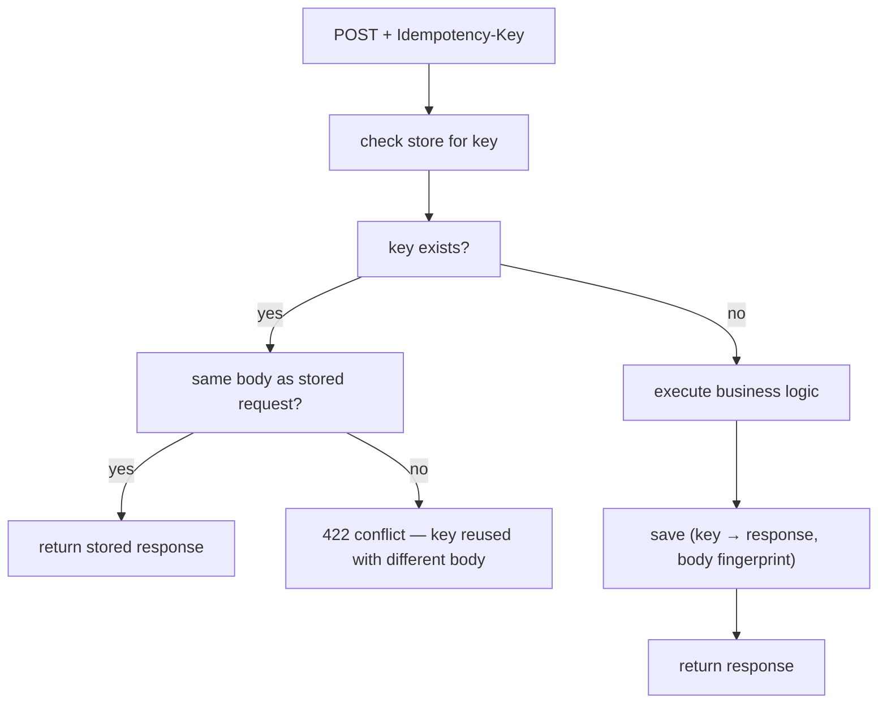

# Idempotency in APIs

A network request can fail in three ways: the request never reached the server, the request was processed but the response was lost, or the request was processed and the response delivered correctly. The client *cannot tell which*. To recover, clients **retry** — but retrying a non-idempotent operation (charge a card, place an order, send an email) **double-executes** if the original request had succeeded. The fix is **idempotency**: the API design that lets the client retry safely. Every modern API (Stripe, Square, AWS, GitHub Apps) implements this for write operations; senior engineers building serious APIs ship idempotency by default.

The canonical solution is the **idempotency key**: the client generates a unique id per logical operation; the server records (key → result) for some window (typically 24 hours); on retry with the same key, the server returns the stored result instead of re-executing. Implementation is straightforward; the design choices (key TTL, conflict semantics, what counts as duplicate, storage backend) matter.

This topic covers: why idempotency matters; idempotency keys vs business keys; the Stripe-style implementation; storage options (Postgres unique constraint, Redis); conflict handling (same key different body); the retry semantics across HTTP / messaging / scheduled jobs; Spring patterns; Kafka idempotent producer comparison.

> [!NOTE]
> Prerequisites: [Richardson MM (T02)](./T02-richardson-maturity-model-and-hateoas.md), [Spring MVC (L4/C01/T10)](../C01-spring-framework/T10-spring-mvc-rest-controllers.md), [Spring for Kafka (L4/C01/T22)](../C01-spring-framework/T22-spring-for-kafka-amqp.md).

## Why Idempotency

```mermaid
sequenceDiagram
  participant C as Client
  participant S as Server
  C->>S: POST /charges {amount: 100}
  Note over S: Charge processed; card debited
  S--XC: 200 OK (response lost in network)
  Note over C: timeout; client retries
  C->>S: POST /charges {amount: 100}
  Note over S: Charge processed AGAIN; card debited twice ❌
```

The client did its job (retried a failed request). The server has no way to know "is this a retry or a new request?" — they look identical. **Idempotency keys** make them distinguishable.

## The Idempotency Key Pattern

```http
POST /api/charges HTTP/1.1
Idempotency-Key: 5e8b3a0a-1f2c-4d3e-9b6f-7a8c9d0e1f2a
Content-Type: application/json

{ "amount": 100, "card": "tok_visa" }
```

Server flow:



Three outcomes:

1. **Cache hit (same body)**: return stored response. Idempotent retry handled.
2. **Cache hit (different body)**: 422 — client reused a key for a different operation. Likely bug.
3. **Cache miss**: execute, store, respond.

## Spring Implementation

```java
@Entity
public class IdempotencyRecord {
    @Id String key;
    String requestFingerprint;
    int responseStatus;
    @Lob String responseBody;
    Instant createdAt;
}

@Component
public class IdempotencyFilter implements Filter {

    private final IdempotencyRecordRepository repo;

    @Override
    public void doFilter(ServletRequest req, ServletResponse resp, FilterChain chain) throws IOException, ServletException {
        HttpServletRequest hreq = (HttpServletRequest) req;
        String key = hreq.getHeader("Idempotency-Key");
        if (key == null || !hreq.getMethod().equals("POST")) {
            chain.doFilter(req, resp); return;
        }

        ContentCachingRequestWrapper wrap = new ContentCachingRequestWrapper(hreq);
        ContentCachingResponseWrapper wrapResp = new ContentCachingResponseWrapper((HttpServletResponse) resp);

        Optional<IdempotencyRecord> stored = repo.findById(key);
        String fingerprint = fingerprint(wrap);

        if (stored.isPresent()) {
            if (!stored.get().requestFingerprint.equals(fingerprint)) {
                resp.setStatus(422);
                resp.getWriter().write("{\"error\":\"idempotency_key_reused\"}");
                return;
            }
            HttpServletResponse r = (HttpServletResponse) resp;
            r.setStatus(stored.get().responseStatus);
            r.getWriter().write(stored.get().responseBody);
            return;
        }

        chain.doFilter(wrap, wrapResp);

        // Save record
        try {
            repo.save(new IdempotencyRecord(key, fingerprint,
                wrapResp.getStatus(),
                wrapResp.getContentAsString(),
                Instant.now()));
        } catch (DataIntegrityViolationException e) {
            // race; another request stored first; ignore
        }
        wrapResp.copyBodyToResponse();
    }
}
```

The store is the persistence layer: Postgres with unique constraint on `key`; or Redis with SETNX.

## Key Generation

The client must generate keys:

- **UUID v4** — random; trivial.
- **UUID v5** — deterministic from operation params (so client retries naturally use the same key).
- **Application-defined** — based on the business operation (e.g., `order:42:create`).

Stripe / Square publish: UUID v4 is fine. The key is opaque to the server.

## Key TTL

How long to remember? Common: **24 hours**. Beyond that, retries are unlikely from any sane client.

Implement TTL:

- **Postgres**: scheduled cleanup job (`DELETE WHERE created_at < NOW() - INTERVAL '24 hours'`).
- **Redis**: `SET key value EX 86400`.

Don't store forever — table grows; memory fills.

## Storage Choice

| Store | Pros | Cons |
|-------|------|------|
| **Postgres** | transactional with main DB; survives crashes | one more table; cleanup jobs |
| **Redis** | fast; built-in TTL | non-durable (or requires AOF) |
| **DynamoDB** | TTL native; serverless | extra service |

For most apps with existing Postgres: just add an `idempotency_records` table. The race-condition handling (unique constraint) gives clean semantics.

## Conflict — Same Key, Different Body

When a client reuses a key with a different payload:

- **Stripe**: returns the stored response (treats as retry).
- **Square**: returns 409 / 422.
- **AWS**: depends on service.

**The safer behavior is to reject (422)**: it signals a client bug. Returning the old response masks the bug and risks confusion.

## Business-Key Idempotency

Sometimes the business has a natural unique key:

```http
POST /api/orders { externalOrderId: "ext_abc123", ... }
```

`externalOrderId` from the client's system. The server enforces `UNIQUE` on it; a duplicate POST returns the existing order. No `Idempotency-Key` header needed.

This is **business-key idempotency** — often cleaner than separate keys. Use when the business naturally has a unique identifier.

## In-Flight Idempotency

What if two concurrent retries arrive for the same key, neither finds a stored record, both execute?

- **Postgres**: `INSERT INTO idempotency_records ... ON CONFLICT DO NOTHING`. One wins; the other's INSERT fails. Retry the loser via the read-stored-response path.
- **Redis**: `SET key NX`. Loser must wait briefly or back off.
- **Distributed lock** before execution. Overkill for most cases.

The Postgres unique-constraint pattern is the cleanest for in-flight races.

## HTTP Methods And Idempotency

HTTP spec mandates:

- **GET, HEAD, OPTIONS, TRACE** — idempotent by spec (no state change).
- **PUT, DELETE** — idempotent by spec (multiple identical calls = same state).
- **POST, PATCH** — not idempotent.

Idempotency keys are needed for **POST and PATCH** specifically. PUT and DELETE should be naturally idempotent; design them that way (e.g., `DELETE` returns 204 even on missing resource; `PUT` is full-state replace).

## Kafka Idempotent Producer

Comparable pattern at the messaging layer (T22 of C01): the producer assigns a sequence number; broker deduplicates.

```yaml
spring:
  kafka:
    producer:
      enable.idempotence: true
```

Avoids duplicates from producer-side retries. Doesn't help if your *application* sends the same logical event twice.

## Idempotency vs Exactly-Once

Idempotency is the *application-level* answer to at-least-once messaging:

- **Exactly-once delivery**: hard / impossible.
- **At-least-once delivery + idempotent receiver = effectively exactly-once.**

For HTTP APIs, retry is "at-least-once" from the client's perspective; idempotency keys give effectively-exactly-once.

## Common Pitfalls

> [!WARNING]
> **No idempotency at all.** Network retry doubles every charge.

> [!WARNING]
> **Idempotency keys stored without TTL.** Table grows unbounded.

> [!WARNING]
> **Same key returns different responses.** Stored fingerprint mismatched; reveals bug.

> [!WARNING]
> **Treating PUT as non-idempotent.** Defies spec; breaks proxies and clients.

> [!WARNING]
> **Idempotency window too short.** Hours instead of 24h; some retries miss.

> [!WARNING]
> **Storing the full response body forever.** Use TTL + slim payloads.

> [!WARNING]
> **In-flight race not handled.** Concurrent retries both execute. Use unique constraint.

> [!WARNING]
> **Key required but client doesn't generate.** Either provide a server-side default (defeats purpose) or reject without key.

## Practice

1. Add `Idempotency-Key` header support to a payment endpoint; test retry of failed-response request.
2. Test reusing a key with a different body; verify 422.
3. Use Postgres with unique constraint; handle the in-flight race via INSERT ... ON CONFLICT.
4. Implement Redis-backed idempotency with SETNX + EXPIRE.
5. Audit your API: which writes are idempotent? Which should be? Which need keys?
6. Use a business key (externalOrderId) for natural idempotency; compare to header-based.
7. Compare your implementation to Stripe's docs.
8. Wire idempotency for an async outbox event so retries don't double-publish.

## Recap

You should now be able to:

- Explain why idempotency matters for any retry-prone write API.
- Implement the idempotency-key pattern via a Servlet filter or aspect, storing in Postgres or Redis.
- Handle the three cases: cache hit (same body), cache hit (different body), cache miss.
- Choose key TTL (typically 24h) and storage; design for in-flight races via unique constraint.
- Use business keys when natural.
- Distinguish HTTP method idempotency (PUT/DELETE inherent; POST/PATCH need keys).
- Connect to messaging-layer idempotent producers and at-least-once + idempotent receiver = effective exactly-once.
- Avoid the canonical pitfalls: no idempotency, no TTL, mismatched fingerprint, races unhandled.

## Next

Continue to [OpenAPI / Swagger documentation](./T04-openapi-swagger-documentation.md) for spec-driven API design, code generation, contract testing integration, and the practical Spring Boot + springdoc-openapi setup.
