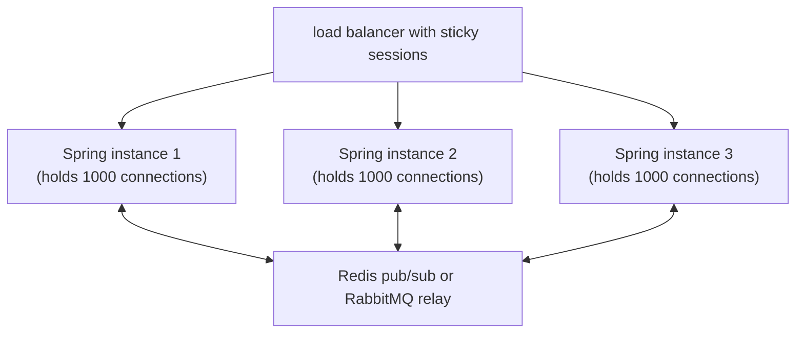

# WebSockets

HTTP is request-response: client asks, server answers. **WebSocket** (RFC 6455, 2011) is **full-duplex** — after a one-time HTTP upgrade handshake, the connection becomes a persistent bidirectional pipe that either side can send messages over at any time. Use cases: **real-time chat**, **live dashboards**, **multiplayer games**, **collaborative editing** (Google Docs–style), **live notifications**, **streaming sensor data to UI**, **trading apps with millisecond price updates**.

A senior engineer weighs WebSocket against alternatives: **SSE (T08)** is simpler for server→client only; **gRPC bidirectional streaming (T06)** is better for inter-service; **HTTP polling** suffices for low-frequency updates. WebSocket fits when truly bidirectional, web-native, sustained connection is needed.

Spring's WebSocket support has two layers: **native API** (raw frames, `WebSocketHandler`) and **STOMP over WebSocket** (message-broker semantics — destinations, subscribe / publish). STOMP fits enterprise messaging patterns naturally; native is for custom binary protocols.

This topic covers: the handshake; native WebSocket in Spring; STOMP message broker (in-memory and RabbitMQ-backed); SockJS fallback (deprecated); scaling (sticky sessions, Redis pub/sub fanout, Kafka fanout); heartbeats and disconnect handling; security (CSRF in handshake, per-message auth); the alternatives matrix.

> [!NOTE]
> Prerequisites: [HTTP/2 (T01)](./T01-http-2-and-http-3.md), [Spring MVC (L4/C01/T10)](../C01-spring-framework/T10-spring-mvc-rest-controllers.md), [Redis (L4/C04/T03)](../C04-nosql-and-caching/T03-key-value-stores-redis.md).

## The Handshake

```http
GET /ws HTTP/1.1
Host: example.com
Upgrade: websocket
Connection: Upgrade
Sec-WebSocket-Key: dGhlIHNhbXBsZSBub25jZQ==
Sec-WebSocket-Version: 13

# Server response
HTTP/1.1 101 Switching Protocols
Upgrade: websocket
Connection: Upgrade
Sec-WebSocket-Accept: s3pPLMBiTxaQ9kYGzzhZRbK+xOo=
```

After this, the TCP socket switches to WebSocket framing (`0x81` text frame, `0x82` binary, `0x88` close, `0x89` ping, `0x8A` pong, with payload-length encoding).

## Native Spring WebSocket

```xml
<dependency>
    <groupId>org.springframework.boot</groupId>
    <artifactId>spring-boot-starter-websocket</artifactId>
</dependency>
```

```java
@Configuration
@EnableWebSocket
public class WsConfig implements WebSocketConfigurer {
    @Override
    public void registerWebSocketHandlers(WebSocketHandlerRegistry registry) {
        registry.addHandler(new EchoHandler(), "/ws/echo")
            .setAllowedOrigins("*");
    }
}

public class EchoHandler extends TextWebSocketHandler {
    @Override
    public void handleTextMessage(WebSocketSession session, TextMessage message) throws Exception {
        session.sendMessage(new TextMessage("echo: " + message.getPayload()));
    }
}
```

Client (browser):

```javascript
const ws = new WebSocket('wss://example.com/ws/echo');
ws.onopen = () => ws.send('hello');
ws.onmessage = (e) => console.log(e.data);
```

Bare WebSocket: low-level; you design the message format.

## STOMP — Pub/Sub Over WebSocket

STOMP (Simple Text Oriented Messaging Protocol) layers messaging semantics on top:

- **Topics** (`/topic/chat`) — pub/sub.
- **Queues** (`/queue/user/42/notifications`) — point-to-point.
- **Subscriptions** — clients subscribe; server broadcasts.
- **Acks** — message acknowledgment.

```java
@Configuration
@EnableWebSocketMessageBroker
public class StompConfig implements WebSocketMessageBrokerConfigurer {

    @Override
    public void registerStompEndpoints(StompEndpointRegistry registry) {
        registry.addEndpoint("/ws").setAllowedOrigins("*");
    }

    @Override
    public void configureMessageBroker(MessageBrokerRegistry config) {
        config.enableSimpleBroker("/topic", "/queue");   // in-memory broker
        config.setApplicationDestinationPrefixes("/app"); // routes to @MessageMapping
    }
}

@Controller
public class ChatController {

    @MessageMapping("/chat/{room}")        // /app/chat/{room}
    @SendTo("/topic/chat/{room}")           // broadcast to /topic/chat/{room}
    public ChatMessage handle(@DestinationVariable String room, ChatMessage in) {
        return new ChatMessage(in.user(), in.text(), Instant.now());
    }
}
```

Client subscribes to `/topic/chat/room1`; sends to `/app/chat/room1`. Server's controller method runs; result broadcasts to all subscribers.

For private user messages:

```java
@MessageMapping("/notify")
@SendToUser("/queue/notifications")    // sends to the originating user only
public Notification handle(...) { ... }
```

## In-Memory vs External Broker

In-memory broker (`enableSimpleBroker`) works for one node only — different instances' subscribers don't see each other's broadcasts. For scaling, use RabbitMQ or ActiveMQ as the broker:

```java
config.enableStompBrokerRelay("/topic", "/queue")
    .setRelayHost("rabbitmq")
    .setRelayPort(61613)
    .setClientLogin("guest")
    .setClientPasscode("guest");
```

Now any Spring instance publishing to `/topic/chat/room1` reaches subscribers connected to *any* instance via Rabbit's STOMP broker.

## SockJS Fallback (Deprecated)

For pre-WebSocket browsers (IE9, ancient Android), SockJS fell back to long-polling, EventSource, etc. By 2026 it's deprecated; modern browsers all support WebSocket natively. Drop SockJS unless you must support IE.

## Scaling Strategies

For N Spring instances each holding M connections:



Patterns:

- **Sticky session**: client always lands on the same instance. Simpler; failure costs are real.
- **Backend pub/sub for fanout**: any instance can publish to all; subscribers on any instance receive.

For chat: every instance is both publisher (when receiving user message) and subscriber (broadcasting to its connected clients).

Connection limit per instance: ~10–50K typically (file descriptors; memory; heap pressure). Beyond that, scale horizontally.

## Heartbeats

WebSocket connections idle break (NAT timeouts, server idle). Heartbeats keep them alive:

```java
config.setHeartbeatValue(new long[]{10000, 10000})   // server→client, client→server, ms
    .setTaskScheduler(taskScheduler);
```

Browsers also expect heartbeats; the framework handles ping/pong frames automatically.

## Security

- **Origin checking**: don't `setAllowedOrigins("*")` in production. List specific origins.
- **Authentication**: HTTP cookies / Authorization header sent on handshake; bind to `Principal`.
- **Per-message authorization**: check the user can publish to a destination via `@PreAuthorize` on `@MessageMapping`.
- **CSRF**: Spring Security's STOMP integration handles CSRF token validation per-message.

```java
@MessageMapping("/admin/announce")
@PreAuthorize("hasRole('ADMIN')")
public void announce(...) { ... }
```

## Disconnect Handling

```java
@EventListener
public void onConnect(SessionConnectedEvent e) { ... }

@EventListener
public void onDisconnect(SessionDisconnectEvent e) {
    String sessionId = e.getSessionId();
    presenceService.markOffline(sessionId);
}
```

Subscribe to session events for presence, cleanup, audit.

## WebSocket vs SSE vs gRPC Bidi

| Need | WebSocket | SSE | gRPC bidi |
|------|:---------:|:---:|:---------:|
| Browser native | ✅ | ✅ | ❌ (need gRPC-Web) |
| Server→client streaming | ✅ | ✅ | ✅ |
| Client→server streaming | ✅ | ❌ (only with separate POST) | ✅ |
| Auto-reconnect | manual | ✅ | manual |
| Protocol complexity | medium | low | high |
| Binary frames | ✅ | ❌ (text) | ✅ |
| Header overhead | low | low | medium |
| Inter-service | OK | OK | best |

**For browser-facing real-time: WebSocket if bidirectional; SSE if one-way.**
**For inter-service real-time: gRPC bidi if Java-native.**

## Common Pitfalls

> [!WARNING]
> **`allowedOrigins("*")` in prod.** Cross-site scripts can connect; data leak. List origins.

> [!WARNING]
> **In-memory broker on multi-instance deploy.** Half users see each other; the other half don't. Use external broker.

> [!WARNING]
> **No heartbeat.** NAT-timed connections drop silently. Configure.

> [!WARNING]
> **Sticky sessions only.** Single-point failure on instance loss. Combine with backend fanout.

> [!WARNING]
> **No per-message auth.** Any connected user can publish anywhere. Use `@PreAuthorize`.

> [!WARNING]
> **Backpressure ignored.** Slow consumer; server's send queue fills; OOM. Configure session output buffer; drop or disconnect slow consumers.

> [!WARNING]
> **One WebSocket connection for the world.** Browser limit; connection pooling tricky. Most apps need one per page.

> [!WARNING]
> **WebSocket over plaintext HTTP in prod.** Use `wss://` (TLS).

## Practice

1. Build native WebSocket echo handler; connect via browser.
2. Convert to STOMP; broadcast chat to `/topic/chat`.
3. Switch from in-memory broker to RabbitMQ STOMP relay; verify multi-instance broadcast.
4. Add heartbeats; verify connection survives NAT-like idle.
5. Add origin checking; verify cross-origin rejected.
6. Add per-message `@PreAuthorize`; verify admin-only destinations blocked.
7. Profile connection limit on one Spring instance (raise file descriptor limit).
8. Compare WebSocket vs SSE for the same broadcast workload.

## Recap

You should now be able to:

- Explain the WebSocket handshake (HTTP upgrade to persistent TCP) and frame structure.
- Build native Spring WebSocket handlers for custom protocols.
- Use STOMP over WebSocket for pub/sub with `/topic`, `/queue`, `@MessageMapping`, `@SendTo`, `@SendToUser`.
- Switch between in-memory broker (single instance) and external broker relay (RabbitMQ / ActiveMQ).
- Scale: sticky sessions + backend fanout via Redis pub/sub or message broker.
- Configure heartbeats; handle disconnects via session events.
- Apply security: origin restrictions, per-message `@PreAuthorize`, CSRF via Spring Security integration.
- Choose WebSocket vs SSE vs gRPC bidi per use case.
- Avoid the canonical pitfalls: open origins, in-memory broker on multi-instance, no heartbeats, no backpressure handling.

## Next

Continue to [Server-Sent Events (SSE)](./T08-server-sent-events-sse.md) for the simpler one-way streaming alternative — when WebSocket is overkill.
