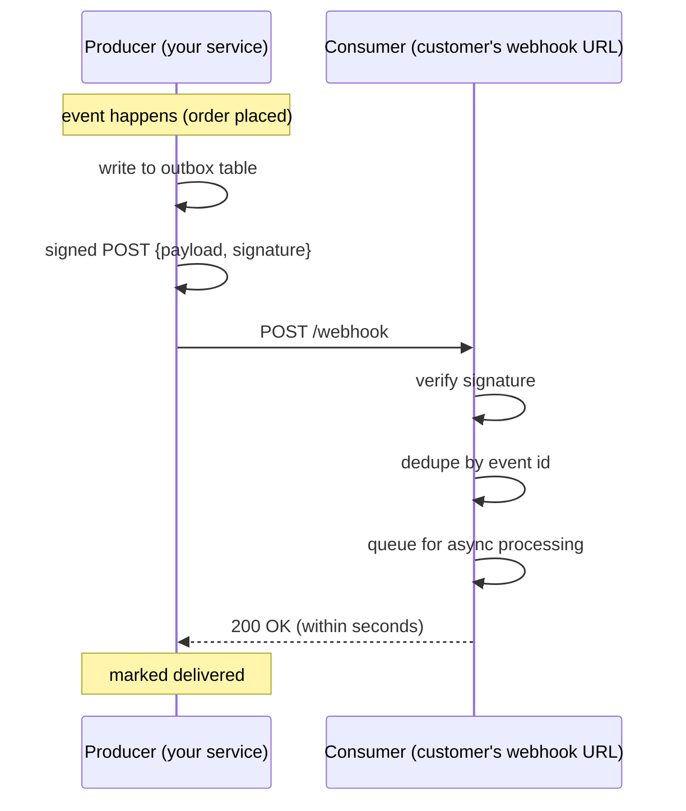

# Webhooks

A webhook is **an HTTP callback** — when something happens in service A, A makes an HTTP POST to service B's URL with the event payload. The inverse of polling. Used by every modern SaaS to notify customers of events: **Stripe** for payment lifecycle, **GitHub** for repo events, **Twilio** for SMS status, **Slack** for messages, **Shopify** for orders. As a producer, webhooks are the polite way to notify consumers without making them poll; as a consumer, you receive events from upstream services this way.

Webhooks look simple — a POST endpoint — but the production-grade implementation has nuance: **signature verification** (so the consumer trusts the payload came from the producer); **idempotent processing** (deliveries may retry, duplicate); **fast acknowledgement** (return 2xx in seconds; queue async); **retry with exponential backoff** (on consumer 5xx); **secret rotation**; **replay-attack protection** via timestamp; **dead-letter handling**; **observability**.

A senior engineer designs both sides correctly. Producer-side: reliable delivery with backoff, signing, idempotency keys, dead-letter. Consumer-side: signature check, dedupe, async processing, ack-and-process-later.

This topic covers: the pattern (producer / consumer); HMAC signature design and Spring verification; idempotent consumers; retry policy from the producer side; replay-attack defense; the dead-letter pattern; Stripe-style implementation; webhook delivery via Kafka outbox; alternatives (polling, EventBridge).

> [!NOTE]
> Prerequisites: [Idempotency (T03)](./T03-idempotency-in-apis.md), [Outbox pattern (L4/C01/T22)](../C01-spring-framework/T22-spring-for-kafka-amqp.md).

## The Pattern



Producer pushes; consumer accepts; both retry on failure.

## Consumer Side — Receiving Webhooks

```java
@RestController
public class StripeWebhookController {

    private final String webhookSecret = System.getenv("STRIPE_WEBHOOK_SECRET");
    private final WebhookEventRepository repo;
    private final ApplicationEventPublisher events;

    @PostMapping("/webhooks/stripe")
    public ResponseEntity<Void> receive(
            @RequestBody String rawBody,                  // raw bytes; needed for signature
            @RequestHeader("Stripe-Signature") String sig) {

        Event event;
        try {
            event = Webhook.constructEvent(rawBody, sig, webhookSecret);   // Stripe SDK
        } catch (SignatureVerificationException e) {
            return ResponseEntity.status(400).build();
        }

        if (repo.existsByEventId(event.getId())) {
            return ResponseEntity.ok().build();   // already processed; idempotent
        }
        repo.save(new WebhookEvent(event.getId(), event.getType(), rawBody, Instant.now()));

        events.publishEvent(new StripeEventReceived(event));   // async process

        return ResponseEntity.ok().build();   // ack within seconds
    }
}

@Component
public class StripeEventHandler {
    @Async
    @EventListener
    public void on(StripeEventReceived e) {
        // process — refund, update order, etc.
        // failures here will be retried via the producer's redelivery; idempotent processing required
    }
}
```

Key properties:

- **Verify signature first** before any processing.
- **Dedupe by event id** — Stripe always sends `id`.
- **Ack 200 fast** — Stripe expects under 30 seconds; process async.
- **Idempotent handler** — retries may arrive; handler must not double-charge / double-email.

## Signature Verification

HMAC-SHA256 of the payload, keyed by a shared secret:

```java
public boolean verify(String payload, String signature, String secret) {
    Mac mac = Mac.getInstance("HmacSHA256");
    mac.init(new SecretKeySpec(secret.getBytes(), "HmacSHA256"));
    String expected = Hex.encodeHexString(mac.doFinal(payload.getBytes()));
    return MessageDigest.isEqual(expected.getBytes(), signature.getBytes());   // constant-time
}
```

`MessageDigest.isEqual` for **constant-time comparison** — prevents timing attacks.

Real impl (Stripe-style) includes a timestamp:

```
Stripe-Signature: t=1717770000,v1=abcdef...
```

Verify `HMAC(t + "." + payload, secret) == v1`. Plus check `t` is recent (e.g., within 5 minutes) — **replay attack defense**.

## Producer Side — Delivering Webhooks

```java
@Service
public class WebhookDispatcher {

    private final WebhookSubscriptionRepository subs;
    private final WebClient webClient;

    @Async
    public void dispatch(WebhookEvent event) {
        subs.findByEventType(event.getType()).forEach(sub -> {
            sendWithRetry(sub, event, 1);
        });
    }

    private void sendWithRetry(Subscription sub, WebhookEvent event, int attempt) {
        String payload = serialize(event);
        String signature = sign(payload, sub.getSecret());
        long timestamp = System.currentTimeMillis() / 1000;

        webClient.post()
            .uri(sub.getUrl())
            .header("X-Webhook-Signature", "t=" + timestamp + ",v1=" + signature)
            .header("X-Event-Id", event.getId())
            .bodyValue(payload)
            .exchangeToMono(resp -> {
                if (resp.statusCode().is2xxSuccessful()) {
                    return Mono.empty();
                }
                if (attempt < 10) {
                    long delay = (long) Math.pow(2, attempt) * 1000;
                    return Mono.delay(Duration.ofMillis(delay)).then(
                        Mono.fromRunnable(() -> sendWithRetry(sub, event, attempt + 1))
                    );
                }
                // Out of retries — dead letter
                deadLetter.record(sub, event);
                return Mono.empty();
            })
            .subscribe();
    }
}
```

Backoff: 1s, 2s, 4s, 8s, ..., up to ~24h depending on policy. Stripe retries for 3 days.

## Retry Policy — When To Retry

- **Connection refused / timeout** — retry.
- **2xx** — success; don't retry.
- **4xx** — client error (bad signature, invalid payload). Don't retry (consumer bug).
- **5xx** — server error. Retry.

A consumer returning 4xx when they meant 5xx breaks producer retries. **Consumer-side robustness**: catch everything; return 5xx on internal failure, 2xx on success.

## Dead Letter

After max retries exhausted, mark the delivery as dead. Operations:

- Alert.
- Manual replay (admin button: re-queue dead-letter delivery).
- Notification to the consumer's admin.

Don't drop silently.

## Idempotent Receiver

Critical because retries are guaranteed. Two implementations:

### Dedup By Event Id

Consumer maintains `processed_events` table; INSERT-or-skip:

```java
boolean inserted = processedEventRepo.insertIfAbsent(event.getId());
if (!inserted) return;   // already processed
```

### Idempotent Side-Effects

Even without dedup, business logic idempotent:

```java
// Charge once per Stripe event id
charges.findOrCreate(event.getId(), event::toCharge);
```

The latter is more robust (survives DB resets) but requires more thought.

## Webhooks Via Outbox + Kafka

For internal services, the **outbox pattern (L4/C01/T22)** is cleaner than HTTP delivery between your own services. Kafka guarantees:

- At-least-once delivery.
- Replay on consumer failure.
- Backpressure handling.

For *external* customers, HTTP webhook is the standard. Many SaaS use the outbox internally + webhook dispatcher service.

## Replay Attacks And Defense

Attacker captures a valid webhook; replays. Defenses:

- **Timestamp in signature**: reject `t` older than 5 minutes.
- **Nonce / unique-id check**: dedup table.
- **TLS** in transit (mandatory).

Without timestamp tolerance, a 10-day-old captured webhook is replayable forever.

## Secret Rotation

Webhook secrets leak. Plan rotation:

- Allow two valid secrets at once during rotation window.
- Customer rotates over a week; old secret retires.
- Stripe supports this with multiple signing secrets.

## Versioning

Schema changes break old consumers. Options:

- Sign up consumer for a specific event version (`v1`, `v2`).
- Include `version` in payload; consumer dispatches.
- Maintain old versions until consumers migrate.

## Observability

- Per-subscription delivery success rate.
- Per-event-type retry count.
- Dead-letter rate.
- Consumer response time.

If a customer's webhook is down, their delivery queue grows; alert before it overwhelms the producer.

## Common Pitfalls

> [!WARNING]
> **No signature verification on the consumer.** Spoofing risk. Always verify HMAC.

> [!WARNING]
> **Synchronous business logic in the webhook handler.** Producers retry on timeout; you re-process; race conditions. Ack fast; queue async.

> [!WARNING]
> **No idempotency on the consumer.** Duplicates. Always dedup by event id.

> [!WARNING]
> **No replay-attack defense.** Captured webhooks replayable. Use timestamp + tolerance.

> [!WARNING]
> **No retry backoff on producer.** DoS on slow consumer. Exponential backoff.

> [!WARNING]
> **No dead-letter handling.** Failures vanish. Record and alert.

> [!WARNING]
> **Plain HTTP delivery.** TLS mandatory.

> [!WARNING]
> **Comparing signatures with `equals`.** Timing attack. Use constant-time.

> [!WARNING]
> **No versioning plan.** Schema change breaks all customers. Version events.

> [!WARNING]
> **Logging full payload.** PII / secret leak. Redact.

## Practice

1. Build a Stripe-style webhook consumer: signature verify, dedup, ack fast, async process.
2. Build a producer: sign with HMAC + timestamp, retry on 5xx, dead-letter after 10.
3. Simulate replay attack; verify timestamp tolerance rejects.
4. Test idempotent receiver: deliver same event 10 times; verify processed once.
5. Test secret rotation: configure two valid secrets; rotate; verify continuity.
6. Wire Prometheus metrics for delivery success / retry / dead-letter.
7. Compare HTTP webhooks vs Kafka outbox for internal services.
8. Build a UI for customer to view their webhook delivery log + replay failed.

## Recap

You should now be able to:

- Build a webhook receiver with HMAC signature verification, dedup, async processing, fast ack.
- Build a webhook producer with retry/backoff, signing, dead-letter.
- Defend against replay attacks via signature timestamps and tolerance windows.
- Implement idempotent processing on the consumer side.
- Plan secret rotation and event versioning.
- Choose webhook (external) vs outbox+Kafka (internal).
- Wire observability: delivery success rate, retry count, dead-letter rate.
- Avoid the canonical pitfalls: no signature, sync handler, no idempotency, no replay defense, no dead letter, equals() comparison, plain HTTP.

## Next

Continue to [Rate limiting & throttling](./T10-rate-limiting-and-throttling.md) for the algorithms (token bucket, sliding window) and Spring integration via Bucket4j, Resilience4j, and gateway-level rate limits.
