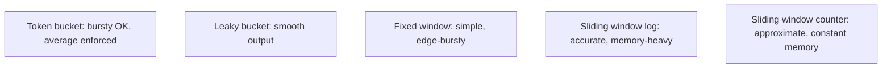
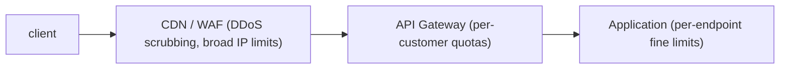

# Rate limiting & throttling

A misbehaving client (or a coordinated attack) can flood your API with requests, exhausting capacity for everyone else. **Rate limiting** caps requests per client per time window — return `429 Too Many Requests` when the cap is exceeded. The implementation choices (token bucket vs sliding window vs fixed window) trade fairness, memory, and accuracy. The integration point (per-instance vs distributed via Redis vs gateway-level) trades complexity and latency.

A senior engineer applies rate limiting at multiple layers: **edge / CDN** for DDoS scrubbing; **API gateway** for coarse per-customer quotas; **application** for per-endpoint fine control. Each layer enforces a budget; combined they protect both the system and individual customers.

This topic covers: the algorithms (token bucket, leaky bucket, fixed window, sliding window log, sliding window counter); per-IP / per-user / per-API-key rate-limit keys; distributed rate limiting via Redis; Bucket4j; Resilience4j rate limiter; Spring Cloud Gateway's request-rate-limiter; the standard HTTP semantics (`429`, `Retry-After`, `X-RateLimit-*`); soft vs hard throttling; the fairness vs throughput trade-offs.

> [!NOTE]
> Prerequisites: [Resilience4j (L4/C01/T19)](../C01-spring-framework/T19-spring-cloud-resilience-resilience4j.md), [Spring Cloud Gateway (L4/C01/T18)](../C01-spring-framework/T18-spring-cloud-config-gateway-eureka-openfeign.md).

## Algorithms

### Token Bucket

A bucket holds N tokens; refilled at rate R per second; cap at N (bucket size). Each request consumes a token; if none available, reject (or wait).

```
N = 100 tokens, R = 10/sec refill
Burst: up to 100 requests instantly possible
Sustained: 10/sec average
```

Allows bursts up to bucket size; sustains average rate. **The most common choice.**

### Leaky Bucket

Requests fill a queue (the "bucket"); processed at fixed rate. Excess requests overflow (rejected). Smooths bursts — opposite of token bucket.

```
Bucket capacity = 100; leak rate = 10/sec
Burst of 200: 100 queued, 100 rejected, then 10/sec drained
```

Used for smoothing outbound traffic (e.g., to a downstream service that can't handle bursts).

### Fixed Window

Count requests per fixed time window (1 min). Reset every minute. Simple but **bursty at window edges**: 100 requests at 59 s + 100 at 60 s = 200 in 2 seconds.

### Sliding Window Log

Store timestamps of all requests in a window. Count those within the last N seconds. Accurate but memory-heavy (one entry per request).

### Sliding Window Counter

Approximate sliding window with two fixed-window counters and a weighted blend. Constant memory; close-to-accurate. **The right default for most cases.**



## Bucket4j — The Java Library

```xml
<dependency>
    <groupId>com.bucket4j</groupId>
    <artifactId>bucket4j_jdk17-core</artifactId>
    <version>8.10.1</version>
</dependency>
```

```java
Bandwidth limit = Bandwidth.classic(100, Refill.greedy(10, Duration.ofSeconds(1)));
Bucket bucket = Bucket.builder().addLimit(limit).build();

if (bucket.tryConsume(1)) {
    // process request
} else {
    // 429
}
```

Local; in-memory; per-instance. For distributed: Redis-backed bucket:

```java
LettuceBasedProxyManager proxy = LettuceBasedProxyManager.builderFor(connection).build();
Bucket distributed = proxy.builder().build(key, () -> BucketConfiguration.builder()
    .addLimit(limit).build());
```

Same API; state in Redis; all instances share the budget per user.

## Resilience4j RateLimiter

T19 of C01 covered this. Local; configured via YAML or programmatic:

```java
RateLimiter rl = RateLimiter.of("api", RateLimiterConfig.custom()
    .limitForPeriod(100)
    .limitRefreshPeriod(Duration.ofSeconds(1))
    .timeoutDuration(Duration.ofMillis(50))
    .build());

if (rl.acquirePermission()) {
    // process
} else {
    // 429
}
```

Doesn't support distributed natively; per-instance only. For cluster-wide budgets, use Bucket4j with Redis or gateway-level.

## Spring Cloud Gateway

```yaml
spring:
  cloud:
    gateway:
      routes:
        - id: orders
          uri: lb://orders
          predicates: [Path=/api/orders/**]
          filters:
            - name: RequestRateLimiter
              args:
                redis-rate-limiter.replenishRate: 100
                redis-rate-limiter.burstCapacity: 200
                redis-rate-limiter.requestedTokens: 1
                key-resolver: "#{@userKeyResolver}"
```

```java
@Bean
public KeyResolver userKeyResolver() {
    return exchange -> Mono.just(exchange.getRequest().getHeaders().getFirst("X-API-Key"));
}
```

Gateway-enforced; Redis-backed; pluggable key resolver (per IP, per user, per API key). Most operations-friendly approach for app-wide quotas.

## Standard HTTP Semantics

```http
HTTP/1.1 429 Too Many Requests
Retry-After: 60
X-RateLimit-Limit: 100
X-RateLimit-Remaining: 0
X-RateLimit-Reset: 1717770060
Content-Type: application/json

{"error": "rate_limited", "message": "Try again in 60 seconds"}
```

- `Retry-After: 60` — client should wait 60 seconds (per RFC 6585).
- `X-RateLimit-*` — informational; non-standard but ubiquitous.

Always return these; client SDKs handle them.

## Key Selection

What identifies a "client"?

| Key | Use |
|-----|-----|
| **IP address** | DDoS defense; coarse; corporate NAT misbehaves |
| **API key** | per-customer quota; precise |
| **User id (authenticated)** | per-user quota |
| **Endpoint + key** | per-endpoint quota (heavier on some endpoints) |
| **Tenant id** | multi-tenant SaaS |

Often combine: per-IP for anonymous; per-API-key for authenticated; per-tenant for multi-tenant.

## Layered Defense



Each layer enforces a budget; layers stack. CDN absorbs floods; gateway protects customer quotas; app protects expensive endpoints.

## Soft vs Hard Throttling

- **Hard**: reject with 429.
- **Soft**: slow down (delay response) but allow.

Soft throttling backpressures; clients self-regulate. Common in messaging / batch APIs.

## Distributed Rate Limiting — The Race

A naïve implementation: read counter from Redis; check; increment. **Race**: two instances both see "99"; both pass; both increment to 100 → 101 requests passed for limit of 100.

Use atomic ops:

- Bucket4j: built-in atomic via Redis Lua scripts.
- Lua: load script that reads-checks-increments atomically.
- Redis `INCR` + `EXPIRE` for simple fixed window.

```lua
local key = KEYS[1]
local limit = tonumber(ARGV[1])
local current = redis.call('GET', key) or 0
if tonumber(current) >= limit then return 0 end
redis.call('INCR', key)
redis.call('EXPIRE', key, 60)
return 1
```

One round trip per check; atomic; safe across instances.

## Spring Implementation Pattern

```java
@Component
public class RateLimitFilter extends OncePerRequestFilter {

    private final ProxyManager<String> proxy;

    @Override
    protected void doFilterInternal(HttpServletRequest req, HttpServletResponse resp, FilterChain chain) throws ServletException, IOException {
        String key = getKey(req);   // API key or IP
        Bucket bucket = resolveBucket(key);

        ConsumptionProbe probe = bucket.tryConsumeAndReturnRemaining(1);
        resp.setHeader("X-RateLimit-Limit", "100");
        resp.setHeader("X-RateLimit-Remaining", String.valueOf(probe.getRemainingTokens()));

        if (probe.isConsumed()) {
            chain.doFilter(req, resp);
        } else {
            long waitMillis = probe.getNanosToWaitForRefill() / 1_000_000;
            resp.setHeader("Retry-After", String.valueOf(waitMillis / 1000));
            resp.setStatus(429);
            resp.getWriter().write("{\"error\":\"rate_limited\"}");
        }
    }
}
```

Filter applies to all requests; per-key bucket; informational headers; 429 with Retry-After on exceed.

## Common Pitfalls

> [!WARNING]
> **Per-instance rate limit when intended cluster-wide.** N instances × per-instance limit = N× more. Use Redis-backed.

> [!WARNING]
> **No Retry-After.** Clients don't know when to retry; they hammer.

> [!WARNING]
> **Fixed-window only.** Edge bursts allow 2× the limit briefly.

> [!WARNING]
> **Race on read-then-increment.** Use atomic Lua or Bucket4j.

> [!WARNING]
> **Per-IP only.** NAT + multiple users behind one IP get throttled together.

> [!WARNING]
> **No layered defense.** Hit gateway with 1M req/sec; gateway-only limits leak. Combine CDN + GW + app.

> [!WARNING]
> **Same limit for all endpoints.** Heavy endpoints exhaust quota fast.

> [!WARNING]
> **No metrics on rate-limit hits.** Can't tune.

> [!WARNING]
> **429 returned with payload describing internal logic.** Information leak.

> [!WARNING]
> **Block legitimate traffic instead of slow.** Soft throttle when appropriate.

## Practice

1. Implement Bucket4j local rate limiter on an endpoint; verify 429 at threshold.
2. Switch to Redis-backed Bucket4j; verify cluster-wide enforcement.
3. Add `Retry-After`, `X-RateLimit-*` headers; verify with curl.
4. Configure Spring Cloud Gateway RequestRateLimiter; per-API-key quotas.
5. Implement Lua rate-limit script; benchmark vs Bucket4j.
6. Compare fixed-window vs sliding-window edge behavior under burst.
7. Layered defense: simulate burst; observe CDN absorb, GW limit, app limit.
8. Track 429 rate per endpoint; tune limits.

## Recap

You should now be able to:

- Choose between token bucket, leaky bucket, fixed window, sliding window log, sliding window counter.
- Implement per-instance rate limiting with Bucket4j / Resilience4j.
- Implement distributed rate limiting via Bucket4j+Redis, Lua scripts, or Spring Cloud Gateway.
- Return standard 429 + Retry-After + X-RateLimit-* headers.
- Choose keys: IP for anonymous, API key / user / tenant for authenticated.
- Layer defense: CDN + gateway + application.
- Apply soft (delay) vs hard (reject) throttling per use case.
- Avoid the canonical pitfalls: per-instance for cluster need, races, IP-only, no metrics, info leak in 429.

## Next

Continue to [BFF (Backend for Frontend)](./T11-bff-backend-for-frontend.md) for the final C05 topic — the pattern of a backend service tailored per frontend (web, mobile, etc.), the aggregation responsibilities, and the Spring patterns.
