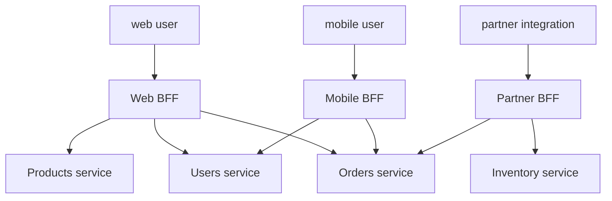

# BFF (Backend for Frontend)

A single "backend API" that serves both a desktop web app, a mobile app, a smartwatch, and a partner integration ends up making compromises: different clients need different data shapes, different aggregations, different security models, different rate limits. **BFF** (Backend for Frontend; coined by SoundCloud's Phil Calçado, ~2015) is the pattern of running **one backend service per frontend**, each tailored to that frontend's needs. The mobile BFF aggregates data into small mobile-friendly payloads; the web BFF returns richer shapes; the partner BFF enforces partner contracts.

A senior engineer reaches for BFF when (a) different clients diverge meaningfully in needs; (b) the domain services (microservices) want to stay stable while frontend velocity is high; (c) authentication / session models differ per frontend (browser cookies vs mobile JWTs vs partner API keys). It's the modern alternative to one bloated "API gateway" service trying to be everything.

This topic covers: the BFF pattern; aggregation responsibilities; OAuth2 BFF (the modern auth pattern for SPAs); per-channel security; GraphQL as a BFF; the trade-off (more services to operate; cleaner separation); when not to BFF (small teams, similar clients).

> [!NOTE]
> Prerequisites: [GraphQL (T05)](./T05-graphql.md), [gRPC (T06)](./T06-grpc-and-protocol-buffers.md). Microservices basics.

## The Pattern



Each BFF talks to whichever downstream services it needs. BFFs are *not* shared: web BFF doesn't serve mobile.

## BFF Responsibilities

- **Aggregation**: combine N downstream calls into one client response.
- **Response shaping**: project data into shapes the client wants (minimal payload for mobile; richer for desktop).
- **Authentication**: handle the client's auth model (session cookie for browser; JWT for mobile).
- **Per-client logging / metrics / rate limiting**.
- **Client-specific business logic** (formatting, localization, error mapping to client conventions).

What BFFs **don't** do:

- Own data (delegate to domain services).
- Implement core business logic (also in domain services).

## Example — Mobile vs Web Order History

```java
// Mobile BFF — small payload, batched
@RestController
public class MobileOrderController {
    private final OrderClient orderClient;
    private final ProductClient productClient;

    @GetMapping("/mobile/orders")
    public List<MobileOrderSummary> list(@AuthenticationPrincipal Jwt jwt) {
        List<Order> orders = orderClient.getMyOrders(jwt.getSubject());
        Set<String> productIds = orders.stream()
            .flatMap(o -> o.items().stream().map(OrderItem::productId))
            .collect(Collectors.toSet());
        Map<String, Product> products = productClient.getProducts(productIds).stream()
            .collect(Collectors.toMap(Product::id, Function.identity()));

        return orders.stream()
            .map(o -> new MobileOrderSummary(
                o.id(),
                o.status(),
                o.items().stream().map(i -> products.get(i.productId()).thumbnailUrl()).limit(1).findFirst().orElse(null),
                o.total()))
            .toList();
    }
}

// Web BFF — fuller payload, richer
@RestController
public class WebOrderController {
    @GetMapping("/web/orders/{id}")
    public WebOrderDetail get(@PathVariable long id, @AuthenticationPrincipal OidcUser user) {
        Order order = orderClient.getOrder(id);
        Customer customer = customerClient.getCustomer(order.customerId());
        List<ShipmentTracking> tracking = trackingClient.getForOrder(id);
        Recommendation recs = recoClient.getRelated(order.customerId());
        // ... 4 calls aggregated; rich response
        return new WebOrderDetail(order, customer, tracking, recs);
    }
}
```

Same domain (orders), two BFFs, different response shapes, different aggregations.

## OAuth2 BFF Pattern

For SPAs (React, Vue), the modern security pattern:

- BFF holds OAuth2 client credentials.
- BFF performs the auth code flow with the IdP.
- BFF stores access token / refresh token *server-side* (Redis-backed Spring Session).
- Browser holds only an HttpOnly **session cookie**.

This is much safer than browser-side token storage (no XSS-leak of tokens). Spring Security's OAuth2 client supports this directly:

```java
@Bean
public SecurityFilterChain bff(HttpSecurity http) throws Exception {
    return http
        .authorizeHttpRequests(auth -> auth.anyRequest().authenticated())
        .oauth2Login(Customizer.withDefaults())
        .csrf(c -> c.csrfTokenRepository(CookieCsrfTokenRepository.withHttpOnlyFalse()))
        .build();
}
```

Browser logs in; gets session cookie; BFF proxies its requests to downstream services with the appropriate token (session lookup → access token).

## GraphQL As BFF

Many BFFs are GraphQL (T05). The client specifies exactly the shape it wants; the BFF resolver aggregates from microservices. The federation pattern (Apollo Federation) is BFF taken to its logical extreme.

```graphql
query Mobile {
  me {
    name
    orders(limit: 10) {
      id
      status
      thumbnail
      total
    }
  }
}
```

The BFF stitches user data + orders + product images. Mobile gets only `thumbnail`; web requests `items { product { name, fullImageUrl, description } }` instead.

## When To Not BFF

- **One frontend only.** Just one backend.
- **All clients want the same shape.** No tailoring needed.
- **Small team can't operate N BFFs.** Per-service ops cost is real.
- **Domain services already aggregate.** Don't BFF on top of a BFF-like service.

BFFs aren't free. Each is a service with its own deployment, monitoring, on-call. Use only when clients diverge significantly.

## Anti-Corruption Layer

BFFs act as ACL between clients (which have churning UI needs) and domain services (which want stability). Domain services expose canonical contracts; BFFs translate per client. This **decouples** UI release cycles from backend.

## BFF Per Team

Sometimes BFFs align with frontend teams: the iOS team owns the iOS BFF (in any backend language); the web team owns the web BFF. **Conway's Law in action**: organize backends to mirror client teams.

## Common Pitfalls

> [!WARNING]
> **One BFF for all clients.** Same problem as monolithic API. Defeats the pattern.

> [!WARNING]
> **BFF doing business logic.** Should be in domain services. BFFs only shape + aggregate.

> [!WARNING]
> **N+1 in BFF.** Calling downstream service in a loop. Batch APIs or DataLoader-style.

> [!WARNING]
> **Sharing BFF across frontends.** Tempting cost-saver; bites later when one client needs change.

> [!WARNING]
> **BFF as choke point.** A bug in one BFF affects that frontend; smaller blast radius than monolith.

> [!WARNING]
> **No client-version tolerance.** BFF must support old clients during rollout.

> [!WARNING]
> **Mobile BFF returning huge JSON.** Defeats mobile bandwidth goals.

> [!WARNING]
> **Adopting BFF for one client.** Wait until divergence is real.

## Practice

1. Identify clients of your current API. Are their needs converging or diverging?
2. Extract a mobile BFF; shape payload to be smaller; measure latency / bytes saved.
3. Implement OAuth2 BFF for an SPA; sessions cookie-based; tokens server-side.
4. Use GraphQL as BFF; mobile and web ask for different fields; same backend.
5. Compare BFF vs single API gateway; identify the ops cost difference.
6. Apply DataLoader-style batching inside BFF resolver.
7. Plan client version tolerance: how does BFF stay backward compatible during client migrations?
8. Assess whether your team can operate the additional services.

## Recap

You should now be able to:

- Apply BFF: one backend per frontend; aggregation + shaping + auth per client.
- Use OAuth2 BFF pattern for SPAs (server-side tokens; HttpOnly session cookie).
- Use GraphQL as a BFF for client-specified projections.
- Restrict BFFs to aggregation / shaping / per-client concerns; keep business logic in domain services.
- Batch downstream calls inside BFFs.
- Choose BFF only when clients diverge meaningfully; otherwise stick with a single API.
- Plan per-team BFF ownership when team / client structure aligns.
- Avoid the canonical pitfalls: shared BFF, business logic in BFF, N+1 to downstream, no version tolerance.

## Next

C05 is complete (11 of 11 topics). Continue to [C06 Reactive Programming](../C06-reactive-programming/) for reactive streams, Project Reactor, backpressure, WebFlux, R2DBC, and the reactive-vs-virtual-threads choice in 2026.
