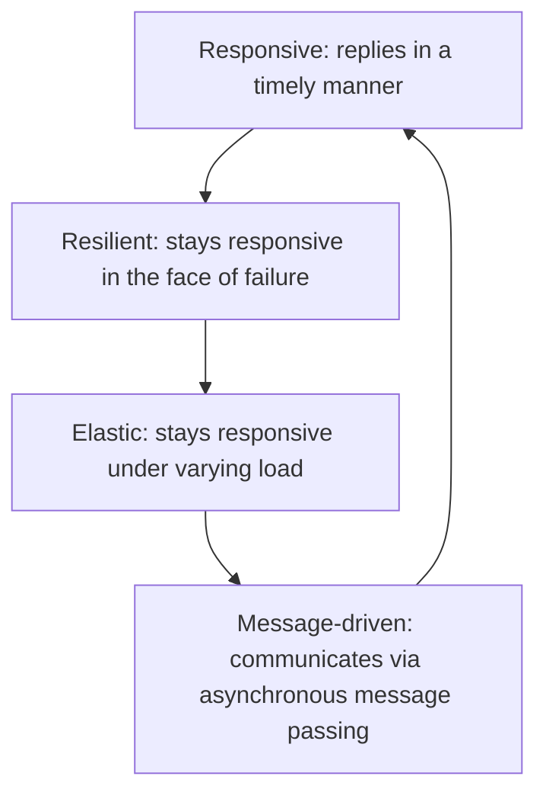
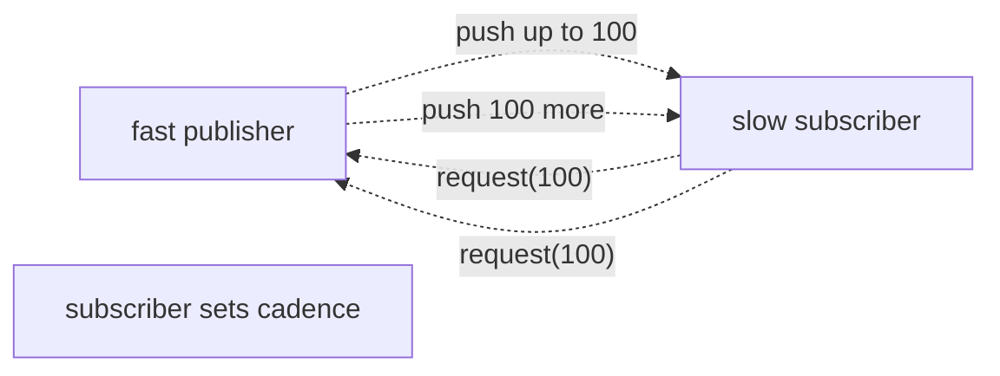

# Reactive principles & the Reactive Streams spec

"Reactive" has two meanings in 2026 Java. **Reactive Manifesto** (2014) describes four properties of a system: **responsive, resilient, elastic, message-driven**. It's a philosophy, not a library. **Reactive Streams** (2015 → JDK 9 `Flow`) is a concrete spec — four interfaces and a small protocol — that any reactive library implements: Project Reactor, RxJava, Akka Streams, Vert.x. The spec defines the interaction: a `Subscriber` *requests* N elements; the `Publisher` produces at most that many. **Backpressure** — the subscriber controlling the rate — is the central innovation.

A senior engineer needs the conceptual foundation before touching Project Reactor (T02) or WebFlux (T05). What problem does reactive solve? When does it pay? Why is it complex? In 2026 with virtual threads available, when is reactive *still* the right answer?

This topic introduces: the Manifesto principles; the Reactive Streams spec (Publisher, Subscriber, Subscription, Processor); the request-N protocol; backpressure mechanics; JDK 9's `Flow` API; library landscape (Reactor vs RxJava); when to go reactive vs imperative + virtual threads.

> [!NOTE]
> Prerequisites: [Spring WebFlux (L4/C01/T17)](../C01-spring-framework/T17-spring-webflux-reactive.md) for context. Async / concurrent Java basics.

## The Reactive Manifesto

Four interconnected properties:



- **Responsive**: low, predictable latency.
- **Resilient**: failure of one component doesn't take down the system. Isolation, replication, supervision, delegation.
- **Elastic**: scales out under load; scales in when idle.
- **Message-driven**: asynchronous, non-blocking message passing decouples components. Enables backpressure.

This is a **system property**, not a library feature. You can build reactive systems with Spring MVC + virtual threads + Kafka. The Manifesto doesn't mandate any specific tool.

## Reactive Streams — The Spec

A 4-interface spec (about 30 lines of Java total):

```java
public interface Publisher<T> {
    void subscribe(Subscriber<? super T> s);
}

public interface Subscriber<T> {
    void onSubscribe(Subscription s);
    void onNext(T t);
    void onError(Throwable t);
    void onComplete();
}

public interface Subscription {
    void request(long n);
    void cancel();
}

public interface Processor<T, R> extends Subscriber<T>, Publisher<R> { }
```

The protocol:

1. `Subscriber` calls `Publisher.subscribe(this)`.
2. `Publisher` calls `subscriber.onSubscribe(subscription)`.
3. `Subscriber` calls `subscription.request(N)` — "send me up to N elements".
4. `Publisher` calls `onNext` up to N times.
5. Subscriber may call `request(M)` again at any time.
6. Eventually `onComplete()` (success) or `onError(t)` (failure).
7. Subscriber may `subscription.cancel()` to stop.

```mermaid
sequenceDiagram
  participant S as Subscriber
  participant P as Publisher
  S->>P: subscribe(s)
  P->>S: onSubscribe(subscription)
  S->>P: subscription.request(5)
  P->>S: onNext(a)
  P->>S: onNext(b)
  P->>S: onNext(c)
  Note over S: process; ask for more
  S->>P: subscription.request(5)
  P->>S: onNext(d)
  P->>S: onNext(e)
  P->>S: onComplete()
```

## Backpressure — The Key Idea

In a *push* model, fast publishers can flood slow subscribers; messages queue; memory fills; OOM. In *pull*, subscribers ask one at a time; throughput limited by round-trip latency.

Reactive Streams is **request-pull-then-push**: the subscriber declares its capacity (`request(N)`); the publisher pushes up to N. Subscriber controls demand without per-element round-trips.



For non-finite streams (sensor feeds, log streams, Kafka), backpressure prevents memory explosion when consumers can't keep up.

## JDK 9 Flow API

Since JDK 9, the same interfaces live in `java.util.concurrent.Flow`:

```java
Flow.Publisher<T>
Flow.Subscriber<T>
Flow.Subscription
Flow.Processor<T, R>
```

Identical contracts. Bridging:

```java
Flow.Publisher<T> jdk = ReactiveStreams.toFlowPublisher(reactorPublisher);
```

Libraries (Reactor, RxJava) implement both interfaces; interop is trivial.

## Hot vs Cold Publishers

**Cold**: each subscription gets its own data stream. Subscribing twice = two independent runs. Most `Flux.just(...)`, `Flux.fromIterable(...)`, DB queries.

**Hot**: a shared stream; subscribers receive whatever is emitted while connected. Mouse events, stock ticker, Kafka topic.

Cold ≈ unicast; Hot ≈ multicast/broadcast.

The distinction matters: subscribing late to a hot publisher misses earlier emissions.

## Operators

Reactor and RxJava provide ~300 operators that compose publishers:

```java
Flux.range(1, 100)
    .filter(n -> n % 2 == 0)
    .map(n -> n * 10)
    .take(5)
    .subscribe(System.out::println);
// emits 20, 40, 60, 80, 100
```

Each operator is itself a publisher that subscribes to its upstream. Backpressure propagates through the chain.

## The Library Landscape

| Library | Notes |
|---------|-------|
| **Project Reactor** | Spring's standard; `Mono<T>` (0..1), `Flux<T>` (0..N) |
| **RxJava** | Netflix; older API; `Single`, `Maybe`, `Observable`, `Flowable` |
| **Akka Streams** | Lightbend; based on actors |
| **Mutiny** | Quarkus's reactive lib; `Uni` / `Multi` |
| **Vert.x** | full event-loop framework; reactive-streams compatible |

For Spring: **Reactor**. T02 covers it deeply.

## Reactive vs Imperative — The 2026 Question

**Before virtual threads (pre-Java 21)**: reactive's main use case was non-blocking I/O for high-concurrency services. Spring WebFlux + Reactor scaled to 100K+ connections per JVM with small thread pools.

**With virtual threads (Java 21+)**: Tomcat with virtual-thread workers handles 100K+ connections too, with simpler blocking code. The "high-concurrency I/O" argument for reactive weakens dramatically.

What **remains** for reactive in 2026:

- **Streaming**: `Flux<T>` as a first-class server-sent stream (T08 of C05; LLM tokens, telemetry).
- **Backpressure semantics**: subscriber-controlled flow critical for some workloads.
- **Functional composition**: operator chains can express dataflow elegantly.
- **Existing reactive codebase**: don't rewrite.

What's **lost**:

- Code complexity (operator chains, debugging, lazy evaluation).
- Stack-trace utility (everything async; traces obscure).
- Cognitive load.

The 2026 default for new Spring services: **imperative + virtual threads + Kafka where async events matter**. Reach for reactive when streaming or backpressure semantics are first-class needs.

## Implementing A Publisher

```java
public class CountingPublisher implements Flow.Publisher<Integer> {

    @Override
    public void subscribe(Flow.Subscriber<? super Integer> sub) {
        sub.onSubscribe(new Flow.Subscription() {
            int n = 0;
            boolean cancelled = false;

            @Override public void request(long requested) {
                for (int i = 0; i < requested && !cancelled; i++) {
                    sub.onNext(n++);
                }
                if (!cancelled && n >= 100) {
                    sub.onComplete();
                }
            }

            @Override public void cancel() { cancelled = true; }
        });
    }
}
```

In practice you never write this by hand — Reactor and RxJava give you `Flux.create(...)` and `Flux.fromIterable(...)`. But understanding the protocol illuminates how the libraries work.

## The TCK

Reactive Streams TCK (Technology Compatibility Kit) is a test suite verifying spec compliance. Library authors run it; user code doesn't typically interact.

## Common Misconceptions

> [!WARNING]
> **"Reactive = non-blocking."** Reactive is about backpressure protocol. Non-blocking I/O is one *implementation choice*. You could have blocking reactive code (subscriber blocks on receive).

> [!WARNING]
> **"Reactive = fast."** Per-operation, reactive is *slower* than blocking due to context switching. The win is throughput under concurrency, not single-op latency.

> [!WARNING]
> **"Reactive solves everything."** It introduces complexity. Use selectively.

> [!WARNING]
> **"Mono = sync, Flux = async."** Both are async by default. Mono = 0..1; Flux = 0..N. Concurrency is orthogonal.

> [!WARNING]
> **"Backpressure protects against any failure."** No — it protects against overwhelm; not against bugs, network drops, etc.

## Common Pitfalls

> [!WARNING]
> **Blocking inside reactive chain.** Defeats purpose; deadlocks event loop. Offload to `boundedElastic` scheduler.

> [!WARNING]
> **Confusing hot and cold.** Subscribing late to cold = fresh data; to hot = miss.

> [!WARNING]
> **Calling `subscribe` for side effects in production.** Lose error tracking; lose cancellation control.

> [!WARNING]
> **Using `block()` inside reactive code.** Defeats the point.

> [!WARNING]
> **Adopting reactive because Spring docs mention it.** Evaluate against your needs.

## Practice

1. Implement a simple `Publisher<Integer>` and `Subscriber<Integer>` from scratch. Trace the protocol.
2. Wire Reactor's `Flux.range(1, 100)` to a custom subscriber that requests in chunks of 10.
3. Demonstrate backpressure: fast producer + slow consumer; observe demand control.
4. Convert a small Spring MVC endpoint to WebFlux. Measure complexity / latency.
5. Compare RxJava vs Reactor for the same simple chain.
6. Build a reactive flow that interleaves blocking work properly via `subscribeOn(boundedElastic)`.
7. With Java 21+, build the same workload imperatively with virtual threads. Compare ergonomics.
8. Evaluate: which parts of your current service genuinely benefit from reactive?

## Recap

You should now be able to:

- Recite the Reactive Manifesto: responsive, resilient, elastic, message-driven.
- Explain the Reactive Streams interfaces (Publisher, Subscriber, Subscription, Processor) and the request-N protocol.
- Recognize backpressure as the central feature; understand how cold publishers differ from hot.
- Map JDK 9 `Flow` API to reactive-streams interfaces.
- Compare library options (Reactor, RxJava, Akka Streams, Mutiny, Vert.x); pick Reactor for Spring.
- Evaluate reactive vs imperative + virtual threads for your workload; default to imperative in 2026.
- Avoid common misconceptions: reactive ≠ fast; reactive ≠ non-blocking; Mono/Flux are about cardinality not concurrency.
- Avoid pitfalls: blocking in reactive chain, calling block(), confusing hot/cold.

## Next

Continue to [Project Reactor (Mono / Flux)](./T02-project-reactor-mono-flux.md) for the deep treatment of Spring's reactive library — operators, schedulers, error handling, testing — that you'll use in any reactive Spring application.
