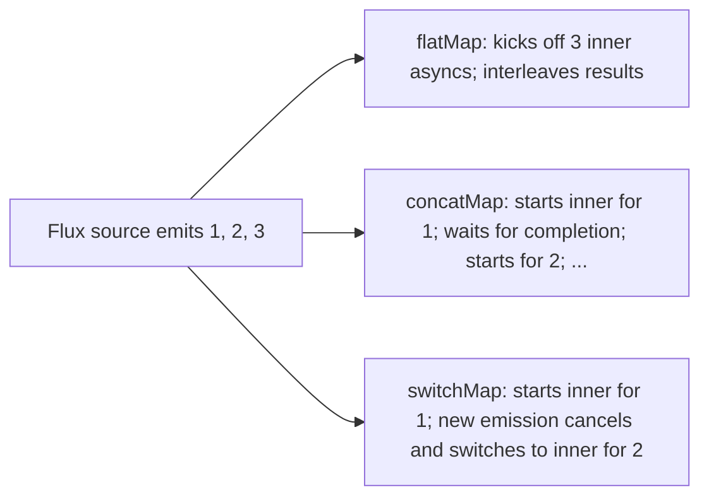

# Project Reactor (Mono / Flux)

Project Reactor is **Spring's reactive library** — `Mono<T>` (0..1 emission) and `Flux<T>` (0..N emissions), ~300 operators, schedulers for concurrency control, an extensive testing toolkit. Reactor implements Reactive Streams (T01); every Spring reactive component (WebFlux, R2DBC, reactive Kafka) emits and consumes these types.

A senior engineer using reactive Spring needs Reactor fluency: knowing which operator to reach for (`flatMap` vs `concatMap` vs `switchMap`); when to switch threads (`subscribeOn` vs `publishOn`); how to handle errors (`onErrorResume`, `onErrorReturn`); how to test (`StepVerifier`); and how to detect blocking calls accidentally inside reactive chains (`BlockHound`).

This is a tight tour. L4/C01/T17 covered WebFlux high level; this topic deepens Reactor specifically with the operators and idioms that dominate real reactive Spring code.

> [!NOTE]
> Prerequisites: [Reactive principles (T01)](./T01-reactive-principles-and-the-reactive-streams-spec.md), [WebFlux (L4/C01/T17)](../C01-spring-framework/T17-spring-webflux-reactive.md).

## Mono And Flux

```java
Mono<User> user = userRepo.findById(42L);     // 0 or 1 User
Flux<Order> orders = orderRepo.findAll();     // 0 or many Orders
```

Both are `Publisher<T>`. Mono is a specialized Flux for one-element-max — common for finders, mutations, single-resource lookups. Flux for collections, streams, events.

### Creation

```java
Mono.just("a");
Mono.empty();
Mono.error(new RuntimeException("boom"));
Mono.fromCallable(() -> doWork());          // lazy
Mono.fromSupplier(() -> "hi");
Mono.fromFuture(completableFuture);
Mono.defer(() -> Mono.just(currentTime()));   // new mono per subscribe

Flux.just(1, 2, 3);
Flux.range(1, 100);
Flux.fromIterable(list);
Flux.fromStream(stream);
Flux.interval(Duration.ofSeconds(1));        // emits 0, 1, 2, ... every second
Flux.create(sink -> { sink.next(1); sink.next(2); sink.complete(); });
Flux.generate((SynchronousSink<Integer> sink) -> sink.next(42));
```

`fromCallable` vs `just`: `just("hi")` evaluates immediately; `fromCallable(() -> "hi")` evaluates on subscribe (right for any side effect).

### Subscription

```java
flux.subscribe(
    item -> log.info("got {}", item),       // onNext
    err -> log.error("oops", err),           // onError
    () -> log.info("done"),                  // onComplete
    subscription -> subscription.request(10) // initial request
);
```

In Spring controllers you almost never call `subscribe` yourself — the framework subscribes when serializing the HTTP response.

## Transform Operators

```java
flux.map(x -> x * 2)              // sync transform per element
flux.flatMap(x -> getAsync(x))    // async transform; flatten resulting publishers
flux.concatMap(x -> getAsync(x))  // ordered; one inner at a time
flux.switchMap(x -> getAsync(x))  // cancel previous inner on new emission
flux.flatMapIterable(x -> List.of(...))   // flatten sync iterable
```

### flatMap vs concatMap vs switchMap



| Operator | When |
|----------|------|
| **flatMap** | parallelism wanted; order doesn't matter |
| **concatMap** | order matters; each inner completes before next |
| **switchMap** | "latest only" semantics (autocomplete-as-you-type) |

## Filter Operators

```java
flux.filter(x -> x > 10);
flux.take(5);                       // first 5
flux.takeWhile(x -> x < 100);
flux.takeUntil(x -> x.isLast());
flux.skip(10);
flux.distinct();
flux.distinctUntilChanged();
flux.elementAt(0);                  // index access; emits Mono
flux.last();
flux.first();
```

## Combine

```java
Mono.zip(monoA, monoB);                          // wait both; emit Tuple2
Mono.zip(monoA, monoB, (a, b) -> combine(a, b));

Flux.merge(fluxA, fluxB);                        // interleave
Flux.concat(fluxA, fluxB);                       // A complete, then B
Flux.combineLatest(fluxA, fluxB, (a, b) -> ...); // emit whenever either emits
Flux.zip(fluxA, fluxB);                          // pair by index
```

## Error Operators

```java
flux.onErrorReturn(defaultValue);             // emit default; complete
flux.onErrorResume(e -> fallbackFlux);        // switch to another stream
flux.onErrorMap(e -> new DomainException(e)); // translate
flux.onErrorComplete();                       // swallow; complete
flux.retry(3);                                 // retry from scratch up to 3 times
flux.retryWhen(Retry.backoff(3, Duration.ofSeconds(1))); // exponential backoff
flux.timeout(Duration.ofSeconds(5));          // emit error if no signal in window
```

## Side-Effect Operators

```java
flux.doOnNext(item -> log.info("got {}", item));
flux.doOnError(err -> log.error("oops", err));
flux.doOnSubscribe(s -> log.debug("subscribed"));
flux.doOnComplete(() -> log.info("done"));
flux.doFinally(signal -> cleanup());
flux.log();   // verbose lifecycle log; great for debugging
flux.checkpoint("my-step");   // adds line to stack traces
```

## Schedulers

By default operators run on the subscribing thread. Switch with `subscribeOn` (source's emission) or `publishOn` (downstream operators):

```java
Mono.fromCallable(this::blockingDbCall)
    .subscribeOn(Schedulers.boundedElastic())   // run blocking on bounded-elastic pool
    .map(this::transform)                        // runs on boundedElastic
    .publishOn(Schedulers.parallel())            // switch
    .filter(this::keep)                          // runs on parallel
    .subscribe();
```

Schedulers:

| Scheduler | Threads | Use |
|-----------|--------:|-----|
| `Schedulers.immediate()` | current | no offload |
| `Schedulers.single()` | 1 | sequential work |
| `Schedulers.parallel()` | CPU count | CPU-bound non-blocking |
| `Schedulers.boundedElastic()` | ~10 × CPU count, capped | I/O-bound blocking |
| `Schedulers.fromExecutor(...)` | custom | wrap your own |

`subscribeOn` controls where the source emits; `publishOn` switches afterward. Subtle:

```java
Flux.range(1, 10)
    .map(x -> { log.info("map1 on " + Thread.currentThread()); return x; })
    .publishOn(Schedulers.parallel())
    .map(x -> { log.info("map2 on " + Thread.currentThread()); return x; })
    .subscribeOn(Schedulers.boundedElastic())
    .subscribe();
```

map1 runs on `boundedElastic` (subscribeOn applies to source); map2 runs on `parallel` (publishOn took over).

## Context

Reactor's reactive `Context` is the reactive equivalent of `ThreadLocal`. Used for tracing context, security context (T17 of C01), etc.

```java
Mono.just("hi")
    .flatMap(s -> Mono.deferContextual(ctx -> Mono.just(s + " " + ctx.get("user"))))
    .contextWrite(Context.of("user", "alice"))
    .subscribe(System.out::println);   // "hi alice"
```

`contextWrite` is reactive `ThreadLocal.set`; `deferContextual` is the read.

## Testing With StepVerifier

```java
@Test
void test() {
    Flux<Integer> flux = Flux.range(1, 3).map(x -> x * 2);

    StepVerifier.create(flux)
        .expectNext(2, 4, 6)
        .verifyComplete();
}

@Test
void timeBased() {
    Flux<Long> tick = Flux.interval(Duration.ofSeconds(1));

    StepVerifier.withVirtualTime(() -> tick.take(3))
        .thenAwait(Duration.ofSeconds(3))
        .expectNext(0L, 1L, 2L)
        .verifyComplete();
}

@Test
void errorPath() {
    Mono<String> m = Mono.error(new RuntimeException("boom"));

    StepVerifier.create(m)
        .expectErrorMatches(t -> t.getMessage().equals("boom"))
        .verify();
}
```

`withVirtualTime` accelerates time-based tests; otherwise tests would take real seconds.

## BlockHound — Detect Accidental Blocking

```xml
<dependency>
    <groupId>io.projectreactor.tools</groupId>
    <artifactId>blockhound-junit-platform</artifactId>
    <scope>test</scope>
</dependency>
```

At test startup BlockHound installs JVM agent that throws if any blocking call (`Thread.sleep`, `synchronized`, JDBC `Connection.getConnection`, etc.) runs on a reactor scheduler. Catches accidentally blocking code in test before prod.

## Common Patterns

### Sequential vs Parallel

```java
// Sequential — wait for each
Flux.fromIterable(orderIds)
    .concatMap(id -> orderClient.get(id))
    .collectList();

// Parallel — fire all at once, gather
Flux.fromIterable(orderIds)
    .flatMap(id -> orderClient.get(id), 10)   // concurrency 10
    .collectList();
```

`flatMap(f, concurrency)` caps simultaneous inner subscriptions.

### Combining Multiple Async Calls

```java
Mono<UserDetail> getDetail(long id) {
    return Mono.zip(
        userClient.get(id),
        orderClient.recentForUser(id),
        prefsClient.get(id))
        .map(t -> new UserDetail(t.getT1(), t.getT2(), t.getT3()));
}
```

Three independent calls parallelized.

### Error Recovery Chain

```java
externalClient.get()
    .timeout(Duration.ofSeconds(2))
    .retryWhen(Retry.backoff(3, Duration.ofMillis(500)))
    .onErrorResume(TimeoutException.class, e -> Mono.just(FALLBACK))
    .onErrorMap(e -> new ServiceException(e));
```

Compose error operators for retry + fallback + translation.

## Common Pitfalls

> [!WARNING]
> **`block()` inside reactive code.** Defeats the model; deadlocks event loops. Never.

> [!WARNING]
> **Blocking JDBC inside `.map()`.** Block-detected by BlockHound. Use `subscribeOn(boundedElastic)` if you must.

> [!WARNING]
> **`flatMap` ordering assumption.** Inner results interleave; not in order. Use `concatMap` for ordered.

> [!WARNING]
> **`subscribe()` and discarding `Disposable`.** Memory leak if source is infinite.

> [!WARNING]
> **`.log()` left in production.** Verbose; perf hit.

> [!WARNING]
> **Forgetting to return the result of operators.** `flux.map(...)` does nothing if not returned.

> [!WARNING]
> **`switchMap` for fan-out instead of `flatMap`.** switchMap cancels previous inner.

> [!WARNING]
> **Time-based tests without virtual time.** Tests take real seconds; CI slow.

## Practice

1. Use `Mono.zip` to combine 3 async calls; verify Tuple3 result.
2. Compare flatMap vs concatMap on the same workflow; observe order differences.
3. Add retry with exponential backoff to a flaky external call.
4. Switch a chain to bounded-elastic scheduler; verify blocking calls now safe.
5. Write StepVerifier tests covering success, error, time-based behavior.
6. Install BlockHound; introduce a `Thread.sleep` in a chain; observe detection.
7. Use Reactor `Context` to propagate a request-id through a chain.
8. Profile a reactive chain vs imperative for the same workload.

## Recap

You should now be able to:

- Use Mono and Flux for 0..1 and 0..N async streams; pick creators (just / fromCallable / defer / create).
- Apply transform / filter / combine / error operators; choose flatMap vs concatMap vs switchMap.
- Switch schedulers with subscribeOn (source) vs publishOn (downstream).
- Use Reactor Context for thread-local-replacement state.
- Test with StepVerifier including virtual time and error matching.
- Use BlockHound to catch blocking-call regressions.
- Build common patterns: sequential vs parallel; combining multiple calls; error chains.
- Avoid the canonical pitfalls: block() inside chain, JDBC on non-elastic scheduler, wrong flatMap variant, discarded subscribe.

## Next

Continue to [RxJava (alternative)](./T03-rxjava-alternative.md) for the comparison library — when teams use RxJava instead of Reactor and how the APIs differ.
