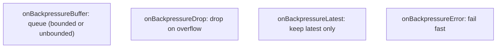

# Backpressure

The Reactive Streams spec's central innovation is **backpressure**: subscribers control how fast publishers produce. T01 introduced the `request(N)` protocol; T02 covered Reactor operators. **This topic** is dedicated to backpressure semantics in practice: what happens when a publisher emits faster than a subscriber consumes? Cold publishers (DB queries, file reads) naturally slow down — they only produce when asked. **Hot publishers** (Kafka topics, sensor streams, server-sent events, mouse events) emit on their own schedule; the subscriber's `request(N)` cap doesn't slow them. Without explicit handling, the publisher's output queue fills; eventually `MissingBackpressureException` or OOM.

A senior engineer designs the overload strategy upfront. Buffer until OOM is rarely right. Reactor and RxJava provide `onBackpressureBuffer`, `onBackpressureDrop`, `onBackpressureLatest`, `onBackpressureError`, plus rate-limiting operators (`sample`, `throttle`, `conflate`). Picking the right one is a business decision: when the subscriber falls behind, do we lose newest, lose oldest, sample, error out?

This topic covers: the natural backpressure of cold publishers; hot-publisher overflow; the four `onBackpressure*` strategies; rate-limiting operators; common real-world scenarios (Kafka consumer, SSE stream, sensor feed); when to give up and accept loss vs OOM.

> [!NOTE]
> Prerequisites: [Project Reactor (T02)](./T02-project-reactor-mono-flux.md).

## Cold Publishers — Natural Backpressure

```java
Flux.range(1, 1_000_000)
    .map(this::heavyTransform)
    .subscribe(new BaseSubscriber<>() {
        @Override protected void hookOnSubscribe(Subscription s) { s.request(10); }
        @Override protected void hookOnNext(Object o) {
            // process
            request(1);
        }
    });
```

The source only emits when subscriber requests. Backpressure is *built in* — no special handling. Database iterations, in-memory collections, file reads all behave this way.

## Hot Publishers — The Problem

```java
Flux<Tick> sensorStream = sensors.tickStream();   // emits every 1 ms regardless
sensorStream
    .doOnNext(this::slowProcessing)               // 100 ms per item
    .subscribe();
```

Sensor emits 1000/s; consumer processes 10/s. Backlog grows infinitely → OOM.

Without explicit handling, hot publishers either:

- **Reactor `Flux`**: buffers internally up to bounds, then throws `OverflowException`.
- **RxJava `Flowable`**: throws `MissingBackpressureException`.

## The Four Strategies

```java
flux
    .onBackpressureBuffer(10_000)         // buffer up to 10K; OOM if exceeded
    .onBackpressureBuffer(10_000, BufferOverflowStrategy.DROP_OLDEST)  // drop oldest when full
    .onBackpressureBuffer(10_000, BufferOverflowStrategy.DROP_LATEST)  // drop newest
    .onBackpressureDrop()                  // drop any element on overflow
    .onBackpressureDrop(dropped -> log.warn("dropped {}", dropped))
    .onBackpressureLatest()                // keep only latest; discard older
    .onBackpressureError()                 // error out on overflow
    .subscribe();
```



### Picking The Strategy

| Use case | Strategy |
|----------|----------|
| Each event matters; can buffer temporarily | `Buffer` with bound |
| UI updates (only latest matters) | `Latest` |
| Logs / events (can lose some) | `Drop` |
| Critical pipeline; should not continue if behind | `Error` |
| Stock ticker (latest price) | `Latest` |
| Sensor readings (sample is enough) | `sample(Duration)` |

## Rate-Limiting Operators

Not strictly backpressure but related:

```java
flux.sample(Duration.ofSeconds(1));       // emit at most one per second (latest)
flux.throttleFirst(Duration.ofSeconds(1)); // first per second window
flux.throttleLast(Duration.ofSeconds(1));  // last per second window
flux.window(Duration.ofSeconds(1));        // group into windows
flux.bufferTimeout(100, Duration.ofMillis(500));   // batch by size or time
```

For high-volume sensor data: `sample` is often enough — keep the most recent reading per second; discard the in-between.

## Worked Example — SSE

A server pushes events to thousands of clients via SSE; some clients are slow.

```java
@GetMapping(value = "/api/events", produces = TEXT_EVENT_STREAM_VALUE)
public Flux<ServerSentEvent<Event>> stream() {
    return eventBus.events()
        .onBackpressureBuffer(1000, BufferOverflowStrategy.DROP_OLDEST)
        .map(this::toSse);
}
```

Slow client: their queue caps at 1000; oldest dropped to make room for newest. Live data preserved; historic lost.

Alternative: disconnect slow clients (Reactor's `timeout` + cancel):

```java
return eventBus.events()
    .timeout(Duration.ofSeconds(5))   // disconnect if no element processed in 5s
    .map(this::toSse);
```

## Kafka Consumer Backpressure

Spring Kafka + reactor-kafka:

```java
KafkaReceiver<String, String> receiver = KafkaReceiver.create(opts);

receiver.receive()
    .flatMap(record ->
        processAsync(record).then(Mono.fromRunnable(record.receiverOffset()::acknowledge)),
        16)   // concurrency 16
    .subscribe();
```

`flatMap` with concurrency cap = backpressure: at most 16 records being processed at once. The Reactor pipeline naturally throttles by acknowledging only after processing — slow processing slows next-batch fetch.

## SSE / WebSocket Slow Consumer

A common production failure: one client is on slow Wi-Fi; their TCP buffer fills; server's send queue grows. With reactive WebSocket, you can `onBackpressureLatest` per client:

```java
public Flux<Object> stream() {
    return liveData
        .onBackpressureLatest()   // keep latest update only
        .map(this::serialize);
}
```

Slow clients see fewer updates but their slow connection doesn't OOM the server.

## Visualizing Demand

```java
flux
    .onBackpressureBuffer()
    .log()   // logs every onNext / onSubscribe / request / etc.
    .subscribe();
```

Reactor's `.log()` shows request and onNext signals — invaluable for understanding demand.

## When To Skip Reactive Backpressure

In 2026 with virtual threads, blocking I/O scales. If your service is request/response (HTTP API) and you don't have streaming hot publishers, **you don't need reactive backpressure**. Use sync code with virtual threads; let the thread pool size be your natural backpressure.

Reactive backpressure earns its complexity for:

- Long-lived streaming (SSE, WebSocket, Kafka consumers).
- Genuinely-asynchronous high-volume pipelines.
- IoT / sensor data.
- LLM / AI token streams.

## Common Pitfalls

> [!WARNING]
> **No backpressure handling on hot publisher.** Memory leak / OOM under load.

> [!WARNING]
> **`onBackpressureBuffer()` unbounded.** Buffers grow forever.

> [!WARNING]
> **Wrong strategy for use case.** Dropping financial transactions = bug. Buffer = OOM. Pick deliberately.

> [!WARNING]
> **Mixing Observable (no BP) and Flowable in RxJava.** Surprising overflow behavior.

> [!WARNING]
> **Long buffer in front of slow async consumer.** Latency rises (queued items); apparent OK until queue full.

> [!WARNING]
> **`sample()` for must-not-lose events.** Loses messages. Use buffer.

> [!WARNING]
> **`onBackpressureDrop` silently in production.** Hidden data loss. Add `.doOnDrop(...)` logging.

> [!WARNING]
> **Reactive backpressure in a request-response API.** Overkill. Use sync.

## Practice

1. Build a hot publisher (Flux.interval, 1 ms) + slow subscriber (100 ms processing). Run without backpressure; observe OOM.
2. Add `onBackpressureBuffer(1000, DROP_OLDEST)`. Observe stable memory + dropped count.
3. Compare strategies: Drop vs Latest vs Buffer for the same workload.
4. Implement `sample(1s)` for sensor data; verify only one emission per second.
5. Build a Kafka consumer with bounded `flatMap` concurrency; observe demand control.
6. SSE endpoint with a slow client; force backpressure; verify server stable.
7. Use `.log()` to trace demand signals; understand what the pipeline does.
8. Decide for each of your reactive flows: which backpressure strategy fits the business need?

## Recap

You should now be able to:

- Recognize cold publishers' natural backpressure vs hot publishers' overflow risk.
- Apply `onBackpressureBuffer` / `Drop` / `Latest` / `Error` based on business needs.
- Use rate-limiting operators (`sample`, `throttleFirst`, `throttleLast`, `bufferTimeout`).
- Implement Kafka consumer backpressure via bounded `flatMap`.
- Handle SSE / WebSocket slow consumers without server OOM.
- Use `.log()` to trace demand signals.
- Decide when reactive backpressure is overkill (request/response with virtual threads).
- Avoid pitfalls: unbounded buffer, silent drop, wrong strategy, mixed Observable/Flowable.

## Next

Continue to [Spring WebFlux](./T05-spring-webflux.md) for the deeper treatment of WebFlux beyond what was in L4/C01/T17 — controllers, error handling, security integration, performance characteristics.
