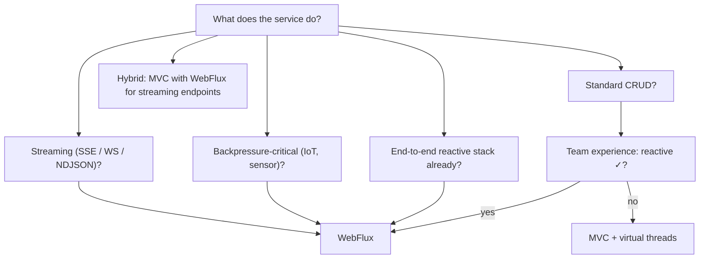

# Reactive vs virtual threads (trade-offs)

For 5+ years (2017–2022), the answer to "I need high concurrency in Java" was **reactive** (WebFlux + Reactor). Reactive's central pitch was non-blocking I/O on small event-loop thread pools, scaling to 10K+ concurrent connections without exhausting threads. **Java 21 (Sep 2023) shipped virtual threads** (Project Loom). Suddenly, **blocking imperative code with one virtual thread per request** scales the same way: Tomcat with `spring.threads.virtual.enabled=true` handles 10K+ concurrent connections too, with the simplicity of traditional `synchronized` + JDBC + JPA code.

A senior engineer in 2026 must understand this shift. **Many services that would have been WebFlux in 2022 should be MVC + virtual threads in 2026.** Reactive remains the right tool for specific scenarios — streaming, backpressure-critical, end-to-end reactive ecosystems — but the default for new services has flipped back to imperative.

This topic is the explicit decision framework. We cover virtual threads' mechanics; how Spring MVC + virtual threads behaves; where reactive still wins; the pinning issue (`synchronized` blocks virtual threads); structured concurrency (`StructuredTaskScope`); operator complexity vs stack-trace readability; a benchmarks summary; and the hybrid approach (MVC + virtual threads + reactive streaming endpoint).

> [!NOTE]
> Prerequisites: [WebFlux (T05)](./T05-spring-webflux.md), [Spring Cloud (L4/C01/T18)](../C01-spring-framework/T18-spring-cloud-config-gateway-eureka-openfeign.md), JDK 21+ knowledge.

## Virtual Threads — The Mechanics

A virtual thread is a Java thread *not bound* to an OS thread. Hundreds of thousands fit in one JVM heap. When the virtual thread blocks (`Thread.sleep`, JDBC `getResultSet`, `LockSupport.park`), it **unmounts** from the carrier OS thread; the carrier picks up another virtual thread; when the blocked one is ready, it remounts. Imperative blocking code becomes effectively async at the OS level.

```java
// Java 21+
Thread.startVirtualThread(() -> {
    Thread.sleep(1000);   // unmounts the carrier; carrier runs others
    System.out.println("hello");
});
```

Memory: ~1 KB per virtual thread (vs ~1 MB per platform thread stack).

## MVC + Virtual Threads In Spring Boot 3.2+

```yaml
spring:
  threads:
    virtual:
      enabled: true
```

Tomcat (or Jetty / Undertow) uses virtual threads as request workers. Effectively unlimited concurrency for I/O-bound services.

A typical service goes from:

```java
// MVC pre-virtual-threads: bounded thread pool serializes requests past 200
@GetMapping("/user/{id}")
public UserResponse get(@PathVariable long id) {
    User u = userRepo.findById(id).orElseThrow();
    return UserResponse.of(u);
}
```

…to the *same code*, now scaling to 10K+ concurrent requests. No code change needed beyond the property flag.

## WebFlux Pitch In 2026

WebFlux's specific wins in 2026:

1. **Streaming**: `Flux<T>` as a first-class response. SSE / NDJSON / server-pushed updates are natural.
2. **Backpressure**: subscribers control demand. Critical for IoT, Kafka consumers, sensor streams.
3. **End-to-end reactive stack**: WebFlux + R2DBC + reactive Mongo + reactive Redis + reactive Kafka. Avoids any blocking I/O. Tail latency under saturation is cleaner.
4. **Memory** under extreme concurrency: still slightly less than virtual threads (event loop + small thread pool vs 100K virtual threads × 1 KB = 100 MB).
5. **Functional composition**: operator chains can express complex flows declaratively.

## The Pinning Problem

Virtual threads have one annoying caveat: **`synchronized` blocks pin them to their carrier**. A virtual thread inside `synchronized(...) { /* blocking call */ }` blocks the carrier OS thread for the duration of the blocking call. If many virtual threads pin, throughput collapses.

The fix: use `ReentrantLock` instead of `synchronized`:

```java
// BAD: pins virtual thread
synchronized (someLock) {
    httpClient.get(...);    // blocks; pinned carrier
}

// GOOD: ReentrantLock unmounts properly
lock.lock();
try {
    httpClient.get(...);
} finally {
    lock.unlock();
}
```

JDK 24 (in development) is working to fix the `synchronized` pinning issue. For 2026 production code (JDK 21–23), audit your dependencies for `synchronized` on blocking paths.

Spring's stack is mostly virtual-thread-safe; many older libraries (driver code, legacy concurrent utilities) may pin.

## Structured Concurrency

JDK 21+ also added **`StructuredTaskScope`** for managing concurrent operations:

```java
try (var scope = new StructuredTaskScope.ShutdownOnFailure()) {
    Subtask<User> user = scope.fork(() -> userClient.get(id));
    Subtask<Profile> profile = scope.fork(() -> profileClient.get(id));
    Subtask<List<Order>> orders = scope.fork(() -> orderClient.recent(id));

    scope.join().throwIfFailed();

    return new UserDetail(user.get(), profile.get(), orders.get());
}
```

Three parallel calls; clean error handling; cancellation propagation. The structured-concurrency equivalent of `Mono.zip(...)` in Reactor.

## Performance Comparison

Indicative numbers for a typical Spring REST service with downstream DB + HTTP calls:

| Workload | MVC + VT | WebFlux + R2DBC |
|----------|:--------:|:----------------:|
| 1K concurrent (LAN) | similar | similar |
| 10K concurrent (LAN) | similar (~2K/s) | similar (~2K/s) |
| 100K concurrent | excellent | excellent |
| Memory at 100K | ~150 MB | ~80 MB |
| Latency p50 | similar | similar |
| Latency p99 (saturation) | depends on pinning | excellent |
| Cold start | ~2 s | ~1.5 s |
| Native image | works | excellent |
| CPU per request | similar | slightly less |
| Code complexity | imperative | reactive operators |

WebFlux keeps a slight edge in tail latency and memory at extreme scale; both are fine for most workloads.

## Decision Matrix



### When To Pick Reactive

- **SSE / WebSocket / streaming heavy**.
- **IoT / sensor / backpressure-critical**.
- **End-to-end reactive ecosystem** (R2DBC, reactive Mongo, reactive Kafka).
- **Existing reactive codebase**.
- **Native image + cold start matters** (Reactor + native > MVC + native).

### When To Pick MVC + Virtual Threads

- **Standard REST CRUD APIs**.
- **JPA + JDBC stack** (incompatible with reactive event loop).
- **Team unfamiliar with reactive**.
- **Debugging important** (stack traces are real).
- **Maintenance over time** (imperative code ages better).

### Hybrid

A single Spring Boot app can run MVC for traditional endpoints + a separate WebFlux app (or use webMVC's `DeferredResult` / `SseEmitter`) for streaming endpoints. Often simpler than going full WebFlux for the 5% of streaming work.

## Code Comparison

### Same Endpoint Both Ways

```java
// MVC + virtual threads
@GetMapping("/orders/{id}")
public OrderDetail get(@PathVariable long id) {
    Order order = orderRepo.findById(id).orElseThrow();
    User customer = userClient.get(order.getCustomerId());
    Inventory inv = inventoryClient.get(order.getProductIds());
    return new OrderDetail(order, customer, inv);
}

// WebFlux
@GetMapping("/orders/{id}")
public Mono<OrderDetail> get(@PathVariable Long id) {
    return orderRepo.findById(id)
        .switchIfEmpty(Mono.error(new NotFoundException()))
        .flatMap(order ->
            Mono.zip(
                userClient.get(order.getCustomerId()),
                inventoryClient.get(order.getProductIds()))
            .map(t -> new OrderDetail(order, t.getT1(), t.getT2())));
}
```

The MVC version is shorter and reads top-to-bottom. Debugging shows clean stack traces. Failures get real line numbers.

The WebFlux version makes parallelism explicit via `zip`. The MVC version is sequential unless you wrap in `CompletableFuture` or `StructuredTaskScope`.

For parallel calls, MVC + VT + structured concurrency:

```java
@GetMapping("/orders/{id}")
public OrderDetail get(@PathVariable long id) throws Exception {
    Order order = orderRepo.findById(id).orElseThrow();
    try (var scope = new StructuredTaskScope.ShutdownOnFailure()) {
        Subtask<User> user = scope.fork(() -> userClient.get(order.getCustomerId()));
        Subtask<Inventory> inv = scope.fork(() -> inventoryClient.get(order.getProductIds()));
        scope.join().throwIfFailed();
        return new OrderDetail(order, user.get(), inv.get());
    }
}
```

Imperative + structured = parallel + readable.

## The Industry Trajectory

- **2024**: Spring Boot 3.2 ships first-class virtual-thread support. Adoption begins.
- **2025**: Wide adoption. New services default to MVC + virtual threads.
- **2026**: WebFlux is a niche tool for streaming + backpressure + R2DBC stacks.
- **2027+**: JDK 24+ fixes synchronized pinning; further reduces friction.

WebFlux **isn't going away**; it has stable niches. But the "we built it in WebFlux for scalability" justification is gone.

## Common Pitfalls

> [!WARNING]
> **Adopting WebFlux for scalability alone in 2026.** MVC + virtual threads matches.

> [!WARNING]
> **Heavy `synchronized` on blocking paths.** Virtual threads pin; throughput collapses. Audit; switch to `ReentrantLock`.

> [!WARNING]
> **Refactoring stable WebFlux service to MVC.** Cost > benefit. Leave it.

> [!WARNING]
> **Mixing WebFlux and MVC in one app.** Pick one per app.

> [!WARNING]
> **`StructuredTaskScope` ignored.** Imperative parallel work is cleaner with it.

> [!WARNING]
> **Not measuring before deciding.** Run a benchmark on your actual workload.

## Practice

1. Build the same service two ways (MVC + VT, WebFlux + R2DBC). Compare line counts, debugging experience.
2. Benchmark both at 1K, 10K, 50K concurrent requests. Measure throughput, p99, memory.
3. Detect virtual-thread pinning: log pin events (`-Djdk.tracePinnedThreads=full`). Identify offending code.
4. Convert `synchronized` to `ReentrantLock` in a pinning path. Re-benchmark.
5. Use `StructuredTaskScope` for parallel calls; compare to `Mono.zip`.
6. Pick one streaming endpoint; implement both ways; compare ergonomics.
7. List your service's current sync vs async hot paths; decide what'd be reactive-worthy.
8. For your team's stack, write the decision: MVC, WebFlux, hybrid.

## Recap

You should now be able to:

- Explain virtual threads' mechanics (carrier mount/unmount on blocking).
- Configure Spring Boot 3.2+ with `spring.threads.virtual.enabled=true`.
- Identify pinning hazards (`synchronized` + blocking) and fix with `ReentrantLock`.
- Use `StructuredTaskScope` for clean parallel work.
- Recognize WebFlux's remaining 2026 wins: streaming, backpressure, end-to-end reactive ecosystems.
- Choose default to MVC + virtual threads for typical services; reactive for specific cases.
- Apply hybrid: MVC for the majority + reactive endpoints for streaming.
- Avoid the canonical pitfalls: scalability-only WebFlux adoption, `synchronized` on hot paths, mixed apps, benchmark-free decisions.

## Next

C06 is complete (7 of 7 topics). Continue to [C07 Messaging & Event Streaming](../C07-messaging-and-streaming/) for the broader treatment of messaging — queues vs topics, JMS, RabbitMQ, Kafka in depth, streaming patterns, EDA, async patterns, outbox + exactly-once.
