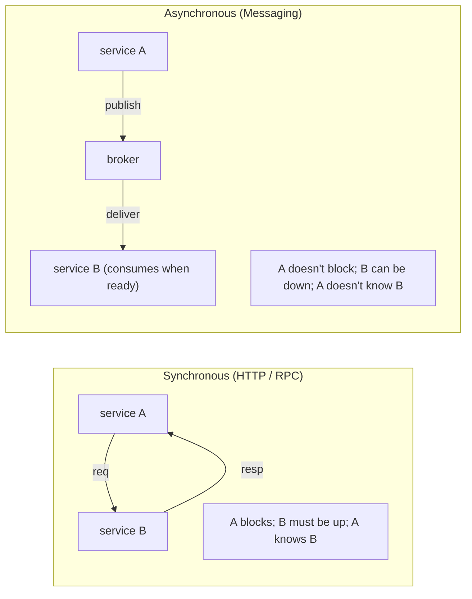
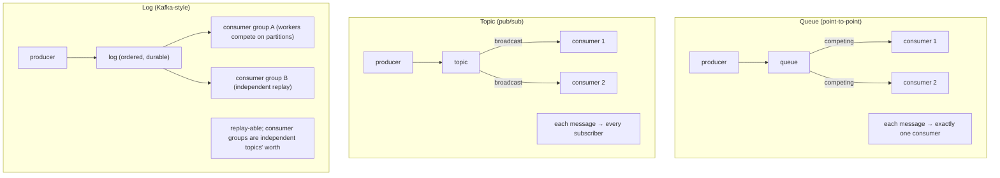
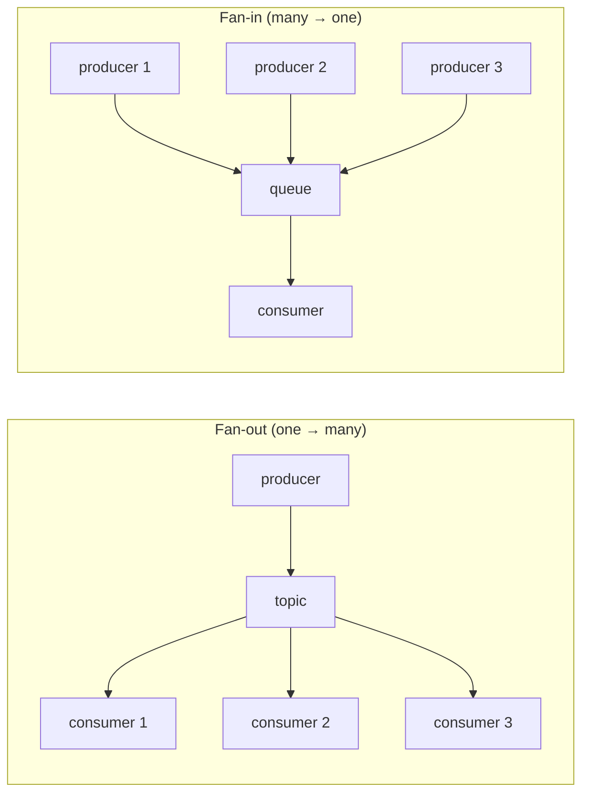
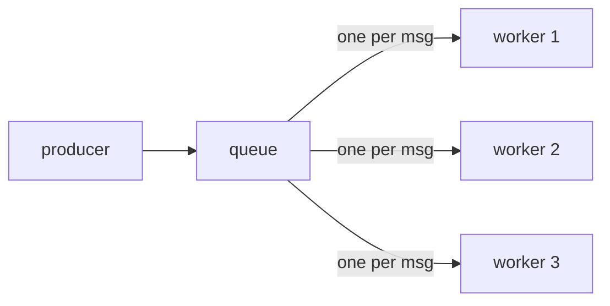
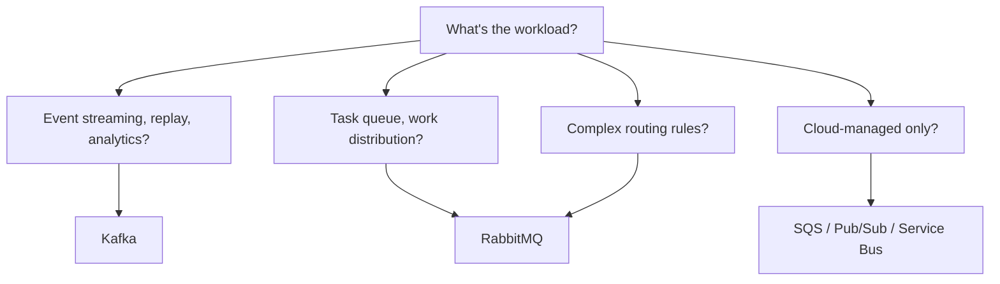

# Messaging concepts (queues, topics, pub/sub)

A messaging system **decouples** producers from consumers. Instead of A calling B's HTTP endpoint directly, A *publishes* a message to a broker; B *consumes* from the broker on its own schedule. **Loose coupling, async semantics, durability, fan-out**. The patterns and the broker choices have evolved over decades: **JMS** (1998) defined the Java API for queues + topics; **AMQP** (2006) standardized a wire protocol; **Apache Kafka** (2011) replaced the broker-as-router model with broker-as-log; **modern stacks** mix queues (RabbitMQ for task fan-out), logs (Kafka for events), and managed services (SQS, Kinesis, EventBridge, Pub/Sub).

This is the opening topic of C07. Before going into JMS (T02), RabbitMQ (T03), Kafka (T04–T05), Streams (T06), EDA (T07), async patterns (T08), outbox + exactly-once (T09), DLQ (T10), Flink (T11), we frame the entire space here. The semantic concepts (queue vs topic, push vs pull, ordering, delivery guarantees) are shared; the implementations differ. A senior engineer knows the concepts independently of the product.

This topic covers: when to use messaging vs direct HTTP; queues vs topics vs pub/sub vs broker-as-log; delivery semantics (at-most-once, at-least-once, effectively-exactly-once); ordering guarantees; competing-consumers pattern; fan-out / fan-in; the broker landscape; the canonical decision matrix.

> [!NOTE]
> Prerequisites: HTTP + REST basics (L2/C04). Distributed-systems fundamentals.

## Why Messaging At All

Use messaging when:

- **Loose coupling**: producer shouldn't know consumer identity.
- **Async work**: caller can return before consumer processes.
- **Burst smoothing**: producer spikes; consumer processes at its own rate.
- **Fan-out**: one event → many consumers.
- **Durability**: message survives consumer downtime.
- **Order across distributed work**: serial processing where needed.

Use direct HTTP when:

- **Synchronous semantics**: caller needs result immediately.
- **Few collaborators with known identity**.
- **Strong response-time SLA**.
- **Simple request-response**.

Many systems use both: HTTP for synchronous query, messaging for asynchronous commands / events.

## Queue Vs Topic Vs Log

### Queue

Messages line up; **first consumer to claim takes it**. Multiple consumers compete (the "competing consumers" pattern). Each message processed exactly once (by exactly one consumer). Typical: task queue, work queue. RabbitMQ queues, ActiveMQ queues, SQS.

### Topic

**Every subscriber** gets every message. Used for events that interest many consumers. Subscribe-time matters: late subscribers miss prior messages (unless durable subscription). JMS topics, AMQP fanout exchanges.

### Log (Kafka-style)

The broker maintains a **durable, ordered, replayable log**. Multiple "consumer groups" each have their own read position; within a group, partitions are distributed to compete. Messages persist beyond consumption (retention period). Replayable. Used for events that may serve many evolving consumers — analytics, audit, downstream services, ML pipelines. Kafka, Kinesis, Apache Pulsar.

The log model **subsumes** both queue and topic semantics: one consumer group = competing consumers (queue); multiple consumer groups = broadcast (topic).

## Delivery Semantics

| Guarantee | Meaning | Cost |
|-----------|---------|------|
| **At-most-once** | message delivered 0 or 1 times; loss possible | minimum overhead |
| **At-least-once** | message delivered ≥ 1 times; duplicates possible | retry + dedup |
| **Exactly-once** | message delivered exactly 1 time | hardest; specific conditions |

Most brokers default to at-least-once. Exactly-once is achievable with:

- **Kafka transactions** (producer + consumer in one transaction).
- **Idempotent receivers**: at-least-once + idempotency keys (T03 of C05).

True end-to-end exactly-once across heterogeneous systems is essentially impossible; **at-least-once + idempotent receiver = effectively-exactly-once**.

## Ordering

| Pattern | Ordering |
|---------|----------|
| Single producer → single queue → single consumer | natural order |
| Single producer → single queue → competing consumers | order broken (consumer race) |
| Multiple producers → single queue | broker arrival order; no inter-producer guarantee |
| Kafka single-partition | within-partition order |
| Kafka multi-partition | per-key order (if partitioned by key) |
| Kafka across partitions | no global order |

For **strictly-ordered** processing: single partition + single consumer, or **per-entity ordering** via partition key (e.g., partition by `customerId` — all events for one customer are ordered, parallel across customers).

## Fan-Out / Fan-In

Fan-out (one event, many consumers): topics / Kafka multi-consumer-group.
Fan-in (many producers, one consumer): queues.

## Competing Consumers

N workers; the broker hands each message to one. Scales horizontally. Order across messages is broken. Right for embarrassingly parallel work.

Kafka achieves the same via consumer group + partitions: N consumers in a group share M partitions; each partition handled by one consumer; messages within a partition ordered.

## Durability

- **Persistent**: message written to disk before ack; survives broker restart.
- **Non-persistent**: in-memory only; lost on restart.

Default for serious messaging: persistent. Non-persistent for fire-and-forget telemetry.

Kafka: every message persisted; retention controls how long.

## Broker Landscape

| Broker | Model | Strengths |
|--------|-------|-----------|
| **Apache Kafka** | log | high throughput; event sourcing; streaming |
| **RabbitMQ** | AMQP queue + exchange | rich routing; low latency; mature |
| **ActiveMQ Artemis** | JMS | Java legacy; in-JVM embeddable |
| **Apache Pulsar** | log + queue | multi-tenant; geo-replication |
| **NATS / JetStream** | pub/sub + log | extreme low latency |
| **Redis Streams** | log-ish | cheap; embedded with Redis |
| **AWS SQS** | queue | managed; cheap |
| **AWS Kinesis** | log | managed Kafka-equivalent |
| **AWS SNS** | pub/sub fanout | managed broadcast |
| **AWS EventBridge** | event routing | rule-based; AWS-native |
| **GCP Pub/Sub** | hybrid | managed; global |
| **Azure Service Bus** | queue + topic | Azure-native |

For 2026 Java backends:

- **Kafka** dominates for event streaming + analytics + microservice events.
- **RabbitMQ** dominates for task queues + complex routing.
- **Managed alternatives** (SQS, Kinesis, Pub/Sub) for cloud-native simplicity.

T02–T05 dive into each.

## When To Use Each Broker

## Common Anti-Patterns

> [!WARNING]
> **Sync HTTP everywhere.** Tight coupling; cascading failures; no buffering.

> [!WARNING]
> **Async messaging for everything.** Inappropriate when response needed; complexity.

> [!WARNING]
> **At-most-once for important events.** Loss = bug.

> [!WARNING]
> **Trying for global ordering across partitions.** Impossible without serializing on one partition.

> [!WARNING]
> **Topic when queue intended.** Multiple consumers double-process.

> [!WARNING]
> **Non-persistent for business-critical.** Restart loses messages.

> [!WARNING]
> **Synchronous wait on async reply.** Defeats the purpose.

## Practice

1. Identify your service's interactions; classify each as sync HTTP, async queue, or async topic candidate.
2. Pick a small command-handling pattern. Sketch implementations: HTTP, RabbitMQ queue, Kafka topic. Compare.
3. Draw the fan-out for "user signs up" → emails sent, analytics recorded, CRM updated. Topic-driven.
4. Identify ordering requirements: which messages must be ordered? Match to partition key.
5. Compare delivery semantics for two real flows in your system.
6. Pick a broker for: order processing pipeline; user-activity log; email-send task queue. Justify.
7. List the brokers your team uses; identify if mixed; identify duplication.

## Recap

You should now be able to:

- Distinguish queue (point-to-point), topic (pub/sub), and log (replayable) models.
- Apply competing-consumers pattern via queue or Kafka consumer group.
- Reason about delivery semantics: at-most-once, at-least-once, exactly-once (the last being effectively achievable via at-least-once + idempotent receiver).
- Apply ordering: single-partition for global; partition-by-key for per-entity.
- Choose broker: Kafka for streams + events; RabbitMQ for tasks + routing; managed for cloud simplicity.
- Decide messaging vs direct HTTP per interaction.
- Avoid the canonical pitfalls: sync everywhere, async everywhere, topic-when-queue.

## Next

Continue to [JMS & ActiveMQ](./T02-jms-and-activemq.md) for the Java standard messaging API — historic but still common — covering ActiveMQ / Artemis brokers and Spring JMS integration.
