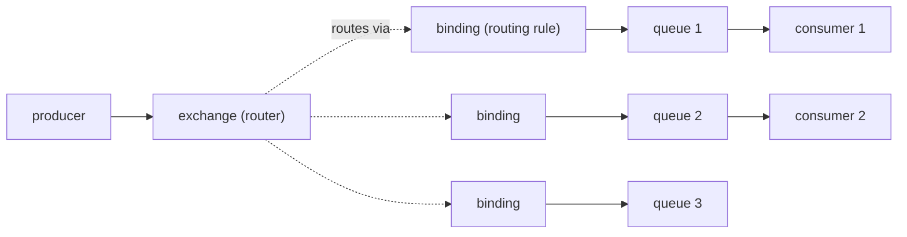
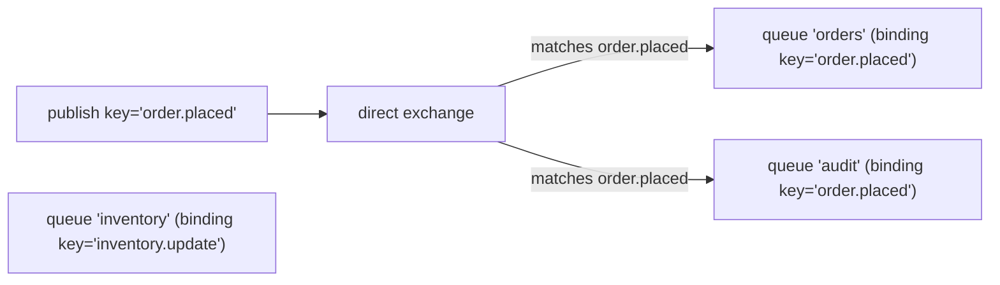
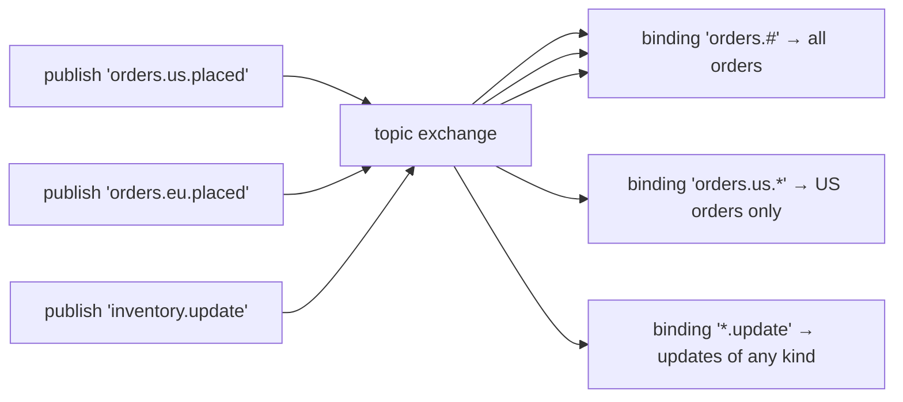
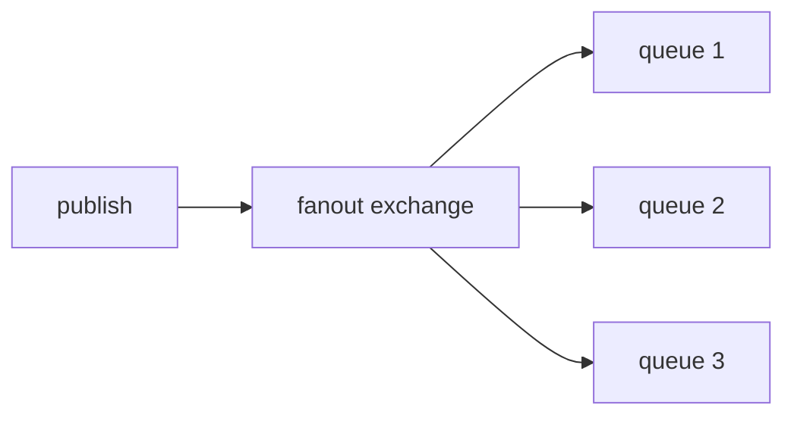
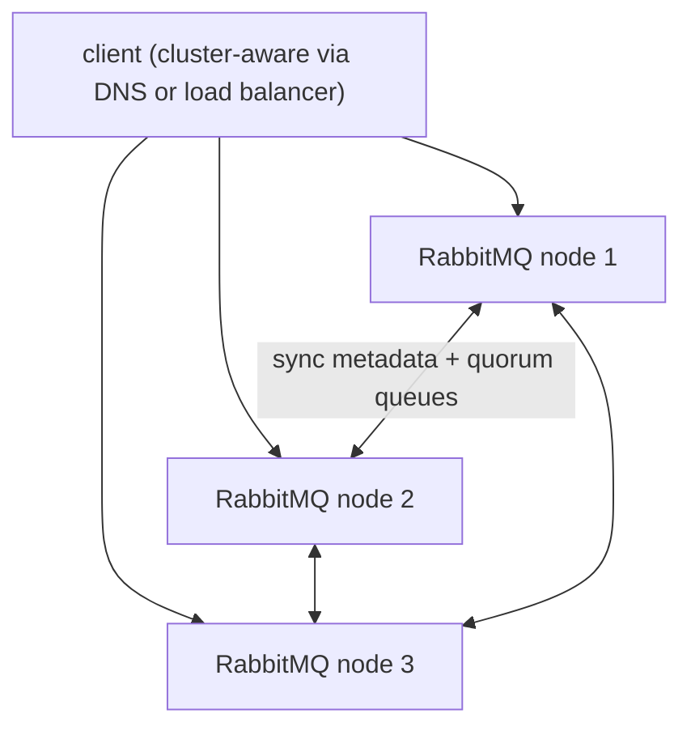

# RabbitMQ (AMQP)

RabbitMQ (Pivotal → VMware → Broadcom; OSS) is the **dominant AMQP broker** — used widely for task queues, RPC-over-messaging, complex routing, work distribution. AMQP (Advanced Message Queuing Protocol, 0-9-1 the dominant version) introduces a **broker-side routing model**: producers publish to **exchanges** (routers); exchanges route via **bindings** to **queues**; consumers read from queues. Four exchange types — **direct**, **topic**, **fanout**, **headers** — cover the routing needs. Compared to Kafka's broker-as-log, RabbitMQ is **broker-as-router**: smart broker, dumb clients; rich routing logic.

L4/C01/T22 covered Spring AMQP basics for Kafka comparison. **This topic** is the RabbitMQ deep dive: AMQP model in detail; the four exchange types; bindings and routing keys; the queue types (classic, quorum, stream — new since 3.10); publisher confirms / returns; consumer ack semantics; dead-letter exchanges (DLX); message TTL; clustering and HA; the 2024-2026 changes (mirrored queues deprecated; quorum queues now default).

> [!NOTE]
> Prerequisites: [Messaging concepts (T01)](./T01-messaging-concepts-queues-topics-pub-sub.md), [Spring for Kafka/AMQP (L4/C01/T22)](../C01-spring-framework/T22-spring-for-kafka-amqp.md).

## The AMQP Model



- **Producer** publishes a message + routing key to an exchange.
- **Exchange** routes via bindings to one or more queues.
- **Queue** buffers messages.
- **Consumer** consumes from a queue.

A queue without bindings is unreachable; an exchange with no bindings drops messages.

## The Four Exchange Types

### Direct Exchange

Routes by **exact match** of routing key:



Used for point-to-point routing by event type.

### Topic Exchange

Routes by **pattern match** with `*` (one word) and `#` (zero+ words):



Routing keys are dot-separated tokens. `orders.us.placed` matches `orders.#`, `orders.us.*`, `*.us.placed`. Powerful for hierarchical event taxonomies.

### Fanout Exchange

Routes to **all bound queues** regardless of routing key. Broadcast.



Used for true publish-subscribe — every queue gets every message.

### Headers Exchange

Routes by **message headers** (not routing key). Rarely used; topic exchange usually suffices.

```java
binding.matchAll("type", "order")
       .matchAll("region", "us")    // both must match
```

## Spring AMQP

```xml
<dependency>
    <groupId>org.springframework.boot</groupId>
    <artifactId>spring-boot-starter-amqp</artifactId>
</dependency>
```

```yaml
spring:
  rabbitmq:
    host: rabbit
    port: 5672
    username: app
    password: ${MQ_PASS}
    listener:
      simple:
        prefetch: 50
        concurrency: 4
        max-concurrency: 16
        acknowledge-mode: manual
    publisher-confirm-type: correlated
    publisher-returns: true
```

### Producer

```java
@Service
public class OrderPublisher {
    private final RabbitTemplate rabbit;
    public OrderPublisher(RabbitTemplate rabbit) { this.rabbit = rabbit; }

    public void publish(Order order) {
        rabbit.convertAndSend("orders.exchange", "orders.us.placed", order);
    }
}
```

`(exchange, routingKey, payload)`. RabbitTemplate uses Jackson by default for JSON.

### Consumer

```java
@Component
public class OrderListener {

    @RabbitListener(queues = "orders.us")
    public void handle(Order order,
                       Channel channel,
                       @Header(AmqpHeaders.DELIVERY_TAG) long tag) throws IOException {
        try {
            orderService.process(order);
            channel.basicAck(tag, false);
        } catch (TransientException e) {
            channel.basicNack(tag, false, true);   // requeue
        } catch (PermanentException e) {
            channel.basicNack(tag, false, false);   // → DLX
        }
    }
}
```

Manual ack mode gives explicit control over ack / nack with requeue or DLX routing.

### Topology Declaration

```java
@Configuration
public class RabbitTopology {

    @Bean public TopicExchange ordersExchange() {
        return new TopicExchange("orders.exchange", true, false);
    }

    @Bean public Queue usOrdersQueue() {
        return QueueBuilder.durable("orders.us")
            .withArgument("x-dead-letter-exchange", "orders.dlx")
            .withArgument("x-message-ttl", 60_000)
            .build();
    }

    @Bean public Binding binding(TopicExchange ex, Queue usOrdersQueue) {
        return BindingBuilder.bind(usOrdersQueue).to(ex).with("orders.us.#");
    }

    @Bean public DirectExchange dlx() {
        return new DirectExchange("orders.dlx", true, false);
    }

    @Bean public Queue dlq() {
        return QueueBuilder.durable("orders.dlq").build();
    }

    @Bean public Binding dlqBinding(DirectExchange dlx, Queue dlq) {
        return BindingBuilder.bind(dlq).to(dlx).with("");
    }
}
```

`RabbitAdmin` auto-declares these on startup. Topology becomes part of deployment.

## Queue Types

Modern RabbitMQ (3.10+) ships three queue types:

| Queue | Use | Notes |
|-------|-----|-------|
| **Classic** | older default | single-node; mirrored HA deprecated |
| **Quorum** | new default | Raft-based replication; HA-safe |
| **Stream** | log-style | append-only; replayable; Kafka-ish |

For new code: **quorum queues** for tasks; **streams** for log-style use cases.

```java
@Bean public Queue ordersQueue() {
    return QueueBuilder.durable("orders.us")
        .quorum()                                     // ← quorum queue
        .withArgument("x-delivery-limit", 5)
        .build();
}
```

`x-delivery-limit` caps redeliveries; after exceeded → DLX (no manual nack needed).

## Publisher Confirms

```yaml
spring:
  rabbitmq:
    publisher-confirm-type: correlated
    publisher-returns: true
```

```java
@Bean
public RabbitTemplate rabbitTemplate(ConnectionFactory cf) {
    RabbitTemplate t = new RabbitTemplate(cf);
    t.setConfirmCallback((cd, ack, cause) -> {
        if (!ack) log.warn("publish nacked: {}", cause);
    });
    t.setReturnsCallback(r -> log.warn("unroutable: {}", r.getMessage()));
    t.setMandatory(true);
    return t;
}
```

- **Confirm**: broker acked received-and-persisted.
- **Return**: broker couldn't route (no matching queue); `mandatory=true` triggers return.

Combined: per-message guarantees better than fire-and-forget; cheaper than full transactions.

## Consumer Prefetch

```yaml
spring:
  rabbitmq:
    listener:
      simple:
        prefetch: 50
```

`prefetch=50`: consumer holds up to 50 unacked messages. Lower = fairer distribution among consumers; higher = better throughput.

For mixed slow/fast workers, set low (1-10) to prevent slow workers from hoarding messages.

## Message TTL And Dead-Letter

```java
QueueBuilder.durable("orders.us")
    .withArgument("x-message-ttl", 60_000)             // 60s TTL per message
    .withArgument("x-dead-letter-exchange", "orders.dlx")
    .build();
```

Messages expire after TTL → DLX. Used for retry-with-delay patterns (publish to delay queue with TTL; on expiry, DLX routes to main queue).

For native delayed messages, install the **delayed-message plugin**:

```java
new CustomExchange("delays", "x-delayed-message", true, false,
    Map.of("x-delayed-type", "topic"));
```

```java
rabbit.convertAndSend("delays", "key", payload,
    msg -> { msg.getMessageProperties().setHeader("x-delay", 30_000); return msg; });
```

## Clustering And HA

RabbitMQ clusters share metadata across nodes. For HA, **classic mirrored queues** were deprecated in 3.9; **quorum queues** replace them (Raft consensus across nodes).



Minimum 3 nodes for production. Quorum queues require odd number (Raft majority).

## Spring AMQP Patterns

### Retry With Stateless Interceptor

```java
@Bean
public RabbitListenerContainerFactory<?> retryFactory(ConnectionFactory cf) {
    SimpleRabbitListenerContainerFactory f = new SimpleRabbitListenerContainerFactory();
    f.setConnectionFactory(cf);
    f.setAcknowledgeMode(AcknowledgeMode.MANUAL);
    f.setAdviceChain(RetryInterceptorBuilder.stateless()
        .maxAttempts(5)
        .backOffOptions(1000, 2.0, 10_000)
        .recoverer(new RejectAndDontRequeueRecoverer())
        .build());
    return f;
}
```

5 attempts, exponential backoff, recover by nack-without-requeue (→ DLX).

### RPC-over-RabbitMQ

```java
ReceivedOrder reply = (ReceivedOrder) rabbit.convertSendAndReceive(
    "rpc.exchange", "rpc.process", order);
```

Producer publishes with `JMSReplyTo` (RabbitMQ uses temporary anonymous queues); consumer responds; producer awaits reply. Useful for sync-over-async patterns but adds complexity; consider gRPC for sync RPC instead.

## RabbitMQ vs Kafka

| Need | RabbitMQ | Kafka |
|------|:--------:|:-----:|
| Complex routing (topic patterns) | ✅ | ❌ (consumer filters) |
| Per-message TTL | ✅ | ❌ |
| Delayed messages | ✅ | partial via topics-by-time |
| Rich queue semantics | ✅ | ❌ |
| Replay history | ❌ (streams partial) | ✅ |
| High throughput (millions/s) | ❌ | ✅ |
| Event sourcing | ❌ | ✅ |
| Task queue | ✅ | ❌ |
| Low latency | ✅ | ✅ |

**Pick RabbitMQ for**: task queues; rich routing; per-message TTL/delay; RPC-over-messaging.
**Pick Kafka for**: event streaming; replay; high throughput; analytics pipelines.

Real systems often use both: Kafka for events; RabbitMQ for tasks.

## Common Pitfalls

> [!WARNING]
> **Classic mirrored queues in new deployments.** Deprecated; use quorum.

> [!WARNING]
> **No publisher confirms.** Lost messages on broker crash.

> [!WARNING]
> **Prefetch too high.** Slow consumer hoards; others idle.

> [!WARNING]
> **Auto-ack mode for important work.** Message gone on consumer crash.

> [!WARNING]
> **No DLX configured.** Failed messages requeue forever → poison loop.

> [!WARNING]
> **RabbitMQ for high-throughput event streaming.** Pick Kafka.

> [!WARNING]
> **Topic exchange overuse.** Hierarchies grow complex.

> [!WARNING]
> **HA-mirrored queue ops without 3+ nodes.** Quorum needs Raft majority.

## Practice

1. Set up RabbitMQ; declare a topic exchange with three bindings; verify routing.
2. Convert classic queue → quorum queue; observe HA behavior on node loss.
3. Add publisher confirms; observe nacks under intentional broker stop.
4. Configure DLX + DLQ; nack with requeue=false; verify message lands in DLQ.
5. Implement delayed messages via TTL + DLX; verify processing after delay.
6. Compare prefetch=1 vs prefetch=100 under workload mix.
7. Set up RPC-over-RabbitMQ; compare to gRPC.
8. Decide for your service: task → RabbitMQ; events → Kafka.

## Recap

You should now be able to:

- Apply AMQP model: producer → exchange → binding → queue → consumer.
- Choose exchange type: direct (exact key), topic (pattern), fanout (broadcast), headers (rare).
- Use Spring AMQP: `RabbitTemplate`, `@RabbitListener`, topology declaration.
- Pick quorum queues for HA; streams for log-style; classic for legacy.
- Configure publisher confirms + returns for delivery guarantees.
- Tune prefetch and concurrency; manual ack for critical paths.
- Implement DLX + DLQ for failed messages.
- Use TTL + DLX for delayed redelivery.
- Choose RabbitMQ for tasks and rich routing; Kafka for streams.
- Avoid the canonical pitfalls: mirrored queues, no confirms, no DLX, auto-ack on critical paths.

## Next

Continue to [Apache Kafka fundamentals](./T04-apache-kafka-fundamentals.md) for the broker-as-log model that dominates event streaming — topics, partitions, replication, producers, consumers, and the conceptual foundation.
