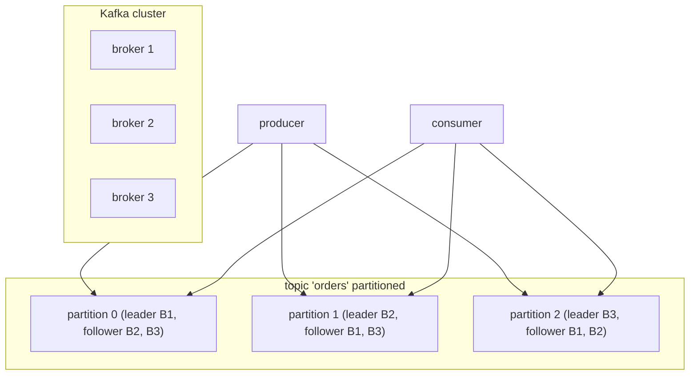
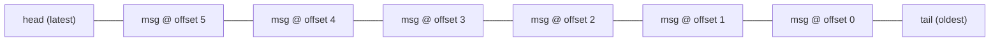
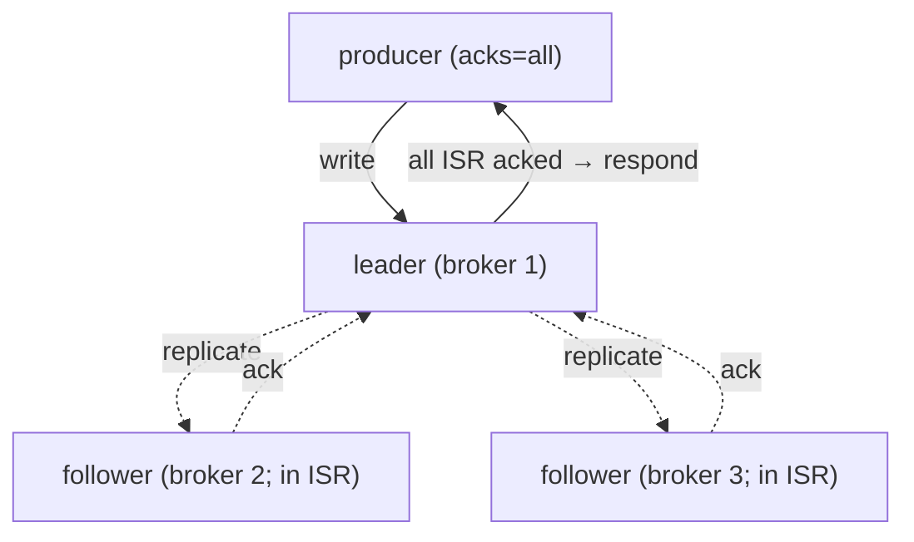

# Apache Kafka fundamentals

Apache Kafka (LinkedIn, 2011) is the **dominant event-streaming platform**. The core insight: instead of broker-as-router (RabbitMQ), broker-as-**log**. A Kafka topic is an append-only, partitioned, replicated log; producers append; consumers track their read positions (offsets) independently. Replay is trivial — just rewind the offset. Throughput is enormous: a single broker handles 100K+ messages/sec; a cluster does millions/sec. Adopted by Uber, Netflix, LinkedIn, Airbnb, Spotify, banks, telecoms — anywhere events stream.

A senior engineer using Kafka needs the conceptual model rock-solid: topics partitioned across brokers for parallelism; partitions replicated for HA; offsets tracking consumer progress; consumer groups distributing partitions among workers. Once that clicks, Spring Kafka (L4/C01/T22) and Kafka Streams (T06) and the operational concerns become straightforward.

This topic covers: the broker-as-log architecture; topics, partitions, segments, offsets; replication (leaders, followers, ISR); the producer/consumer protocol; KRaft mode (Kafka's metadata management; replaces ZooKeeper); retention; log compaction; the producer's idempotence and transactions for exactly-once. T05 dives deep into consumer groups, partition assignment, and rebalancing.

> [!NOTE]
> Prerequisites: [Messaging concepts (T01)](./T01-messaging-concepts-queues-topics-pub-sub.md), [Spring for Kafka (L4/C01/T22)](../C01-spring-framework/T22-spring-for-kafka-amqp.md).

## The Architecture



- **Broker**: a Kafka server.
- **Topic**: a named stream of messages.
- **Partition**: a unit of parallelism within a topic; an ordered, append-only log.
- **Replication**: each partition has 1 leader + N-1 followers; producers + consumers talk to the leader.
- **Consumer**: reads from one or more partitions; tracks its offset.

## Topics And Partitions

```bash
kafka-topics --create --topic orders \
    --partitions 6 \
    --replication-factor 3 \
    --bootstrap-server kafka:9092
```

- 6 partitions: 6 parallel write/read streams. More = more throughput; more = more memory / open files.
- replication 3: each partition stored on 3 brokers; tolerates 2 broker failures.

Choosing partition count:

- Rule of thumb: 2-10× expected consumer parallelism. With 4 consumers, 8-40 partitions.
- Can increase later but **never decrease**.
- Watch keyed message ordering — partition count change rehashes.

## Partition As Log



Each message gets a monotonically-increasing **offset** within its partition. Append-only. Consumers track which offset they've processed; replay = move offset back.

Partitions are stored as **segments** (multi-GB log files) on disk:

```
/var/lib/kafka/data/orders-0/
  00000000000000000000.log
  00000000000000100000.log    # next segment when previous filled
  00000000000000200000.log
  *.index, *.timeindex
```

Old segments are deleted per retention policy.

## Replication — Leaders, Followers, ISR

Each partition has a **leader** broker + N-1 **followers**. Producers and consumers communicate with the leader. Followers replicate from the leader.

The **In-Sync Replicas (ISR)** is the set of replicas (including leader) currently caught up. If a follower lags > `replica.lag.time.max.ms` (default 30 s), it's removed from ISR.

A producer with `acks=all` waits for **all ISR** to acknowledge. If ISR ≥ `min.insync.replicas` (typical 2 of 3), write proceeds; otherwise fails. This gives strong durability — writes survive at least 1 broker failure.



## KRaft — Goodbye ZooKeeper

Pre-2022 Kafka used ZooKeeper for metadata (partition leaders, broker registration). Kafka 3.3+ ships **KRaft** mode: Kafka manages its own metadata via internal Raft consensus. **Kafka 4.0 (2025) makes ZooKeeper-free deployment the only option.** New clusters: KRaft. Old clusters: migrate.

```ini
# config/kraft/server.properties
process.roles=broker,controller
controller.quorum.voters=1@host1:9093,2@host2:9093,3@host3:9093
```

Simpler ops; one fewer system to manage.

## Producer Protocol

```java
Properties props = new Properties();
props.put("bootstrap.servers", "kafka:9092");
props.put("key.serializer", StringSerializer.class);
props.put("value.serializer", JsonSerializer.class);
props.put("acks", "all");
props.put("enable.idempotence", "true");

try (Producer<String, Order> producer = new KafkaProducer<>(props)) {
    producer.send(new ProducerRecord<>("orders", order.id(), order));
}
```

Steps:

1. Producer batches records (in memory; flushed by `linger.ms` or `batch.size`).
2. Sends batch to partition leader; leader writes to log; replicates to followers.
3. Once all ISR ack (with `acks=all`), responds to producer.

With `enable.idempotence=true`, producer assigns sequence numbers; broker dedupes — exactly-once-per-producer-session. Combined with transactions: exactly-once consume-process-produce.

## Consumer Protocol

```java
Properties props = new Properties();
props.put("bootstrap.servers", "kafka:9092");
props.put("group.id", "orders-service");
props.put("key.deserializer", StringDeserializer.class);
props.put("value.deserializer", JsonDeserializer.class);
props.put("auto.offset.reset", "earliest");
props.put("enable.auto.commit", false);

try (Consumer<String, Order> consumer = new KafkaConsumer<>(props)) {
    consumer.subscribe(List.of("orders"));
    while (true) {
        ConsumerRecords<String, Order> records = consumer.poll(Duration.ofMillis(500));
        for (ConsumerRecord<String, Order> r : records) {
            process(r.value());
        }
        consumer.commitSync();
    }
}
```

`enable.auto.commit=false` + manual `commitSync()` gives at-least-once with explicit offset control. `auto.offset.reset` = `earliest` / `latest` / `none`: where to start on first read.

T05 dives into consumer groups and partition assignment.

## Retention

```
# topic-level config
retention.ms=604800000        # 7 days
retention.bytes=-1            # no size limit
```

Old segments deleted after retention. For event sourcing / replay, set longer.

## Log Compaction

Alternative to time retention: keep only the **latest message per key**:

```
cleanup.policy=compact
```

After compaction:

```
key=user-42, value=v1
key=user-42, value=v2
key=user-43, value=v1
key=user-42, value=v3       ← latest

→ after compaction
key=user-43, value=v1
key=user-42, value=v3
```

Used for: state snapshots; current-value-by-key topics. Underpins Kafka Streams state stores (T06).

## Schema Registry

JSON has no schema; type changes break consumers. **Confluent Schema Registry** + Avro / Protobuf / JSON Schema gives:

- Schemas stored centrally.
- Producer attaches schema id to message.
- Consumer fetches schema by id; deserializes.
- Compatibility checks on schema evolution (backward / forward / full).

```java
props.put("value.serializer", KafkaAvroSerializer.class);
props.put("schema.registry.url", "http://schema-registry:8081");
```

Mandatory for serious Kafka deployments with multiple teams.

## Kafka vs RabbitMQ — Recap

| Aspect | Kafka | RabbitMQ |
|--------|:-----:|:--------:|
| Model | log | queue + routing |
| Throughput | very high | high |
| Replay | ✅ | ❌ |
| Routing | consumer-side | broker-side |
| Per-message TTL | ❌ | ✅ |
| Retention | days/weeks | minutes (transient) |
| HA / scaling | excellent | good (quorum) |
| Use | events, streaming | tasks, RPC |

## Spring Kafka Quick Recap

```yaml
spring:
  kafka:
    bootstrap-servers: kafka:9092
    consumer:
      group-id: orders-service
      auto-offset-reset: earliest
      key-deserializer: org.apache.kafka.common.serialization.StringDeserializer
      value-deserializer: org.springframework.kafka.support.serializer.JsonDeserializer
      properties:
        spring.json.trusted.packages: "com.example.events"
    producer:
      acks: all
      enable.idempotence: true
```

```java
@KafkaListener(topics = "orders.placed", groupId = "orders-service")
public void handle(Order order) { ... }

@Autowired KafkaTemplate<String, Order> template;
template.send("orders.placed", order.id().toString(), order);
```

Covered deeply in L4/C01/T22.

## Common Pitfalls

> [!WARNING]
> **`acks=1` for important data.** Leader can ack, then die; data lost. Use `acks=all`.

> [!WARNING]
> **Too few partitions.** Consumer parallelism capped.

> [!WARNING]
> **Auto-commit + heavy processing.** Offsets advance before processing; restart skips.

> [!WARNING]
> **No min.insync.replicas.** Single broker can satisfy `acks=all` — defeats safety.

> [!WARNING]
> **JSON without schema registry.** Schema drift breaks consumers.

> [!WARNING]
> **Long retention without log compaction for state topics.** Topic grows forever.

> [!WARNING]
> **Cross-partition ordering assumption.** No global order; only per-partition.

> [!WARNING]
> **ZooKeeper-mode new cluster in 2026.** Use KRaft.

## Practice

1. Create a topic with 3 partitions, replication 3, `acks=all`, `min.insync.replicas=2`. Verify durability under broker failure.
2. Send messages with different keys; observe distribution across partitions.
3. Start consumer in group A; consume all messages. Add second consumer to group A; observe partition rebalance.
4. Start a separate consumer in group B; verify independent offset and full replay.
5. Configure log compaction; verify old keys disappear after compaction.
6. Wire Confluent Schema Registry; verify Avro serialization.
7. Use KRaft mode for a local 3-broker cluster.
8. Compare throughput: Kafka vs RabbitMQ same workload.

## Recap

You should now be able to:

- Explain Kafka's broker-as-log architecture: topics, partitions, segments, offsets.
- Configure replication with leader/follower/ISR; pick `acks` and `min.insync.replicas`.
- Use KRaft mode for metadata management (Kafka 4+).
- Distinguish retention by time/size vs log compaction.
- Use the producer with idempotence + transactions for effective exactly-once.
- Use the consumer with manual commit for at-least-once.
- Apply Schema Registry for schema evolution.
- Compare Kafka vs RabbitMQ semantics.
- Avoid the canonical pitfalls: low acks, too few partitions, auto-commit, no schema registry, ZooKeeper for new clusters.

## Next

Continue to [Kafka deep (partitions, consumer groups, offsets)](./T05-kafka-deep-partitions-consumer-groups-offsets.md) for the consumer-side mechanics — group coordination, partition assignment, rebalance protocols, and the offset-management discipline.
