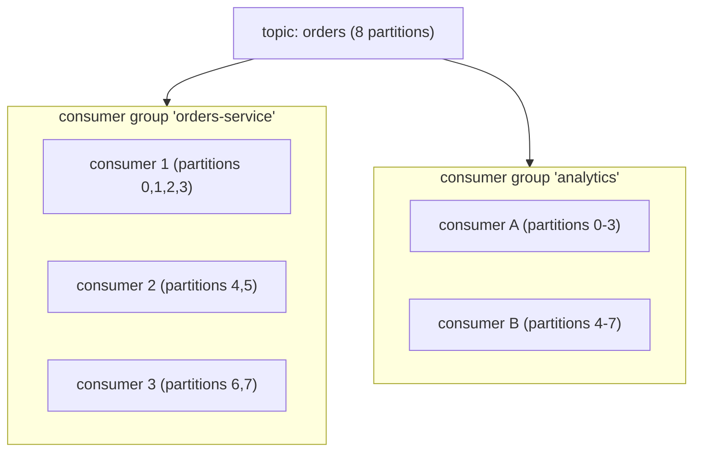
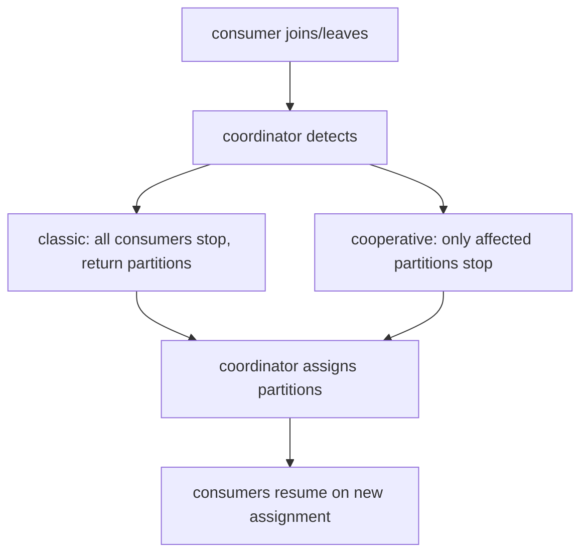

# Kafka deep (partitions, consumer groups, offsets)

T04 covered Kafka's architecture and producer side. **This topic** dives into the consumer side — the place most Kafka operational complexity lives. **Consumer groups** distribute partitions among consumers; **partition assignment** decides which consumer gets which partition; **rebalances** happen when group membership changes (and badly handled rebalances are the #1 Kafka production headache). **Offsets** track consumer progress; how / when they're committed determines delivery semantics. **Consumer lag** is the operational health metric.

A senior engineer running Kafka in production needs deep familiarity with: the group coordinator protocol; partition assignment strategies (range, round-robin, sticky, cooperative-sticky); the rebalance lifecycle (stop-the-world classic vs incremental cooperative); offset commit modes (auto vs manual sync vs manual async); the offset storage topic; lag monitoring; static membership (avoiding spurious rebalances); the `max.poll.interval.ms` trap.

This is dense Kafka operational knowledge. Master it; the rest of Kafka is cleanup.

> [!NOTE]
> Prerequisites: [Kafka fundamentals (T04)](./T04-apache-kafka-fundamentals.md), [Spring for Kafka (L4/C01/T22)](../C01-spring-framework/T22-spring-for-kafka-amqp.md).

## Consumer Groups

A **consumer group** is identified by `group.id`. The group jointly consumes a topic — Kafka's group coordinator distributes partitions among the consumers.



Each group gets every message; **within a group**, each partition assigned to exactly one consumer. More consumers in a group = more parallelism, up to partition count (excess consumers idle).

## Partition Assignment Strategies

The group coordinator + the consumer-supplied assignor decide partition-to-consumer assignment.

### Range Assignor

Default in older Kafka. Per-topic: divide partitions among consumers in lexical order.

8 partitions, 3 consumers: c1 gets 0-2 (3); c2 gets 3-5 (3); c3 gets 6-7 (2). Unbalanced.

### Round-Robin Assignor

8 partitions, 3 consumers: round-robin → c1: 0,3,6; c2: 1,4,7; c3: 2,5. Balanced; but every rebalance reshuffles everything.

### Sticky Assignor

Like round-robin but **tries to keep existing assignments stable**. Reassigns minimally on rebalance.

### Cooperative Sticky Assignor (Kafka 2.4+)

Stable assignment + **incremental rebalance**: instead of pausing all consumers, only consumers affected by partition movement pause briefly. Massively improves rebalance experience.

**Production default in 2026**: cooperative sticky.

```yaml
spring:
  kafka:
    consumer:
      properties:
        partition.assignment.strategy: org.apache.kafka.clients.consumer.CooperativeStickyAssignor
```

## Rebalance Lifecycle

A rebalance happens when:

- A consumer joins or leaves the group.
- Group membership times out (heartbeat lost).
- Topic partitions change.



**Classic rebalance** (pre-2.4) = stop-the-world. With cooperative sticky, the pause is per-partition and brief.

### Rebalance Storms

When rebalances happen too often, throughput collapses:

- Consumer crashes → rebalance → another lags → rebalance → ...
- New deployment with rolling restart → rebalance per pod restart.

Mitigations:

- **Static membership**: each consumer has a `group.instance.id`; on graceful restart the coordinator waits briefly before triggering rebalance.
- **Tune timeouts**: `session.timeout.ms` (default 45s) controls how long the coordinator waits before declaring a consumer dead.
- **Cooperative assignor** for milder rebalance impact.

```yaml
spring:
  kafka:
    consumer:
      properties:
        group.instance.id: pod-${HOSTNAME}    # static membership
        session.timeout.ms: 45000
        heartbeat.interval.ms: 3000
```

## Offset Management

Each consumer group tracks **the next offset to read** per partition. Offsets are stored in Kafka itself — a special compacted topic `__consumer_offsets`.

```bash
kafka-consumer-groups --describe --group orders-service --bootstrap-server kafka:9092
GROUP             TOPIC          PARTITION  CURRENT-OFFSET  LOG-END-OFFSET  LAG
orders-service    orders         0          12345           12350           5
orders-service    orders         1          12340           12350           10
...
```

**LAG = LOG-END-OFFSET - CURRENT-OFFSET** = how many messages behind the consumer is.

## Commit Modes

### Auto-Commit

```yaml
enable.auto.commit: true
auto.commit.interval.ms: 5000
```

Periodically (every 5s) commits the latest fetched offset. **Race condition**: offsets committed *before* processing finishes; restart skips unprocessed messages. **Don't use for critical workloads.**

### Manual Sync Commit

```java
consumer.commitSync();
```

Blocks until ack. Reliable. Per `poll` cycle. Throughput cost: extra round trip per batch.

### Manual Async Commit

```java
consumer.commitAsync((offsets, ex) -> {
    if (ex != null) log.warn("commit failed", ex);
});
```

Fire and forget. Faster. Risk: commit may fail; next commit is older offset; double processing.

### Best Practice

```java
while (true) {
    ConsumerRecords records = consumer.poll(...);
    for (record : records) {
        process(record);
    }
    consumer.commitAsync();          // async per batch
}
// At shutdown:
consumer.commitSync();                // sync at end
```

## Spring Kafka Ack Modes

T22 of C01:

```yaml
spring:
  kafka:
    listener:
      ack-mode: BATCH                  # default; commit per poll batch
      # or: RECORD, TIME, COUNT, MANUAL, MANUAL_IMMEDIATE
```

For critical workloads use `MANUAL`:

```java
@KafkaListener(topics = "orders")
public void handle(Order order, Acknowledgment ack) {
    process(order);
    ack.acknowledge();
}
```

Acknowledge after processing; restart resumes from last unacked.

## Exactly-Once Consumer (Transactional)

For consume-process-produce with exactly-once semantics:

```yaml
spring:
  kafka:
    producer:
      transaction-id-prefix: tx-orders-
      enable.idempotence: true
    consumer:
      isolation.level: read_committed
```

```java
@KafkaListener(topics = "orders.placed")
@Transactional("kafkaTransactionManager")
public void process(OrderPlaced event) {
    Order enriched = enrich(event);
    template.send("orders.enriched", enriched.id(), enriched);
    // both consumer offset commit + outbound send in one tx
}
```

Same Kafka transaction commits consumer offset + outbound message. With `read_committed`, downstream consumers see only committed messages. End-to-end exactly-once *within Kafka*.

## Consumer Lag — The Critical Metric

```bash
kafka-consumer-groups --describe --group orders-service --bootstrap-server kafka:9092
```

Lag rising → consumer can't keep up. Causes:

- Slow processing (long-running handlers).
- Insufficient parallelism (consumers < partitions).
- Downstream service slow (HTTP / DB calls in handler).
- Rebalance / pause.

Lag-flat-at-high → permanent backpressure; need more consumers, more partitions, or faster processing.

Wire Burrow or Kafka Lag Exporter → Prometheus → Grafana → alerts.

## `max.poll.interval.ms` Trap

```yaml
max.poll.interval.ms: 300000    # 5 minutes
```

If the consumer doesn't call `poll()` again within this time, the coordinator considers it dead → rebalance.

A slow handler (30s per message, 100 messages per poll) = 3000s = consumer kicked out.

Solutions:

- Process fewer messages per poll (lower `max.poll.records`).
- Process in parallel inside the listener.
- Move slow work to a separate thread.
- Raise `max.poll.interval.ms` (rare).

Spring Kafka handles this gracefully with `AckMode.MANUAL_IMMEDIATE` and offloading patterns.

## Partition Strategy For Ordering

Partition key determines ordering. For per-customer ordering:

```java
template.send("orders", customerId.toString(), order);   // key = customerId
```

All orders for `customerId=42` go to the same partition; consumer processes them in order. Different customers parallelized across partitions.

## Common Pitfalls

> [!WARNING]
> **Auto-commit + heavy processing.** Offsets advance prematurely.

> [!WARNING]
> **Long handler exceeds `max.poll.interval.ms`.** Rebalance loop.

> [!WARNING]
> **Range assignor in production.** Unbalanced and disruptive rebalances. Use cooperative-sticky.

> [!WARNING]
> **No static membership.** Rolling deploys trigger rebalances per pod.

> [!WARNING]
> **Ignoring lag.** Slow consumer until OOM.

> [!WARNING]
> **More consumers than partitions.** Idle; wasted capacity.

> [!WARNING]
> **Wrong partition key for ordering.** Per-entity ordering lost.

> [!WARNING]
> **Manual commit on error.** Commit despite failure; skipped message.

## Deeper Dive — Production Kafka Configurations

### Producer Configuration — The Full Picture

```java
@Configuration
public class KafkaProducerConfig {
    @Bean
    public ProducerFactory<String, Object> producerFactory() {
        Map<String, Object> props = new HashMap<>();
        // CONNECTION
        props.put(ProducerConfig.BOOTSTRAP_SERVERS_CONFIG, "kafka-0:9092,kafka-1:9092,kafka-2:9092");

        // SERIALIZATION
        props.put(ProducerConfig.KEY_SERIALIZER_CLASS_CONFIG, StringSerializer.class);
        props.put(ProducerConfig.VALUE_SERIALIZER_CLASS_CONFIG, JsonSerializer.class);

        // DURABILITY — critical
        props.put(ProducerConfig.ACKS_CONFIG, "all");                    // wait for all in-sync replicas
        props.put(ProducerConfig.ENABLE_IDEMPOTENCE_CONFIG, true);       // no duplicates on retry (default true in 3.0+)
        props.put(ProducerConfig.MAX_IN_FLIGHT_REQUESTS_PER_CONNECTION, 5);  // ≤5 with idempotence

        // RELIABILITY — retries with bounded duration
        props.put(ProducerConfig.RETRIES_CONFIG, Integer.MAX_VALUE);     // keep retrying...
        props.put(ProducerConfig.DELIVERY_TIMEOUT_MS_CONFIG, 120_000);   // ...up to 2 min total
        props.put(ProducerConfig.REQUEST_TIMEOUT_MS_CONFIG, 30_000);

        // PERFORMANCE
        props.put(ProducerConfig.COMPRESSION_TYPE_CONFIG, "lz4");        // lz4 = best speed/ratio
        props.put(ProducerConfig.BATCH_SIZE_CONFIG, 65_536);             // 64KB per partition batch
        props.put(ProducerConfig.LINGER_MS_CONFIG, 10);                  // wait 10ms to batch
        props.put(ProducerConfig.BUFFER_MEMORY_CONFIG, 64 * 1024 * 1024); // 64MB producer buffer

        // EXACTLY-ONCE (transactional producer for read-process-write)
        props.put(ProducerConfig.TRANSACTIONAL_ID_CONFIG, "tx-${spring.application.name}-${HOSTNAME}");

        return new DefaultKafkaProducerFactory<>(props);
    }
}
```

**Critical settings explained**:
- **`acks=all`**: producer waits for ALL in-sync replicas to ack before considering write successful. Combined with `min.insync.replicas=2` on the topic, this gives durability guarantee — message survives N-1 broker failures.
- **`enable.idempotence=true`**: producer attaches a sequence number per partition; brokers reject duplicates. Eliminates double-send on retry. Default `true` in 3.0+.
- **`compression.type=lz4`**: balances CPU and bandwidth. Snappy is older alternative; gzip is highest compression but slowest. `zstd` is newest, often best.
- **`linger.ms=10` + `batch.size=65536`**: batch writes for throughput. 0ms linger = lowest latency but minimal batching.

### Consumer Configuration — Production-Ready

```java
@Configuration
public class KafkaConsumerConfig {
    @Bean
    public ConsumerFactory<String, Order> consumerFactory() {
        Map<String, Object> props = new HashMap<>();
        // CONNECTION
        props.put(ConsumerConfig.BOOTSTRAP_SERVERS_CONFIG, "kafka-0:9092,kafka-1:9092,kafka-2:9092");
        props.put(ConsumerConfig.GROUP_ID_CONFIG, "order-processor");
        props.put(ConsumerConfig.GROUP_INSTANCE_ID_CONFIG, "${HOSTNAME}");  // static membership

        // DESERIALIZATION
        props.put(ConsumerConfig.KEY_DESERIALIZER_CLASS_CONFIG, StringDeserializer.class);
        props.put(ConsumerConfig.VALUE_DESERIALIZER_CLASS_CONFIG, ErrorHandlingDeserializer.class);
        props.put(ErrorHandlingDeserializer.VALUE_DESERIALIZER_CLASS, JsonDeserializer.class);
        props.put(JsonDeserializer.TRUSTED_PACKAGES, "com.example.events");

        // OFFSET MANAGEMENT
        props.put(ConsumerConfig.ENABLE_AUTO_COMMIT_CONFIG, false);       // we commit manually
        props.put(ConsumerConfig.AUTO_OFFSET_RESET_CONFIG, "earliest");   // or "latest" for new groups
        props.put(ConsumerConfig.ISOLATION_LEVEL_CONFIG, "read_committed"); // skip aborted tx messages

        // PARTITION ASSIGNMENT — cooperative-sticky for 2026 production
        props.put(ConsumerConfig.PARTITION_ASSIGNMENT_STRATEGY_CONFIG,
                  CooperativeStickyAssignor.class.getName());

        // BATCH SIZING
        props.put(ConsumerConfig.MAX_POLL_RECORDS_CONFIG, 100);            // process 100 records per poll
        props.put(ConsumerConfig.MAX_POLL_INTERVAL_MS_CONFIG, 300_000);    // 5 min to process batch
        props.put(ConsumerConfig.FETCH_MIN_BYTES_CONFIG, 1024);            // wait for 1KB+ before fetching
        props.put(ConsumerConfig.FETCH_MAX_WAIT_MS_CONFIG, 500);           // ...or 500ms max wait

        // HEARTBEAT (must be << max.poll.interval)
        props.put(ConsumerConfig.SESSION_TIMEOUT_MS_CONFIG, 30_000);       // 30s session timeout
        props.put(ConsumerConfig.HEARTBEAT_INTERVAL_MS_CONFIG, 10_000);    // heartbeat every 10s

        return new DefaultKafkaConsumerFactory<>(props);
    }
}
```

**Key insights**:
- **`group.instance.id`** (static membership): pod restart doesn't trigger a full rebalance. Critical for rolling deploys.
- **`max.poll.records=100`**: process this many records before next `poll()`. Too high → slow handlers risk `max.poll.interval.ms` timeout → rebalance.
- **`cooperative-sticky` assignor**: incremental rebalances; only affected partitions move. Default `range` causes "stop the world" rebalances.
- **`isolation.level=read_committed`**: skip messages from aborted transactions. Required if producers use transactions.

### Spring Kafka Consumer with Manual Ack

```java
@Component
public class OrderConsumer {

    @KafkaListener(
        topics = "orders",
        groupId = "order-processor",
        containerFactory = "manualAckContainerFactory"
    )
    public void consume(ConsumerRecord<String, Order> record,
                       Acknowledgment ack) {
        try {
            orderService.process(record.value());
            ack.acknowledge();      // commit offset only on success
        } catch (TransientException e) {
            // don't ack; will be redelivered on next poll
            throw e;
        } catch (PermanentException e) {
            // ack + send to DLQ
            dlqProducer.send(new ProducerRecord<>("orders-dlq", record.value()));
            ack.acknowledge();
        }
    }

    @Bean
    public ConcurrentKafkaListenerContainerFactory<String, Order> manualAckContainerFactory(
            ConsumerFactory<String, Order> cf) {
        var factory = new ConcurrentKafkaListenerContainerFactory<String, Order>();
        factory.setConsumerFactory(cf);
        factory.setConcurrency(3);   // 3 consumer threads → match partition count
        factory.getContainerProperties().setAckMode(AckMode.MANUAL);
        // OR AckMode.MANUAL_IMMEDIATE for stricter at-least-once
        return factory;
    }
}
```

### Idempotent Consumer (At-Least-Once → Effectively Exactly-Once)

Even with `enable.idempotence` producer + `read_committed` consumer, consumer-side processing can re-run on rebalance. Add idempotency at the consumer:

```java
@Component
public class IdempotentOrderConsumer {
    @KafkaListener(topics = "orders", groupId = "order-processor")
    public void consume(ConsumerRecord<String, Order> record) {
        UUID dedupKey = extractIdempotencyKey(record);   // e.g., from message header

        // atomic INSERT OR IGNORE on dedup table
        boolean isNew = dedupRepo.tryInsert(dedupKey);
        if (!isNew) {
            log.info("Duplicate message {} skipped", dedupKey);
            return;
        }

        orderService.process(record.value());
        // dedup record + business state committed in same DB transaction
    }
}
```

The dedup table is cleaned periodically (TTL ~7 days).

### Kafka Transactions for Read-Process-Write (Strict EOS)

```java
@Bean
public KafkaTransactionManager<?, ?> kafkaTxManager(ProducerFactory<?, ?> pf) {
    return new KafkaTransactionManager<>(pf);
}

@Transactional("kafkaTxManager")
@KafkaListener(topics = "orders")
public void consume(ConsumerRecord<String, Order> record) {
    Order processed = orderService.process(record.value());
    kafkaTemplate.send("orders-processed", processed);
    // offset commit + send happen in same transaction
    // either both happen or neither
}
```

**EOS overhead**: ~10-15% throughput hit (Kafka transaction coordinator round-trips). Use when consistency requirement is hard; skip for high-throughput at-least-once + idempotent consumer.

## Deeper Dive — Consumer Lag Investigation

```bash
# Show lag per partition
kafka-consumer-groups.sh --bootstrap-server localhost:9092 \
    --describe --group order-processor

# Output:
# TOPIC    PARTITION  CURRENT-OFFSET  LOG-END-OFFSET  LAG  CONSUMER-ID
# orders        0          12345          12500       155  consumer-1-uuid
# orders        1          12200          12500       300  consumer-2-uuid
# orders        2          12500          12500         0  consumer-3-uuid
```

**Lag growing steadily** → consumer is slower than producer. Diagnose:
1. **Single-threaded processing?** A consumer can only process 1 partition at a time per thread. Add concurrency: `factory.setConcurrency(N)` where N ≤ partition count.
2. **Slow downstream?** Trace a single message — DB write taking 500ms? External API timeout?
3. **Rebalance storm?** Check rebalance count; tune `session.timeout.ms` and `max.poll.interval.ms`.
4. **Poison message?** One bad record blocks partition. Implement DLQ + `DefaultErrorHandler`.

**Lag stable but high** → consumer keeps up but hasn't caught up yet. Wait + monitor; if not catching up, scale consumers.

**Lag = 0 but throughput problems** → consumer processing fast but message rate exceeds desired throughput. Check producer rate; consider buffering downstream.

### Adding DLQ Pattern

```java
@Configuration
public class DLQConfig {
    @Bean
    public DefaultErrorHandler errorHandler(KafkaTemplate<String, Object> template) {
        DeadLetterPublishingRecoverer recoverer = new DeadLetterPublishingRecoverer(template,
            (record, ex) -> new TopicPartition(record.topic() + "-dlq", record.partition()));

        DefaultErrorHandler handler = new DefaultErrorHandler(recoverer,
            new FixedBackOff(1000L, 3));    // retry 3 times with 1s backoff before DLQ

        // Classification: what's transient vs permanent
        handler.addRetryableExceptions(TransientException.class, IOException.class);
        handler.addNotRetryableExceptions(PermanentException.class, IllegalArgumentException.class);

        return handler;
    }
}
```

## Deeper Dive — Topic Configuration (`server.properties` and `kafka-topics.sh`)

```bash
# Create topic with proper config
kafka-topics.sh --bootstrap-server localhost:9092 \
    --create --topic orders \
    --partitions 12 \
    --replication-factor 3 \
    --config min.insync.replicas=2 \
    --config retention.ms=604800000 \
    --config compression.type=lz4 \
    --config segment.ms=86400000 \
    --config cleanup.policy=delete
```

**Key settings**:
- `partitions`: max parallelism for consumer group. Pick high enough for future growth (hard to add partitions later for key-ordered topics).
- `replication.factor=3`: tolerate 2 broker failures. Standard for production.
- `min.insync.replicas=2`: with `acks=all`, writes succeed only if 2+ replicas acked. With 3 replicas, tolerates 1 down.
- `retention.ms`: how long messages kept (default 7 days). For log compaction, use `cleanup.policy=compact`.
- `compression.type`: topic-level default; producer can override.
- `segment.ms` / `segment.bytes`: how often Kafka rotates segment files. Affects retention granularity.

### Compacted Topic vs Delete Topic

```bash
# Delete-policy (default): old messages dropped after retention
--config cleanup.policy=delete --config retention.ms=604800000

# Compact-policy: keep only LATEST message per key (like a key-value store)
--config cleanup.policy=compact --config min.cleanable.dirty.ratio=0.5

# Both: compact while in time window, delete after
--config cleanup.policy=compact,delete --config retention.ms=2592000000
```

**Use compaction for**: event-sourcing snapshots, user profile updates, config topics. Reading the topic gives current state.

**Don't compact**: audit logs, time-series, event streams where every message matters.

## Deeper Dive — Capacity Sizing Worksheet

Sizing a new Kafka cluster:

```
INPUTS
  Message rate (avg/peak)     : 50k/sec avg, 200k/sec peak
  Average message size         : 1 KB
  Replication factor           : 3
  Retention                    : 7 days

THROUGHPUT REQUIRED
  Avg write throughput         : 50k × 1 KB = 50 MB/s (× 3 RF = 150 MB/s replicated)
  Peak write throughput        : 200 MB/s (× 3 = 600 MB/s)

  Per broker write capacity    : ~500 MB/s (HDD) to ~1 GB/s (NVMe SSD)
  Brokers needed (peak)        : ceil(600 / 500) = 2 minimum, add 1-2 for HA = 3-4 brokers

STORAGE REQUIRED
  Per day per partition (avg)  : 50 MB/s × 86400 sec = 4.3 TB/day per cluster
  7-day retention × 3 RF       : 4.3 × 7 × 3 = 90 TB total cluster storage
  Per broker (3 brokers)       : 30 TB each — need large EBS or local SSDs

PARTITION COUNT
  Target throughput per part   : 5-20 MB/s (cap to avoid hot partitions)
  Partitions needed            : 50 MB/s / 10 MB/s = 5 minimum
  Headroom for future          : 12-24 partitions (round to multiple of brokers)
  Consumer parallelism cap     : = partition count

CONSUMER COUNT
  Throughput per consumer      : depends on processing speed
  Consumers needed             : ≤ partition count (one consumer per partition max)
```

## Deeper Dive — Real-World Kafka Pitfalls

| Pitfall | Cause | Fix |
|---|---|---|
| All messages going to one partition | Producer uses no key OR all keys hash to same partition | Diversify key; use `Murmur2Partitioner` for better distribution |
| Consumer falls behind on restart | `auto.offset.reset=earliest` + dropped consumer = re-read from start | Use `latest` for new groups; commit offsets reliably |
| "Magic v1 does not support record headers" | Mixing producer/consumer versions across major releases | Pin same version; use kafka-clients lib version compatible with broker |
| Producer hangs on send | Broker network unreachable; producer buffer full | Set `delivery.timeout.ms` bound; alert on `record-error-rate` metric |
| Duplicate messages despite idempotent producer | Consumer-side processing not idempotent | Add dedup key + DB unique constraint |
| Schema-evolution breaks consumers | New producer field; old consumer can't deserialize | Use Avro/Protobuf with Schema Registry; enforce compatibility rules (BACKWARD/FORWARD) |
| Rebalance every few minutes | Slow consumer hitting `max.poll.interval.ms` | Reduce `max.poll.records` OR async-process within consumer |
| One pod processes 50x more than others | `range` assignor + sticky imbalance | Switch to `cooperative-sticky` assignor |

## Practice

1. Start 3 consumers in one group on 6-partition topic; observe assignment.
2. Kill one consumer; observe rebalance latency with range vs cooperative-sticky assignor.
3. Add `group.instance.id`; do a graceful restart; verify no rebalance.
4. Simulate slow handler; observe `max.poll.interval.ms` rebalance trap; fix.
5. Wire lag monitoring; create alert at threshold.
6. Configure Kafka transactions for consume-process-produce; verify exactly-once.
7. Test partition key strategy: per-customer key; verify ordered per customer; parallel across.
8. Audit your service's commit mode and ack semantics.

## Recap

You should now be able to:

- Configure consumer groups; reason about partition-to-consumer distribution.
- Pick partition assignor: cooperative-sticky for 2026 production.
- Apply static membership to avoid rolling-deploy rebalances.
- Choose commit mode: manual sync at end + async per batch.
- Configure Spring Kafka ack mode (MANUAL_IMMEDIATE for critical).
- Apply exactly-once via Kafka transactions for consume-process-produce.
- Monitor consumer lag; alert on persistent backpressure.
- Avoid `max.poll.interval.ms` trap by tuning poll size or offloading slow work.
- Pick partition key for desired ordering semantics.
- Avoid the canonical pitfalls: auto-commit, long handlers, range assignor, no static membership, ignoring lag.

## Next

Continue to [Kafka Streams](./T06-kafka-streams.md) for the stream-processing API built on top of Kafka — KStream / KTable, joins, windowing, state stores, and the place between Kafka and full stream-processing systems like Flink.
