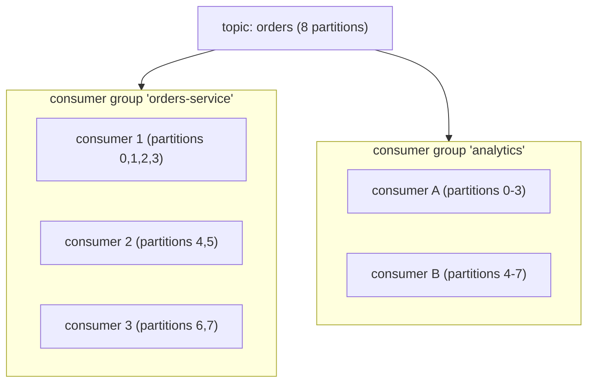
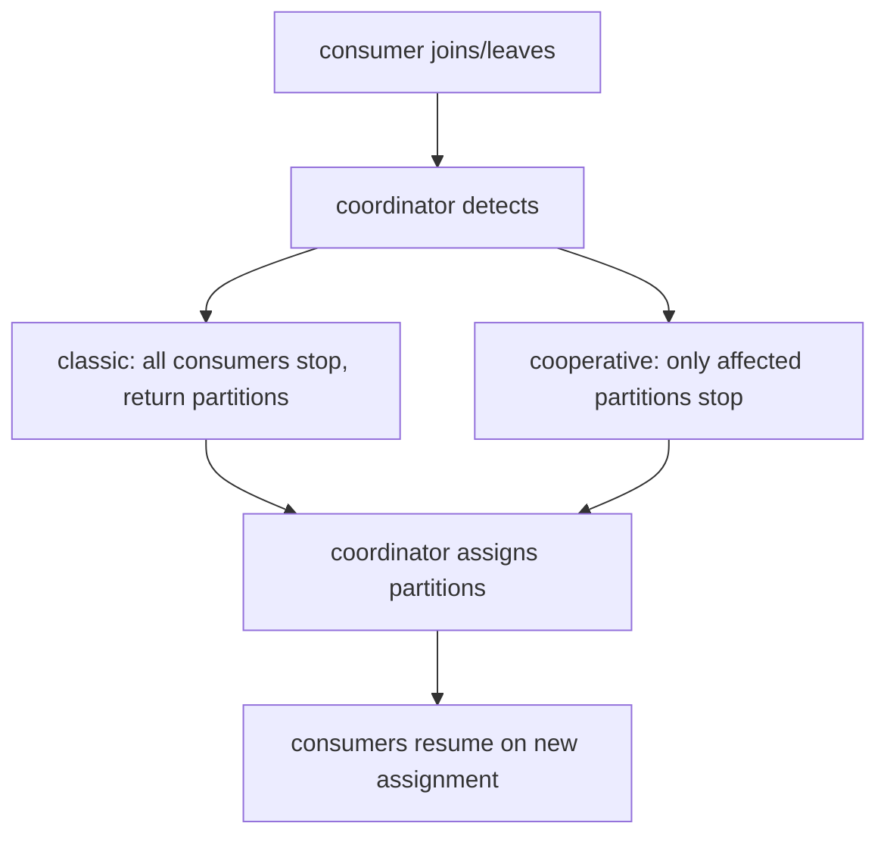

# Kafka deep (partitions, consumer groups, offsets)

T04 covered Kafka's architecture and producer side. **This topic** dives into the consumer side — the place most Kafka operational complexity lives. **Consumer groups** distribute partitions among consumers; **partition assignment** decides which consumer gets which partition; **rebalances** happen when group membership changes (and badly handled rebalances are the #1 Kafka production headache). **Offsets** track consumer progress; how / when they're committed determines delivery semantics. **Consumer lag** is the operational health metric.

A senior engineer running Kafka in production needs deep familiarity with: the group coordinator protocol; partition assignment strategies (range, round-robin, sticky, cooperative-sticky); the rebalance lifecycle (stop-the-world classic vs incremental cooperative); offset commit modes (auto vs manual sync vs manual async); the offset storage topic; lag monitoring; static membership (avoiding spurious rebalances); the `max.poll.interval.ms` trap.

This is dense Kafka operational knowledge. Master it; the rest of Kafka is cleanup.

> [!NOTE]
> Prerequisites: [Kafka fundamentals (T04)](./T04-apache-kafka-fundamentals.md), [Spring for Kafka (L4/C01/T22)](../C01-spring-framework/T22-spring-for-kafka-amqp.md).

## Consumer Groups

A **consumer group** is identified by `group.id`. The group jointly consumes a topic — Kafka's group coordinator distributes partitions among the consumers.



Each group gets every message; **within a group**, each partition assigned to exactly one consumer. More consumers in a group = more parallelism, up to partition count (excess consumers idle).

## Partition Assignment Strategies

The group coordinator + the consumer-supplied assignor decide partition-to-consumer assignment.

### Range Assignor

Default in older Kafka. Per-topic: divide partitions among consumers in lexical order.

8 partitions, 3 consumers: c1 gets 0-2 (3); c2 gets 3-5 (3); c3 gets 6-7 (2). Unbalanced.

### Round-Robin Assignor

8 partitions, 3 consumers: round-robin → c1: 0,3,6; c2: 1,4,7; c3: 2,5. Balanced; but every rebalance reshuffles everything.

### Sticky Assignor

Like round-robin but **tries to keep existing assignments stable**. Reassigns minimally on rebalance.

### Cooperative Sticky Assignor (Kafka 2.4+)

Stable assignment + **incremental rebalance**: instead of pausing all consumers, only consumers affected by partition movement pause briefly. Massively improves rebalance experience.

**Production default in 2026**: cooperative sticky.

```yaml
spring:
  kafka:
    consumer:
      properties:
        partition.assignment.strategy: org.apache.kafka.clients.consumer.CooperativeStickyAssignor
```

## Rebalance Lifecycle

A rebalance happens when:

- A consumer joins or leaves the group.
- Group membership times out (heartbeat lost).
- Topic partitions change.



**Classic rebalance** (pre-2.4) = stop-the-world. With cooperative sticky, the pause is per-partition and brief.

### Rebalance Storms

When rebalances happen too often, throughput collapses:

- Consumer crashes → rebalance → another lags → rebalance → ...
- New deployment with rolling restart → rebalance per pod restart.

Mitigations:

- **Static membership**: each consumer has a `group.instance.id`; on graceful restart the coordinator waits briefly before triggering rebalance.
- **Tune timeouts**: `session.timeout.ms` (default 45s) controls how long the coordinator waits before declaring a consumer dead.
- **Cooperative assignor** for milder rebalance impact.

```yaml
spring:
  kafka:
    consumer:
      properties:
        group.instance.id: pod-${HOSTNAME}    # static membership
        session.timeout.ms: 45000
        heartbeat.interval.ms: 3000
```

## Offset Management

Each consumer group tracks **the next offset to read** per partition. Offsets are stored in Kafka itself — a special compacted topic `__consumer_offsets`.

```bash
kafka-consumer-groups --describe --group orders-service --bootstrap-server kafka:9092
GROUP             TOPIC          PARTITION  CURRENT-OFFSET  LOG-END-OFFSET  LAG
orders-service    orders         0          12345           12350           5
orders-service    orders         1          12340           12350           10
...
```

**LAG = LOG-END-OFFSET - CURRENT-OFFSET** = how many messages behind the consumer is.

## Commit Modes

### Auto-Commit

```yaml
enable.auto.commit: true
auto.commit.interval.ms: 5000
```

Periodically (every 5s) commits the latest fetched offset. **Race condition**: offsets committed *before* processing finishes; restart skips unprocessed messages. **Don't use for critical workloads.**

### Manual Sync Commit

```java
consumer.commitSync();
```

Blocks until ack. Reliable. Per `poll` cycle. Throughput cost: extra round trip per batch.

### Manual Async Commit

```java
consumer.commitAsync((offsets, ex) -> {
    if (ex != null) log.warn("commit failed", ex);
});
```

Fire and forget. Faster. Risk: commit may fail; next commit is older offset; double processing.

### Best Practice

```java
while (true) {
    ConsumerRecords records = consumer.poll(...);
    for (record : records) {
        process(record);
    }
    consumer.commitAsync();          // async per batch
}
// At shutdown:
consumer.commitSync();                // sync at end
```

## Spring Kafka Ack Modes

T22 of C01:

```yaml
spring:
  kafka:
    listener:
      ack-mode: BATCH                  # default; commit per poll batch
      # or: RECORD, TIME, COUNT, MANUAL, MANUAL_IMMEDIATE
```

For critical workloads use `MANUAL`:

```java
@KafkaListener(topics = "orders")
public void handle(Order order, Acknowledgment ack) {
    process(order);
    ack.acknowledge();
}
```

Acknowledge after processing; restart resumes from last unacked.

## Exactly-Once Consumer (Transactional)

For consume-process-produce with exactly-once semantics:

```yaml
spring:
  kafka:
    producer:
      transaction-id-prefix: tx-orders-
      enable.idempotence: true
    consumer:
      isolation.level: read_committed
```

```java
@KafkaListener(topics = "orders.placed")
@Transactional("kafkaTransactionManager")
public void process(OrderPlaced event) {
    Order enriched = enrich(event);
    template.send("orders.enriched", enriched.id(), enriched);
    // both consumer offset commit + outbound send in one tx
}
```

Same Kafka transaction commits consumer offset + outbound message. With `read_committed`, downstream consumers see only committed messages. End-to-end exactly-once *within Kafka*.

## Consumer Lag — The Critical Metric

```bash
kafka-consumer-groups --describe --group orders-service --bootstrap-server kafka:9092
```

Lag rising → consumer can't keep up. Causes:

- Slow processing (long-running handlers).
- Insufficient parallelism (consumers < partitions).
- Downstream service slow (HTTP / DB calls in handler).
- Rebalance / pause.

Lag-flat-at-high → permanent backpressure; need more consumers, more partitions, or faster processing.

Wire Burrow or Kafka Lag Exporter → Prometheus → Grafana → alerts.

## `max.poll.interval.ms` Trap

```yaml
max.poll.interval.ms: 300000    # 5 minutes
```

If the consumer doesn't call `poll()` again within this time, the coordinator considers it dead → rebalance.

A slow handler (30s per message, 100 messages per poll) = 3000s = consumer kicked out.

Solutions:

- Process fewer messages per poll (lower `max.poll.records`).
- Process in parallel inside the listener.
- Move slow work to a separate thread.
- Raise `max.poll.interval.ms` (rare).

Spring Kafka handles this gracefully with `AckMode.MANUAL_IMMEDIATE` and offloading patterns.

## Partition Strategy For Ordering

Partition key determines ordering. For per-customer ordering:

```java
template.send("orders", customerId.toString(), order);   // key = customerId
```

All orders for `customerId=42` go to the same partition; consumer processes them in order. Different customers parallelized across partitions.

## Common Pitfalls

> [!WARNING]
> **Auto-commit + heavy processing.** Offsets advance prematurely.

> [!WARNING]
> **Long handler exceeds `max.poll.interval.ms`.** Rebalance loop.

> [!WARNING]
> **Range assignor in production.** Unbalanced and disruptive rebalances. Use cooperative-sticky.

> [!WARNING]
> **No static membership.** Rolling deploys trigger rebalances per pod.

> [!WARNING]
> **Ignoring lag.** Slow consumer until OOM.

> [!WARNING]
> **More consumers than partitions.** Idle; wasted capacity.

> [!WARNING]
> **Wrong partition key for ordering.** Per-entity ordering lost.

> [!WARNING]
> **Manual commit on error.** Commit despite failure; skipped message.

## Practice

1. Start 3 consumers in one group on 6-partition topic; observe assignment.
2. Kill one consumer; observe rebalance latency with range vs cooperative-sticky assignor.
3. Add `group.instance.id`; do a graceful restart; verify no rebalance.
4. Simulate slow handler; observe `max.poll.interval.ms` rebalance trap; fix.
5. Wire lag monitoring; create alert at threshold.
6. Configure Kafka transactions for consume-process-produce; verify exactly-once.
7. Test partition key strategy: per-customer key; verify ordered per customer; parallel across.
8. Audit your service's commit mode and ack semantics.

## Recap

You should now be able to:

- Configure consumer groups; reason about partition-to-consumer distribution.
- Pick partition assignor: cooperative-sticky for 2026 production.
- Apply static membership to avoid rolling-deploy rebalances.
- Choose commit mode: manual sync at end + async per batch.
- Configure Spring Kafka ack mode (MANUAL_IMMEDIATE for critical).
- Apply exactly-once via Kafka transactions for consume-process-produce.
- Monitor consumer lag; alert on persistent backpressure.
- Avoid `max.poll.interval.ms` trap by tuning poll size or offloading slow work.
- Pick partition key for desired ordering semantics.
- Avoid the canonical pitfalls: auto-commit, long handlers, range assignor, no static membership, ignoring lag.

## Next

Continue to [Kafka Streams](./T06-kafka-streams.md) for the stream-processing API built on top of Kafka — KStream / KTable, joins, windowing, state stores, and the place between Kafka and full stream-processing systems like Flink.
