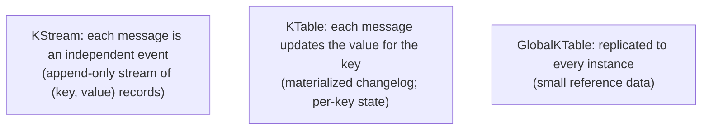

# Kafka Streams

Kafka Streams is **a Java library for stream processing on top of Kafka**. Not a separate cluster; not a Kafka feature — a library you embed in your Spring application that reads from Kafka topics, transforms / aggregates / joins, writes back to Kafka topics. Stateful operations (counts, windows, joins) maintain local **state stores** (RocksDB) backed by Kafka changelog topics for fault tolerance. If you've used Spark Streaming or Flink, Kafka Streams sits in the same neighborhood — but with much less operational overhead (no separate cluster) and tighter Kafka integration (uses partition assignment + offsets natively).

A senior engineer reaches for Kafka Streams when (a) the input is Kafka; (b) transformations are stateful (aggregations, joins, windowing); (c) the work doesn't justify a full Flink cluster. For simpler "consume → transform → produce", a Spring Kafka listener is enough. For complex multi-topic joins, time windows, or interactive queries against state, Streams fits.

This topic covers: the KStream / KTable / GlobalKTable abstractions; the DSL; the lower-level Processor API; stateful operations; windowing (tumbling, hopping, session, sliding); joins (stream-stream, stream-table, table-table); state stores (RocksDB) and changelog topics; interactive queries; Spring Cloud Stream Kafka Streams binder; Kafka Streams vs Flink.

> [!NOTE]
> Prerequisites: [Kafka fundamentals (T04)](./T04-apache-kafka-fundamentals.md), [Kafka deep (T05)](./T05-kafka-deep-partitions-consumer-groups-offsets.md).

## KStream vs KTable



- **KStream**: every record is an event. Click stream, sensor readings, log lines.
- **KTable**: every record is an update to a key's value. User profile changes, current price per symbol.
- **GlobalKTable**: KTable replicated to every Kafka Streams instance. For small reference data joined by every record.

The duality: a KTable is just a KStream with the convention "value is the latest state per key". `KStream.toTable()` and `KTable.toStream()` convert.

## The DSL — A Tour

```java
StreamsBuilder builder = new StreamsBuilder();

KStream<String, Order> orders = builder.stream("orders.placed");
KTable<String, Customer> customers = builder.table("customers");

// stateless ops
KStream<String, Order> bigOrders = orders.filter((k, o) -> o.total() > 100);
KStream<String, EnrichedOrder> enriched = bigOrders
    .map((k, o) -> KeyValue.pair(o.customerId(), o));   // re-key

// stream-table join
KStream<String, EnrichedOrder> joined = enriched
    .join(customers, (order, customer) -> new EnrichedOrder(order, customer));

// stateful aggregation
KTable<String, Long> orderCounts = orders
    .groupByKey()
    .count(Materialized.as("order-counts-store"));

// write back
joined.to("orders.enriched");

Topology topology = builder.build();
KafkaStreams streams = new KafkaStreams(topology, props);
streams.start();
```

The topology is a graph of operations; each input topic is a source; each `to()` a sink. Kafka Streams handles consumer assignment, state, threading.

## Stateful Operations

Group by key, then aggregate:

```java
KTable<String, Long> dailyOrderCount = orders
    .groupByKey()
    .windowedBy(TimeWindows.of(Duration.ofDays(1)))
    .count();
```

The `count()` is stateful — needs to remember running counts per key per window. Stored in a **RocksDB state store**.

For fault tolerance, every state store has a **changelog topic** in Kafka: every state change is also published. On restart / rebalance, state is rebuilt from the changelog.

## Windowing

Aggregations over time windows:

| Window | Use |
|--------|-----|
| **Tumbling** | non-overlapping fixed intervals (every 5 min) |
| **Hopping** | overlapping fixed intervals (5 min size, 1 min step) |
| **Session** | inactivity-based (close when no events for X) |
| **Sliding** | event-time-based with retention |

```java
// tumbling: 5-min windows, no overlap
.windowedBy(TimeWindows.of(Duration.ofMinutes(5)))

// hopping: 5-min size, advance by 1 min (overlapping)
.windowedBy(TimeWindows.of(Duration.ofMinutes(5)).advanceBy(Duration.ofMinutes(1)))

// session: close when 10 minutes of inactivity
.windowedBy(SessionWindows.with(Duration.ofMinutes(10)))
```

Result is a `KTable<Windowed<K>, V>` keyed by (window, key).

## Joins

### Stream-Table Join

```java
KStream<String, Order> orders = ...;       // events
KTable<String, Customer> customers = ...;  // state

orders.join(customers, (o, c) -> new OrderWithCustomer(o, c));
```

Order arrives; look up customer in KTable; enrich. Common pattern.

### Stream-Stream Join (windowed)

```java
KStream<String, Order> orders = ...;
KStream<String, Payment> payments = ...;

orders.join(payments,
    (o, p) -> new OrderWithPayment(o, p),
    JoinWindows.of(Duration.ofMinutes(5)));
```

Matches orders to payments within a 5-minute window. Both sides are streams; need a window because both are unbounded.

### Table-Table Join

```java
customers.join(addresses, (c, a) -> new CustomerWithAddress(c, a));
```

KTable joins are continuously-updated views.

## Interactive Queries

Local state stores can be queried directly:

```java
ReadOnlyKeyValueStore<String, Long> store =
    streams.store(StoreQueryParameters.fromNameAndType(
        "order-counts-store", QueryableStoreTypes.keyValueStore()));

Long count = store.get("customer-42");
```

Expose via REST:

```java
@GetMapping("/api/stats/{customerId}/orders")
public OrderCount get(@PathVariable String customerId) {
    Long count = store.get(customerId);
    return new OrderCount(customerId, count);
}
```

For distributed state (the store is local to this instance), use `KafkaStreams.metadataForKey` to find which instance holds the key and HTTP-route the request.

## Repartitioning

Many operations require records with the same key to land on the same partition (for stateful work). If you re-key, Kafka Streams writes to an internal repartition topic and re-consumes:

```java
KStream<String, Order> byCustomer = orders.selectKey((k, v) -> v.customerId());
// implicit repartition topic created
KTable<String, Long> counts = byCustomer.groupByKey().count();
```

Repartition topics are auto-managed but visible (named with internal prefix). They double write/read overhead; minimize re-keys.

## Spring Cloud Stream Kafka Streams Binder

```xml
<dependency>
    <groupId>org.springframework.cloud</groupId>
    <artifactId>spring-cloud-stream-binder-kafka-streams</artifactId>
</dependency>
```

```java
@Bean
public Function<KStream<String, Order>, KStream<String, EnrichedOrder>> enrich() {
    return orders -> orders
        .filter((k, o) -> o.total() > 100)
        .mapValues(o -> enrich(o));
}
```

```yaml
spring:
  cloud:
    stream:
      function:
        definition: enrich
      kafka:
        streams:
          binder:
            application-id: orders-streams-app
        bindings:
          enrich-in-0:
            destination: orders.placed
          enrich-out-0:
            destination: orders.enriched
```

Function-based binding; clean Spring integration; auto-configures the topology.

## Kafka Streams vs Flink

| Aspect | Kafka Streams | Flink |
|--------|:-------------:|:-----:|
| Deployment | embed in Spring app | separate cluster |
| Inputs | Kafka only | Kafka, Kinesis, files, sockets, DBs |
| State | RocksDB + Kafka | RocksDB / heap |
| Exactly-once | yes (Kafka transactions) | yes |
| Operational complexity | low | medium-high |
| Use case scale | medium | up to extreme |
| Windowing flexibility | good | excellent |
| ML integration | limited | extensive |

**Pick Kafka Streams when**: input is Kafka; team owns the service; moderate complexity.
**Pick Flink when**: multi-source; complex CEP; heavy windowing; team has stream-processing experience.

For most Spring teams in 2026: **Kafka Streams**. T11 covers Flink briefly.

## Common Pitfalls

> [!WARNING]
> **Over-repartitioning.** Each repartition doubles I/O. Plan key strategy.

> [!WARNING]
> **State store growth unbounded.** Apply windowing or session timeouts.

> [!WARNING]
> **No exception handler on stream.** Crashes consumer; group rebalances. Configure `DeserializationExceptionHandler`.

> [!WARNING]
> **Restart-rebuild from changelog is slow.** State stores in 100s of GB take minutes to rebuild. Use standby replicas.

> [!WARNING]
> **Interactive queries to non-local key.** Need to route to owner. Use metadata API.

> [!WARNING]
> **Side effects (HTTP calls) inside map().** Slow + un-replayable. Use Kafka Connect sink or async.

> [!WARNING]
> **Windowing without retention.** Old windows persist forever.

> [!WARNING]
> **Choosing Kafka Streams for non-Kafka inputs.** Wrong tool.

## Practice

1. Build a topology: filter + map + write to output topic. Run with embedded Kafka.
2. Add stateful count by key with materialized store. Verify state in RocksDB.
3. Stream-table join: enrich orders with customer data.
4. Add tumbling window aggregation; verify per-window counts.
5. Expose interactive query via REST; query state directly.
6. Wire Spring Cloud Stream Kafka Streams binder; declare functions.
7. Simulate restart; observe state rebuild from changelog.
8. Compare same workload Kafka Streams vs Flink (if available).

## Recap

You should now be able to:

- Distinguish KStream (events), KTable (state), GlobalKTable (replicated).
- Build topologies with the DSL: filter, map, join, aggregate, window.
- Apply stateful operations with RocksDB state stores + changelog topics.
- Choose windowing: tumbling, hopping, session, sliding.
- Implement stream-table, stream-stream (windowed), and table-table joins.
- Expose interactive queries against local state stores.
- Use Spring Cloud Stream binder for function-style topologies.
- Choose Kafka Streams vs Flink based on inputs and team capability.
- Avoid the canonical pitfalls: over-repartitioning, unbounded state, side effects in map, slow restart with no standbys.

## Next

Continue to [Event-driven architecture](./T07-event-driven-architecture.md) for the architectural pattern of services communicating through events — choreography, event sourcing, CQRS, and the design discipline.
